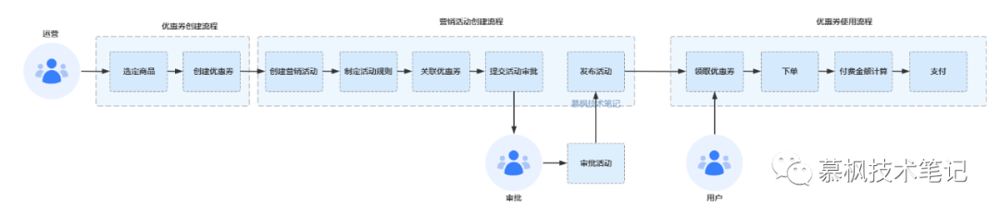

<!-- TOC -->

- [1. DDD 领域驱动设计落地实践：六步拆解 DDD](#1-ddd-领域驱动设计落地实践六步拆解-ddd)
    - [1.1. 引言](#11-引言)
    - [1.2. 项目需求信息](#12-项目需求信息)
    - [1.3. DDD落地实践](#13-ddd落地实践)
    - [1.4. 战略设计](#14-战略设计)
        - [1.4.1. 业务分析](#141-业务分析)
        - [1.4.2. 领域建模](#142-领域建模)
    - [1.5. 战术设计](#15-战术设计)
        - [1.5.1. 微服务拆分](#151-微服务拆分)
        - [1.5.2. 领域分层](#152-领域分层)
    - [1.6. 总结](#16-总结)

<!-- /TOC -->

# 1. DDD 领域驱动设计落地实践：六步拆解 DDD

## 1.1. 引言

相信通过前面几篇文章的介绍，大家对于 DDD 的相关理论以及实践的套路有了一定的理解，但是理解 DDD 理论和实践手段是一回事，能不能把这些理论知识实际应用到我们实际工作中又是另外一回事，因此本文通过实际的业务分析把之前文章中涉及的理论和手段全部带着大家走一遍，我想通过这种方式，让大家实际的感受下 DDD 落地过程中会遇到哪些问题以及我们应该怎样去解决这些问题。

## 1.2. 项目需求信息

这里还是大家比较熟悉的电商场景来进行说明，我想这样大家比较好理解一点。在前段时间双十一，大家被各种购物优惠券的套路整的眼花缭乱，仿佛数学不好，都不配拿到最优惠的价格了。大家都在吐槽，就不能少点套路，买东西直接给我 5 折不就天下太平了吗？我想造成这种现象的原因大概就是中国电商行业的内卷吧，只有通过各种营销活动的堆积，才能让大家花更多的时间去浏览更过的商品，才能获得更好的留客以及交易。好了，跑题了，这些我们先不去关心。那我们今天就用这个折磨人的优惠券的流程作为设计实例来说明整个 DDD 的落地过程吧。优惠券的关键业务流程如下：

1. 当需要进行大促活动的时候，运营同学需要选定对应的商品，创建创建优惠券。
2. 运营同学需要创建营销活动，制定对应的营销活动规则，比如什么满减啊，跨店减啊类似这种折磨人脑细胞的规则，然后关联相应的优惠券，最后提交活动审批。审批通过后，进行营销活动发布。
3. 提交活动审批后，审批进行营销活动审批。
4. 用户在营销页面领取优惠券之后，下单购买商品之后，在付款的时候根据对应的优惠券进行付费金额计算并完成支付。

## 1.3. DDD落地实践

项目背景信息我们大致了解之后，那么我们就要着手开始通过ＤＤＤ来进行领域驱动设计的过程了。其实我们学习 DDD 理论以及方法不是最终的目的，而通过它实现实际的业务复杂度治理以及优化微服务设计才是真正的目的。

## 1.4. 战略设计

在战略设计阶段，我们最主要的过程大致包括了业务场景分析、领域建模、划分边界上下文三个阶段。实际上战略设计是 DDD 过程中的核心步骤。

### 1.4.1. 业务分析

在这个阶段我们所有做的就是进行全面的业务梳理，吧业务中涉及到的所有细节都梳理出来，为后续进行领域建模分析提供足够的、全面的业务输入。经常使用到的业务场景分析方法主要包括用例分析法、事件风暴法以及四色建模法。这里我们使用事件风暴进行业务场景的分析以及梳理。

1. **事前准备**
在进行事件风暴之前我们需要进行一些准备，主要包括贴纸、笔以及讨论的会议室，会议室中最好不要有椅子，目的是想让大家都能够站立在一起、全神贯注的去进行业务讨论。
2. **邀请参会的人**
会议的参与方主要包括业务、用户、PD、研发、测试、架构师等。
3. **业务讨论**
首先确定我们今天需要讨论的业务是什么，目标是什么。像前文所说的那样，本次讨论的业务就是营销活动的优惠券业务，目标就是完成优惠券的业务梳理，确保没有业务方面的理解 gap，在团队中达成业务理解的的一致性。在这个过程中我们需要通过提问的方式来驱动交流。

- 分析业务中的事件，搞清楚事件发生的前因后果，什么意思呢？就是什么动作会导致当前时间的发生，当前这个事件发生后又会导致怎样的后果。这些我们都需要梳理清楚。还有一点需要注意， 我不但要关注正常的业务流程还要关注异常的业务流程。
- 寻找业务逻辑和业务规则，比如我们在提交活动前，需要确定这些优惠券适用哪些人、领取方式是怎样的以及生效事件是怎样的等等，这些都是我们在执行操作之前需要确定的业务规则。

如下图所示，我们将优惠券的业务流程进行了梳理，分别从操作人、事件、命令的方式来描述整个优惠券业务流转的过程。

> 注：在进行事件风暴过程中，所有的参与人都要全身投入整个过程，放下手机以及电脑，一起参与整个业务梳理过程，只有这样，事件风暴才可能有比较好的效果。

### 1.4.2. 领域建模

在前面的事件风暴业务梳理中，我们已经把优惠券业务涉及到的参与者、动作以及事件等都进行了全面的梳理。那么接下来我们就要在此基础之上进行领域建模，这是整个 DDD 的核心。

1. **领域对象分析**

如上面所示的事件风暴小黑板中的内容，我们需要在这些梳理出来的内容中找到对应的实体、值对象以及围绕这些的领域事件以及命令操作。根据分析，我们从整个业务过程中提取了优惠券、营销活动、活动审批单、活动规则、审批意见等实体以及值对象以及和这些领域对象相关的命令操作。

2. **构建业务聚合**

完成领域对象分析之后，我们需要构建业务聚合。想要构建聚合，那么首先就要在实体中找到聚合根。我们先来回顾下聚合根的特点，聚合根一定是实体，那么它具有全局唯一的标识，另外它是具备生命周期的同时需要专门的模块来进行管理。根据这样的标准，在领域对象中我们发现优惠券、营销活动以及活动审批单是具备聚合根特征的，而营销规则、营销内容等是和营销活动紧密相关的，因此他们构成营销活动聚合关系。优惠券规则、优惠券类型等是和优惠券聚合根紧密相连的，所以他们构成优惠券聚合关系。同理活动审批单也会构成聚合关系。最终我们形成如下的聚合关系。

获得了整个业务流程中的所有聚合后，我们需要更具业务语义上下文将具体的聚合划分到对应的上下文中，因此我们可以把优惠券的业务分为优惠券、营销活动以及审批三个限界上下文。

## 1.5. 战术设计

在战略设计阶段，我们通过事件风暴法对整体的业务进行了全部的梳理，同时构建了领域模型以及划分了边界下文。那么接下来我们就要将领域模型映射到工程结构以及代码中实现最终的实现落地。另外在这个阶段实际还有很多细节需要明确，那优惠券来说，它包含哪些属性，需要哪些领域服务，哪些需要设计为实体，哪些需要设计为值对象，这些都是需要在战术设计阶段明确下来。

### 1.5.1. 微服务拆分

我们根据已经划分的边界上下文，我们可以拆分为优惠券服务、营销活动服务以及审批中心三个微服务，至于用户支付使用这块，还是由原先已存在支付服务来完成，只是在付款核算的时候需要使用到优惠券进行最后的金额计算。

### 1.5.2. 领域分层

在领域分层方面，我们还是按照之前文章中所说的分层结构来进行，即 interfaces 层、biz 层、domain 层以及 instructure 层。每层代表的含义之前的文章中已经进行了详细的说明，大家可以翻看前面文章中的介绍，这里不再进行赘述了。

我们以优惠券为例，实际聚合中对象还需要进行进一步的细化。对于优惠券来说它实际上还有如下所示的值对象以及实体来组成实际的优惠券。同时在优惠券我们的梳理的领域服务还包括创建优惠券、查询优惠券以及修改优惠券状态，这些动作实际都应该在领域层通过领域服务的形式完成落地。而对应的 biz 层就相当于业务的编排组合，也就是实际的业务流程的串联。

当我们把领域对象进行进一步的细化之后，同时把对应的领域服务敲定之后，我们可以把这些分析后的内容映射成工程分层后的代码了。如下图所示，即为优惠券的 domain 层的代码映射。

当然到这里并不意味着结束，其实在后续还有很多工作要做，比如详细设计、编写代码以及功能测试，特别实在详细设计阶段，我们还要涉及很多的细节问题的敲定，比如数据库表的设计、比如使用什么 MQ，用不用缓存，怎么保证缓存和数据库的数据一致性问题，分布式服务有没有分布式事务的问题，应该怎么解决？有没有服务幂等问题，应该怎么解决？这些都是需要在详细设计阶段进行确定的。因此 DDD 就像是框架，通过它把业务映射成为领域对象以及领域服务和领域事件，再把这些领域相关内容再读映射为实际的代码。使得我们的服务更加的逻辑清晰以及扩展性更强，但是分布式的技术实现细节，我们还是需要有对应的解决方案来进行解决。

## 1.6. 总结

本文以电商行业的营销活动中的优惠券的发放和使用作为实际案例来阐述 DDD 领域驱动设计落地实践的过程，通过整个过程的梳理，为大家提炼了整个设计过程的精要，相信大家可以按照这样的思路在实际的工作中再结合各自的业务特征应该可以真正完成整个 DDD 的实践。万事开头难，相信只要大家能够亲自去参与或者主导一个 DDD 的落地实践过程，那么对于理解 DDD 这套架构设计方法论又会进入一个新的台阶。在后面的文章中再和大家聊聊落地 DDD 过程中可能会遇到的一些问题以及软件复杂度治理的问题。

> refer to: https://ost.51cto.com/posts/13360
