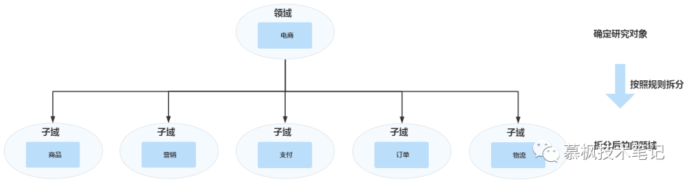
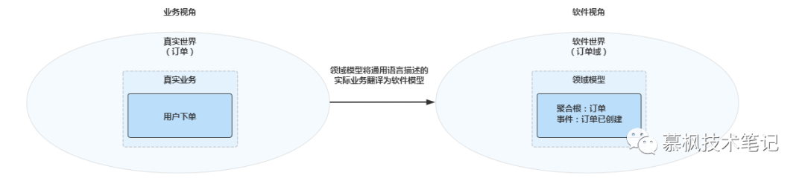
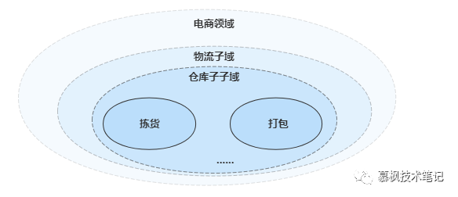

<!-- TOC -->

- [一文扫清DDD核心概念理解障碍](#一文扫清ddd核心概念理解障碍)
    - [领域、子域、核心域等这么多域到底怎么理解？](#领域子域核心域等这么多域到底怎么理解)
    - [限界上下文？限界是什么？上下文又是什么？](#限界上下文限界是什么上下文又是什么)
    - [总结](#总结)

<!-- /TOC -->

# 一文扫清DDD核心概念理解障碍

## 领域、子域、核心域等这么多域到底怎么理解？

在DDD的众多概念中，首先需要搞清楚的就是到底什么是领域。因为DDD是领域驱动设计，所以领域是DDD的核心基础概念。那么到底什么是领域呢？领域是指某个业务范围以及在范围内进行的活动。根据这个定义，我们知道领域最重要的一个核心点就是范围，只有限定了问题研究的范围，才能针对具体范围内的问题进行研究分析，在后期进行微服务拆分的的时候也是根据范围来进行的。

我们开发的软件平台是为了解决用户问题，既然我们需要研究问题并解决问题，那就得先确定问题的范围到底是什么。如果我们做的是电商平台，那么我们研究的是电商这个领域或者说电商这个范围的问题，实体店内的销售情况就不是我们研究的问题范围了。因此我们可以把领域理解为我们需要解决指定业务范围内的问题域。再举个生活中的例子，派出所实际都是有自己的片区的也就是业务范围，户籍管理、治安等都是归片区的派出所负责的。这里的片区实际就是领域，派出所专注解决自己片区内的各种事项。

既然我们研究的领域确定了，或者说研究的问题域以及范围确定了，那么接下来就需要对领域进行进一步的划分和切割。实际上这和我们研究事物的一般方法手段是一致的，一旦某个问题太大无从下手的时候，都会将问题进行一步步的拆解，再逐个进行分析和解决。那么放到DDD中，我们在进行分析领域的时候，如果领域对应的业务范围过大，那么就需要对领域进行拆解划分，形成对应的子域或者说更小的问题域，所以说子域对应的是相对于领域来说，更小的业务范围以及问题域。

回到我们刚才所说的电商领域，它就是一个非常大的领域，因为电商实际还包含了商品、用户、营销、支付、订单、物流等等各种复杂的业务。因此支付域、物流域等就是相对于电商来说更小的业务范围或者更小的问题域，那么这部分领域就是对于电商这个领域的子域，相当于对电商这个业务范围的进一步的划分。

搞清楚了领域和子域的区别之后，那么怎么理解核心域、通用域以及支撑域这么多其他的域呢（域太多了，我脑袋开始嗡嗡响了）？领域和子域是按照范围大小进行区分的，那么核心域、通用域等实际就是按照功能属性进行划分的。

核心域：平台的核心竞争力、最重要的业务，比如对于阿里来说，电商就是核心域。

通用域：其他子域沉淀的通用能力，没有定制化的能力，比如公司的数据中台。

支撑域：不包含核心业务能力也不是各个子域的通用能力沉淀。

那么为什么划分了子域之后，还要分什么核心域、通用域呢？实际上这样划分的目的是根据子域的属性，确定公司对于不同域的资源投入。将优势的资源投入到具备核心竞争力的域上，也是为了让产品更加具备竞争力，就是所谓的钱要花到刀刃上。

## 限界上下文？限界是什么？上下文又是什么？

限界上下文我觉得是DDD中一个不太好理解的概念，光看这个不明觉厉的名字，甚至有点不知道它到底想表达什么样的意思。我们先来看下限界上下文的原文---Bounded Context，通过原文我们可以看得出来，实际上限界上下文这个翻译增加了我们的理解成本。而反观Bounded Context这个原文实际更好理解一点，即为有边界的上下文。这里给大家一个小建议，如果技术上某个概念不好理解，那么不妨去看看它的原文是什么，大部分情况下原文会比翻译过来的更好理解，更能反映设计者想要表达的真实含义。

大家都知道我们的语言是有上下文环境的，有的时候同样一句话在不同的语言环境或者说语言上下文中，所代表的意思是不一样的。打个比方假如你有一个女朋友，你们约好晚上一起去吃饭，你在去晚上吃饭地方的路上，这个时候你收到一条来自女朋友的语音：“我已经到龙翔桥了，你出来后往苹果店走。如果你到了，我还没到，你就等着吧。如果我到了，你还没到，你就等着吧。”这里的你就等着吧，在不同的语境下包含的意思是不同的，一个是陈述事实，一个让你瑟瑟发抖。

因此，既然语言本身就有上下文，那么用通用语言描述的业务肯定也是有边界的。DDD中的限界上下文就是用来圈定业务范围的，目的是为了确保业务语言在限界上下文内的表达唯一，不会产生额外的歧义。这个时候大家会不会有另外一个问题，那么这个限界上下文到底是一个逻辑概念还是代码层面会有一个实实在在的边界呢？

按照我自己的理解，限界上下文既是概念上的业务边界，也是代码层面的逻辑逻辑边界。为什么这么说呢？我们在进行业务划分的时候，领域划分为子域集合，子域再划分为子子域集合，那么子子域的业务边界有时候就会和限界上下文的边界重合，也就是说子子域本身就是限界上下文，那么此时限界上下文就是业务边界。在代码落地的过程中，用户服务涉及到用户的创建、用户信息的修改等操作。肯定不会到订单服务中去做这些事情。因为他们属于不同的业务域，也就是说订单相关的操作已经超越了用户的边界上下文，因此它应该在订单的边界上下文中进行。

域和边界上下文的关系是一对一或者一对多的关系，实际上我认为域和限界上下文本质上一致的，应该是为什么这么说呢，比如我们做的微服务当中用户服务，比如，肯定不会到订单服务中去做这些事情。因为他们属于不同的业务域，也就是说订单相关的操作已经超越了用户的边界上下文，因此它应该在订单的限界上下文中进行。限界上下文最主要的作用就是限定哪些业务面描述以及业务动作在这个限界当中。

## 总结

DDD在实际落地实践过程中会遇到各种各样的问题，首当其冲的就是一些核心概念晦涩难懂，阻碍了技术人员对DDD的理解和掌握。本文对DDD比较难理解的核心概念进行了详细的描述，相信通过本文大家对于这些核心概念的理解能够更加深入。

> refer to: https://ost.51cto.com/posts/13330
