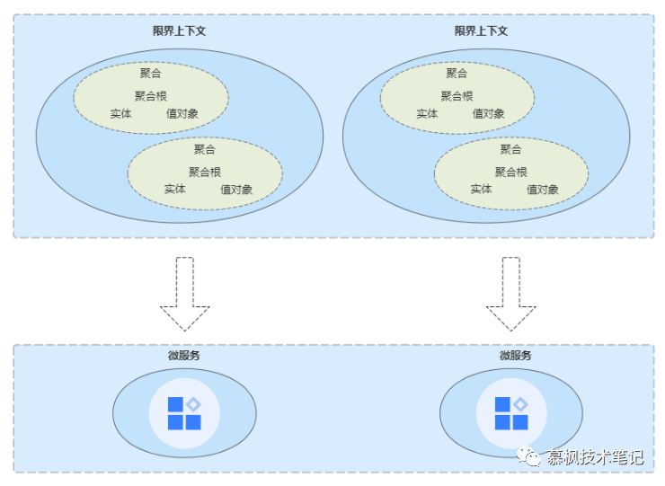
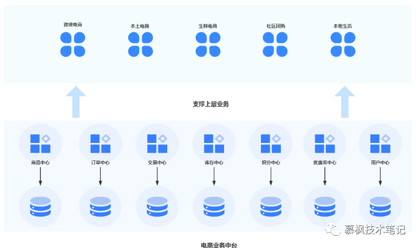

<!-- TOC -->

- [DDD领域驱动设计落地实践：微服务拆分之道](#ddd领域驱动设计落地实践微服务拆分之道)
    - [为什么要进行微服务拆分](#为什么要进行微服务拆分)
    - [微服务到底该怎么拆？](#微服务到底该怎么拆)
    - [业务能力](#业务能力)
    - [通用能力](#通用能力)
    - [微服务拆分原则](#微服务拆分原则)
    - [总结](#总结)

<!-- /TOC -->

# DDD领域驱动设计落地实践：微服务拆分之道

## 为什么要进行微服务拆分

在进行微服务拆分之前，我们首先应该搞清楚为什么要进行微服务拆分？微服务拆分后会带来怎样的业务价值？在后期维护上面会不会比以前的维护成本更低？我想这些问题都是架构师在实现微服务拆分之前需要回答的问题。那么我们就来先看看单体应用在业务不断发展的过程中会遇到怎样的问题。

1. 维护难
随着业务的不断发展，单体应用的功能越来越多，需求不断变化，修改不断进行，单个应用多团队维护就会出现各种团队协作问题，不知不觉中降低了产品的研发效能。而且由于各个业务模块杂糅在一起，一个需求过来后，到底改哪个团队来做，经常在开会的时候吵得脸红脖子粗，增加了时间以及沟通成本。
2. 更新难
进行需求迭代的时候，也许只修改了某个模块的功能，但是每次发布都是一整个大的包进行发布，其中构建、发包的时间成本会随着应用的迭代逐渐增加，导致整个需求上线过程变更显得十分笨重，不利于进行团队规模的敏捷开发。
3. 稳定难
由于单体应用故障隔离范围只是线程级别的，单体应用可能会由于某个模块的功能有问题而导致整个服务平台的不可用，因此平台稳定性方面显然不能满足经常变化的业务发展的需要。

鉴于上述问题，我们需要对大泥球似的单体大应用进行合理拆分，以便于适用业务的快速发展。微服务架构拆分之后，团队成员不用都围绕一个大泥球应用转了，根据拆分的不同的业务域，各自负责自己的业务域，维护起来相对来说更加方便。同事如果有需求迭代，没有功能修改的业务域可以不用发生变更，不需要进行重新部署，大大降低了修改变更导致的平台稳定性性问题。另外由于是微服务分布式架构，不再是单点应用，不再存在单点问题，性能方面也会有所提升。

## 微服务到底该怎么拆？

当我们想清楚为什么进行微服务拆分之后，团队Boss也同意进行微服务拆分了。于是我们准备撸起袖子加油干的时候，另外一个问题又挡在我们前面，微服务到底应该怎么拆呢？或者换句话说，我们应该按照怎样的标准来进行拆分呢？如果拆分的不好，逻辑混乱的微服务还不如逻辑清晰的单体应用。这时候天空飘来了三个大字---DDD。

DDD的理论中提供了我们进行领域驱动设计的指导方针，对于我们进行微服务的拆分具备天然的指导意义。比如DDD指导我们首先要对当前系统平台的业务进行全面的分析，可以通过用例分析法、事件风暴法以及四色建模法来进行业务分析，使用统一的业务语言进行业务领域划分以及边界上下文的划定，当然在这个过程中还包含了领域模型的构建，在业务分析中找到对应的实体、值对象以及聚合根，从而形成聚合，将聚合划分到边界上下文中。后面我们就可以根据边界上下文来进行具体的微服务的划分了。

笔者在实践微服务拆分的过程中主要按照业务能力、通用能力两个维度来进行具体的拆分。接下来给大家详细说明下。

## 业务能力

所谓业务能力就是平台的具体实现的业务功能是什么，这就好比在电商业务中物流域我们按照业务可以划分为仓储、运输、配送、计费等业务领域。大的领域划分出来之后，我们可以用真实的业务流程来串联这些业务领域。当业务流程经过这些业务领域的时候，必定会触发一些领域事件，经历一些业务流程，那么在这个过程中我们就可以梳理出对应的实体、值对象以及聚合根，我们将具有紧密业务逻辑关系的实体以及值对象收敛在聚合根的周围，从而形成聚合。例如在仓储领域中就会涉及到入库、库内操作以及出库这三大流程，其中入库主要包括质检、收货以及上架。这其中涉及到的实体主要用入库单、货品、操作员等，其中入库单就是聚合根，通过它可以将货品、操作员等实体以及值对象聚合起来，形成入库聚合。

## 通用能力

这里的通用能力其实包含两个意思，对于微服务本身来说，通用能力就是将各个微服务都涉及到的通用能力进行抽象形成单独的微服务。但是对于整个业务平台来说，通用能力实际就是业务中台。

1. **通用服务**
所谓通用服务就是在各个微服务之间都会碰到的问题，比如说接口的鉴权、日志的监控和管理、服务状态的监控和管理以及服务幂等等分布式系统问题。因此，我们需要将这些微服务的通用服务进行统一的抽象，形成通用的基础服务，这样微服务本身只需要关注自身的业务，这些微服务通用的能力由单独的基础服务来进行实现就 OK 了。

2. **业务中台**
我们还是拿大家最熟悉的电商业务来举个栗子吧，电商的业务形态有很多种，就阿里巴巴来说，有淘宝、天猫、主打生鲜的盒马、天猫超市等等。不管上层的业务形态有怎样的变化，实际上他们都是有比较核心的业务域是通用的，比如用户、支付、仓储、物流等等。那么实际上这些通用的业务对于整个电商平台来说实际就是通用能力，因此我们需要将这些通用的公共的能力进行下沉，形成业务中台，实现企业级的通用业务能力复用。

## 微服务拆分原则

在进行微服务拆分的过程中，有几条笔者总结的原则大家可以参考下，在实操的时候如果没有原则来遵循，实际我们自己也没办法去评判微服务拆分的效果到底有没有达到我们的预期。

**微服务拆分要把握度**

如果在微服务拆分过程中发生过度拆分，就会导致微服务爆炸的情况。不可避免的增加软件系统的维护成本，同时由于拆分也会导致业务流程变长，原本一两个服务就完成的业务，拆分后需要在五六个甚至更多的微服务才能完成，增加了平台出现 Bug 的概率，不知不觉中降低了平台的稳定性。另外更多的微服务意味着需要更多的服务器资源，从而在无形中增加了业务成本。因此我们可以借助于 DDD 划分的边界上下文，防止微服务过度拆分情况的发生。

**拆分过程逐步迭代**

软件平台架构的演进过程必定会经历现有平台以及新架构平台先共存，后替代的过程。因此我们可以先从平台的非核心功能开始再到核心功能这样逐步拆分的方式进行迭代拆分，避免一上来就要大刀阔斧的进行微服务拆分以及架构调整，否则就会陷入旧平台不稳定而新平台又不完善的尴尬处境。

**确保微服务高内聚低耦合**

在进行微服务拆分之前，应该对平台进行完整的领域划分，建立合适的领域模型，确定好边界上下文，并以此作为微服务拆分的指导。将领域模型的稳定与不断变化的外部需求进行隔离，保证核心领域模型的稳定，避免领域模型之间的强依赖。从而达到实现微服务高内聚低耦合的目的。

## 总结

本文主要围绕微服务拆分在实践落地层面存在的问题进行了分析，并结合自身的实践经验，可以分别从业务能力维度以及通用能力维度两方面进行拆分，同时提出了微服务拆分的相关原则和建议。希望大家在自己的实际项目中进行微服务拆分落地的时候可以有所参考。

> refer to: https://ost.51cto.com/posts/13363

