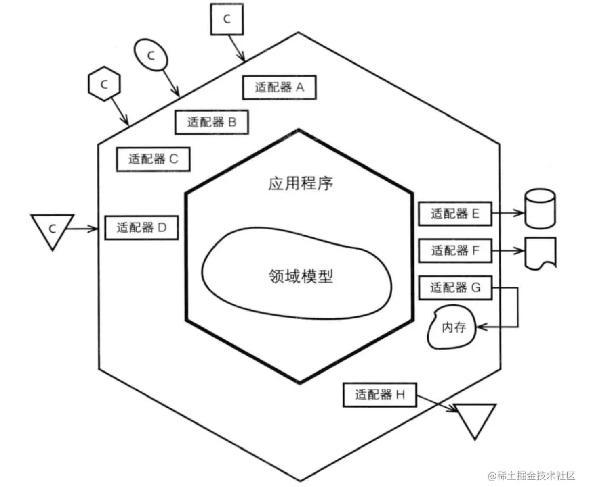
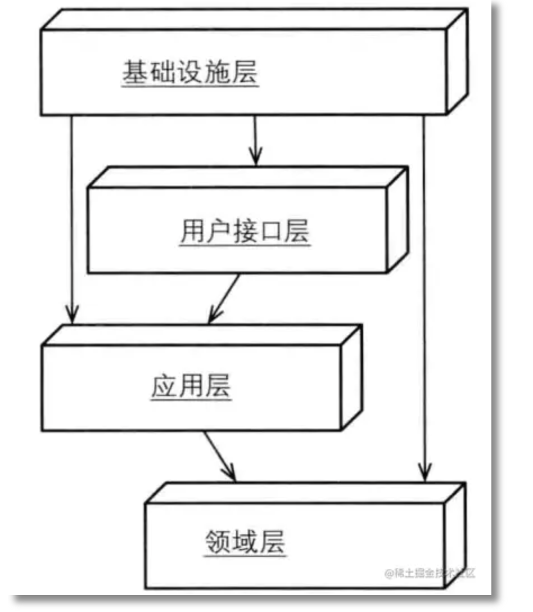
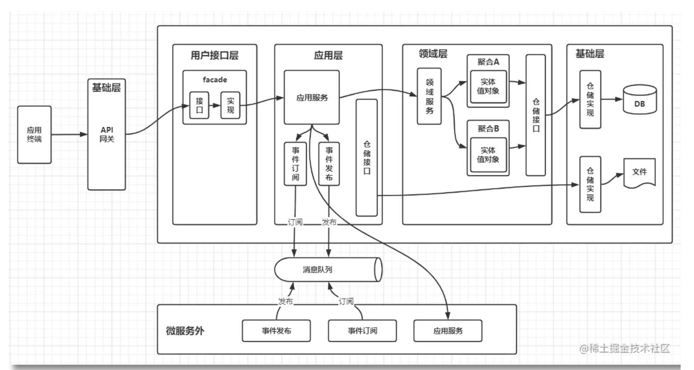

<!-- TOC -->

- [可落地的DDD编码实践（代码结构）](#可落地的ddd编码实践代码结构)
    - [术语](#术语)
    - [前言](#前言)
    - [从六边形架构谈起](#从六边形架构谈起)
    - [依赖倒置](#依赖倒置)
    - [DDD 代码分层](#ddd-代码分层)
        - [用户接口层](#用户接口层)
        - [应用层](#应用层)
            - [Response vs Exception](#response-vs-exception)
            - [CQE vs DTO](#cqe-vs-dto)
            - [Anti-Corruption Layer 防腐层](#anti-corruption-layer-防腐层)
        - [领域层](#领域层)
        - [基础设施层](#基础设施层)

<!-- /TOC -->
<a id="markdown-可落地的ddd编码实践代码结构" name="可落地的ddd编码实践代码结构"></a>
# 可落地的DDD编码实践（代码结构）

<a id="markdown-术语" name="术语"></a>
## 术语

- DTO：Data Transfer Object
- VO：View Object
- DO：Domain Object
- PO：Persistent Object
- POJO：Plain Ordinary Java Object
- CQE：Command、Query、Event

<a id="markdown-前言" name="前言"></a>
## 前言

网上那么多DDD的文章，但代码工程却没有一个比较好的例子，本文将手把手跟你一起写DDD代码，学习DDD思想与代码相结合带来的好处。

<a id="markdown-从六边形架构谈起" name="从六边形架构谈起"></a>
## 从六边形架构谈起



六边形架构也称端口与适配器。对于每种外界类型，都有一个适配器与之相对应。外界通过应用层API与内部进行交互。
六边形架构提倡用一种新的视角来看待整个系统。该架构中存在两个区域，分别是“外部区域”和“内部区域”。在外部区域中，不同的客户均可以提交输入；而内部的系统则用于获取持久化数据，并对程序输出进行存储（比如数据库），或者在中途将输出转发到另外的地方（比如消息，转发到消息队列）。
每种类型的客户都有自己的适配器，该适配器用于将客户输入转化为程序内部API所理解的输入。六边形每条不同的边代表了不同种类型的端口，端口要么处理输入，要么处理输出。图中有3个客户请求均抵达相同的输入端口（适配器A、B和C），另一个客户请求使用了适配器D。可能前3个请求使用了HTTP协议（浏览器、REST和SOAP等），而后一个请求使用了MSMQ的协议。端口并没有明确的定义，它是一个非常灵活的概念。无论采用哪种方式对端口进行划分，当客户请求到达时，都应该有相应的适配器对输入进行转化，然后适配器将调用应用程序的某个操作或者向应用程序发送一个事件，控制权由此交给内部区域。

<a id="markdown-依赖倒置" name="依赖倒置"></a>
## 依赖倒置

依赖倒置的原则（DIP）由Robert C. Martin提出，核心的定义是：

> 1. 高层模块不应该依赖于底层模块，两者都应该依赖于抽象
> 2. 抽象不应该依赖于实现细节，实现细节应该依赖于接口

按照DIP的原则，领域层就可以不再依赖于基础设施层，基础设施层通过注入持久化的实现就完成了对领域层的解耦，采用依赖注入原则的新分层架构模型就变成如下所示：



采用了依赖注入方式后，其实可以发现事实上已经没有分层概念了。无论高层还是底层，实际只依赖于抽象，整个分层好像被推平了。

<a id="markdown-ddd-代码分层" name="ddd-代码分层"></a>
## DDD 代码分层



整体代码结构

```
- com.${company}.${system}.${appname}
|- ui(用户接口层)
  |service
    |- impl
  |- web
    |- controller
    |- filter
|- application(应用层)
  |- service
    |- impl
  |- command
  |- query
  |- dto
  |- mq
|- domain(领域层)
  |- service
  |- facade
  |- model
  |- event
  |- repository
|- infrastructure(基础设施层)
  |- dal
    |-dos
    |-dao
  |- mapper
  |- factory
```

<a id="markdown-用户接口层" name="用户接口层"></a>
### 用户接口层

用户接口层作为对外的门户，将网络协议与业务逻辑解耦。可以包含鉴权、Session管理、限流、异常处理、日志等功能。

返回值一般使用 `{"code":0,"msg":"success","data":{}}` 的格式进行返回。 一般会封装一些公共的 `Response` 对象，参考如下：

```
public class Response implements Serializable {
    private boolean success;
    private String code;
    private String msg;
    private Map<String, Object> errData;
}

public class SingleResponse<T> extends Response {
    private T data;   
}    

public class ListResponse<T> extends Response {
    private int count = 0;
    private int pageSize = 20;
    private int pageNo = 1;
    private List<T> data;
}
```

用户接口层的接口，无需与应用接口保持一一对应，应该保证不同的场景使用不同的接口，保证后续业务的兼容性与可维护性。

<a id="markdown-应用层" name="应用层"></a>
### 应用层

应用层连接用户接口层和领域层，主要协调领域层，面向用例和业务流程，协调多个聚合完成服务的组合和编排，在这一层不实现任何业务逻辑，只是很薄的一层。

应用层的核心类：

- ApplicationService 应用服务：最核心的类，负责业务流程的编排，但本身不负责任何业务逻辑。有时会简写为 “AppService”。一个 ApplicationService 类是一个完整的业务流程，其中每个方法负责处理一个 Use Case，比如订单的各种用例（下单、支付成功、发货、收货、查询）。
- DTO Assembler：负责将内部领域模型转化为可对外的 DTO。
- 返回的 DTO：作为 ApplicationService 的出参。
- Command 指令：指调用方明确想让系统操作的指令，其预期是对一个系统有影响，也就是写操作。通常来讲指令需要有一个明确的返回值（如同步的操作结果，或异步的指令已经被接受）。
- Query 查询：指调用方明确想查询的东西，包括查询参数、过滤、分页等条件，其预期是对一个系统的数据完全不影响的，也就是只读操作。
- Event 事件：指一件已经发生过的既有事实，需要系统根据这个事实作出改变或者响应的，通常事件处理都会有一定的写操作。事件处理器不会有返回值。这里需要注意一下的是，Application 层的 Event 概念和 Domain 层的 DomainEvent 是类似的概念，但不一定是同一回事，这里的 Event 更多是外部一种通知机制而已。

ApplicationService 的接口入参只能是一个 Command、Query 或Event 对象，CQE (Command、query、event 简写) 对象需要能代表当前方法的语意。这样的好处是提升了接口的稳定性、降低低级的重复，并且让接口入参更加语意化。

案例代码

```
public interface UserAppService {
    UserDTO add(@Valid AddUserCommand cmd);
    List<UserDTO> query(UserQuery query);
}

@Data
public class AddUserCommand {
    private Integer age;
    private String name;
    ...
}

@Data
public class OrderQuery {
    private Long userId;
    private int pageNo;
    private int pageSize;
}

@Data
public class UserDTO {
    private Long userId;
    private Integer age;
    private String name;
    ...
}
```

针对于不同语意的指令，要避免CQE对象的复用。反例：一个常见的场景是“Create创建” 和 “Update更新”，一般来说这两种类型的对象唯一的区别是一个 ID，创建没有 ID，而更新则有。所以经常能看见有的同学用同一个对象来作为两个方法的入参，唯一区别是ID是否赋值。这个是错误的用法，因为这两个操作的语意完全不一样，他们的校验条件可能也完全不一样，所以不应该复用同一个对象。正确的做法是产出两个对象。

<a id="markdown-response-vs-exception" name="response-vs-exception"></a>
#### Response vs Exception

Interface 层的 HTTP 和 RPC 接口，返回值为 Result，捕捉所有异常。 Application 层的所有接口返回值为 DTO，不负责处理异常。

<a id="markdown-cqe-vs-dto" name="cqe-vs-dto"></a>
#### CQE vs DTO

表面上看，两种对象都是简单的 POJO 对象，但其实是有很大区别的：

- CQE: 是 ApplicationService 的输入，有明确的“意图”，对象的内部需要保证其正确性。每一个 CQE 都是有明确“意图”的，所以要尽量避免 CQE 的复用，哪怕所有参数都一样，只要语义不同，就不应该复用。
- DTO: 只是数据容器，只是为了和外部交互，所以本身不包含任何逻辑，只是贫血对象。

因为 CQE 是有“意图”的，所以，理论上 CQE 的数量是无限的。但 DTO 作为数据容器，是和模型对应的，所以是有限的。

<a id="markdown-anti-corruption-layer-防腐层" name="anti-corruption-layer-防腐层"></a>
#### Anti-Corruption Layer 防腐层

在 ApplicationService 中，经常会依赖外部服务，从代码层面对外部系统产生了依赖。比如创建一个用户时，可能依赖了帐号服务，这个时候我们引入防腐层。防腐层的类名一般用 “Facade”。

ACL 防腐层的实现方式：
- 对于依赖的外部对象，我们抽取出所需要的字段，生成一个内部所需的 VO 或 DTO 类。
- 构建一个新的 Facade，在 Facade 中封装调用链路，将外部类转化为内部类。
- 针对外部系统调用，同样的用 Facade 方法封装外部调用链路。

<a id="markdown-领域层" name="领域层"></a>
### 领域层

领域层是领域模型的核心，主要实现领域模型的核心业务逻辑，体现领域模型的业务能力。领域层关注实现领域对象的充血模型和聚合本身的原子业务逻辑，至于用户操作和业务流程，则交给应用层去编排。这样设计可以保证领域模型不容易受外部需求变化的影响，保证领域模型的稳定。

领域层的核心类：

- 实体类(Entity)：大多数 DDD 架构的核心都是实体类，实体类包含了一个领域里的状态、以及对状态的直接操作。Entity 最重要的设计原则是保证实体的不变性（Invariants），也就是说要确保无论外部怎么操作，一个实体内部的属性都不能出现相互冲突，状态不一致的情况。
- 值对象(VO)：通常是用来度量和描述事物。我们可以非常容易的对其进行创建，测试，使用，优化和维护，所以在建模时，我们尽量采用值对象来建模。
- 聚合根(Aggr)：聚合是由业务和逻辑紧密关联的实体和值对象组合而成的。聚合是数据修改和持久化的基本单元。每个聚合都有一个根实体，叫做聚合根，外界只能通过聚合根跟聚合通信。聚合根的主要目的是为了避免由于复杂数据模型缺少统一的业务规则控制，而导致聚合、实体之间数据不一致的问题。
- 领域服务(DomainService)：当某个操作不适合放在聚合和值对象上时，最好的方式便是使用领域服务了。可以使用领域服务的地方，过度使用领域服务将导致贫血领域模型。执行一个显著的业务操作过程；对领域对象进行转换；已多个领域对象作为输入进行计算，结果产生一个值对象。
- 仓储层接口(Repository)：把我们要的数据当做一个集合放在仓储里面，想要的时候直接获取。仓储作为领域层和基础结构层的连接组件，使得领域层不必过多的关注存储细节。在设计时，将仓储接口放在领域层，而将仓储的具体实现放在基础结构层，领域层通过接口访问数据存储，而不必过多的关注仓储存储数据的细节，这样使得领域层将更多的关注点放在领域逻辑上面。
- 工厂(Factory)：对于实体等对象构造比较麻烦的，可以借助工厂进行构造。

通常，对于实体、值对象、聚合根，我们可以不加类后缀，这样更能体现领域对象本身的含义。(参考：[DDD的类命名规范](5.md))

```
public class Order {
    // OrderId是隐性的概念显性化，而不是直接使用一个String，String就只能表示一个值了
    private OrderId orderId;
    private BuyerId buyerId;
    private OrderStatus status;
    private Long amount;
    private List<OrderItem> orderItems;
    
    public static Order create(...) {
        // 如果参数比较多，构造比较麻烦，可以迁移到 Factory
        ...
    }
    
    public void pay(...) {
        
    }
    
    public void deliver(...) {
        
    }
    
    ...
}
public class OrderItem {
    private Long goodsId;
    private Integer count;
    
    public static OrderItem create(Long goodsId, Integer count) {
        ...
    }
}
```

领域服务 xxxService：

```
// 领域服务一般无需接口定义
public class OrderDomainService {
   
    @Resource
    private OrderRepository orderRepository;

    public Order create(Order order) {
        ...
        orderRepository.create(order);
        return order;
    }
}
```

存储库 xxxRepository：

```
public interface OrderRepository {
    void add(Order order);
    Order getByOrderId(OrderId orderId);
}
```

<a id="markdown-基础设施层" name="基础设施层"></a>
### 基础设施层

主要负责技术细节处理，比如数据库CRUD、缓存、消息服务等。

```
public class OrderDO {
    
}

public class OrderItemDO {
    
}

public class OrderDao implements OrderRepository {
    @Resource
    private OrderMapper orderMapper;
    @Resource
    private OrderItemMapper orderItemMapper;

    @Override
    public void add(Order order) {
        OrderDO orderDO = OrderFactory.build(order);
        List<OrderItemDO> orderItemDOList = OrderFactory.build(order);

        orderMapper.insert(orderDO);
        orderItemMapper.batchInsert(orderItemDOList);
    }
}
```

> refer to: https://juejin.cn/post/7040826223500967972
