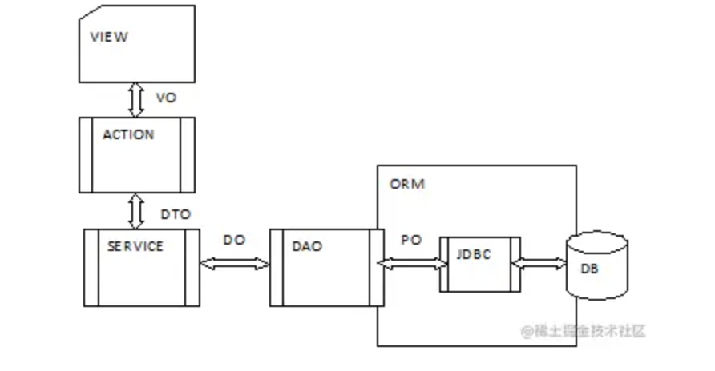
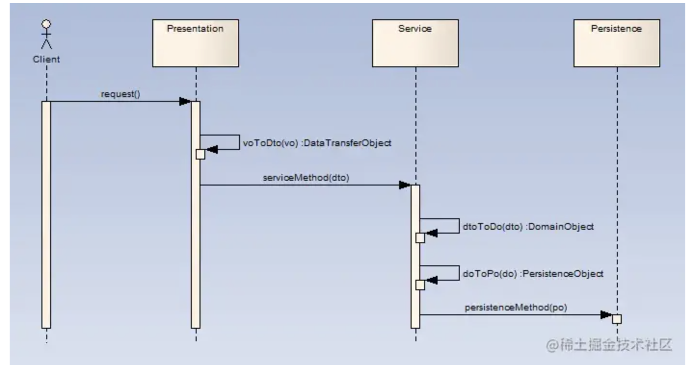

<!-- TOC -->

- [领域驱动模型 VO、DTO、DO、PO 概念及其区别](#领域驱动模型-vodtodopo-概念及其区别)
    - [领域模型中的实体类](#领域模型中的实体类)
    - [VO （View Object）视图对象](#vo-view-object视图对象)
    - [DTO（Data Transfer Object）数据传输对象](#dtodata-transfer-object数据传输对象)
    - [DO（Domain Object）领域对象](#dodomain-object领域对象)
    - [PO（Persistent Object）：持久化对象](#popersistent-object持久化对象)
    - [VO 与 DTO 对比](#vo-与-dto-对比)
        - [VO 与 DTO 的区别](#vo-与-dto-的区别)
        - [VO 与 DTO 的应用](#vo-与-dto-的应用)
    - [DTO 与 DO 对比](#dto-与-do-对比)
        - [DTO 与 DO 的应用](#dto-与-do-的应用)
    - [DO 与 PO 对比](#do-与-po-对比)
        - [DO 与 PO 的区别](#do-与-po-的区别)
    - [总结](#总结)

<!-- /TOC -->

# 领域驱动模型 VO、DTO、DO、PO 概念及其区别

## 领域模型中的实体类

领域模型中的实体类分为四种模型：VO、DTO、DO、PO，各种实体类用于不同业务层次间的交互，并会在层次内实现实体类之间的转化。

业务分层为：视图层（VIEW+ACTION）、服务层（SERVICE）、持久层（DAO），相应各层间实体的传递如下：

## VO （View Object）视图对象

用于展示层，它的作用是把某个指定页面（或组件）的所有数据封装起来。

## DTO（Data Transfer Object）数据传输对象

这个概念来源于J2EE的设计模式，原来的目的是为了EJB的分布式应用提供粗粒度的数据实体，以减少分布式调用的次数，从而提高分布式调用的性能和降低网络负载，但是这里，主要用于展示层与服务层之间的数据传输对象。

> 比如一张表有100个字段，那么对应的DTO就有100个属性（大多数情况下，DTO内的数据来自多张表）。但是view层只需要显示10个字段，没有必要把整个PO对象传递到 client，这时我们就可以用只有这10个属性的DTO来传输数据到 client，这样也不会暴露 server 端的表结构。到达客户端后，如果用这个对象来对应界面展示，那么此时它的身份就转为 VO。

## DO（Domain Object）领域对象

就是从现实世界中抽象出来的有形或无形的业务实体。

## PO（Persistent Object）：持久化对象

它跟持久层（通常是关系型数据库）的数据结构形成一一对应的映射关系，如果持久层是关系型数据库，那么，数据表中的每个字段就对应PO的一个属性。

对于以上概念的理解，可能还不能形成一种抽象化思维，我们通过一个时序图建立模型来描述上述对象在三层架构应用中的位置：

- 用户提交请求（可能是填写表单），表单的数据在展示层被匹配为 VO。
- 服务层把 VO 转换为服务层对应方法所要求的 DTO，传送给服务层。
- 服务层首先根据 DTO 的数据构造一个 DO （或重建），调用 DO 的业务方法完成具体业务。
- 服务层把 DO 转换为持久层对应的 PO（一般使用 ORM 工具），调用持久层的持久化方法，把 PO 传递给它，完成持久化操作。

> 对于一个逆向操作，如读取数据，也是用类似的方式转换和传递。

## VO 与 DTO 对比

### VO 与 DTO 的区别

在这里我们可能会问：既然 DTO 是展示层与服务层之间传递数据的对象，为什么还要一个 VO 呢？

是的，对于绝大部分的应用场景来说，DTO 和 VO 的属性值基本是一致的，而且他们通常都是 POJO，因此没必要多此一举。但不要忘记这是实现层的思维，对于设计层面来说，概念上还是应该存在 VO 和 DTO，因此两者有着本质的区别，DTO 代表服务层需要接收的数据和返回的数据，而 VO 代表展示层需要显示的数据。

> 用一个例子来说明可能会比较容易理解：
> 
> 例如：Service 层有一个 getUser 的方法返回一个系统用户，其中有一个属性是 gender（性别），对于 Service 层来说，它只从语义上定义：1-男性、2-女性、0-未指定，而对于展示层来说，它可能需要用“帅哥”代表男性、“美女”代表女性、“秘密”代表未指定。
> 
> 说到这里，可能你还会反驳，在服务层直接返回“帅哥、美女”不就行吗？对于大部分应用来说，这不是问题，但设想以下，如果需求允许客户可以定制风格，而不同的客户端对于表现层的要求有所不同，那么，问题就来了。再者，回到设计层面分析，从职责单一原则来看，服务层只负责业务，与具体的表现形式无关，因此，它返回的 DTO，不应该出现与表现形式的耦合。

理论归理论，这到底还是分析设计层面的思维，是否在具体实现层面必须这样做呢？一刀切的做法往往会得不偿失，下面我们具体分析应用中如何做出正确的选择。

### VO 与 DTO 的应用

在上面只是用了一个简单的例子来说 VO 与 DTO 在概念上区别，这里我们具体分析在应用中如何做出正确的选择。

在以下场景中，我们可以考虑把 VO 与 DTO 合二为一（注意：是实现层面）：

- 当需求非常清晰稳定，而且客户端很明确只有一个的时候，没有必要把 VO 和 DTO 区分开来，这时候 VO 可以隐退，用一个 DTO 即可，为什么是 VO 隐退而不是 DTO ？回到设计层面，服务层的职责依然不应该与展示层耦合，所以对于前面的例子，你很容易理解，DTO 对于 “性别”来说，依然不能用“帅哥美女”，这个转换应该依赖于页面的脚本（如 JavaScript）或其他机制（JSTL、EL、CSS）。
- 即使客户端可以进行定制，或者存在多个不同的客户端，如果客户端能够用某种技术（脚本或其他机制）实现转换，同样可以让 VO 隐退。

以下场景需要优先考虑 VO、DTO 并存：

- 因为某种技术原因，比如某个框架（如Flex）提供自动把 POJO 转换为 UI 中某些 Field 时，可以考虑在实现层面定义出 VO，这个权衡完全取决于使用框架的自动转换能力带来的开发和维护效率提升与设计多一个VO所多做的事情带来的开发和维护效率的下降之间的比对。
- 如果页面出现一个“大视图”，而组成这个大视图的所有数据需要调用多个服务，返回多个DTO来组装（当然，这同样可以通过服务层提供一次性返回一个大视图的DTO来取代，但在服务层提供一个这样的防腐是否合适，需要在设计层面进行权衡）。

## DTO 与 DO 对比

首先是概念上的区别，DTO 是展示层和服务层之间的数据传输对象（可以认为是两者之间的协议），而 DO 是对现实世界各种业务角色的抽象，这就引出了两者在数据上的区别。

> 例如：UserInfo 和 User ，对于一个 getUser 方法来说，本质上它永远不应该返回用户的密码，因此 UserInfo 至少比 User 少一个 password 的数据。而在领域驱动设计中，DO不是简单的POJO，它具有领域业务逻辑。

### DTO 与 DO 的应用

从上面会反向问题：既然 getUser 方法返回的 UserInfo 不应该包含 password，那么就不应该存在 password 这个属性定义，但是如果同时有一个 createUser 的防腐，传入的UserInfo需要包含用户的 password，怎么办？

在设计层面，展示层向服务层传递的 DTO 与 服务层返回给展示层的 DTO 在概念上是不同的，但在实现层面，我们通常很少会这样做（定义两个 UserInfo，甚至更多），因为这样做并不见得很明智，我们完全可以设计一个完全兼容的DTO，在服务层接收数据的时候，不应该有展示层设置的属性（如订单的踪迹应该由其单价、数量、折扣等决定），无论展示层是否设置，服务层都一概忽略，而在服务层返回数据时，不该返回的数据（如用户密码），就不设置对应的属性。

对于DO来说，还有一点需要说明：为什么不在服务层中直接返回 DO 呢？这样可以省去 DTO 的编码和转换工作，原因如下：

- 两者在本质上的区别可能导致彼此并不一一对应，一个DTO可能对应多个DO，反之亦然，甚至两者存在多对多的关系；
- DO 具有一些不应该让展示层知道的数据；
- DO 具有业务方法，如果直接把 DO 传递给展示层，展示层的代码就可以绕过服务层直接调用它不应该访问的操作，对于基于 AOP 拦截服务层来进行访问控制的机制来说，这问题尤其突出，而在展示层调用DO的业务方法也会因为事物的问题，让事物难以控制。
- 从设计层面来说，展示层依赖于服务层，服务层依赖于领域层，如果把DO暴露出去，就会导致展示层直接依赖于领域层，这虽然依然单向依赖，但这种跨层依赖会导致不必要的耦合。

## DO 与 PO 对比

### DO 与 PO 的区别

DO 和 PO 在绝大部分情况下是一一对应的，PO是只含有 get/set 方法的 POJO，但某些场景还是能反映出两者在概念上存在本质区别：

- DO 在某些场景下不需要进行显式的持久化，例如利用策略模式设计的商品折扣策略，会衍生出折扣策略的接口和不同折扣策略实现类，这些折扣策略实现类可以算是 DO，但它们只会驻留在静态内存池，不需要持久化到持久层，因此，这类 DO 是不存在对应的 PO的。
- 同样的道理，某些场景下，PO也没有对应的DO，例如老师Teacher和学生Student存在多对多的关系，在关系数据库中，这种关系需要表现为一个中间表，也就对应有一个TeacherAndStudentPO的PO，但这个PO在业务领域没有任何现实的意义，它完全不能与任何DO对应上。

## 总结

到目前为止，已经比较清晰的了解VO、DTO、DO、PO的概念、区别和实际应用了。通过上面的详细分析，我们还可以总结出一个原则：分析设计层面和实现层面完全是两个独立的层面，即使实现层面通过某种技术手段可以把两个完全独立的概念合二为一，在分析设计层面，我们仍然（至少在头脑中）需要把概念上独立的东西清晰的区分开来，这个原则对于做好分析设计非常重要（工具越先进，往往会让我们越麻木）。

> https://juejin.cn/post/6936912927853117454
