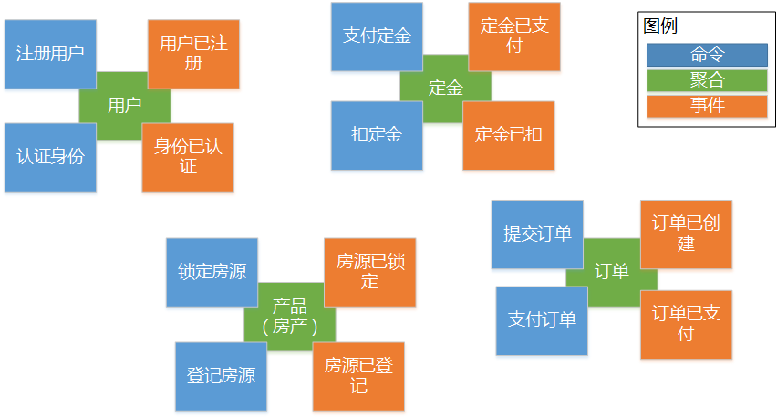
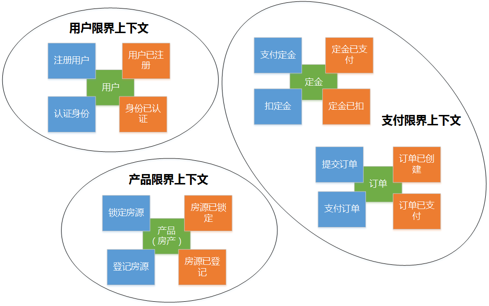
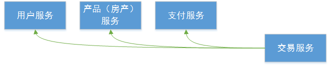
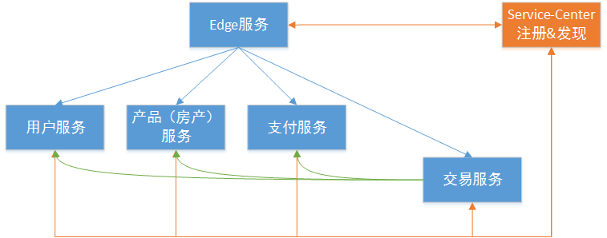
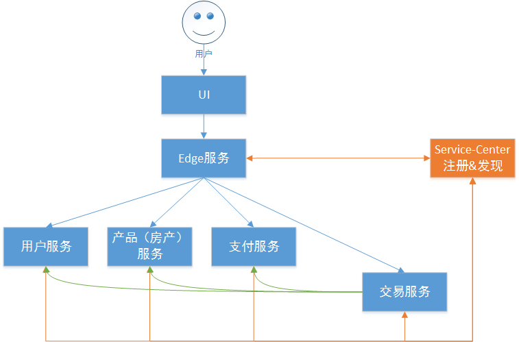

<!-- TOC -->

- [客户管理系统微服务化实战-PartI](#客户管理系统微服务化实战-parti)
    - [场景：地产 CRM](#场景地产-crm)
    - [使用DDD指导地产CRM系统的设计](#使用ddd指导地产crm系统的设计)
    - [将分析成果转化为方案域设计](#将分析成果转化为方案域设计)

<!-- /TOC -->

# 客户管理系统微服务化实战-PartI

## 场景：地产 CRM

您经营着一家房地产开发商，销售房产，迫切需要一套销售系统，考虑到微服务的优势，您决定使用微服务的方式构建系统；主要的业务流程也非常简单：用户前来购买购买产品（房产），首先需要登记用户信息，并缴纳一定数量的定金，待交易当日，挑选心仪的产品（房产），支付尾款，完成交易。

## 使用DDD指导地产CRM系统的设计

微服务系统的设计方面，领域驱动设计（Domain-Driven Design，DDD）是一个从业务出发的好选择，它由Eric Evans提出，是一种全新的系统设计和建模方法，这里的模型指的就是领域模型（Domain Model）。领域模型通过聚合（Aggregate）组织在一起，聚合间有明显的业务边界，这些边界将领域划分为一个个限界上下文（Bounded Context）。

理论概念都搞清楚了，那么怎么来找模型和聚合呢？一个非常流行的方法就是Event Storming，它是由Alberto Brandolini发明，经历了DDD社区和很多团队的实践，也是一种非常有参与感的团队活动：

上图就是我们对地产CRM这个场景使用Event Storming探索的结果，现在我们能够将限界上下文清晰的梳理出来：

> 提示：Event Storming是一项非常有创造性的活动，也是一个持续讨论和反复改进的过程，不同的团队关注的核心域（Core Domain）不同，得到的最终结果也会有差异。我们的目的是为了演示完整的微服务系统构建的过程，并不涉及商业核心竞争力方面的探讨，因此没有Core Domain和Sub Domain之类的偏重。

## 将分析成果转化为方案域设计

当我们完成所有的限界上下文的识别后，可以直接将它们落地为微服务：

1. 用户服务：提供用户信息管理服务，这里保存这用户的账号和密码，负责登录和认证；
2. 产品（房产）服务：提供产品管理服务，保存着房产的信息诸如价格、是否已售出等信息；
3. 支付服务：提供交易时支付服务，模拟对接银行支付定金，以及购房时支付尾款；

由于完成一笔交易是一个复杂的流程，与这三个微服务都有关联，因此我们引入了一个复合服务——交易服务：

- 交易服务：提供产品交易服务，它通过编排调用将整个交易流程串起来,交易服务中有两个流程：
    - 定金支付
        - Step1：通过用户服务验证用户身份；

        - Step2：通过支付服务请求银行扣款，增加定金账号内的定金；
    - 购房交易
        - Step1：通过用户服务验证用户身份；
        - Step2：通过资源服务确定用户希望购买的资源（房产）尚未售出；
        - Step3：通过资源服务标记目标资源（房产）已售出；
        - Step4：通过支付服务请求扣减定金账号内的定金，以及银行扣剩下的尾款；
        - 最后两个步骤需要保证事务一致性，其中Step4包含两个扣款操作。

之后，我们引入Edge服务提供统一入口：

> Edge服务：很多时候也被称为API网关（API Gateway），负责集中认证、动态路由等等；
> Edge服务需要依赖服务注册-发现机制，因此同时导入了ServiceCenter。

最后还需要提供UI：

> 前端UI（同样以微服务方式提供）：用户交互界面;
> 至此，DDD设计地产CRM的工作就结束了。

> refer to: https://servicecomb.apache.org/cn/docs/crm-part-I/
