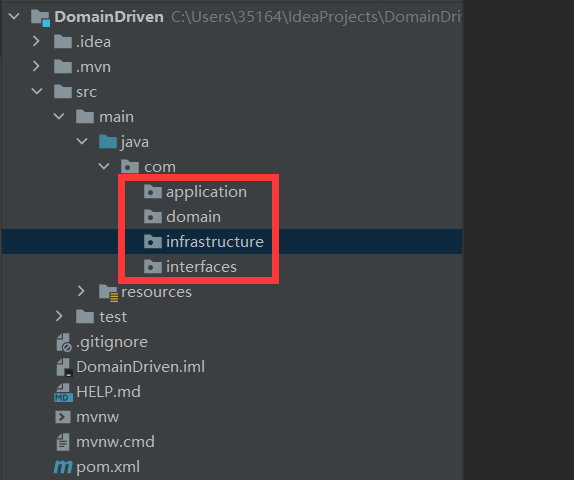

<!-- TOC -->

- [DDD—领域模型映射代码结构](#ddd领域模型映射代码结构)
    - [一级代码目录](#一级代码目录)
    - [各层代码目录](#各层代码目录)

<!-- /TOC -->

# DDD—领域模型映射代码结构

## 一级代码目录

前面《DDD—分层架构，洋葱架构，六边形架构》一文中讲到，领域模型的业务逻辑从领域层，应用层到用户接口层逐层组合和封装，对外提供灵活的服务，既实现了各层的分工和解耦，也实现了各层的协作，DDD分层架构是微服务代码结构的最佳落地。

根据DDD的分层架构，我们可以首先根据各层的单一职责定义一级目录（各层具体的职责见《DDD—分层架构，洋葱架构，六边形架构》）如下图：
- interfaces：用户接口层
- application：应用层
- domain：领域层
- infrastructure：基础层

## 各层代码目录

**用户接口层：interfaces目录下的代码目录结构有assembler，dto 和facade 三类**
- assembler：实现前端传输数据到后端的载体DTO和DO领域对象的转换，assembler都是和DTO和DO一起出现
- dto：前端传输数据到后端的载体，不实现任何业务逻辑
- facade：封装应用服务，提供粗粒度的调用接口

**应用层：application目录下的代码目录结构有event的订阅和发布，编排领域层的应用service，同时应用层负责与外部微服务交互，可能有DTO和DO的转换过程，需要Assembler的参与**
- event.publish：存放事件发布的代码
- event.subscribe：存放事件订阅的代码
- service：应用服务，对多个领域服务和外部微服务调用的封装，编排和组合，对用户接口层提供流程上的核心业务逻辑

**领域层：domain目录下是由一个或多个独立的聚合目录构成，每一个聚合是一个独立的业务功能单元，多个聚合共同实现领域模型的核心业务逻辑，聚合文件夹可以以聚合名称命名，聚合内包含entity，event，repository和service四个子目录。**
- entity：存放聚合根，实体和值对象
- event：存放事件实体，以及事件的具体业务逻辑实现
- service：存放跨聚合编排的领域服务，以及PO和DO转换和初始化用的工厂
- repository：一个聚合只能有一个仓储，仓储一般包含仓储接口和仓储实现。同事仓储还会有DAO代码的具体实现

**基础层：主要存放配置信息config和各种第三工具，API，组件集成的工具类utils**

领域模型映射成微服务代码结构的最终目录组织结构如下：

> refer to: https://www.cnblogs.com/jiyukai/p/14836825.html
