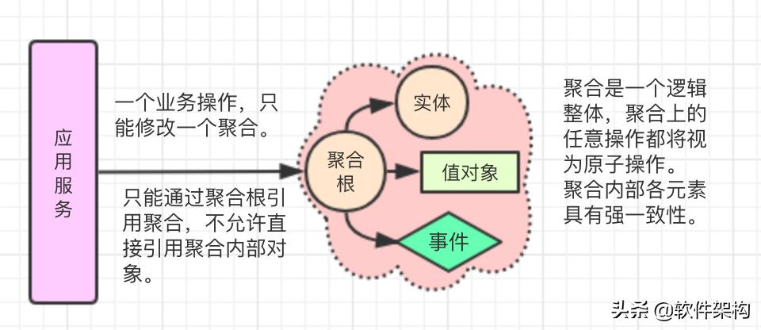
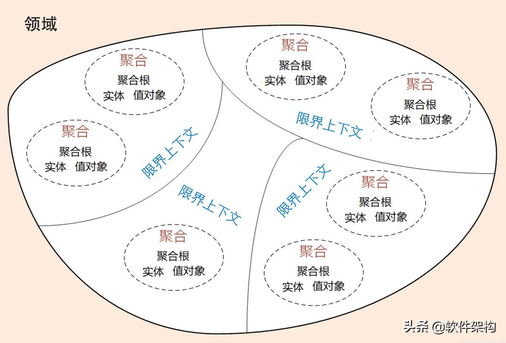
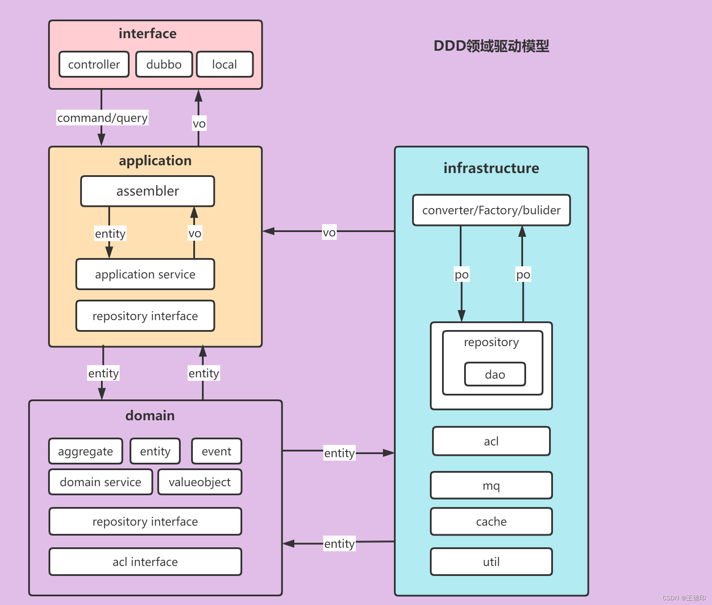
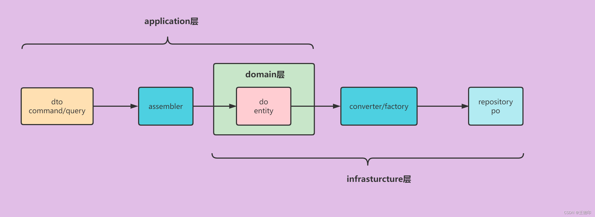
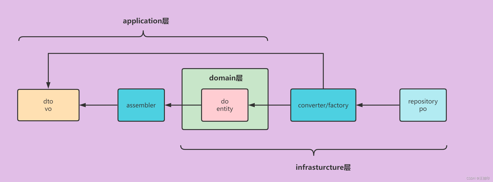

<!-- TOC -->

- [DDD领域驱动设计之聚合根、实体、值对象](#ddd领域驱动设计之聚合根实体值对象)
    - [聚合根、实体、值对象的区别？](#聚合根实体值对象的区别)
    - [聚合根、实体、值对象对象之间如何建立关联？](#聚合根实体值对象对象之间如何建立关联)
    - [如何识别聚合与聚合根？](#如何识别聚合与聚合根)
    - [CQRS 实战](#cqrs-实战)
        - [概念](#概念)
        - [架构图](#架构图)
        - [代码布局](#代码布局)
        - [数据模型转换](#数据模型转换)
        - [项目目录结构](#项目目录结构)
    - [总结](#总结)

<!-- /TOC -->

# DDD领域驱动设计之聚合根、实体、值对象

## 聚合根、实体、值对象的区别？

1. 从标识的角度：

聚合根具有全局的唯一标识，而实体只有在聚合内部有唯一的本地标识，值对象没有唯一标识，不存在这个值对象或那个值对象的说法。

2. 从是否只读的角度：

聚合根除了唯一标识外，其他所有状态信息都理论上可变；实体是可变的；值对象是只读的；

3. 从生命周期的角度：

聚合根有独立的生命周期，实体的生命周期从属于其所属的聚合，实体完全由其所属的聚合根负责管理维护；值对象无生命周期可言，因为只是一个值；

## 聚合根、实体、值对象对象之间如何建立关联？

聚合根到聚合根：通过ID关联；

聚合根到其内部的实体，直接对象引用；

聚合根到值对象，直接对象引用；

实体对其他对象的引用规则：1）能引用其所属聚合内的聚合根、实体、值对象；2）能引用外部聚合根，但推荐以ID的方式关联，另外也可以关联某个外部聚合内的实体，但必须是ID关联，否则就出现同一个实体的引用被两个聚合根持有，这是不允许的，一个实体的引用只能被其所属的聚合根持有；

值对象对其他对象的引用规则：只需确保值对象是只读的即可，推荐值对象的所有属性都尽量是值对象；

## 如何识别聚合与聚合根？

明确含义：一个Bounded Context（限界上下文）可能包含多个聚合，每个聚合都有一个根实体，叫做聚合根；

识别顺序：先找出哪些实体可能是聚合根，再逐个分析每个聚合根的边界，即该聚合根应该聚合哪些实体或值对象；最后再划分Bounded Context；

聚合边界确定法则：根据不变性约束规则（Invariant）。不变性规则有两类：1）聚合边界内必须具有哪些信息，如果没有这些信息就不能称为一个有效的聚合；2）聚合内的某些对象的状态必须满足某个业务规则.

## CQRS 实战

### 概念

CQRS(Command Query Responsibility Segregation)是将Command(命令)与Query(查询)分离的一种模式。其基本思想在于：任何一个方法都可以拆分为命令和查询两部分：

Command：不返回任何结果(void)，但会改变对象的状态。Command是引起数据变化操作的总称，一般会执行某个动作，如：新增，更新，删除等操作。操作都封装在Command中，用户提交Commond到CommandBus，然后分发到对应的CommandHandler中执行。Command执行后通过Repository将数据持久化。事件源(Event source)CQRS，Command将特定的Event发送到EventBus，然后由特定的EventHandler处理。

Query：返回查询结果，不会对数据产生变化的操作，只是按照某些条件查找数据。基于Query条件，返回查询结果；为不同的场景定制不同的Facade。

### 架构图

基于四层的CQRS架构图：

### 代码布局

**第一种是**

用户界面层调用应用服务
应用服务调用领域服务
在领域服务中
①通过仓库获取聚合根
②通过资源库持久化聚合根
③调用聚合根的业务方法
④发布领域事件

**第二种是**

用户界面层调用应用服务
应用服务
①通过资源库获取聚合根
②调用聚合根的业务方法或者领域服务的方法
③通过资源库持久化聚合根
④发布领域事件

### 数据模型转换

每一层都有自己特定的数据，可以做如下区分：

- VO（View Object）：视图对象，主要对应界面显示的数据对象。对于一个WEB页面，小程序，微信公众号等前端需要的数据对象。也有团队用VO表示领域层中的Value Object值对象，这个要根据团队的规范来定义。
- DTO（Data Transfer Object）：数据传输对象，主要用于远程调用之间传输的对象的地方。比如我们一张表有 100 个字段，那么对应的 PO 就有 100 个属性。但是客户端只需要 10 个字段，没有必要把整个 PO 对象传递到客户端，这时我们就可以用只有这 10 个属性的 DTO 来传递结果到客户端，这样也不会暴露服务端表结构。到达客户端以后，如果用这个对象来对应界面显示，那此时它的身份就转为 VO。DTO泛指用于展示层与服务层之间的数据传输对象，当然VO也相当于数据DTO的一种。
- DO（Domain Object）：领域对象，就是从现实世界中抽象出来的有形或无形的业务实体，使用的是充血模型设计的对象。也有团队使用用 BO（Business Objects）表示业务对象的概念。
- PO（Persistent Object）：持久化对象，它跟持久层（通常是关系型数据库）的数据结构形成一一对应的映射关系，如果持久层是关系型数据库，那么，数据表中的每个字段（或若干个）就对应 PO 的一个（或若干个）属性。最形象的理解就是一个 PO 就是数据库中的一条记录，好处是可以把一条记录作为一个对象处理，可以方便的转为其它对象。也有团队使用DO（Data Object）表示数据对象
- POJO（Plain Ordinary Java Object）：简单对象，是只具有setter getter方法对象的统称。但是不要把对象名命名成 xxxPOJO！

**模型转换架构图：**

（1）从应用层->基础设施层的过程：

（2）从基础设施层->应用层的过程：

### 项目目录结构

│
│    ├─interface   用户接口层 
│    │    └─controller    控制器，对外提供（Restful）接口
│    │    └─facade		  外观模式，对外提供本地接口和dubbo接口
│    │    └─mq		      mq消息，消费者消费外部mq消息
│    │ 
│    ├─application 应用层
│    │    ├─assembler     装配器
│    │    ├─dto           数据传输对象，xxxCommand/xxxQuery/xxxVo     
│    │    │    ├─command  接受增删改的参数
│    │    │    ├─query    接受查询的参数
│    │    │    ├─vo       返回给前端的vo对象
│    │    ├─service       应用服务，负责领域的组合、编排、转发、转换和传递
│    │    ├─repository    查询数据的仓库接口
│    │    ├─listener      事件监听定义
│    │ 
│    ├─domain      领域层
│    │    ├─entity        领域实体
│    │    ├─valueobject   领域值对象
│    │    ├─service       领域服务
│    │    ├─repository    仓库接口，增删改的接口
│    │    ├─acl  		  防腐层接口
│    │    ├─event         领域事件
│    │ 
│    ├─infrastructure  基础设施层
│    │    ├─converter     实体转换器
│    │    ├─repository    仓库
│    │    │    ├─impl     仓库实现
│    │    │    ├─mapper   mybatis mapper接口
│    │    │    ├─po       数据库orm数据对象 
│    │    ├─ack			  实体转换器
│    │    ├─mq            mq消息
│    │    ├─cache         缓存
│    │    ├─util          工具类
│    │    
│    

## 总结

1. MVC是一个短暂的快乐但不足以支撑漫长的生活，而DDD是一个不要短暂的温存而是一世的陪伴，如果是你来抉择你会选择哪一个？
2. MVC的开发模式：是数据驱动，自低向上的思想，关注数据。DDD的开发模式：是领域驱动，自顶向下，关注业务活动。为了应对业务快速变化的软件系统，DDD是面向对象的最终体现，大家一起用起来吧！
3. DDD是一套方法论，一千个读者一千个哈姆雷特。
