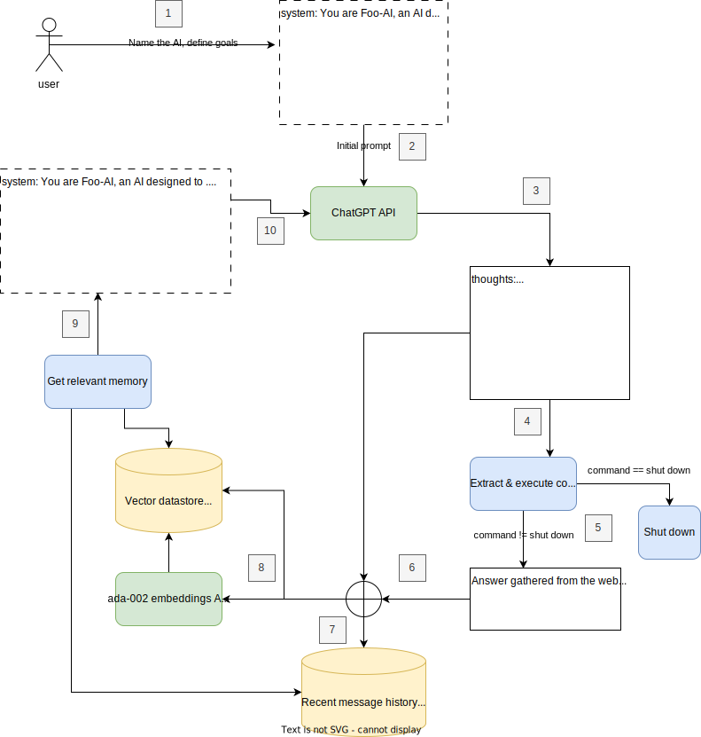

<!-- TOC -->

- [AI Agents: AutoGPT architecture & breakdown](#ai-agents-autogpt-architecture--breakdown)
- [Architecture](#architecture)
    - [Workflow](#workflow)
    - [Commands](#commands)
- [Appendix](#appendix)
    - [Example terminal message for initial user input](#example-terminal-message-for-initial-user-input)
    - [How ChatCompletions messages are printed](#how-chatcompletions-messages-are-printed)
    - [Example initial prompt](#example-initial-prompt)
    - [Example json string returned by ChatGPT](#example-json-string-returned-by-chatgpt)
    - [Example prompt with memories](#example-prompt-with-memories)

<!-- /TOC -->
<a id="markdown-ai-agents-autogpt-architecture--breakdown" name="ai-agents-autogpt-architecture--breakdown"></a>
# AI Agents: AutoGPT architecture & breakdown

> refer to: <https://georgesung.github.io/ai/2023/04/22/autogpt-arch.html>

Recently I’ve found myself completely hooked experimenting with [AutoGPT](https://github.com/Significant-Gravitas/Auto-GPT), as have many others. Using AutoGPT as a black box, I started getting curious about how it works under the hood. Thankfully the code is open source, so I decided to take a look. The following are my notes on the architecture of AutoGPT. Hopefully this helps those who are curious about how AutoGPT works. Also, AutoGPT can serve as a reference design for those who are building their own agentic AI systems.

Note: I analyzed the code from [AutoGPT v0.2.1](https://github.com/Significant-Gravitas/Auto-GPT/releases/tag/v0.2.1), which I downloaded a week ago. The information below reflects AutoGPT 0.2.1. At the time of this writing (2023/04/22), AutoGPT v0.2.2 has already been released. Kudos to the incredible progress the community is making!

<a id="markdown-architecture" name="architecture"></a>
# Architecture



<a id="markdown-workflow" name="workflow"></a>
## Workflow

<a id="hidden-1" name="hidden-1"></a>
1. User (the human) defines the name of the AI agent, and specifies up to 5 goals, e.g. users of AutoGPT will see the following in their terminal (complete example in the Appendix under *["Example terminal message for initial user input"](#example-terminal-message-for-initial-user-input)*)

```
Welcome to Auto-GPT!  Enter the name of your AI and its role below.
...
Enter up to 5 goals for your AI:
...
Goal 1: ...
Goal 2: ...
```

<a id="hidden-2" name="hidden-2"></a>
2. Based on the user’s settings, the initial prompt is generated and sent to the ChatGPT API. The prompt contains the user’s setttings, and overall instructions for ChatGPT. Overall instructions include all available commands, instructions to output results in json, and more. For an example of an initial prompt, see the Appendix *["Example initial prompt"](#example-initial-prompt)*.

<a id="hidden-3" name="hidden-3"></a>
3. ChatGPT returns a json string (ideally), which includes its thoughts, reasoning, plan, and criticism. The json also includes the next command to execute and its arguments. For an example of a json string returned by ChatGPT, see the Appendix *["Example json string returned by ChatGPT"](#example-json-string-returned-by-chatgpt)*.

<a id="hidden-4" name="hidden-4"></a>
4. The command is extracted and parsed from ChatGPT’s response. If the shut down `task_complete` command was issued, then the system shuts down. Else, the appropriate command executor executes the command with the given arguments.

<a id="hidden-5" name="hidden-5"></a>
5. The executed command returns a string value. For example, the Google search command would return the search results, the `browse_website` command would return a summary of the scraped website contents, the `write_to_file` would return the status of writing to a file, etc.

<a id="hidden-6" name="hidden-6"></a>
6. The ChatGPT output ([4](#hidden-4)) and command return string ([5](#hidden-5)) are combined, to be added to memory

<a id="hidden-7" name="hidden-7"></a>
7. The context from ([6](#hidden-6)) is added to short-term memory, stored as text only. This could be implemented using queue/FIFO data structure. In *AutoGPT 0.2.1*, the full message history is stored, but only *the first 9 ChatGPT messages / command return strings* are selected as *short-term memory*.

<a id="hidden-8" name="hidden-8"></a>
8. The context from ([6](#hidden-6)) is also added to long-term memory. The general idea is we want a collection of `(vector, text)` pairs, and the ability to execute a *[KNN](https://en.wikipedia.org/wiki/K-nearest_neighbors_algorithm)/approximate-KNN* search to find the top-K most similar items from a given query. To get the text embeddings/vectors, we use OpenAI’s ada-002 embeddings API. To store the `(vector, text)` pairs, we can use local memory (e.g. [FAISS](https://huggingface.co/learn/nlp-course/chapter5/6)), or even a scalable [vector database](https://www.pinecone.io/learn/vector-database/) like Pinecone. *AutoGPT 0.2.1 supports Pinecone, local datastore, and more. I used the local storage option, which writes the embedding vectors to disk in plain-text format.*

<a id="hidden-9" name="hidden-9"></a>
9. Given the most recent context from the short-term memory ([7](#hidden-7)), query the long-term memory from ([8](#hidden-8)) to get the top-K most relevant pieces of memory *(K=10 for AutoGPT 0.2.1)*. The top-K most relevant memories are added to the prompt, under `{relevant memory}` in the diagram. For an example prompt that includes memories, see the Appendix *"Example prompt with memories"*. The memories are added under “This reminds you of events from your past”.

<a id="hidden-10" name="hidden-10"></a>
10. A new prompt is constructed, with the same instructions from the initial prompt ([2](#hidden-2)), the relevant memories from ([9](#hidden-9)), and an instruction at the end to "GENERATE NEXT COMMAND JSON" (see the Appendix “Example prompt with memories”). This new prompt is used to call ChatGPT, and steps ([3](#hidden-3)) through ([10](#hidden-10)) are repeated until the task is complete, i.e. ChatGPT issues the `task_complete` shut down command.

<a id="markdown-commands" name="commands"></a>
## Commands

One fascinating and very powerful aspect of agentic AI is its ability to issue and execute commands. In AutoGPT, the LLM system (ChatGPT) is made aware of the available commands and their functionality via the following text in the prompt:

```
Commands:
1. Google Search: "google", args: "input": "<search>"
2. Browse Website: "browse_website", args: "url": "<url>", "question": "<what_you_want_to_find_on_website>"
3. Start GPT Agent: "start_agent", args: "name": "<name>", "task": "<short_task_desc>", "prompt": "<prompt>"
4. Message GPT Agent: "message_agent", args: "key": "<key>", "message": "<message>"
5. List GPT Agents: "list_agents", args: 
6. Delete GPT Agent: "delete_agent", args: "key": "<key>"
7. Clone Repository: "clone_repository", args: "repository_url": "<url>", "clone_path": "<directory>"
8. Write to file: "write_to_file", args: "file": "<file>", "text": "<text>"
9. Read file: "read_file", args: "file": "<file>"
10. Append to file: "append_to_file", args: "file": "<file>", "text": "<text>"
11. Delete file: "delete_file", args: "file": "<file>"
12. Search Files: "search_files", args: "directory": "<directory>"
13. Evaluate Code: "evaluate_code", args: "code": "<full_code_string>"
14. Get Improved Code: "improve_code", args: "suggestions": "<list_of_suggestions>", "code": "<full_code_string>"
15. Write Tests: "write_tests", args: "code": "<full_code_string>", "focus": "<list_of_focus_areas>"
16. Execute Python File: "execute_python_file", args: "file": "<file>"
17. Generate Image: "generate_image", args: "prompt": "<prompt>"
18. Send Tweet: "send_tweet", args: "text": "<text>"
19. Convert Audio to text: "read_audio_from_file", args: "file": "<file>"
20. Do Nothing: "do_nothing", args: 
21. Task Complete (Shutdown): "task_complete", args: "reason": "<reason>"
```

Each command has a short description (e.g. *"Google Search", "Execute Python File"*, etc.) so ChatGPT knows which command to select given the current context. Further, each command has its own executor in AutoGPT.

I find this a very powerful concept, since one can extend the suite of commands available, which opens up many possibilities. For example, if we had a command to add products to the shopping cart of an online retailer, we can specify an objective to ([1](#hidden-1)) find tennis strings most suitable for a topspin baseline player, and ([2](#hidden-2)) add that string to the user’s shopping cart. One can also extend commands to the physical world, such as smart home controls. Of course, it is very important to prioritize safety, as these LLM-based autonomous agents are still in their early days of development!

<a id="markdown-appendix" name="appendix"></a>
# Appendix

<a id="markdown-example-terminal-message-for-initial-user-input" name="example-terminal-message-for-initial-user-input"></a>
## Example terminal message for initial user input

```
Welcome to Auto-GPT!  Enter the name of your AI and its role below. Entering nothing will load defaults.
Name your AI:  For example, 'Entrepreneur-GPT'
AI Name: Foo
Foo here!  I am at your service.
Describe your AI's role:  For example, 'an AI designed to autonomously develop and run businesses with the sole goal of increasing your net worth.'
Foo is: an AI that recommends tennis equipment for a specific player
Enter up to 5 goals for your AI:  For example: Increase net worth, Grow Twitter Account, Develop and manage multiple businesses autonomously'
Enter nothing to load defaults, enter nothing when finished.
Goal 1: Find the top 3 most suitable tennis strings for a hard hitting baseline player who hits with a lot of topspin
Goal 2: Write the tennis strings to output
Goal 3: Shut down when you are done
Goal 4: 
```

<a id="markdown-how-chatcompletions-messages-are-printed" name="how-chatcompletions-messages-are-printed"></a>
## How ChatCompletions messages are printed

AutoGPT uses OpenAI’s [ChatCompletion](https://platform.openai.com/docs/guides/chat/introduction), which expects a list of dicts that represents the chat history. For visual clarify, I have printed out the prompts that go into ChatGPT as a string. For example:

```
messages = [
    {"role": "system", "content": "foo"},
    {"role": "user", "content": "bar1"},
    {"role": "assistant", "content": "bar2"}
]
```

will be printed as:

```
system: foo
user: bar1
assistant: bar2
```

<a id="markdown-example-initial-prompt" name="example-initial-prompt"></a>
## Example initial prompt

```
system: You are Foo, an AI that recommends tennis equipment for a specific player
Your decisions must always be made independently without seeking user assistance. Play to your strengths as an LLM and pursue simple strategies with no legal complications.

GOALS:

1. Find the top 3 most suitable tennis strings for a hard hitting baseline player who hits with a lot of topspin
2. Write the tennis strings to output
3. Shut down when you are done


Constraints:
1. ~4000 word limit for short term memory. Your short term memory is short, so immediately save important information to files.
2. If you are unsure how you previously did something or want to recall past events, thinking about similar events will help you remember.
3. No user assistance
4. Exclusively use the commands listed in double quotes e.g. "command name"

Commands:
1. Google Search: "google", args: "input": "<search>"
2. Browse Website: "browse_website", args: "url": "<url>", "question": "<what_you_want_to_find_on_website>"
3. Start GPT Agent: "start_agent", args: "name": "<name>", "task": "<short_task_desc>", "prompt": "<prompt>"
4. Message GPT Agent: "message_agent", args: "key": "<key>", "message": "<message>"
5. List GPT Agents: "list_agents", args: 
6. Delete GPT Agent: "delete_agent", args: "key": "<key>"
7. Clone Repository: "clone_repository", args: "repository_url": "<url>", "clone_path": "<directory>"
8. Write to file: "write_to_file", args: "file": "<file>", "text": "<text>"
9. Read file: "read_file", args: "file": "<file>"
10. Append to file: "append_to_file", args: "file": "<file>", "text": "<text>"
11. Delete file: "delete_file", args: "file": "<file>"
12. Search Files: "search_files", args: "directory": "<directory>"
13. Evaluate Code: "evaluate_code", args: "code": "<full_code_string>"
14. Get Improved Code: "improve_code", args: "suggestions": "<list_of_suggestions>", "code": "<full_code_string>"
15. Write Tests: "write_tests", args: "code": "<full_code_string>", "focus": "<list_of_focus_areas>"
16. Execute Python File: "execute_python_file", args: "file": "<file>"
17. Generate Image: "generate_image", args: "prompt": "<prompt>"
18. Send Tweet: "send_tweet", args: "text": "<text>"
19. Convert Audio to text: "read_audio_from_file", args: "file": "<file>"
20. Do Nothing: "do_nothing", args: 
21. Task Complete (Shutdown): "task_complete", args: "reason": "<reason>"

Resources:
1. Internet access for searches and information gathering.
2. Long Term memory management.
3. GPT-3.5 powered Agents for delegation of simple tasks.
4. File output.

Performance Evaluation:
1. Continuously review and analyze your actions to ensure you are performing to the best of your abilities.
2. Constructively self-criticize your big-picture behavior constantly.
3. Reflect on past decisions and strategies to refine your approach.
4. Every command has a cost, so be smart and efficient. Aim to complete tasks in the least number of steps.

You should only respond in JSON format as described below 
Response Format: 
{
    "thoughts": {
        "text": "thought",
        "reasoning": "reasoning",
        "plan": "- short bulleted\n- list that conveys\n- long-term plan",
        "criticism": "constructive self-criticism",
        "speak": "thoughts summary to say to user"
    },
    "command": {
        "name": "command name",
        "args": {
            "arg name": "value"
        }
    }
} 
Ensure the response can be parsed by Python json.loads
system: The current time and date is Sat Apr 22 01:43:22 2023
system: This reminds you of these events from your past:


user: Determine which next command to use, and respond using the format specified above:
```

<a id="markdown-example-json-string-returned-by-chatgpt" name="example-json-string-returned-by-chatgpt"></a>
## Example json string returned by ChatGPT

```
{
    "thoughts": {
        "text": "I need to find the top 3 most suitable tennis strings for a hard hitting baseline player who hits with a lot of topspin. I should start by doing some research on the topic.",
        "reasoning": "I need to gather information on the characteristics of tennis strings that are suitable for a hard hitting baseline player who hits with a lot of topspin. This will help me narrow down my search and find the top 3 most suitable options.",
        "plan": "- Conduct a Google search on the topic\n- Browse websites that specialize in tennis equipment\n- Consult with a GPT agent if necessary",
        "criticism": "I need to make sure that I am gathering information from reliable sources and that I am considering all relevant factors when making my recommendations.",
        "speak": "I will conduct a Google search on the topic and browse websites that specialize in tennis equipment to find the top 3 most suitable tennis strings for a hard hitting baseline player who hits with a lot of topspin."
    },
    "command": {
        "name": "google",
        "args": {
            "input": "best tennis strings for hard hitting baseline player with topspin"
        }
    }
}
```

<a id="markdown-example-prompt-with-memories" name="example-prompt-with-memories"></a>
## Example prompt with memories

```
system: You are Foo, an AI that recommends tennis equipment for a specific player
Your decisions must always be made independently without seeking user assistance. Play to your strengths as an LLM and pursue simple strategies with no legal complications.

GOALS:

1. Find the top 3 most suitable tennis strings for a hard hitting baseline player who hits with a lot of topspin
2. Write the tennis strings to output
3. Shut down when you are done


Constraints:
1. ~4000 word limit for short term memory. Your short term memory is short, so immediately save important information to files.
2. If you are unsure how you previously did something or want to recall past events, thinking about similar events will help you remember.
3. No user assistance
4. Exclusively use the commands listed in double quotes e.g. "command name"

Commands:
1. Google Search: "google", args: "input": "<search>"
2. Browse Website: "browse_website", args: "url": "<url>", "question": "<what_you_want_to_find_on_website>"
3. Start GPT Agent: "start_agent", args: "name": "<name>", "task": "<short_task_desc>", "prompt": "<prompt>"
4. Message GPT Agent: "message_agent", args: "key": "<key>", "message": "<message>"
5. List GPT Agents: "list_agents", args: 
6. Delete GPT Agent: "delete_agent", args: "key": "<key>"
7. Clone Repository: "clone_repository", args: "repository_url": "<url>", "clone_path": "<directory>"
8. Write to file: "write_to_file", args: "file": "<file>", "text": "<text>"
9. Read file: "read_file", args: "file": "<file>"
10. Append to file: "append_to_file", args: "file": "<file>", "text": "<text>"
11. Delete file: "delete_file", args: "file": "<file>"
12. Search Files: "search_files", args: "directory": "<directory>"
13. Evaluate Code: "evaluate_code", args: "code": "<full_code_string>"
14. Get Improved Code: "improve_code", args: "suggestions": "<list_of_suggestions>", "code": "<full_code_string>"
15. Write Tests: "write_tests", args: "code": "<full_code_string>", "focus": "<list_of_focus_areas>"
16. Execute Python File: "execute_python_file", args: "file": "<file>"
17. Generate Image: "generate_image", args: "prompt": "<prompt>"
18. Send Tweet: "send_tweet", args: "text": "<text>"
19. Convert Audio to text: "read_audio_from_file", args: "file": "<file>"
20. Do Nothing: "do_nothing", args: 
21. Task Complete (Shutdown): "task_complete", args: "reason": "<reason>"

Resources:
1. Internet access for searches and information gathering.
2. Long Term memory management.
3. GPT-3.5 powered Agents for delegation of simple tasks.
4. File output.

Performance Evaluation:
1. Continuously review and analyze your actions to ensure you are performing to the best of your abilities.
2. Constructively self-criticize your big-picture behavior constantly.
3. Reflect on past decisions and strategies to refine your approach.
4. Every command has a cost, so be smart and efficient. Aim to complete tasks in the least number of steps.

You should only respond in JSON format as described below 
Response Format: 
{
    "thoughts": {
        "text": "thought",
        "reasoning": "reasoning",
        "plan": "- short bulleted\n- list that conveys\n- long-term plan",
        "criticism": "constructive self-criticism",
        "speak": "thoughts summary to say to user"
    },
    "command": {
        "name": "command name",
        "args": {
            "arg name": "value"
        }
    }
} 
Ensure the response can be parsed by Python json.loads
system: The current time and date is Sat Apr 22 13:47:07 2023
system: This reminds you of these events from your past:
['Assistant Reply: {\n    "thoughts": {\n        "text": "I need to find the top 3 most suitable tennis strings for a hard hitting baseline player who hits with a lot of topspin. I should start by doing some research on the topic.",\n        "reasoning": "I need to gather information on the characteristics of tennis strings that are suitable for a hard hitting baseline player who hits with a lot of topspin. This will help me narrow down my search and find the top 3 most suitable options.",\n        "plan": "- Conduct a Google search on the topic\\n- Browse websites that specialize in tennis equipment\\n- Consult with a GPT agent if necessary",\n        "criticism": "I need to make sure that I am gathering information from reliable sources and that I am considering all relevant factors when making my recommendations.",\n        "speak": "I will conduct a Google search on the topic and browse websites that specialize in tennis equipment to find the top 3 most suitable tennis strings for a hard hitting baseline player who hits with a lot of topspin."\n    },\n    "command": {\n        "name": "google",\n        "args": {\n            "input": "best tennis strings for hard hitting baseline player with topspin"\n        }\n    }\n} \nResult: Command google returned: b\'[\\n    {\\n        "title": "Best Tennis Strings in 2023 - For Spin, Power, Control - Athlete Path",\\n        "href": "https://www.athletepath.com/best-tennis-strings/",\\n        "body": "Wilson Champions Choice Duo Tennis String Babolat RPM Blast Black 17g Strings Solinco Hyper-G Heaven High Spin Poly String Head Rip Control Tennis String Wilson NXT String Tourna Big Hitter Black7 Luxilion ALU Power 125 Tennis Racquet String Set How to Choose Tennis Strings Types of Tennis Strings Important Features to Consider Conclusion"\\n    },\\n    {\\n        "title": "Best tennis strings of 2022 | TW gear guide - Tennis Warehouse",\\n        "href": "https://www.tennis-warehouse.com/learning_center/gear_guides/tennis_string/best_tennis_strings.html",\\n        "body": "Wilson Champion\\\'s Choice Hybrid 16 String 5.0 3 Reviews $ 41.95 Quantity: 1 Increment Add To Cart Wish list TW Reviews Price Icon Lowest Price Guarantee Arrow Up We will match or beat any posted overall price advertised in-store or online on in stock items. Shop Hybrids Best strings by playing feature (benefit)"\\n    },\\n    {\\n        "title": "11 Best Tennis Strings For Spin - A Complete Guide",\\n        "href": "https://tennispredict.com/11-best-tennis-strings-for-spin/",\\n        "body": "These are the 11 best tennis strings for spin. Babolat RPM Blast Luxilon ALU Power Spin Solinco Tour Bite 19 Technifiber Black Code 4S 16 Volkl Cyclone 16 Kirschbaum Xplosive Speed 16 Wilson Revolve Spin 16 Turna Poly Big Hitter Black 7 Gamma AMP Moto 16 Head Sonic Pro Edge 16 Yonex Poly Tour Spin"\\n    },\\n    {\\n        "title": "10+ Best Tennis Strings for 2023 | Playtested & Reviewed",\\n        "href": "https://tenniscompanion.org/best-tennis-strings/",\\n        "body": "My pick for the best synthetic gut tennis string, which I cover in greater detail in this guide, is Prince Synthetic Gut. It\\\'s an excellent string with a long-standing positive reputation in the tennis community. Here are a few additional options to consider for beginners and children. Head Synthetic Gut PPS Gamma Synthetic Gut"\\n    },\\n    {\\n        "title": "Best Tennis Strings for Topspin",\\n        "href": "https://primotennis.com/best-tennis-strings-for-topspin/",\\n        "body": "Finding the sweet spot is key! The best string tension for topspin is around 50-60 pounds (23-27 kg). This provides enough power and control while still allowing the ball to bite into the string bed for maximum spin potential. If you find that your strings are breaking too frequently, you may want to increase the tension slightly."\\n    },\\n    {\\n        "title": "12 Best Tennis Strings With Buying Guide 2023 - Tennisscan",\\n        "href": "https://tennisscan.com/best-tennis-strings/",\\n        "body": "Wilson Champions Choice is a cross between Wilson Natural Gut and Luxilon ALU Power Rough, two of the most popular strings on tour. The player gets the best of both worlds by combining the optimum playability of a high-quality. Use the Luxilon ALU Power Rough for durability and control in the mains."\\n    },\\n    {\\n        "title": "Most Spin-Friendly Strings - Tennis Warehouse",\\n        "href": "https://www.tennis-warehouse.com/learning_center/gear_guides/tennis_string/best_spin_strings.html",\\n        "body": "It also provides a low-powered response, which allows big hitters to play with confidence. Read the full review. Weiss CANNON Ultra Cable 17 Yellow/1.23 String. $12.90. 3. Weiss CANNON Ultra Cable 17/1.23 String White. $12.90. 3. Weiss CANNON Ultra Cable 17 Ye/1.23 String Reel - 660\\\'."\\n    },\\n    {\\n        "title": "The Best Tennis Strings - The Tennis Bros",\\n        "href": "https://thetennisbros.com/reviews/strings/the-best-tennis-strings/",\\n        "body": "Natural gut is the most powerful, most elastic string on the planet and is loved by professional and amateur players alike. It\\\'s created from cow intestine that is twisted into a string format in a factory, coated and then sold in a packet. Its touch on the tennis court is heavenly and it feels like velvet on the arm."\\n    }\\n]\' \nHuman Feedback: GENERATE NEXT COMMAND JSON ']


user: GENERATE NEXT COMMAND JSON
assistant: {
    "thoughts": {
        "text": "Based on my research, I have found some tennis strings that are suitable for a hard hitting baseline player with topspin. I will now write these strings to output and shut down.",
        "reasoning": "I have completed my research and found the information I need to make my recommendations. Writing the strings to output will allow the user to see my recommendations and shut down will end this task.",
        "plan": "- Write the top 3 most suitable tennis strings to output\n- Shut down",
        "criticism": "I need to make sure that I am providing accurate and helpful information to the user. I should also consider providing additional information on why these strings are suitable for a hard hitting baseline player with topspin.",
        "speak": "Based on my research, I have found some tennis strings that are suitable for a hard hitting baseline player with topspin. I will now write these strings to output and shut down."
    },
    "command": {
        "name": "write_to_file",
        "args": {
            "file": "recommended_strings.txt",
            "text": "1. Babolat RPM Blast\n2. Solinco Tour Bite\n3. Luxilon ALU Power Spin"
        }
    }
}
system: Command write_to_file returned: File written to successfully.
user: GENERATE NEXT COMMAND JSON
```
