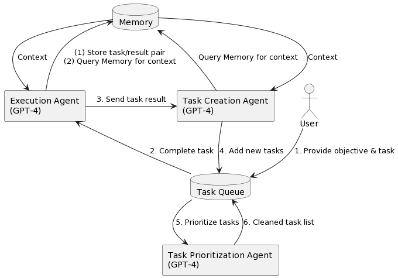

<!-- TOC -->

- [AutoGPT 详解](#autogpt-详解)
- [AutoGPT 原理](#autogpt-原理)
    - [Command Prompt](#command-prompt)
        - [Demand Prompt](#demand-prompt)
        - [Response Format](#response-format)
        - [Memory 和 History](#memory-和-history)
    - [结论](#结论)
- [源码分析](#源码分析)
    - [程序入口](#程序入口)
    - [construct_prompt 构建 Demand Prompt](#construct_prompt-构建-demand-prompt)
    - [prompt_user 进行 ai 配置（ai 名字、role、5个目标）](#prompt_user-进行-ai-配置ai-名字role5个目标)
    - [construct_full_prompt 构建完整的 Demand Prompt](#construct_full_prompt-构建完整的-demand-prompt)
    - [get_prompt](#get_prompt)
    - [start_interaction_loop](#start_interaction_loop)
    - [chat_with_ai](#chat_with_ai)
- [Plugin 机制](#plugin-机制)
- [References](#references)

<!-- /TOC -->
<a id="markdown-autogpt-详解" name="autogpt-详解"></a>
# AutoGPT 详解

> 基于 AutoGPT 0.2.2 版本进行的分析

<a id="markdown-autogpt-原理" name="autogpt-原理"></a>
# AutoGPT 原理



AutoGPT uses GPT-4 to generate, prioritize and execute tasks, using plug-ins for internet browsing and other access. It uses outside memory to keep track of what it is doing and provide context, which lets it evaluate its situation, generate new tasks or self-correct, and add new tasks to the queue, which it then prioritizes.

AutoGPT 的核心逻辑是一个 Prompt Loop:


1. AutoGPT 会基于一定策略自动组装 Command Prompt，这些首次会包含用户输入的 Name, Role 和 Goals
2. Command Prompt 的目标不是为了拿到最终结果，而是通过 GPT Chat API (对应界面 Thinking 的过程) 返回下一步的 Command (包含 command name 和 arguments, 如 browser_website(url = "www.baidu.com") )
3. 这些 Command 都是可扩展的，每一种命令代表一种外部能力(比如爬虫、Google 搜索，也包括 GPT 的能力)，通过这些 Command 调用返回的 Result 又会成为到 Command Prompt 的组成元素，
回到第 1 步往复循环，直到拿到最终结果结果（状态为 "compelete"）

<a id="markdown-command-prompt" name="command-prompt"></a>
## Command Prompt

整个 Command Prompt 会组装为 Chat GPT 的 Messages 参数，截取中间某次 GPT 交互的消息格式如下:


<a id="markdown-demand-prompt" name="demand-prompt"></a>
### Demand Prompt

用户输入 AI Name、Role 和 Goals 之后，完整的 Demand Prompt 示例如下：

```
You are Energy-GPT, An AI assistant that helps analyze the best stock opportunities in energy sector 

Your decisions must always be made independently without seeking user assistance. Play to your strengths as an LLM and pursue simple strategies with no legal complications.

GOALS:
1. Identify top 3 companies to invest in the energy sector based on value
2. Write report in text file with the pros and cons of that ticker and a summary of how the company earns income


Constraints:
1. ~4000 word limit for short term memory. Your short term memory is short, so immediately save important information to files.
2. If you are unsure how you previously did something or want to recall past events, thinking about similar events will help you remember.
3. No user assistance
4. Exclusively use the commands listed in double quotes e.g. "command name"

Commands:
1. Google Search: "google", args: "input": "<search>"
2. Browse Website: "browse_website", args: "url": "<url>", "question": "<what_you_want_to_find_on_website>"
3. Start GPT Agent: "start_agent", args: "name": "<name>", "task": "<short_task_desc>", "prompt": "<prompt>"
4. Message GPT Agent: "message_agent", args: "key": "<key>", "message": "<message>"
5. List GPT Agents: "list_agents", args: 
6. Delete GPT Agent: "delete_agent", args: "key": "<key>"
7. Clone Repository: "clone_repository", args: "repository_url": "<url>", "clone_path": "<directory>"
8. Write to file: "write_to_file", args: "file": "<file>", "text": "<text>"
9. Read file: "read_file", args: "file": "<file>"
10. Append to file: "append_to_file", args: "file": "<file>", "text": "<text>"
11. Delete file: "delete_file", args: "file": "<file>"
12. Search Files: "search_files", args: "directory": "<directory>"
13. Evaluate Code: "evaluate_code", args: "code": "<full_code_string>"
14. Get Improved Code: "improve_code", args: "suggestions": "<list_of_suggestions>", "code": "<full_code_string>"
15. Write Tests: "write_tests", args: "code": "<full_code_string>", "focus": "<list_of_focus_areas>"
16. Execute Python File: "execute_python_file", args: "file": "<file>"
17. Generate Image: "generate_image", args: "prompt": "<prompt>"
18. Send Tweet: "send_tweet", args: "text": "<text>"
19. Do Nothing: "do_nothing", args: 
20. Task Complete (Shutdown): "task_complete", args: "reason": "<reason>"

Resources:
1. Internet access for searches and information gathering.
2. Long Term memory management.
3. GPT-3.5 powered Agents for delegation of simple tasks.
4. File output.

Performance Evaluation:
1. Continuously review and analyze your actions to ensure you are performing to the best of your abilities.
2. Constructively self-criticize your big-picture behavior constantly.
3. Reflect on past decisions and strategies to refine your approach.
4. Every command has a cost, so be smart and efficient. Aim to complete tasks in the least number of steps.

You should only respond in JSON format as described below 
Response Format: 
{
    "thoughts": {
        "text": "thought",
        "reasoning": "reasoning",
        "plan": "- short bulleted\n- list that conveys\n- long-term plan",
        "criticism": "constructive self-criticism",
        "speak": "thoughts summary to say to user"
    },
    "command": {
        "name": "command name",
        "args": {
            "arg name": "value"
        }
    }
}
```

组成简要介绍如下表:

| 组成部分 | 来源 | 描述 |
| :--- | :--- | :--- |
| Name | 用户输入 | Nil |
| Role | 用户输入 | Nil |
| Goals | 用户输入 | Nil |
| Constraints | 静态 | 对 GPT 声明制约因素，看起来是为了让 GPT 对 AutoGPT 产生的提示的一些策略做说明，比如 4000Token 的限制导致会删减 History 信息，过程中希望它自主完成等等 |
| Resources | 静态 | 让 GPT 对可用资源有感知，让其更好的做出策略 |
| Performance Evaluation | 静态 | 对 GPT 提了两个关键要求：（1）基于过去 ( Memory 和 History ) 反馈进行优化；（2）尽量用少的步骤完成目标，减少 Long Loop 甚至 Infinite Loop 的可能 |
| Commands | 静态(基于注册命令) | 这部分是基于注册的命令进行展示，注册机制在 autogpt/prompt.py 中，如 ：commands.append("Convert Audio to text", "read_audio_from_file", {"file": "\<file\>"}) 注册了一个新的"read_audio_from_file" 命令，这个命令实现需要在 commands/read_audio_from_file.py 中实现 |
| Response Format | 静态 | 限制 GPT 返回的格式为包含 thoughts 和 command 的 JSON 格式 |

<a id="markdown-response-format" name="response-format"></a>
### Response Format

```json
{
    "thoughts": {
        "text": "thought",
        "reasoning": "reasoning",
        "plan": "- short bulleted\n- list that conveys\n- long-term plan",
        "criticism": "constructive self-criticism",
        "speak": "thoughts summary to say to user"
    },
    "command": {
        "name": "command name",
        "args": {
            "arg name": "value"
        }
    }
}
```

<a id="markdown-memory-和-history" name="memory-和-history"></a>
### Memory 和 History

虽然 AutoGPT 工程部分的代码并不复杂，其中的核心其实都是为了更好的管理记忆： Memory 和 History。

- Memory：是过往记忆存储，使用 Embeddings API(Ada) 计算段落向量并保存到本地、Redis 或 Pinecone 向量数据库，由于存储的是归一化后的向量，两份段落的向量可以通过点积计算其相关度。
- History：即历史的 Chat 信息，会处理成 Chat API 的消息格式。

理论上在每次 GPT 调用时，我们加入全部的 Memory 和 History 的上下文是最佳的，但实际上 GPT 是有 Token 调用上限的。

AutoGPT 的策略是按最近的 History 和最相关的 Memory 的方式来组织 GPT 的记忆，以达到 Prompt Loop 在 Token 限制下也能按越来越趋近完成的方式来运转。

AutoGPT 的做法非常暴力，给 Memory 写死的 2500 的 Token 上限，提取与最近9条 Message History 最相关的 Top10 条 Memory 信息，如果这 10 条 Memory 信息的 Tokens 超过了 2500，则减少 Memory 信息条数，只到满足 2500 Tokens 以内。相关代码如下：

```python
relevant_memory = (
    ""
    if len(full_message_history) == 0
    else permanent_memory.get_relevant(str(full_message_history[-9:]), 10)
)

while current_tokens_used > 2500:
    # remove memories until we are under 2500 tokens
    relevant_memory = relevant_memory[:-1]
    (
        next_message_to_add_index,
        current_tokens_used,
        insertion_index,
        current_context,
    ) = generate_context(
        prompt, relevant_memory, full_message_history, model
    )
```

剩下的 Token 除了固定的支出 ( 如 Demand、Time、Trigger、Memory)，其余都会给与 History：

```python
while next_message_to_add_index >= 0:
    # print (f"CURRENT TOKENS USED: {current_tokens_used}")
    message_to_add = full_message_history[next_message_to_add_index]

    tokens_to_add = token_counter.count_message_tokens(
        [message_to_add], model
    )
    if current_tokens_used + tokens_to_add > send_token_limit:
        break

    # Add the most recent message to the start of the current context,
    #  after the two system prompts.
    current_context.insert(
        insertion_index, full_message_history[next_message_to_add_index]
    )

    # Count the currently used tokens
    current_tokens_used += tokens_to_add

    # Move to the next most recent message in the full message history
    next_message_to_add_index -= 1
```

综上所述，围绕 Memory 和 History 的核心逻辑如下：


<a id="markdown-结论" name="结论"></a>
## 结论

本质是 AutoGPT 将以往的"配置型策略调度"的 Automate 工具，转换为 "GPT 智能策略调度"，AutoGPT 对此的解法是：

- **Token上限**：AutoGPT 内部进行 Token 的自动管理，其中 History 基于最近时间，而 Memory 则是基于相关性(通过 Embeddings API)
- **自动化**：通过 Memory 和 History 等记忆代理，辅以一些魔法声明，可以促使 GPT 从记忆中学习，结合 Command 驱动的流程架构，使得 AutoGPT 可以"自主运行"
- **外部能力**：任务推进基于 Comand 驱动，OpenAI(GPT 3.5 turbo) 只负责返回 Command，单步结果实际由命令组件(组件也可能是 GPT 服务)执行，由于组件是受控且可扩展的，所以扩展和调用外部能力成为可能。另外，AutoGPT 当前也支持 Plugin 形式的外部扩展能力
- **新鲜度**：既然可以使用 Google，也可以使用爬虫，甚至自定义的 API，当然也解决了内容新鲜度的问题，本质上就是"最新的内容 + GPT的推导"的能力组合，不需要将内容限制在 GPT 模型的训练数据中

但 AutoGPT 仍然存在以下问题：

- **Infinite Loop 的风险**: 所以非必要不打开 --continuous ，部分步骤人脑来看
- **海量 Token 开销**：为了准确性，会尽量带上撑满 Token 上限的 Memory 和 History，一个简单任务都会吃掉数万 Token

<a id="markdown-源码分析" name="源码分析"></a>
# 源码分析

<a id="markdown-程序入口" name="程序入口"></a>
## 程序入口

> autogpt/cli.py

```python
...
@click.pass_context
def main(
    ctx: click.Context,
    continuous: bool,
    continuous_limit: int,
    ai_settings: str,
    skip_reprompt: bool,
    speak: bool,
    debug: bool,
    gpt3only: bool,
    gpt4only: bool,
    memory_type: str,
    browser_name: str,
    allow_downloads: bool,
    skip_news: bool,
) -> None:

    if ctx.invoked_subcommand is None:
        # 获取程序执行时环境变量值，根据环境变量值初始化 Config 单实例的变量值
        cfg = Config()
    
        # 根据命令行参数更新 Config 单实例的变量值
        create_config(
            continuous,
            continuous_limit,
            ai_settings,
            skip_reprompt,
            speak,
            debug,
            gpt3only,
            gpt4only,
            memory_type,
            browser_name,
            allow_downloads,
            skip_news,
        )

        # 构建 demand prompt string，包含 ai 名字、role、5个目标、CONSTRAINTS、
        # COMMANDS、RESOURCEs、PERFORMANCE EVALUATIONs、response_format
        system_prompt = construct_prompt()
       
        full_message_history = []
        next_action_count = 0
        # Make a constant:
        triggering_prompt = (
            "Determine which next command to use, and respond using the"
            " format specified above:"
        )
        # Initialize memory and make sure it is empty.
        # this is particularly important for indexing and referencing pinecone memory
        #
        # memory 作用：存储对话的上下文，通过在内存中找到全部历史信息中的最近10个关键上下文
        # 继续组成下一次上下文，比如 LocalCache 就是通过 ada 算法实现 topk 搜索
        # Supports both long-term and short-term memory storage, overcoming the
        # token limitations of ChatGPT.
        # LocalCache stores the memory in a local file
        memory = get_memory(cfg, init=True)
        logger.typewriter_log(
            "Using memory of type:", Fore.GREEN, f"{memory.__class__.__name__}"
        )
        logger.typewriter_log("Using Browser:", Fore.GREEN, cfg.selenium_web_browser)
        # AutoGPT 的 Agent，负责跟用户和 OpenAI 进行交互
        # 长期记忆的 memory 和短期记忆的 full_message_history
        # memory 是过往记忆存储，使用Embeddings API(Ada) 计算段落向量并保存到本地、
        #   Redis或 Pinecone 向量数据库，由于存储的是归一化后的向量，
        #   两份段落的向量可以通过点积计算其相关度
        # full_message_history 即历史的 Chat 信息, 会处理成 Chat API 的消息格式
        agent = Agent(
            ai_name=ai_name,
            memory=memory,
            full_message_history=full_message_history,
            next_action_count=next_action_count,
            system_prompt=system_prompt,
            triggering_prompt=triggering_prompt,
        )
        # 进入 autogpt autonomous 循环
        agent.start_interaction_loop()

```

<a id="markdown-construct_prompt-构建-demand-prompt" name="construct_prompt-构建-demand-prompt"></a>
## construct_prompt 构建 Demand Prompt

> autogpt/prompt.py

```python
def construct_prompt() -> str:
    """Construct the prompt for the AI to respond to

    Returns:
        str: The prompt string
    """
    # 加载上一次的 ai 配置（ai 名字、role、5个目标）
    config = AIConfig.load(CFG.ai_settings_file)
    if CFG.skip_reprompt and config.ai_name:
        logger.typewriter_log("Name :", Fore.GREEN, config.ai_name)
        logger.typewriter_log("Role :", Fore.GREEN, config.ai_role)
        logger.typewriter_log("Goals:", Fore.GREEN, f"{config.ai_goals}")
    elif config.ai_name:
        logger.typewriter_log(
            "Welcome back! ",
            Fore.GREEN,
            f"Would you like me to return to being {config.ai_name}?",
            speak_text=True,
        )
        # 让用户输入 y/n，确定是否使用上一次的 ai 配置
        should_continue = clean_input(
            f"""Continue with the last settings?
Name:  {config.ai_name}
Role:  {config.ai_role}
Goals: {config.ai_goals}
Continue (y/n): """
        )

        # 初始化新的 ai 配置
        if should_continue.lower() == "n":
            config = AIConfig()

    if not config.ai_name:
        # 让用户输入新的 ai 配置信息
        config = prompt_user()
        config.save(CFG.ai_settings_file)

    # Get rid of this global:
    global ai_name
    ai_name = config.ai_name

    # Returns a prompt to the user with the class information in string (an
    # organized fashion). A string containing the initial prompt for the user
    # including the ai_name, ai_role and ai_goals
    # 根据 AIConfig 对象信息返回包含 ai_name, ai_role and ai_goals、CONSTRAINTS、
    # COMMANDS、RESOURCEs、PERFORMANCE EVALUATIONs、response_format 的一个完整的 string
    return config.construct_full_prompt()
```

<a id="markdown-prompt_user-进行-ai-配置ai-名字role5个目标" name="prompt_user-进行-ai-配置ai-名字role5个目标"></a>
## prompt_user 进行 ai 配置（ai 名字、role、5个目标）

> autogpt/setup.py

```python
def prompt_user() -> AIConfig:

    # Get AI Name from User
    logger.typewriter_log(
        "Name your AI: ", Fore.GREEN, "For example, 'Entrepreneur-GPT'"
    )
    # 输入 ai 名字
    ai_name = utils.clean_input("AI Name: ")
    if ai_name == "":
        ai_name = "Entrepreneur-GPT"

    logger.typewriter_log(
        f"{ai_name} here!", Fore.LIGHTBLUE_EX, "I am at your service.", speak_text=True
    )

    # Get AI Role from User
    logger.typewriter_log(
        "Describe your AI's role: ",
        Fore.GREEN,
        "For example, 'an AI designed to autonomously develop and run businesses with"
        " the sole goal of increasing your net worth.'",
    )
    # 输入 ai role 描述
    ai_role = utils.clean_input(f"{ai_name} is: ")
    if ai_role == "":
        ai_role = "an AI designed to autonomously develop and run businesses with the"
        " sole goal of increasing your net worth."

    # Enter up to 5 goals for the AI
    logger.typewriter_log(
        "Enter up to 5 goals for your AI: ",
        Fore.GREEN,
        "For example: \nIncrease net worth, Grow Twitter Account, Develop and manage"
        " multiple businesses autonomously'",
    )
    print("Enter nothing to load defaults, enter nothing when finished.", flush=True)
    ai_goals = []
    # 输入 5 个目标
    for i in range(5):
        ai_goal = utils.clean_input(f"{Fore.LIGHTBLUE_EX}Goal{Style.RESET_ALL} {i+1}: ")
        if ai_goal == "":
            break
        ai_goals.append(ai_goal)
    if not ai_goals:
        ai_goals = [
            "Increase net worth",
            "Grow Twitter Account",
            "Develop and manage multiple businesses autonomously",
        ]

    return AIConfig(ai_name, ai_role, ai_goals)
```

<a id="markdown-construct_full_prompt-构建完整的-demand-prompt" name="construct_full_prompt-构建完整的-demand-prompt"></a>
## construct_full_prompt 构建完整的 Demand Prompt

> autogpt/config/ai_config.py

```python
def construct_full_prompt(self) -> str:
        """
        Returns a prompt to the user with the class information in an organized fashion.

        Parameters:
            None

        Returns:
            full_prompt (str): A string containing the initial prompt for the user
              including the ai_name, ai_role and ai_goals.
        """

        prompt_start = (
            "Your decisions must always be made independently without"
            " seeking user assistance. Play to your strengths as an LLM and pursue"
            " simple strategies with no legal complications."
            ""
        )

        from autogpt.prompt import get_prompt

        # Construct full prompt
        full_prompt = (
            f"You are {self.ai_name}, {self.ai_role}\n{prompt_start}\n\nGOALS:\n\n"
        )
        for i, goal in enumerate(self.ai_goals):
            full_prompt += f"{i+1}. {goal}\n"

        # get_prompt() generates a prompt string that includes various constraints,
        # commands, resources, and performance evaluations、response_format
        full_prompt += f"\n\n{get_prompt()}"
        return full_prompt
```

<a id="markdown-get_prompt" name="get_prompt"></a>
## get_prompt 

get_prompt() 返回包含 constraints, commands, resources, and performance evaluations, response_format 的 string.

```python
def get_prompt() -> str:
    """
    This function generates a prompt string that includes various constraints,
        commands, resources, and performance evaluations.

    Returns:
        str: The generated prompt string.
    """

    # Initialize the Config object
    cfg = Config()

    # Initialize the PromptGenerator object
    prompt_generator = PromptGenerator()

    # Add constraints to the PromptGenerator object
    prompt_generator.add_constraint(
        "~4000 word limit for short term memory. Your short term memory is short, so"
        " immediately save important information to files."
    )
    prompt_generator.add_constraint(
        "If you are unsure how you previously did something or want to recall past"
        " events, thinking about similar events will help you remember."
    )
    prompt_generator.add_constraint("No user assistance")
    prompt_generator.add_constraint(
        'Exclusively use the commands listed in double quotes e.g. "command name"'
    )
    prompt_generator.add_constraint(
        "Use subprocesses for commands that will not terminate within a few minutes"
    )

    # Define the command list
    commands = [
        ("Google Search", "google", {"input": "<search>"}),
        (
            "Browse Website",
            "browse_website",
            {"url": "<url>", "question": "<what_you_want_to_find_on_website>"},
        ),
        (
            "Start GPT Agent",
            "start_agent",
            {"name": "<name>", "task": "<short_task_desc>", "prompt": "<prompt>"},
        ),
        (
            "Message GPT Agent",
            "message_agent",
            {"key": "<key>", "message": "<message>"},
        ),
        ("List GPT Agents", "list_agents", {}),
        ("Delete GPT Agent", "delete_agent", {"key": "<key>"}),
        (
            "Clone Repository",
            "clone_repository",
            {"repository_url": "<url>", "clone_path": "<directory>"},
        ),
        ("Write to file", "write_to_file", {"file": "<file>", "text": "<text>"}),
        ("Read file", "read_file", {"file": "<file>"}),
        ("Append to file", "append_to_file", {"file": "<file>", "text": "<text>"}),
        ("Delete file", "delete_file", {"file": "<file>"}),
        ("Search Files", "search_files", {"directory": "<directory>"}),
        ("Analyze Code", "analyze_code", {"code": "<full_code_string>"}),
        (
            "Get Improved Code",
            "improve_code",
            {"suggestions": "<list_of_suggestions>", "code": "<full_code_string>"},
        ),
        (
            "Write Tests",
            "write_tests",
            {"code": "<full_code_string>", "focus": "<list_of_focus_areas>"},
        ),
        ("Execute Python File", "execute_python_file", {"file": "<file>"}),
        ("Generate Image", "generate_image", {"prompt": "<prompt>"}),
        ("Send Tweet", "send_tweet", {"text": "<text>"}),
    ]

    # Only add the audio to text command if the model is specified
    if cfg.huggingface_audio_to_text_model:
        commands.append(
            ("Convert Audio to text", "read_audio_from_file", {"file": "<file>"}),
        )

    # Only add shell command to the prompt if the AI is allowed to execute it
    if cfg.execute_local_commands:
        commands.append(
            (
                "Execute Shell Command, non-interactive commands only",
                "execute_shell",
                {"command_line": "<command_line>"},
            ),
        )
        commands.append(
            (
                "Execute Shell Command Popen, non-interactive commands only",
                "execute_shell_popen",
                {"command_line": "<command_line>"},
            ),
        )

    # Only add the download file command if the AI is allowed to execute it
    if cfg.allow_downloads:
        commands.append(
            (
                "Downloads a file from the internet, and stores it locally",
                "download_file",
                {"url": "<file_url>", "file": "<saved_filename>"},
            ),
        )

    # Add these command last.
    commands.append(
        ("Do Nothing", "do_nothing", {}),
    )
    commands.append(
        ("Task Complete (Shutdown)", "task_complete", {"reason": "<reason>"}),
    )

    # Add commands to the PromptGenerator object
    for command_label, command_name, args in commands:
        prompt_generator.add_command(command_label, command_name, args)

    # Add resources to the PromptGenerator object
    prompt_generator.add_resource(
        "Internet access for searches and information gathering."
    )
    prompt_generator.add_resource("Long Term memory management.")
    prompt_generator.add_resource(
        "GPT-3.5 powered Agents for delegation of simple tasks."
    )
    prompt_generator.add_resource("File output.")

    # Add performance evaluations to the PromptGenerator object
    prompt_generator.add_performance_evaluation(
        "Continuously review and analyze your actions to ensure you are performing to"
        " the best of your abilities."
    )
    prompt_generator.add_performance_evaluation(
        "Constructively self-criticize your big-picture behavior constantly."
    )
    prompt_generator.add_performance_evaluation(
        "Reflect on past decisions and strategies to refine your approach."
    )
    prompt_generator.add_performance_evaluation(
        "Every command has a cost, so be smart and efficient. Aim to complete tasks in"
        " the least number of steps."
    )

    # Generate the prompt string
    return prompt_generator.generate_prompt_string()
```

<a id="markdown-start_interaction_loop" name="start_interaction_loop"></a>
## start_interaction_loop

> autogpt/agent/agent.py

```python
class Agent:
    """Agent class for interacting with Auto-GPT.
       ...
    """

    def start_interaction_loop(self):
    # Interaction Loop
    cfg = Config()
    loop_count = 0
    command_name = None
    arguments = None
    user_input = ""

    while True:
        # Discontinue if continuous limit is reached
        loop_count += 1
        if (
            # continuous 模式下，如果循环次数超过了上限次数，则退出循环
            cfg.continuous_mode
            and cfg.continuous_limit > 0
            and loop_count > cfg.continuous_limit
        ):
            logger.typewriter_log(
                "Continuous Limit Reached: ", Fore.YELLOW, f"{cfg.continuous_limit}"
            )
            break

        # Send message to AI, get response
        # Spinner 主要用来显示 "- / | \" 动态变化和消息的
        with Spinner("Thinking... "):
            # chat_with_ai 负责向 OpenAI 发送请求，并返回 assistant_reply
            assistant_reply = chat_with_ai(
                self.system_prompt,
                self.triggering_prompt,
                self.full_message_history,
                self.memory,
                cfg.fast_token_limit,
            )  # TODO: This hardcodes the model to use GPT3.5. Make this an argument

        assistant_reply_json = fix_json_using_multiple_techniques(assistant_reply)

        # Print Assistant thoughts
        if assistant_reply_json != {}:
            # 确保返回格式是预期指定的格式
            validate_json(assistant_reply_json, "llm_response_format_1")
            # Get command name and arguments
            try:
                print("<<<<<<<<<<<< do print_assistant_thoughts >>>>>>>>>>>>")
                print_assistant_thoughts(self.ai_name, assistant_reply_json)
                print("<<<<<<<<<<<< done print_assistant_thoughts >>>>>>>>>>>>")
                # 从 openai 返回的消息 assistant_reply_json 中获取推荐命令
                command_name, arguments = get_command(assistant_reply_json)
                # command_name, arguments = assistant_reply_json_valid["command"]["name"], assistant_reply_json_valid["command"]["args"]
                if cfg.speak_mode:
                    say_text(f"I want to execute {command_name}")
            except Exception as e:
                logger.error("Error: \n", str(e))

        if not cfg.continuous_mode and self.next_action_count == 0:
            ### GET USER AUTHORIZATION TO EXECUTE COMMAND ###
            # Get key press: Prompt the user to press enter to continue or escape
            # to exit
            logger.typewriter_log(
                "NEXT ACTION: ",
                Fore.CYAN,
                f"COMMAND = {Fore.CYAN}{command_name}{Style.RESET_ALL}  "
                f"ARGUMENTS = {Fore.CYAN}{arguments}{Style.RESET_ALL}",
            )
            print(
                "Enter 'y' to authorise command, 'y -N' to run N continuous "
                "commands, 'n' to exit program, or enter feedback for "
                f"{self.ai_name}...",
                flush=True,
            )
            while True:
                console_input = clean_input(
                    Fore.MAGENTA + "Input:" + Style.RESET_ALL
                )
                if console_input.lower().strip() == "y":
                    user_input = "GENERATE NEXT COMMAND JSON"
                    break
                elif console_input.lower().strip() == "":
                    print("Invalid input format.")
                    continue
                elif console_input.lower().startswith("y -"):
                    try:
                        # 取 -N 的绝对值 N
                        self.next_action_count = abs(
                            int(console_input.split(" ")[1])
                        )
                        user_input = "GENERATE NEXT COMMAND JSON"
                    except ValueError:
                        print(
                            "Invalid input format. Please enter 'y -n' where n is"
                            " the number of continuous tasks."
                        )
                        continue
                    break
                elif console_input.lower() == "n":
                    user_input = "EXIT"
                    break
                else:
                    # 用户输入反馈信息
                    user_input = console_input
                    command_name = "human_feedback"
                    break

            if user_input == "GENERATE NEXT COMMAND JSON":
                logger.typewriter_log(
                    "-=-=-=-=-=-=-= COMMAND AUTHORISED BY USER -=-=-=-=-=-=-=",
                    Fore.MAGENTA,
                    "",
                )
            elif user_input == "EXIT":
                print("Exiting...", flush=True)
                break
        else:
            # Print command
            logger.typewriter_log(
                "NEXT ACTION: ",
                Fore.CYAN,
                f"COMMAND = {Fore.CYAN}{command_name}{Style.RESET_ALL}"
                f"  ARGUMENTS = {Fore.CYAN}{arguments}{Style.RESET_ALL}",
            )

        # Execute command
        if command_name is not None and command_name.lower().startswith("error"):
            result = (
                f"Command {command_name} threw the following error: {arguments}"
            )
        elif command_name == "human_feedback":
            result = f"Human feedback: {user_input}"
        else:
            result = (
                f"Command {command_name} returned: "
                # 执行命令
                f"{execute_command(command_name, arguments)}"
            )
            if self.next_action_count > 0:
                self.next_action_count -= 1

        memory_to_add = (
            f"Assistant Reply: {assistant_reply} "
            f"\nResult: {result} "
            f"\nHuman Feedback: {user_input} "
        )

        # OpenAI 返回结果和命令执行结果添加到 Memory 进行持久化存储
        # 在 chat_with_ai 中 OpenAI 的返回结果已经添加到了 History，但是没有添加到 Memory
        # 发现是在这里把 assistant_reply、result 一起添加了
        self.memory.add(memory_to_add)

        # Check if there's a result from the command append it to the message
        # history
        if result is not None:
            # 命令执行结果添加到 History
            # 在 chat_with_ai 中 OpenAI 的返回结果已经添加到了 History
            # 所以这里只需要添加命令执行结果
            self.full_message_history.append(create_chat_message("system", result))
            logger.typewriter_log("SYSTEM: ", Fore.YELLOW, result)
        else:
            self.full_message_history.append(
                create_chat_message("system", "Unable to execute command")
            )
            logger.typewriter_log(
                "SYSTEM: ", Fore.YELLOW, "Unable to execute command"
            )
```

<a id="markdown-chat_with_ai" name="chat_with_ai"></a>
## chat_with_ai

> autogpt/chat.py

```python
def chat_with_ai(
    prompt, user_input, full_message_history, permanent_memory, token_limit
):
    """Interact with the OpenAI API, sending the prompt, user input, message history,
    and permanent memory."""
    while True:
        try:
            """
            Interact with the OpenAI API, sending the prompt, user input,
                message history, and permanent memory.

            Args:
                prompt (str): The prompt explaining the rules to the AI.
                user_input (str): The input from the user.
                full_message_history (list): The list of all messages sent between the
                    user and the AI.
                permanent_memory (Obj): The memory object containing the permanent
                  memory.
                token_limit (int): The maximum number of tokens allowed in the API call.

            Returns:
            str: The AI's response.
            """
            model = cfg.fast_llm_model  # TODO: Change model from hardcode to argument
            # Reserve 1000 tokens for the response

            logger.debug(f"Token limit: {token_limit}")
            send_token_limit = token_limit - 1000

            relevant_memory = (
                ""
                if len(full_message_history) == 0
                # history 基于最近时间，而 memory 则是基于相关性(通过 Embeddings API)
                #
                # 这里提取与最近9条 message history 最相关的 top10 memory 信息
                else permanent_memory.get_relevant(str(full_message_history[-9:]), 10)
            )

            logger.debug(f"Memory Stats: {permanent_memory.get_stats()}")

            (
                next_message_to_add_index,
                current_tokens_used,
                insertion_index,
                current_context,
            ) = generate_context(prompt, relevant_memory, full_message_history, model)

            # AutoGPT的策略是按最近的 history 和最相关的 memory 的方式来组织 GPT 的记忆 ，
            # 以达到 Prompt Loop 在 Token 限制下也能按越来越趋近完成的方式来运转
            #
            # AutoGPT 的做法非常暴力，给 Memory 写死的 2500 的 Token 上限
            # 基于 memory 相关性的 prompt 不能超过 2500 个 tokens
            # 提取与最近9条 Message History 最相关的 Top10 条 Memory 信息
            # 如果超过了，则减少 memory 信息的数量
            while current_tokens_used > 2500:
                # remove memories until we are under 2500 tokens
                #
                # 去掉相关性最小的 memory 信息
                relevant_memory = relevant_memory[:-1]
                # generate_context 基于 prompt、当前时间和 relevant_memory 来
                # 构建 current_context
                (
                    next_message_to_add_index,
                    current_tokens_used,
                    insertion_index,
                    current_context,
                ) = generate_context(
                    prompt, relevant_memory, full_message_history, model
                )

            current_tokens_used += token_counter.count_message_tokens(
                [create_chat_message("user", user_input)], model
            )  # Account for user input (appended later)

            # 在 tokens 允许的情况下尽可能多的添加 history 信息
            while next_message_to_add_index >= 0:
                # print (f"CURRENT TOKENS USED: {current_tokens_used}")
                message_to_add = full_message_history[next_message_to_add_index]

                tokens_to_add = token_counter.count_message_tokens(
                    [message_to_add], model
                )
                # 如果超过了 token 限制则不再添加 history 信息
                if current_tokens_used + tokens_to_add > send_token_limit:
                    break

                # Add the most recent message to the start of the current context,
                #  after the two system prompts.
                current_context.insert(
                    insertion_index, full_message_history[next_message_to_add_index]
                )

                # Count the currently used tokens
                current_tokens_used += tokens_to_add

                # Move to the next most recent message in the full message history
                next_message_to_add_index -= 1

            # Append user input, the length of this is accounted for above
            current_context.extend([create_chat_message("user", user_input)])

            # Calculate remaining tokens
            tokens_remaining = token_limit - current_tokens_used
            # assert tokens_remaining >= 0, "Tokens remaining is negative.
            # This should never happen, please submit a bug report at
            #  https://www.github.com/Torantulino/Auto-GPT"

            # Debug print the current context
            logger.debug(f"Token limit: {token_limit}")
            logger.debug(f"Send Token Count: {current_tokens_used}")
            logger.debug(f"Tokens remaining for response: {tokens_remaining}")
            logger.debug("------------ CONTEXT SENT TO AI ---------------")
            for message in current_context:
                # Skip printing the prompt
                if message["role"] == "system" and message["content"] == prompt:
                    continue
                logger.debug(f"{message['role'].capitalize()}: {message['content']}")
                logger.debug("")
            logger.debug("----------- END OF CONTEXT ----------------")

            # TODO: use a model defined elsewhere, so that model can contain
            # temperature and other settings we care about
            print("-------- messages=current_context   ------")
            print(json.dumps(current_context, sort_keys=True, indent=2, separators=(',', ':')))
            # 调用 openai chat completion 接口进行通信，获取返回结果 assistant_reply
            assistant_reply = create_chat_completion(
                model=model,
                messages=current_context,
                max_tokens=tokens_remaining,
            )

            # Update full message history
            # OpenAI 返回结果添加到 history
            full_message_history.append(create_chat_message("user", user_input))
            full_message_history.append(
                create_chat_message("assistant", assistant_reply)
            )

            return assistant_reply
        except RateLimitError:
            # TODO: When we switch to langchain, this is built in
            print("Error: ", "API Rate Limit Reached. Waiting 10 seconds...")
            time.sleep(10)
```

```python
def generate_context(prompt, relevant_memory, full_message_history, model):
    current_context = [
        create_chat_message("system", prompt),
        create_chat_message(
            "system", f"The current time and date is {time.strftime('%c')}"
        ),
        create_chat_message(
            "system",
            f"This reminds you of these events from your past:\n{relevant_memory}\n\n",
        ),
    ]

    # Add messages from the full message history until we reach the token limit
    next_message_to_add_index = len(full_message_history) - 1
    insertion_index = len(current_context)
    # Count the currently used tokens
    current_tokens_used = token_counter.count_message_tokens(current_context, model)
    return (
        next_message_to_add_index,
        current_tokens_used,
        insertion_index,
        current_context,
    )
```

```python
# Overly simple abstraction until we create something better
# simple retry mechanism when getting a rate error or a bad gateway
def create_chat_completion(
    messages: list,  # type: ignore
    model: str | None = None,
    temperature: float = CFG.temperature,
    max_tokens: int | None = None,
) -> str:
    """Create a chat completion using the OpenAI API

    Args:
        messages (list[dict[str, str]]): The messages to send to the chat completion
        model (str, optional): The model to use. Defaults to None.
        temperature (float, optional): The temperature to use. Defaults to 0.9.
        max_tokens (int, optional): The max tokens to use. Defaults to None.

    Returns:
        str: The response from the chat completion
    """
    response = None
    phind_response = None
    poe_response = None
    num_retries = 10
    warned_user = False
    if CFG.debug_mode:
        print(
            Fore.GREEN
            + f"Creating chat completion with model {model}, temperature {temperature},"
            f" max_tokens {max_tokens}" + Fore.RESET
        )
    for attempt in range(num_retries):
        backoff = 2 ** (attempt + 2)
        try:
            if CFG.use_azure:
                response = openai.ChatCompletion.create(
                    deployment_id=CFG.get_azure_deployment_id_for_model(model),
                    model=model,
                    messages=messages,
                    temperature=temperature,
                    max_tokens=max_tokens,
                )
            else:
                response = openai.ChatCompletion.create(
                    model=model,
                    messages=messages,
                    temperature=temperature,
                    max_tokens=max_tokens,
                )
            break
        except RateLimitError:
            ...
        time.sleep(backoff)

    if response is None:
        logger.typewriter_log(
            "FAILED TO GET RESPONSE FROM OPENAI",
            Fore.RED,
            "Auto-GPT has failed to get a response from OpenAI's services. "
            + f"Try running Auto-GPT again, and if the problem the persists try running it with `{Fore.CYAN}--debug{Fore.RESET}`.",
        )
        logger.double_check()
        if CFG.debug_mode:
            raise RuntimeError(f"Failed to get response after {num_retries} retries")
        else:
            quit(1)

    return response.choices[0].message["content"]
```

```python
def execute_command(command_name: str, arguments):
    """Execute the command and return the result

    Args:
        command_name (str): The name of the command to execute
        arguments (dict): The arguments for the command

    Returns:
        str: The result of the command
    """
    try:
        command_name = map_command_synonyms(command_name.lower())
        if command_name == "google":
            # Check if the Google API key is set and use the official search method
            # If the API key is not set or has only whitespaces, use the unofficial
            # search method
            key = CFG.google_api_key
            if key and key.strip() and key != "your-google-api-key":
                google_result = google_official_search(arguments["input"])
                return google_result
            else:
                google_result = google_search(arguments["input"])

            # google_result can be a list or a string depending on the search results
            if isinstance(google_result, list):
                safe_message = [
                    google_result_single.encode("utf-8", "ignore")
                    for google_result_single in google_result
                ]
            else:
                safe_message = google_result.encode("utf-8", "ignore")

            return safe_message.decode("utf-8")
        elif command_name == "memory_add":
            memory = get_memory(CFG)
            return memory.add(arguments["string"])
        elif command_name == "start_agent":
            return start_agent(
                arguments["name"], arguments["task"], arguments["prompt"]
            )
        elif command_name == "message_agent":
            return message_agent(arguments["key"], arguments["message"])
        elif command_name == "list_agents":
            return list_agents()
        elif command_name == "delete_agent":
            return delete_agent(arguments["key"])
        elif command_name == "get_text_summary":
            return get_text_summary(arguments["url"], arguments["question"])
        elif command_name == "get_hyperlinks":
            return get_hyperlinks(arguments["url"])
        elif command_name == "clone_repository":
            return clone_repository(
                arguments["repository_url"], arguments["clone_path"]
            )
        elif command_name == "read_file":
            return read_file(arguments["file"])
        elif command_name == "write_to_file":
            return write_to_file(arguments["file"], arguments["text"])
        elif command_name == "append_to_file":
            return append_to_file(arguments["file"], arguments["text"])
        elif command_name == "delete_file":
            return delete_file(arguments["file"])
        elif command_name == "search_files":
            return search_files(arguments["directory"])
        elif command_name == "download_file":
            if not CFG.allow_downloads:
                return "Error: You do not have user authorization to download files locally."
            return download_file(arguments["url"], arguments["file"])
        elif command_name == "browse_website":
            return browse_website(arguments["url"], arguments["question"])
        # TODO: Change these to take in a file rather than pasted code, if
        # non-file is given, return instructions "Input should be a python
        # filepath, write your code to file and try again"
        elif command_name == "analyze_code":
            return analyze_code(arguments["code"])
        elif command_name == "improve_code":
            return improve_code(arguments["suggestions"], arguments["code"])
        elif command_name == "write_tests":
            return write_tests(arguments["code"], arguments.get("focus"))
        elif command_name == "execute_python_file":  # Add this command
            return execute_python_file(arguments["file"])
        elif command_name == "execute_shell":
            if CFG.execute_local_commands:
                return execute_shell(arguments["command_line"])
            else:
                return (
                    "You are not allowed to run local shell commands. To execute"
                    " shell commands, EXECUTE_LOCAL_COMMANDS must be set to 'True' "
                    "in your config. Do not attempt to bypass the restriction."
                )
        elif command_name == "execute_shell_popen":
            if CFG.execute_local_commands:
                return execute_shell_popen(arguments["command_line"])
            else:
                return (
                    "You are not allowed to run local shell commands. To execute"
                    " shell commands, EXECUTE_LOCAL_COMMANDS must be set to 'True' "
                    "in your config. Do not attempt to bypass the restriction."
                )
        elif command_name == "read_audio_from_file":
            return read_audio_from_file(arguments["file"])
        elif command_name == "generate_image":
            return generate_image(arguments["prompt"])
        elif command_name == "send_tweet":
            return send_tweet(arguments["text"])
        elif command_name == "do_nothing":
            return "No action performed."
        elif command_name == "task_complete":
            shutdown()
        else:
            return (
                f"Unknown command '{command_name}'. Please refer to the 'COMMANDS'"
                " list for available commands and only respond in the specified JSON"
                " format."
            )
    except Exception as e:
        return f"Error: {str(e)}"
```

<a id="markdown-plugin-机制" name="plugin-机制"></a>
# Plugin 机制

> 在 AutoGPT 0.3.0 版本中加入了 Plugin 机制

Plugin 机制也比较简单，是 AutoGPT Commands 的一个扩展，Plugin 机制是在 Prompt Loop 过程中插入了一些 Hook 点，在 Hook 点上，Plugin 代码能够执行一些额外的工作。Plugin 模版如下：

> Significant-Gravitas/Auto-GPT-Plugin-Template/blob/master/src/auto_gpt_plugin_template/__init__.py

```python
"""This is a template for Auto-GPT plugins."""
import abc
from typing import Any, Dict, List, Optional, Tuple, TypeVar, TypedDict

from abstract_singleton import AbstractSingleton, Singleton

PromptGenerator = TypeVar("PromptGenerator")


class Message(TypedDict):
    role: str
    content: str


class AutoGPTPluginTemplate(AbstractSingleton, metaclass=Singleton):
    """
    This is a template for Auto-GPT plugins.
    """

    def __init__(self):
        super().__init__()
        self._name = "Auto-GPT-Plugin-Template"
        self._version = "0.1.0"
        self._description = "This is a template for Auto-GPT plugins."

    @abc.abstractmethod
    def can_handle_on_response(self) -> bool:
        """This method is called to check that the plugin can
        handle the on_response method.
        Returns:
            bool: True if the plugin can handle the on_response method."""
        return False

    @abc.abstractmethod
    def on_response(self, response: str, *args, **kwargs) -> str:
        """This method is called when a response is received from the model."""
        pass

    @abc.abstractmethod
    def can_handle_post_prompt(self) -> bool:
        """This method is called to check that the plugin can
        handle the post_prompt method.
        Returns:
            bool: True if the plugin can handle the post_prompt method."""
        return False

    @abc.abstractmethod
    def post_prompt(self, prompt: PromptGenerator) -> PromptGenerator:
        """This method is called just after the generate_prompt is called,
            but actually before the prompt is generated.
        Args:
            prompt (PromptGenerator): The prompt generator.
        Returns:
            PromptGenerator: The prompt generator.
        """
        pass

    @abc.abstractmethod
    def can_handle_on_planning(self) -> bool:
        """This method is called to check that the plugin can
        handle the on_planning method.
        Returns:
            bool: True if the plugin can handle the on_planning method."""
        return False

    @abc.abstractmethod
    def on_planning(
        self, prompt: PromptGenerator, messages: List[Message]
    ) -> Optional[str]:
        """This method is called before the planning chat completion is done.
        Args:
            prompt (PromptGenerator): The prompt generator.
            messages (List[str]): The list of messages.
        """
        pass

    @abc.abstractmethod
    def can_handle_post_planning(self) -> bool:
        """This method is called to check that the plugin can
        handle the post_planning method.
        Returns:
            bool: True if the plugin can handle the post_planning method."""
        return False

    @abc.abstractmethod
    def post_planning(self, response: str) -> str:
        """This method is called after the planning chat completion is done.
        Args:
            response (str): The response.
        Returns:
            str: The resulting response.
        """
        pass

    @abc.abstractmethod
    def can_handle_pre_instruction(self) -> bool:
        """This method is called to check that the plugin can
        handle the pre_instruction method.
        Returns:
            bool: True if the plugin can handle the pre_instruction method."""
        return False

    @abc.abstractmethod
    def pre_instruction(self, messages: List[Message]) -> List[Message]:
        """This method is called before the instruction chat is done.
        Args:
            messages (List[Message]): The list of context messages.
        Returns:
            List[Message]: The resulting list of messages.
        """
        pass

    @abc.abstractmethod
    def can_handle_on_instruction(self) -> bool:
        """This method is called to check that the plugin can
        handle the on_instruction method.
        Returns:
            bool: True if the plugin can handle the on_instruction method."""
        return False

    @abc.abstractmethod
    def on_instruction(self, messages: List[Message]) -> Optional[str]:
        """This method is called when the instruction chat is done.
        Args:
            messages (List[Message]): The list of context messages.
        Returns:
            Optional[str]: The resulting message.
        """
        pass

    @abc.abstractmethod
    def can_handle_post_instruction(self) -> bool:
        """This method is called to check that the plugin can
        handle the post_instruction method.
        Returns:
            bool: True if the plugin can handle the post_instruction method."""
        return False

    @abc.abstractmethod
    def post_instruction(self, response: str) -> str:
        """This method is called after the instruction chat is done.
        Args:
            response (str): The response.
        Returns:
            str: The resulting response.
        """
        pass

    @abc.abstractmethod
    def can_handle_pre_command(self) -> bool:
        """This method is called to check that the plugin can
        handle the pre_command method.
        Returns:
            bool: True if the plugin can handle the pre_command method."""
        return False

    @abc.abstractmethod
    def pre_command(
        self, command_name: str, arguments: Dict[str, Any]
    ) -> Tuple[str, Dict[str, Any]]:
        """This method is called before the command is executed.
        Args:
            command_name (str): The command name.
            arguments (Dict[str, Any]): The arguments.
        Returns:
            Tuple[str, Dict[str, Any]]: The command name and the arguments.
        """
        pass

    @abc.abstractmethod
    def can_handle_post_command(self) -> bool:
        """This method is called to check that the plugin can
        handle the post_command method.
        Returns:
            bool: True if the plugin can handle the post_command method."""
        return False

    @abc.abstractmethod
    def post_command(self, command_name: str, response: str) -> str:
        """This method is called after the command is executed.
        Args:
            command_name (str): The command name.
            response (str): The response.
        Returns:
            str: The resulting response.
        """
        pass

    @abc.abstractmethod
    def can_handle_chat_completion(
        self, messages: Dict[Any, Any], model: str, temperature: float, max_tokens: int
    ) -> bool:
        """This method is called to check that the plugin can
          handle the chat_completion method.
        Args:
            messages (List[Message]): The messages.
            model (str): The model name.
            temperature (float): The temperature.
            max_tokens (int): The max tokens.
          Returns:
              bool: True if the plugin can handle the chat_completion method."""
        return False

    @abc.abstractmethod
    def handle_chat_completion(
        self, messages: List[Message], model: str, temperature: float, max_tokens: int
    ) -> str:
        """This method is called when the chat completion is done.
        Args:
            messages (List[Message]): The messages.
            model (str): The model name.
            temperature (float): The temperature.
            max_tokens (int): The max tokens.
        Returns:
            str: The resulting response.
        """
        pass

    @abc.abstractmethod
    def can_handle_text_embedding(
        self, text: str
    ) -> bool:
        """This method is called to check that the plugin can
          handle the text_embedding method.
        Args:
            text (str): The text to be convert to embedding.
          Returns:
              bool: True if the plugin can handle the text_embedding method."""
        return False
    
    @abc.abstractmethod
    def handle_text_embedding(
        self, text: str
    ) -> list:
        """This method is called when the chat completion is done.
        Args:
            text (str): The text to be convert to embedding.
        Returns:
            list: The text embedding.
        """
        pass

    @abc.abstractmethod
    def can_handle_user_input(self, user_input: str) -> bool:
        """This method is called to check that the plugin can
        handle the user_input method.
        Args:
            user_input (str): The user input.
        Returns:
            bool: True if the plugin can handle the user_input method."""
        return False

    @abc.abstractmethod
    def user_input(self, user_input: str) -> str:
        """This method is called to request user input to the user.
        Args:
            user_input (str): The question or prompt to ask the user.
        Returns:
            str: The user input.
        """

        pass

    @abc.abstractmethod
    def can_handle_report(self) -> bool:
        """This method is called to check that the plugin can
        handle the report method.
        Returns:
            bool: True if the plugin can handle the report method."""
        return False

    @abc.abstractmethod
    def report(self, message: str) -> None:
        """This method is called to report a message to the user.
        Args:
            message (str): The message to report.
        """
        pass
```

插件例子可参考：<https://github.com/Significant-Gravitas/Auto-GPT-Plugins/tree/master/src/autogpt_plugins>。

比如在 [email plugin](https://github.com/Significant-Gravitas/Auto-GPT-Plugins/blob/master/src/autogpt_plugins/email/__init__.py) 中，使用了 `post_prompt` hook 点。

> **post_prompt** is called just after the generate_prompt is called, but actually before the prompt is generated.

email plugin 于 post_prompt hook 点中，在 PromptGenerator 单实例中添加了 read/send email 相关的 command：

```python
class AutoGPTEmailPlugin(AutoGPTPluginTemplate):
    """
    This is the Auto-GPT email plugin.
    """

    def __init__(self):
        super().__init__()
        self._name = "Auto-GPT-Email-Plugin"
        self._version = "0.1.3"
        self._description = "Auto-GPT Email Plugin: Supercharge email management."

    def post_prompt(self, prompt: PromptGenerator) -> PromptGenerator:
        from .email_plugin.email_plugin import (
            bothEmailAndPwdSet,
            read_emails,
            send_email,
            send_email_with_attachment,
        )

        if bothEmailAndPwdSet():
            prompt.add_command(
                "Read Emails",
                "read_emails",
                {
                    "imap_folder": "<imap_folder>",
                    "imap_search_command": "<imap_search_criteria_command>",
                },
                read_emails,
            )
            prompt.add_command(
                "Send Email",
                "send_email",
                {"to": "<to>", "subject": "<subject>", "body": "<body>"},
                send_email,
            )
            prompt.add_command(
                "Send Email",
                "send_email_with_attachment",
                {
                    "to": "<to>",
                    "subject": "<subject>",
                    "body": "<body>",
                    "filename": "<attachment filename>",
                },
                send_email_with_attachment,
            )
        else:
            print(
                Fore.RED
                + f"{self._name} - {self._version} - Email plugin not loaded, because EMAIL_PASSWORD or EMAIL_ADDRESS were not set in env."
            )

        return prompt

    # 该函数的返回值设置为 True，表示该 Hook 点需要进行处理
    def can_handle_post_prompt(self) -> bool:
        """This method is called to check that the plugin can
        handle the post_prompt method.
        Returns:
            bool: True if the plugin can handle the post_prompt method."""
        return True
```

我们看看 PromptGenerator.add_command 函数：

> autogpt/prompts/generator.py

```python
class PromptGenerator:
    """
    A class for generating custom prompt strings based on constraints, commands,
        resources, and performance evaluations.
    """

    def __init__(self) -> None:
        """
        Initialize the PromptGenerator object with empty lists of constraints,
            commands, resources, and performance evaluations.
        """
        self.constraints = []
        self.commands = []
        self.resources = []
        self.performance_evaluation = []
        self.goals = []
        self.command_registry = None
        self.name = "Bob"
        self.role = "AI"
        self.response_format = {
            "thoughts": {
                "text": "thought",
                "reasoning": "reasoning",
                "plan": "- short bulleted\n- list that conveys\n- long-term plan",
                "criticism": "constructive self-criticism",
                "speak": "thoughts summary to say to user",
            },
            "command": {"name": "command name", "args": {"arg name": "value"}},
        }

    def add_command(
        self,
        command_label: str,
        command_name: str,
        args=None,
        function: Optional[Callable] = None,
    ) -> None:
        """
        Add a command to the commands list with a label, name, and optional arguments.
        Args:
            command_label (str): The label of the command.
            command_name (str): The name of the command.
            args (dict, optional): A dictionary containing argument names and their
              values. Defaults to None.
            function (callable, optional): A callable function to be called when
                the command is executed. Defaults to None.
        """
        if args is None:
            args = {}

        command_args = {arg_key: arg_value for arg_key, arg_value in args.items()}

        command = {
            "label": command_label,
            "name": command_name,
            "args": command_args,
            "function": function,
        }

        self.commands.append(command)
```

也就是说，我们通过 post_prompt hook 点，往 PromptGenerator 的 commands 数组中添加了 email 相关的命令。

当 command prompt 发送到 OpenAI 后，OpenAI 根据我们的 goal（比如 read email 或者 send email）来推荐给 AutoGPT 下一步的 Command，最后 AutoGPT 调用 Email Plugin 中的 read/send email 函数执行具体的命令：

> <https://github.com/Significant-Gravitas/Auto-GPT-Plugins/blob/master/src/autogpt_plugins/email/email_plugin/email_plugin.py>

```python
import email
import imaplib
import json
import mimetypes
import os
import re
import smtplib
import time
from email.header import decode_header
from email.message import EmailMessage

...

def send_email(to: str, subject: str, body: str) -> str:
    return send_email_with_attachment_internal(to, subject, body, None, None)
```

对于 Plugin 机制，总结下来就是在 Hook 点往 Command Prompt 中添加 Plugin Command，当 Command Prompt 发送给 OpenAI 之后，OpenAI 根据上下文、目标和 Command，推荐接下来某一步中让 AutoGPT 去执行 Plugin 命令。执行完如果还没有结束循环逻辑的话，继续 Prompt Loop。

<a id="markdown-references" name="references"></a>
# References

- <https://thezvi.substack.com/p/ai-6-agents-of-change#%C2%A7your-ai-not-an-agent-there-i-fixed-it>
- <https://zhuanlan.zhihu.com/p/625094476>
