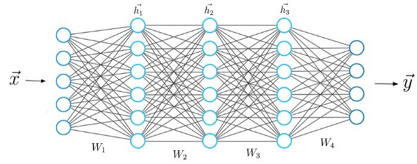
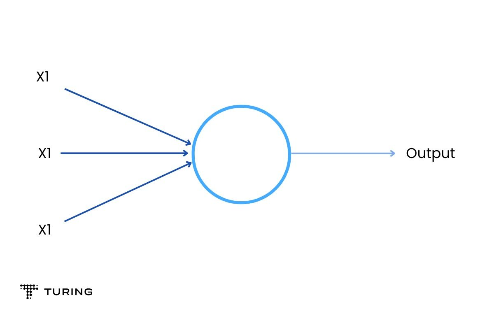
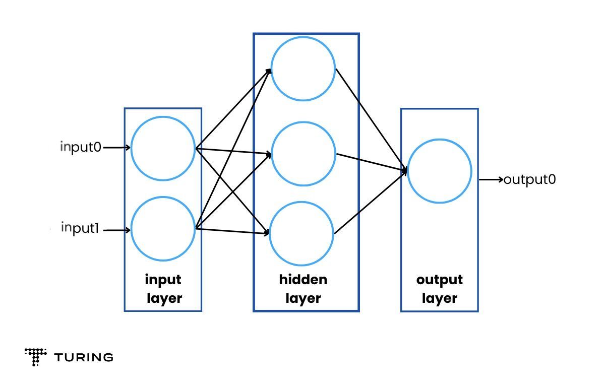
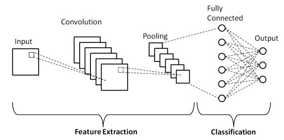
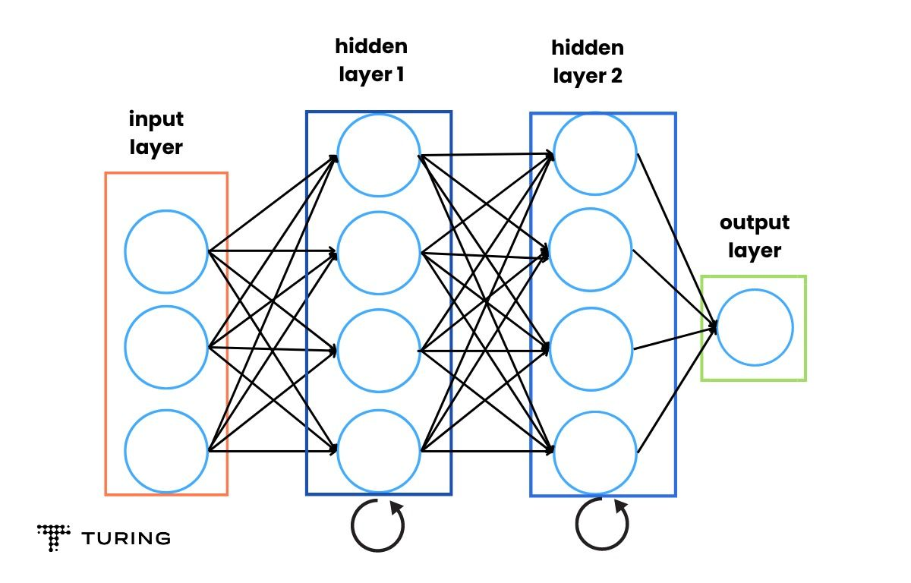

<!-- TOC -->

- [Neural Network Models](#neural-network-models)
    - [What are neural networks?](#what-are-neural-networks)
    - [Types of neural networks](#types-of-neural-networks)
        - [Single-layer perceptron](#single-layer-perceptron)
        - [Multilayer perceptrons (MLPs)](#multilayer-perceptrons-mlps)
        - [Convolutional neural networks (CNNs)](#convolutional-neural-networks-cnns)
        - [Recurrent neural networks (RNNs)](#recurrent-neural-networks-rnns)
    - [How neural networks function](#how-neural-networks-function)
        - [Neurons](#neurons)
        - [Combining neurons into a network](#combining-neurons-into-a-network)
        - [Training the neural network](#training-the-neural-network)

<!-- /TOC -->
<a id="markdown-neural-network-models" name="neural-network-models"></a>
# Neural Network Models

Artificial intelligence, deep learning, and machine learning are deeply entrenched in our daily lives. These technologies might seem similar to some; indeed, they are interlinked although they have differences. To clarify, deep learning is a subdivision of machine learning. It is a set of neural networks that tries to enact the workings of the human brain and learn from its experiences.

<a id="markdown-what-are-neural-networks" name="what-are-neural-networks"></a>
## What are neural networks?

A neural network is a reflection of the human brain's behavior. It allows computer programs to recognize patterns and solve problems in the fields of machine learning, deep learning, and artificial intelligence. These systems are known as artificial neural networks (ANNs) or simulated neural networks (SNNs). Google’s search algorithm is a fine example.

Neural networks are subtypes of machine learning and form the core part of deep learning algorithms. Their structure is designed to resemble the human brain, which makes biological neurons signal to one another. ANNs contain node layers that comprise input, one or more hidden layers, and an output layer.



Each artificial neuron is connected to another and has an associated threshold and weight. When the output of any node is above the threshold, that node will get activated, sending data to the next layer. If not above the threshold, no data is passed along to the next node.

Neural networks depend on training data to learn and improve their accuracy over time. Once these learning algorithms are tuned towards accuracy, they become powerful tools in AI. They allow us to classify and cluster data at a high velocity. Tasks in image recognition take just minutes to process compared to manual identification.

<a id="markdown-types-of-neural-networks" name="types-of-neural-networks"></a>
## Types of neural networks

Neural network models are of different types and are based on their purpose. Here are some common varieties.

<a id="markdown-single-layer-perceptron" name="single-layer-perceptron"></a>
### Single-layer perceptron

The perceptron created by Frank Rosenblatt is the first neural network. It contains a single neuron and is very simple in structure.



<a id="markdown-multilayer-perceptrons-mlps" name="multilayer-perceptrons-mlps"></a>
### Multilayer perceptrons (MLPs)

These form the base for natural language processing (NLP). They comprise an input layer, a hidden layer, and an output layer. It is important to know that MLPs contain sigmoid neurons and not perceptrons because most real-world problems are non-linear. Data is fed into these modules to train them.



<a id="markdown-convolutional-neural-networks-cnns" name="convolutional-neural-networks-cnns"></a>
### Convolutional neural networks (CNNs)

They are similar to MLPs but are usually used for pattern or image recognition, and computer vision. These neural networks work with the principles of matrix multiplication to identify patterns within an image.



<a id="markdown-recurrent-neural-networks-rnns" name="recurrent-neural-networks-rnns"></a>
### Recurrent neural networks (RNNs)

They are identified with the help of feedback loops and are used with time-series data for making predictions, such as stock market predictions.



<a id="markdown-how-neural-networks-function" name="how-neural-networks-function"></a>
## How neural networks function

The working of neural networks is pretty simple and can be analyzed in a few steps as shown below:

<a id="markdown-neurons" name="neurons"></a>
### Neurons

A neuron is the base of the neural network model. It takes inputs, does calculations, analyzes them, and produces outputs. Three main things occur in this phase:

- Each input is multiplied by its weight
- All the weighted inputs are added with a bias b
- They are summed together.

```python
import numpy as np

def sigmoid(x):
  #Our activation function: f(x) = 1 / (1 + e^(-x))
  return 1 / (1 + np.exp(-x))

class Neuron:
  def init(self, weights, bias):
    self.weights = weights
    self.bias = bias

  def feedforward(self, inputs):
    #Weight inputs, add bias, then use the activation function
    total = np.dot(self.weights, inputs) + self.bias
    return sigmoid(total)

weights = np.array([0, 1]) # w1 = 0, w2 = 1
bias = 4 # b = 0
n = Neuron(weights, bias)
x = np.array([2, 3]) # x1 = 2, x2 = 3
print(n.feedforward(x)) # 0.9990889488055994
```

With the help of the activation function, an unbound input is turned into an output that has a predictable form. The sigmoid function is one such activation function. It only outputs the numbers 0 and 1. The outcome with negative numbers can be 0 and positive can be 1.

<a id="markdown-combining-neurons-into-a-network" name="combining-neurons-into-a-network"></a>
### Combining neurons into a network

A neural network is a bunch of neurons interlinked together. A simple neuron has two inputs, a hidden layer with two neurons, and an output layer. The inputs are 0 and 1, the hidden layers are h1 and h2, and the output layer is O1. A hidden layer can be any layer between the input and the output layer. There can be any number of layers.

A neural network itself can have any number of layers with any number of neurons in it. The basic principle remains the same: feed the algorithm inputs to produce the desired output.

<a id="markdown-training-the-neural-network" name="training-the-neural-network"></a>
### Training the neural network

The neural network is trained and improved upon. Mean squared error loss can be used for the same. A quick refresher: A loss is when you find a way to quantify the efforts of your neural network and try to improve it.


In the above formula,

- N is the number of inputs
- Y is the variable used for the prediction
- Y_true is the true value of the predictor variable
- Y_pred is the predicted value of the variable or the output.

Here, the (y_true - y_pred)^2 is the squared error. The overall squared error can be taken with the help of the loss function. Think of loss as a function of weights. The better you predict, the lower the loss. The goal, then, is to train a network by trying to minimize the loss.

You can now change the network weights to influence predictions. Label each weight to the network and then write loss as a multivariate function.

Stochastic gradient descent shows how to change weights to minimize loss. The equation is:


η is a constant known as the learning rate which governs how quickly you train. Subtract η ∂w1/​∂L​ from w1:

- When ∂L/∂w1 is positive, w1 will decrease and make L decrease.
- When it's negative, w1 will increase and make L decrease.

Doing this for each weight in the network will see the loss decrease and improve the network. It is vital to have a proper training process, such as:

- Choosing one sample from the dataset to make it stochastic gradient descent by only operating on one sample at a particular time.
- Calculating all the derivatives of loss concerning the weights.
- Using the update equation to update each weight.
- Going back to step 1 and moving forward.

Once you have completed the processes above, you’re ready to implement a complete neural network. The steps mentioned will see loss steadily decrease and accuracy improve. Practice by running and playing with the code to gain a deeper understanding of how to refine neural networks.


> https://www.turing.com/kb/how-neural-network-models-in-machine-learning-work
