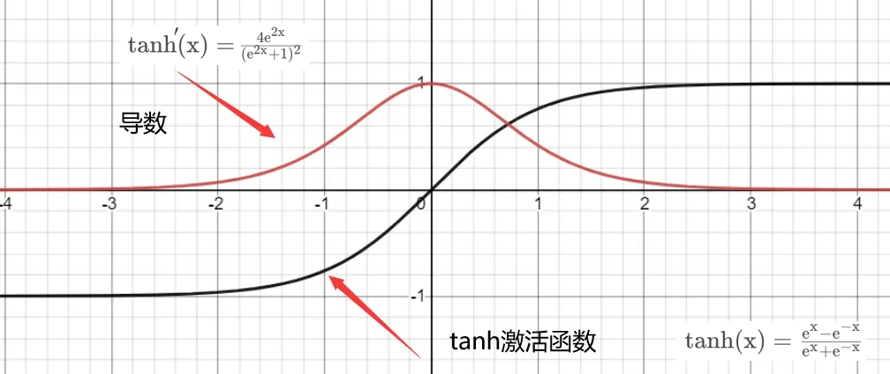

# activation

激活函数，并不是去激活什么，而是指如何把“激活的神经元的特征”通过函数把特征保留并映射出来，即负责将神经元的输入映射到输出端。

## 为什么需要激活函数

相比于人类大脑中基于神经元的模型，激活函数是决定向下一个神经元传递何种信息的单元，这也正是激活函数在人工神经网络中的作用。激活函数接收前一个单元输出的信号，并将其转换成某种可以被下一个单元接收的形式。

如上图所示，神经网络中的每个神经元节点接受上一层神经元的输出值作为本神经元的输入值，并将输入值传递给下一层，输入层神经元节点会将输入属性值直接传递给下一层（隐层或输出层）。在多层神经网络中，上层节点的输出和下层节点的输入之间具有一个函数关系，这个函数称为激活函数。

**简单来说，激活函数，并不是去激活什么，而是指如何把“激活的神经元的特征”通过函数把特征保留并映射出来，即负责将神经元的输入映射到输出端。**

常见激活函数如下：

**右饱和：**
当x趋向于正无穷时，函数的导数趋近于0，此时称为右饱和。
**左饱和：**
当x趋向于负无穷时，函数的导数趋近于0，此时称为左饱和。
**饱和函数和非饱和函数：**
当一个函数既满足右饱和，又满足左饱和，则称为饱和函数，否则称为非饱和函数。

激活函数可以分两大类：
- 饱和激活函数： sigmoid、 tanh
- 非饱和激活函数: ReLU

相较于饱和激活函数，非饱和激活函数可以解决“梯度消失”的问题，加快收敛。尤其对于深度神经网络【层数非常多！！】的“梯度消失”问题。

## 理想激活函数的特点

1. 能避免梯度消失问题。

2. 以零为中心：激活函数的输出应对称于零，这样梯度就不会向特定方向移动。

3. 计算成本：网络的每一层都会应用激活函数，它在深层网络中需要计算数百万次。因此，激活函数的计算成本应该很低。

4. 可微性：神经网络使用梯度下降过程进行训练，因此模型中的层需要可微或至少部分可微。这是一个函数可以作为激活函数层的必要条件。

## 激活函数为什么使用非线性函数

激活函数为什么要使用非线性函数？要解释这个问题，可以反过来思考一下，为什么激活函数不能使用线性函数。

如果使用线性函数，每一层输出都是上层输入的线性函数，无论神经网络有多少层，输出都是输入的线性组合。加深神经网络的层数就没有什么意义了。线性函数的问题在于不管加深层数到多少，总是存在与之等效的「无隐藏层」的神经网络。为了稍微直观的理解这一点，考虑下面一个简单的例子。

存在一个线性函数 `f(x)=kx(k≠0)` 作为激活函数，将 `y=f(f(f(x)))` 对应三层的神经网络。很明显可以想到同样的处理可以由 `y=ax(a=k^3)`，一个没有隐藏层的神经网络来表示。该例子仅仅是一个近似，实际中的神经网络的运算要比这个例子复杂很多，但不影响结论的成立。也就是说，使用线性激活函数时，无法发挥多层网络带来的优势。

**相反如果使用非线性函数，激活函数给神经元引入了非线性因素，使得神经网络可以任意逼近任何非线性函数，这样神经网络就可以应用到众多的非线性模型中。**

## sigmoid

**可以看出sigmoid的导数最大值为0.25，在进行反向传播时，各层的梯度（均小于0.25）相乘很容易造成梯度为0，也就是“梯度消失”。** 这样，几乎就没有梯度信号通过神经元传递到前面层的梯度更新中，因此这时前面层的权值几乎没有更新，这就叫梯度消失。

**二分类问题（例如判断物体是否是猫猫）：使用 `sigmoid` 函数返回概率。**
**多分类问题（返回物体是每个类别的概率）：使用 `softmax` 函数，概率总和为1。**

## tanh

可以看出，相较于Sigmoid函数有所改善，但导数仍小于1，不能避免梯度消失的情况。

## relu

**隐藏层的默认推荐激活函数为 ReLU(Rectified Linear Unit)。**

- ReLU 在大于0时展示的线性特征能很好的解决梯度消失问题。
- 与前两者相比，计算复杂度低。
- 整体的非线性，能拟合任何复杂的连续函数。
- 单侧抑制，可以对神经元进行筛选，让模型训练鲁棒性更强。
- 神经元”熄灭“。relu在训练的时很“脆弱”。当输入值为负时，输出值和导数(梯度)均为0，意味着神经元”熄灭“，且在反向传播过程中不产生任何梯度调整值。之后的神经元梯度永远为0，不再对任何数据有所响应，导致相应参数永远不会被更新。
