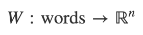
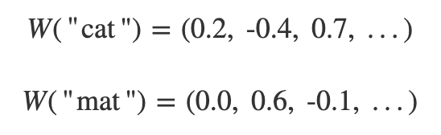
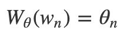
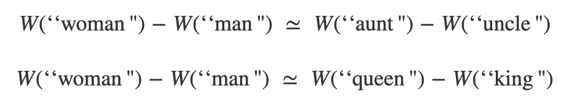
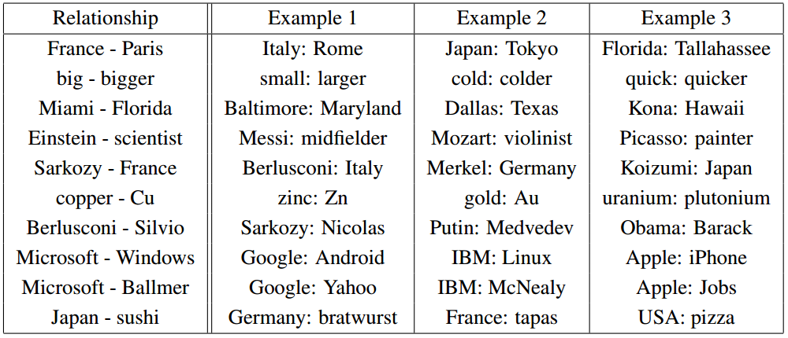
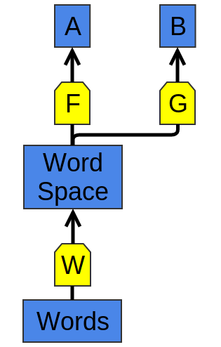
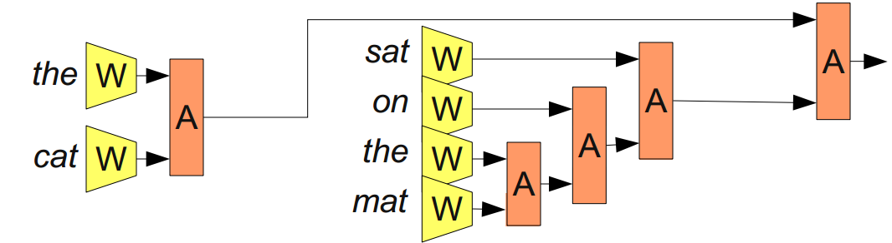
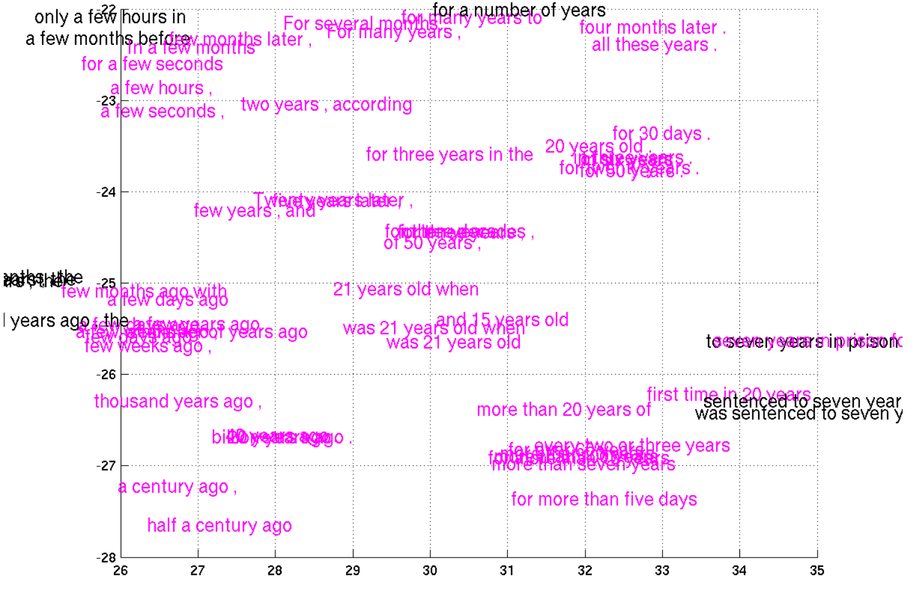

# Deep Learning, NLP, and Representations

## Introduction

In the last few years, deep neural networks have dominated pattern recognition. They blew the previous state of the art out of the water for many computer vision tasks. Voice recognition is also moving that way.

But despite the results, we have to wonder… why do they work so well?

This post reviews some extremely remarkable results in applying deep neural networks to natural language processing (NLP). In doing so, I hope to make accessible one promising answer as to why deep neural networks work. I think it’s a very elegant perspective.

## One Hidden Layer Neural Networks

**A neural network with a hidden layer has universality: given enough hidden units, it can approximate any function.** This is a frequently quoted – and even more frequently, misunderstood and applied – theorem.

It’s true, essentially, because the hidden layer can be used as a lookup table.

For simplicity, let’s consider a perceptron network. A perceptron is a very simple neuron that fires if it exceeds a certain threshold and doesn’t fire if it doesn’t reach that threshold. A perceptron network gets binary (0 and 1) inputs and gives binary outputs.

Note that there are only a finite number of possible inputs. For each possible input, we can construct a neuron in the hidden layer that fires for that input(1),and only on that specific input. Then we can use the connections between that neuron and the output neurons to control the output in that specific case(2). 

And so, it’s true that one hidden layer neural networks are universal. But there isn’t anything particularly impressive or exciting about that. Saying that your model can do the same thing as a lookup table isn’t a very strong argument for it. It just means it isn’t impossible for your model to do the task.

Universality means that a network can fit to any training data you give it. It doesn’t mean that it will interpolate to new data points in a reasonable way.

No, universality isn’t an explanation for why neural networks work so well. The real reason seems to be something much more subtle… And, to understand it, we’ll first need to understand some concrete results.

## Word Embeddings

I’d like to start by tracing a particularly interesting strand of deep learning research: word embeddings. In my personal opinion, word embeddings are one of the most exciting area of research in deep learning at the moment, although they were originally introduced by Bengio, et al. more than a decade ago(3).
Beyond that, I think they are one of the best places to gain intuition about why deep learning is so effective.

A word embedding W:

is a paramaterized function mapping words in some language to high-dimensional vectors (perhaps 200 to 500 dimensions). For example, we might find:

Typically, the function is a lookup table, parameterized by a matrix, θ, with a row for each word: 

`W` is initialized to have random vectors for each word. It learns to have meaningful vectors in order to perform some task.

For example, one task we might train a network for is predicting whether a 5-gram (sequence of five words) is ‘valid.’ We can easily get lots of 5-grams from Wikipedia (eg. “cat sat on the mat”) and then ‘break’ half of them by switching a word with a random word (eg. “cat sat song the mat”), since that will almost certainly make our 5-gram nonsensical.

The model we train will run each word in the 5-gram through `W` to get a vector representing it and feed those into another ‘module’ called `R` which tries to predict if the 5-gram is ‘valid’ or ‘broken.’ Then, we’d like:

In order to predict these values accurately, the network needs to learn good parameters for both `W` and `R`.

Now, this task isn’t terribly interesting. Maybe it could be helpful in detecting grammatical errors in text or something. But what is extremely interesting is `W`.

(In fact, to us, the entire point of the task is to learn `W`. We could have done several other tasks – another common one is predicting the next word in the sentence. But we don’t really care. In the remainder of this section we will talk about many word embedding results and won’t distinguish between different approaches.)

One thing we can do to get a feel for the word embedding space is to visualize them with `t-SNE`, a sophisticated technique for visualizing high-dimensional data. [t-SNE visualizations of word embeddings. Left: Number Region; Right: Jobs Region. From Turian et al. (2010)]

This kind of ‘map’ of words makes a lot of intuitive sense to us. Similar words are close together. Another way to get at this is to look at which words are closest in the embedding to a given word. Again, the words tend to be quite similar. [What words have embeddings closest to a given word? From Collobert et al. (2011)]

It seems natural for a network to make words with similar meanings have similar vectors. If you switch a word for a synonym (eg. “a few people sing well” → “a couple people sing well”), the validity of the sentence doesn’t change. While, from a naive perspective, the input sentence has changed a lot, if `W` maps synonyms (like “few” and “couple”) close together, from `R`’s perspective little changes.

This is very powerful. The number of possible 5-grams is massive and we have a comparatively small number of data points to try to learn from. Similar words being close together allows us to generalize from one sentence to a class of similar sentences. This doesn’t just mean switching a word for a synonym, but also switching a word for a word in a similar class (eg. “the wall is blue” → “the wall is red”). Further, we can change multiple words (eg. “the wall is blue” →
“the ceiling is red”). The impact of this is exponential with respect to the number of words.(4)

So, clearly this is a very useful thing for `W` to do. But how does it learn to do this? It seems quite likely that there are lots of situations where it has seen a sentence like “the wall is blue” and know that it is valid before it sees a sentence like “the wall is red”. As such, shifting “red” a bit closer to “blue” makes the network perform better.

We still need to see examples of every word being used, but the analogies allow us to generalize to new combinations of words. You’ve seen all the words that you understand before, but you haven’t seen all the sentences that you understand before. So too with neural networks.

Word embeddings exhibit an even more remarkable property: analogies between words seem to be encoded in the difference vectors between words. For example, there seems to be a constant male-female difference vector:

This may not seem too surprising. After all, gender pronouns mean that switching a word can make a sentence grammatically incorrect. You write, “she is the aunt” but “he is the uncle.” Similarly, “he is the King” but “she is the Queen.” If one sees “she is the uncle,” the most likely explanation is a grammatical error. If words are being randomly switched half the time, it seems pretty likely that happened here.

“Of course!” We say with hindsight, “the word embedding will learn to encode gender in a consistent way. In fact, there’s probably a gender dimension. Same thing for singular vs plural. It’s easy to find these trivial relationships!”

It turns out, though, that much more sophisticated relationships are also encoded in this way. It seems almost miraculous! [Relationship pairs in a word embedding. From Mikolov et al. (2013b)]

It’s important to appreciate that all of these properties of `W` are side effects. We didn’t try to have similar words be close together. We didn’t try to have analogies encoded with difference vectors. All we tried to do was perform a simple task, like predicting whether a sentence was valid. These properties more or less popped out of the optimization process.

This seems to be a great strength of neural networks: they learn better ways to represent data, automatically. Representing data well, in turn, seems to be essential to success at many machine learning problems. Word embeddings are just a particularly striking example of learning a representation.

## Shared Representations

The properties of word embeddings are certainly interesting, but can we do anything useful with them? Besides predicting silly things, like whether a 5-gram is ‘valid’?

We learned the word embedding in order to do well on a simple task, but based on the nice properties we’ve observed in word embeddings, you may suspect that they could be generally useful in NLP tasks. In fact, word representations like these are extremely important:

> The use of word representations… has become a key “secret sauce” for the success of many NLP systems in recent years, across tasks including named entity recognition, part-of-speech tagging, parsing, and semantic role labeling. (Luong et al. (2013))

`W` and `F` learn to perform task `A`. Later, `G` can learn to perform `B` based on `W`:

There’s a counterpart to this trick. Instead of learning a way to represent one kind of data and using it to perform multiple kinds of tasks, we can learn a way to map multiple kinds of data into a single representation!

One nice example of this is a bilingual word-embedding, produced in Socher et al. (2013a). We can learn to embed words from two different languages in a single, shared space. In this case, we learn to embed English and Mandarin Chinese words in the same space.

We train two word embeddings, `Wen` and `Wzh` in a manner similar to how we did above. However, we know that certain English words and Chinese words have similar meanings. So, we optimize for an additional property: words that we know are close translations should be close together.

Of course, we observe that the words we knew had similar meanings end up close together. Since we optimized for that, it’s not surprising. More interesting is that words we didn’t know were translations end up close together.

In light of our previous experiences with word embeddings, this may not seem too surprising. Word embeddings pull similar words together, so if an English and Chinese word we know to mean similar things are near each other, their synonyms will also end up near each other. We also know that things like gender differences tend to end up being represented with a constant difference vector. It seems like forcing enough points to line up should force these difference vectors to be the same in both the English and Chinese embeddings. A result of this would be that if we know that two male versions of words translate to each other, we should also get the female words to translate to each other.

Intuitively, it feels a bit like the two languages have a similar ‘shape’ and that by forcing them to line up at different points, they overlap and other points get pulled into the right positions. [t-SNE visualization of the bilingual word embedding. Green is Chinese, Yellow is English. (Socher et al. (2013a))]

In bilingual word embeddings, we learn a shared representation for two very similar kinds of data. But we can also learn to embed very different kinds of data in the same space.

Recently, deep learning has begun exploring models that embed images and words in a single representation.(5)

The basic idea is that one classifies images by outputting a vector in a word embedding. Images of dogs are mapped near the “dog” word vector. Images of horses are mapped near the “horse” vector. Images of automobiles near the “automobile” vector. And so on.

The interesting part is what happens when you test the model on new classes of images. For example, if the model wasn’t trained to classify cats – that is, to map them near the “cat” vector – what happens when we try to classify images of cats?

It turns out that the network is able to handle these new classes of images quite reasonably. Images of cats aren’t mapped to random points in the word embedding space. Instead, they tend to be mapped to the general vicinity of the “dog” vector, and, in fact, close to the “cat” vector. Similarly, the truck images end up relatively close to the “truck” vector, which is near the related “automobile” vector.

This was done by members of the Stanford group with only 8 known classes (and 2 unknown classes). The results are already quite impressive. But with so few known classes, there are very few points to interpolate the relationship between images and semantic space off of.

The Google group did a much larger version – instead of 8 categories, they used 1,000 – around the same time (Frome et al. (2013)) and has followed up with a new variation (Norouzi et al. (2014)). Both are based on a very powerful image classification model (from Krizehvsky et al. (2012)), but embed images into the word embedding space in different ways.

The results are impressive. While they may not get images of unknown classes to the precise vector representing that class, they are able to get to the right neighborhood. So, if you ask it to classify images of unknown classes and the classes are fairly different, it can distinguish between the different classes.

Even though I’ve never seen a Aesculapian snake or an Armadillo before, if you show me a picture of one and a picture of the other, I can tell you which is which because I have a general idea of what sort of animal is associated with each word. These networks can accomplish the same thing.

> (These results all exploit a sort of “these words are similar” reasoning. But it seems like much stronger results should be possible based on relationships between words. In our word embedding space, there is a consistent difference vector between male and female version of words. Similarly, in image space, there are consistent features distinguishing between male and female. Beards, mustaches, and baldness are all strong, highly visible indicators of being male. Breasts and, less reliably, long hair, makeup and jewelery, are obvious indicators of being female.6 Even if you’ve never seen a king before, if the queen, determined to be such by the presence of a crown, suddenly has a beard, it’s pretty reasonable to give the male version.) 

Shared embeddings are an extremely exciting area of research and drive at why the representation focused perspective of deep learning is so compelling.

## Recursive Neural Networks

We began our discussion of word embeddings with the following network:

.png)

The above diagram represents a modular network, `R(W(w1), W(w2), W(w3), W(w4), W(w5))`. It is built from two modules, `W` and `R`. This approach, of building neural networks from smaller neural network “modules” that can be composed together, is not very wide spread. It has, however, been very successful in NLP.

Models like the above are powerful, but they have an unfortunate limitation: they can only have a fixed number of inputs.

We can overcome this by adding an association module, `A`, which will take two word or phrase representations and merge them.

By merging sequences of words, `A` takes us from representing words to representing phrases or even representing whole sentences! And because we can merge together different numbers of words, we don’t have to have a fixed number of inputs.

It doesn’t necessarily make sense to merge together words in a sentence linearly. If one considers the phrase “the cat sat on the mat”, it can naturally be bracketed into segments: “((the cat) (sat (on (the mat))))”. We can apply `A` based on this bracketing:

These models are often called “recursive neural networks” because one often has the output of a module go into a module of the same type. They are also sometimes called “tree-structured neural networks.”

Recursive neural networks have had significant successes in a number of NLP tasks. For example, Socher et al. (2013c) uses a recursive neural network to predict sentence sentiment:

One major goal has been to create a reversible sentence representation, a representation that one can reconstruct an actual sentence from, with roughly the same meaning. For example, we can try to introduce a disassociation module, `D`, that tries to undo `A`:

If we could accomplish such a thing, it would be an extremely powerful tool. For example, we could try to make a bilingual sentence representation and use it for translation.

Unfortunately, this turns out to be very difficult. Very very difficult. And given the tremendous promise, there are lots of people working on it.

Recently, Cho et al. (2014) have made some progress on representing phrases, with a model that can encode English phrases and decode them in French. Look at the phrase representations it learns!

## References

1. Constructing a case for every possible input requires 2^n hidden neurons, when you have n
 input neurons. In reality, the situation isn’t usually that bad. You can have cases that encompass multiple inputs. And you can have overlapping cases that add together to achieve the right input on their intersection.↩

2. (It isn’t only perceptron networks that have universality. Networks of sigmoid neurons (and other activation functions) are also universal: give enough hidden neurons, they can approximate any continuous function arbitrarily well. Seeing this is significantly trickier because you can’t just isolate inputs.)↩

3. Word embeddings were originally developed in (Bengio et al, 2001; Bengio et al, 2003), a few years before the 2006 deep learning renewal, at a time when neural networks were out of fashion. The idea of distributed representations for symbols is even older, e.g. (Hinton 1986)."↩

4. The seminal paper, A Neural Probabilistic Language Model (Bengio, et al. 2003) has a great deal of insight about why word embeddings are powerful.↩

> http://colah.github.io/posts/2014-07-NLP-RNNs-Representations/
