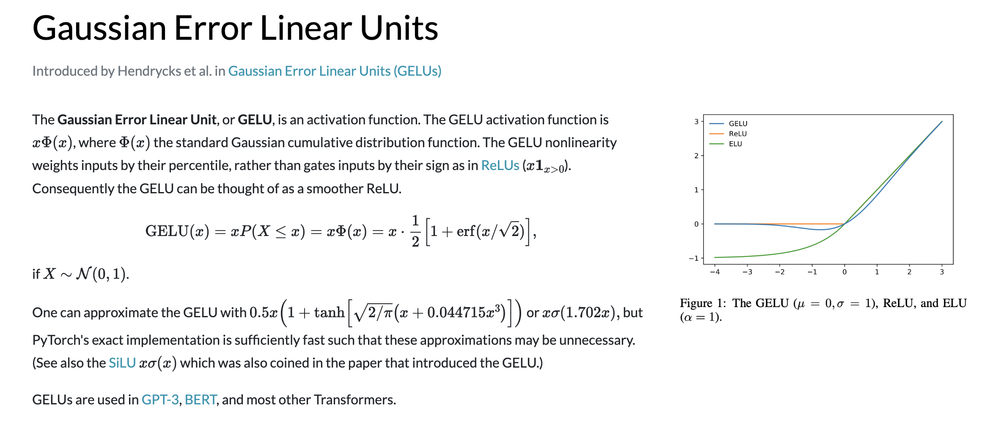

# gelu

不管其他领域的鄙视链，在激活函数领域，大家公式的鄙视链应该是：Elus > Relu > Sigmoid ，这些激活函数都有自身的缺陷， sigmoid容易饱和，Elus 与 Relu 缺乏随机因素。

在神经网络的建模过程中，模型很重要的性质就是非线性，同时为了模型泛化能力，需要加入随机正则，例如 dropout (随机置一些输出为0,其实也是一种变相的随机非线性激活)， 而随机正则与非线性激活是分开的两个事情， 而其实模型的输入是由非线性激活与随机正则两者共同决定的。

GELUs (Gaussian Error Linerar Units) 正是在激活中引入了随机正则的思想，是一种对神经元输入的概率描述，直观上更符合自然的认识，同时实验效果要比 Relus 与 ELUs 都要好。

GELUs 其实是 dropout、zoneout、Relus 的综合，GELUs 对于输入乘以一个 0,1 组成的 mask，而该 mask 的生成则是概率随机的依赖于输入。假设输入为 X, mask 为 m，则 m 服从一个伯努利分布(Φ(x), Φ(x) = P(X <= x) , X 服从标准正太分布)，这么选择是因为神经元的输入趋向于正太分布，这么设定使得当输入 x 减小的时候，输入会有一个更高的概率被 dropout 掉，这样的激活变换就会随机依赖于输入了。

> 伯努利分布又名两点分布或者 0-1 分布。

