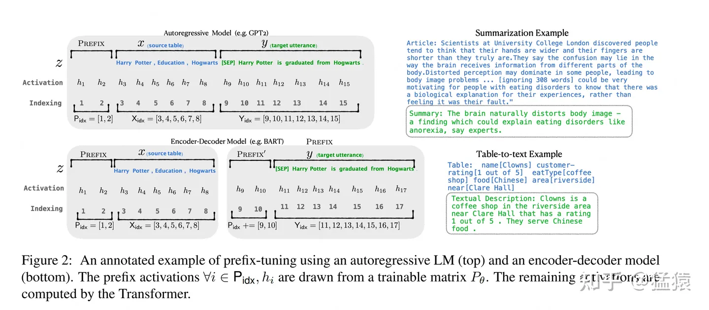

# 大模型低秩适配器LoRA
> refer to: https://zhuanlan.zhihu.com/p/646831196
> refer to: https://zhuanlan.zhihu.com/p/618073170

## 全参数微调

我们知道，微调的含义，就是把已经训练好的模型（pretrained model）拿来，给它吃特定的下游任务数据，使得模型在预训练权重上继续训练，直至满足下游任务性能标准。预训练模型就像一个特征提取器，能够基于先前训练数据中学到的经验，为我们提取有效的特征，大大提升下游任务的训练效果和收敛速度。

**全量微调**指的是，在下游任务的训练中，对预训练模型的每一个参数都做更新。例如图中，给出了Transformer的Q/K/V矩阵的全量微调示例，对每个矩阵来说，在微调时，其`d*d`个参数，都必须参与更新。

全量微调的显著缺点是，训练代价昂贵。例如GPT3的参数量有175B，我等单卡贵族只能望而却步，更不要提在微调中发现有bug时的覆水难收。同时，由于模型在预训练阶段已经吃了足够多的数据，收获了足够的经验，**因此我只要想办法给模型增加一个额外知识模块，让这个小模块去适配我的下游任务，模型主体保持不变（freeze）即可。**

那这样的知识小模块，具体要怎么添加呢？

## Adapter Tuning 与 Prefix Tuning

我们来看在LoRA出现前，两种主流的局部微调办法：Adapter Tuning与Prefix Tuning。这也是LoRA的原始论文中，重点比对的两种微调方式。

### Adapter Tuning

Adapter Tuning的方法有很多种，这里我们举出Houlsby et al. ,2019提出的方法，这也是LoRA论文中提及这项技术时所引用的第一篇文章。

图例中的左边是一层Transformer Layer结构，其中的Adapter就是我们说的“额外知识模块”；右边是Adatper的具体结构。**在微调时，除了Adapter的部分，其余的参数都是被冻住的（freeze）**，这样我们就能有效降低训练的代价。Adapter的内部架构不是本文所述的重点，这里我们就不再介绍了。

但这样的设计架构存在一个**显著劣势：添加了Adapter后，模型整体的层数变深，会增加训练速度和推理速度**，原因是：

- 需要耗费额外的运算量在Adapter上
- 当我们采用并行训练时（例如Transformer架构常用的张量模型并行），Adapter层会产生额外的通讯量，增加通讯时间

### Prefix Tuning

Prefix Tuning的方法也有很多种，这里我们选取Li&Liang,2021这一篇进行简述。**在这篇中，作者通过对输入数据增加前缀（prefix）来做微调。当然，prefix也可以不止加载输入层，还可以加在Transformer Layer输出的中间层，感兴趣的朋友可以查找论文自行研究。**

如图所示，对于GPT这样的生成式模型，在输入序列的最前面加入prefix token，图例中加入2个prefix token，在实际应用中，prefix token的个数是个超参，可以根据模型实际微调效果进行调整。对于BART这样的Encoder-Decoder架构模型，则在x和y的前面同时添加prefix token。在后续微调中，我们只需要冻住模型其余部分，单独训练prefix token相关的参数即可，每个下游任务都可以单独训练一套prefix token。

那么prefix的含义是什么呢？prefix的作用是引导模型提取x相关的信息，进而更好地生成y。例如，我们要做一个summarization的任务，那么经过微调后，prefix就能领悟到当前要做的是个“总结形式”的任务，然后引导模型去x中提炼关键信息；如果我们要做一个情感分类的任务，prefix就能引导模型去提炼出x中和情感相关的语义信息，以此类推。这样的解释可能不那么严谨，但大家可以大致体会一下prefix的作用。

Prefix Tuning虽然看起来方便，但也存在以下两个显著劣势:

- 较难训练，且模型的效果并不严格随prefix参数量的增加而上升，这点在原始论文中也有指出
- 会使得输入层有效信息长度减少。为了节省计算量和显存，我们一般会固定输入数据长度。增加了prefix之后，留给原始文字数据的空间就少了，因此可能会降低原始文字中prompt的表达能力。

## 什么是LoRA

总结一下，**全参数微调太贵，Adapter Tuning存在训练和推理延迟，Prefix Tuning难训且会减少原始训练数据中的有效文字长度**，那是否有一种微调办法，能改善这些不足呢？

在这样动机的驱动下，作者提出了**LoRA（Low-Rank Adaptation，低秩适配器）这样一种微调方法**。我们先抛开对“低秩”、“适配器”这样抽象词语的解释，我们先来看LoRA长什么样，要怎么用。在下一节中，我们再来详细解释“低秩”作用的原理。

### 问题描述

### LoRA整体架构

**图中左侧表示“全参数finetune”的场景**。我们将参数分成了两个部分：

之所以这么拆分，是因为**全参数finetune可以理解成“冻住的预训练权重” + “微调过程中产生的权重更新量”。**

经过这样一番拆分，使得微调参数量从`d*d`降低至`2*r*d`，同时不改变输出数据的维度。

需要注意的是，这里对 A 采用高斯初始化，对 B 采用零初始化的目的是，让训练刚开始时 的值为0，这样不会给模型带来额外的噪声。那么你可能想问，那我对 A 做零初始化，对 B 做高斯初始化行不行呢？反正看起来只要让 初始化为0就行？

针对这个问题，我在github issue上找到了LoRA一作的回答：

简单来说，当前作者还没有发现转换 A,B 初始化方式产生的显著区别，只要这两者中任意一者为0，另一者不为0即可。

### 训练

### 推理

### 低秩 alpha 和 r 的理解

我们前面说过，当 r 越小时，低秩矩阵所含的信息越精炼，但同时也可能越不全面。那么到底 r 要取多少才合适呢？

**得出的可能结论是，看起来 alpha 可以是 64，r 可以是 64、8 或者 4。具体要在模型的不同层和不同的应用场景去验证了。**
