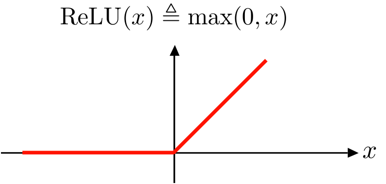
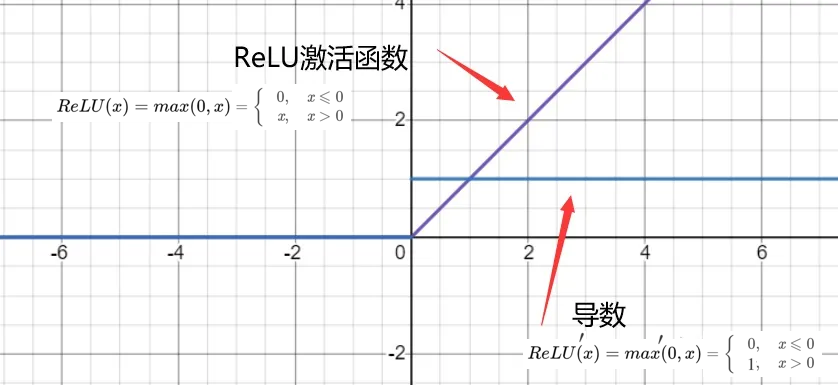
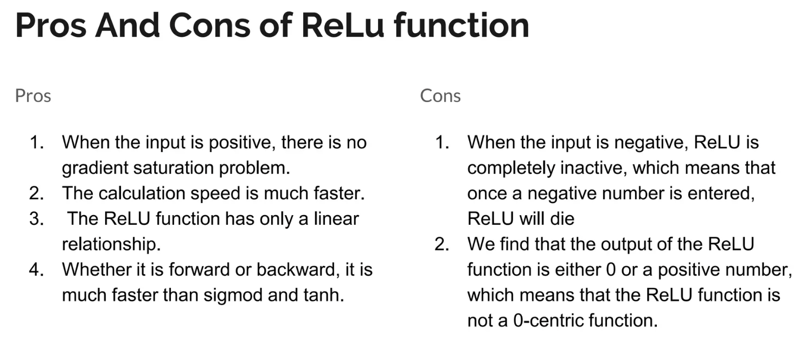

# relu

**relu, rectified linear unit, is primarily used in the hidden layers of neural networks to ensure non-linearity.** The function caps all outputs to zero and above. Outputs below zero are returned as zero, while numbers above zero are returned as they are. This ensures that there are no negative numbers in the network.

## relu 分析

从上图可知，**ReLU 的有效导数是常数1，解决了深层网络中出现的梯度消失问题，也就使得深层网络可训练。同时 ReLU 又是非线性函数，所谓非线性，就是一阶导数不为常数；对 ReLU 求导，在输入值分别为正和为负的情况下，导数是不同的，即 ReLU 的导数不是常数，所以 ReLU 是非线性的（只是不同于 Sigmoid 和 tanh，relu 的非线性不是光滑的）。**

**ReLU 在 x>0 下，导数为常数1的特点：**

导数为常数1的好处就是在“链式反应”中不会出现梯度消失，但梯度下降的强度就完全取决于权值的乘积，这样就可能会出现梯度爆炸问题。解决这类问题：一是控制权值，让它们在（0，1）范围内；二是做梯度裁剪，控制梯度下降强度，如 ReLU(x)=min(6, max(0,x))。

**ReLU 在 x<0 下，输出置为0的特点：**

描述该特征前，需要明确深度学习的目标：深度学习是根据大批量样本数据，从错综复杂的数据关系中，找到关键信息（关键特征）。换句话说，就是把密集矩阵转化为稀疏矩阵，保留数据的关键信息，去除噪音，这样的模型就有了鲁棒性。ReLU 将 x<0 的输出置为0，就是一个去噪音，稀疏矩阵的过程。而且在训练过程中，这种稀疏性是动态调节的，网络会自动调整稀疏比例，保证矩阵有最优的有效特征。**ReLu 会使一部分神经元的输出为0，这样就造成了网络的稀疏性，同时减少了参数的相互依存关系，缓解了过拟合问题的发生。**

**正因为有了这单侧抑制，才使得神经网络中的神经元也具有了稀疏激活性。尤其体现在深度神经网络模型(如 CNN )中，当模型增加N层之后，理论上ReLU神经元的激活率将降低2的N次方倍。**

那么问题来了：**这种稀疏激活性有何作用？** 换句话说，我们为什么需要让神经元稀疏？不妨举栗子来说明。当看名侦探柯南的时候，我们可以根据故事情节进行思考和推理，这时用到的是我们的大脑左半球；而当看蒙面唱将时，我们可以跟着歌手一起哼唱，这时用到的则是我们的右半球。左半球侧重理性思维，而右半球侧重感性思维。也就是说，当我们在进行运算或者欣赏时，都会有一部分神经元处于激活或是抑制状态，可以说是各司其职。再比如，生病了去医院看病，检查报告里面上百项指标，但跟病情相关的通常只有那么几个。与之类似，当训练一个深度分类模型的时候，和目标相关的特征往往也就那么几个，**因此通过ReLU实现稀疏后的模型能够更好地挖掘相关特征，拟合训练数据。**

但是 ReLU 强制将 x<0 部分的输出置为0（置为0就是屏蔽该特征），可能会导致模型无法学习到有效特征，所以如果学习率设置的太大，就可能会导致网络的大部分神经元处于‘dead’状态，所以使用 ReLU 的网络，学习率不能设置太大。**当然，如果你设置了一个合适的较小的 learning rate，这个问题发生的情况其实也不会太频繁。**

**ReLU 作为激活函数的特点：**

- 相比 Sigmoid 和 tanh，ReLU 摒弃了复杂的计算，提高了运算速度。
- 解决了梯度消失问题，收敛速度快于 Sigmoid 和 tanh 函数，但要防范 ReLU 的梯度爆炸
- 容易得到更好的模型，但也要防止训练中出现模型‘Dead’情况。

## pros and cons

