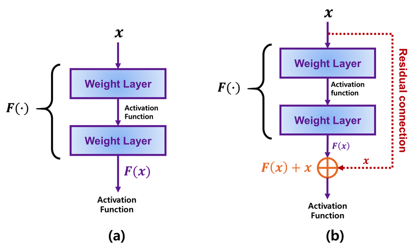

# Residual Connection

A Residual Block:

- The intuition behind a network with residual blocks is that each layer is fed to the next layer of the network and also directly to the next layers skipping between a few layers in between. 
- Residual blocks allow you to train much deeper neural networks.
- The connection(gray arrow) is called **skip connection** or **shortcut connection** as it is bypassing one or more layers in between.
- It is also called **identity connection** as we can learn an identity function from it.

The comparison between the general connections and the residual connections used in ResNet. 
1. describes how the input data x is passed into the weight layers in general CNN models with no residual connections.
2. shows how x is passed to both the weight layers and the residual connections in ResNet.
