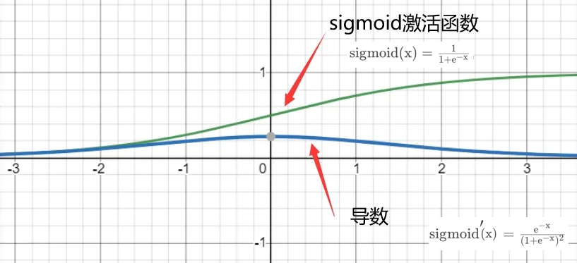
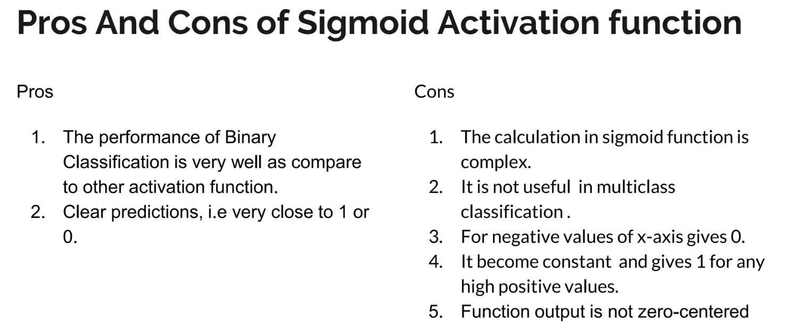

# sigmoid

缺点：

- 激活函数计算量大（在正向传播和反向传播中都包含幂运算和除法）；
反向传播求误差梯度时，求导涉及除法；
- Sigmoid导数取值范围是[0, 0.25]，由于神经网络反向传播时的“链式反应”，很容易就会出现梯度消失的情况。例如对于一个10层的网络， 根据 `0.25~10 = 0.000000954`，第10层的误差相对第一层卷积的参数 W1 的梯度将是一个非常小的值，这就是所谓的“梯度消失”。
- Sigmoid的输出不是0均值（即 zero-centered）；这会导致后一层的神经元将得到上一层输出的非0均值的信号作为输入，随着网络的加深，会改变数据的原始分布。

## pros and cons

