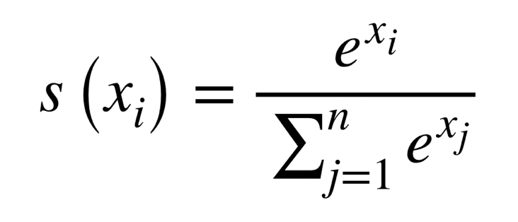
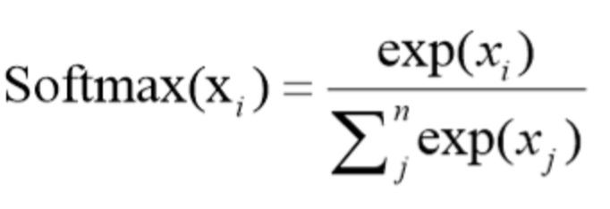
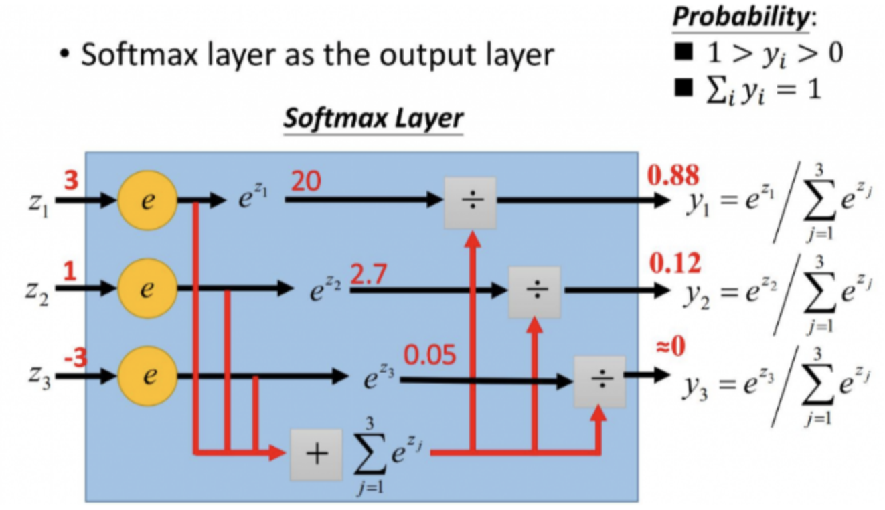
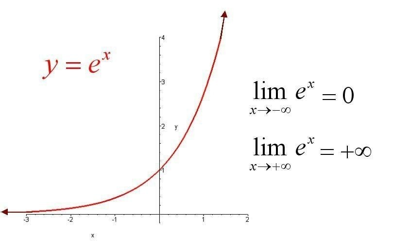
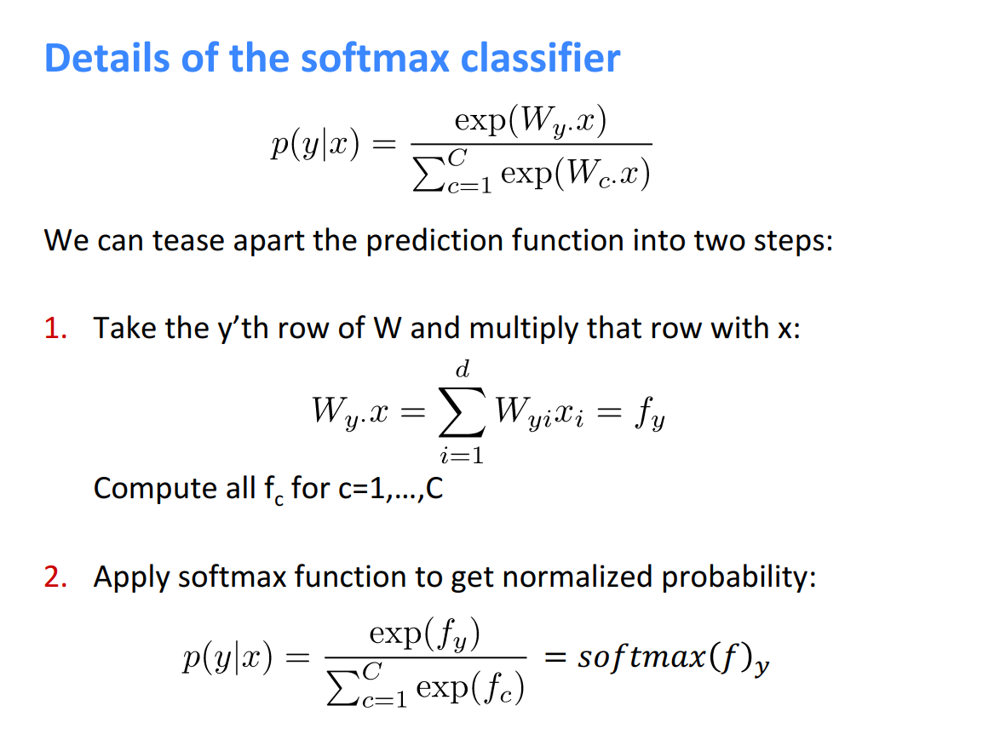
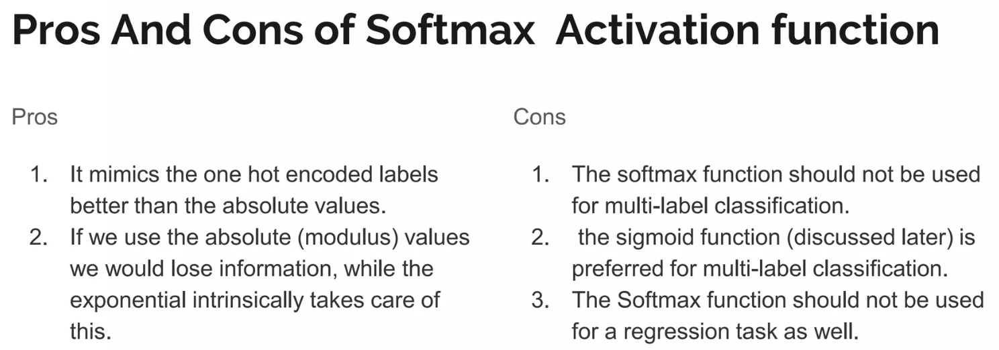

# softmax

**softmax 函数，归一化指数函数。** 利用 softmax 函数可以将我们的输出映射成 [0,1] 区间的权重/概率。

假设我们有一个向量 `X`，`Xi` 表示向量 `X` 的第 `i` 个元素，那么这个元素的 `softmax` 值计算公式如下：

或者

更形象的如下图表示：

上述示例中，原来输出是 `3,1,-3` 通过 softmax 函数一作用，就映射成为 [0,1] 的值，而这些值的累和为 1（满足概率的性质），那么我们就可以将它理解成概率，在最后选取输出结点的时候，我们就可以选取概率最大（也就是值对应最大的）结点，作为我们的预测目标！

**softmax 函数满足概率的两个性质：**
**1. 预测的概率为非负数；**
**2. 各种预测结果概率之和为1。**

所以 softmax 做了两件事情：

**1. softmax 函数分子：将预测结果转化为非负数**

我们知道指数函数的值域取值区间为非负数，同时保持了原有数值间的大小关系，比如 `a > b`，那么 `exp(a) > exp(b) > 0`：

**softmax 第一步将模型的预测结果转化到指数函数上，这样保证了概率的非负性。**

**2. softmax 函数分母：各种预测结果概率之和为1**

**为了确保各个预测结果的概率之和为1，我们只需要将转化后的结果进行归一化处理。方法就是将转化后的结果除以所有转化后结果之和，可以理解为转化后结果占总数的百分比。** 这样就得到近似的概率。

斯坦福大学课程中 softmax 函数的展开解释如下：

**pros and cons：**

