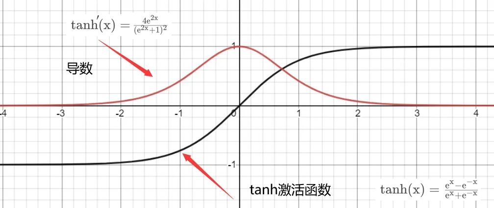
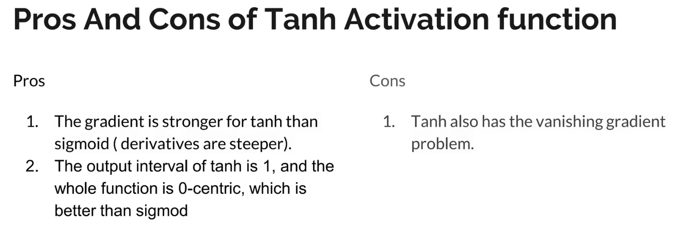

# tanh

tanh 为双曲正切函数，其英文读作 Hyperbolic Tangent。tanh 和 sigmoid 相似，都属于饱和激活函数，区别在于输出值范围由 `(0,1)` 变为了 `(-1,1)`，可以把 tanh 函数看做是 sigmoid 向下平移和拉伸后的结果。

相比 Sigmoid 函数，

- tanh 的输出范围时(-1, 1)，解决了 Sigmoid 函数的不是zero-centered 输出问题；
- 幂运算的问题仍然存在；
- tanh导数范围在(0, 1)之间，相比 sigmoid的(0, 0.25)，梯度消失（gradient vanishing）问题会得到缓解，但仍然还会存在。

## pros and cons

