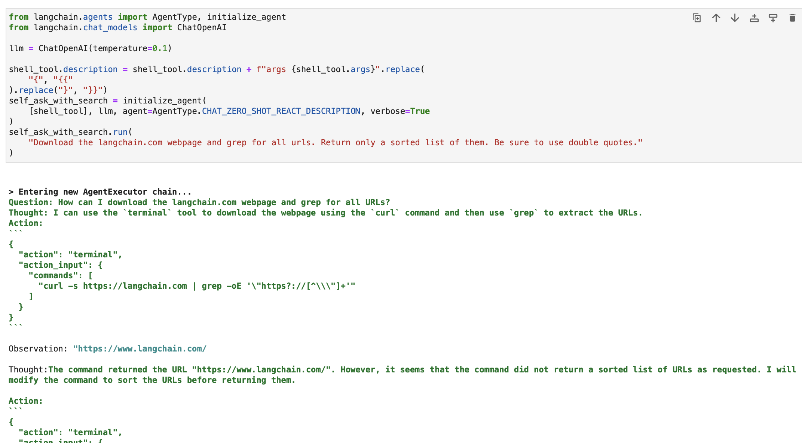

<!-- TOC -->

- [A Complete LangChain Guide](#a-complete-langchain-guide)
    - [Understanding LangChain](#understanding-langchain)
    - [Installation and Setup](#installation-and-setup)
    - [Modules](#modules)
        - [Module I : Model I/O](#module-i--model-io)
            - [LLMs](#llms)
            - [Chat Models](#chat-models)
            - [Prompts](#prompts)
            - [Output Parsers](#output-parsers)
        - [Module II : Retrieval](#module-ii--retrieval)
            - [Document Loaders](#document-loaders)
            - [Document Transformers](#document-transformers)
            - [Text Embedding Models](#text-embedding-models)
            - [Vector Stores](#vector-stores)
            - [Retrievers](#retrievers)
        - [Module III : Agents](#module-iii--agents)
            - [Tools](#tools)
        - [Module IV : Chains](#module-iv--chains)
        - [Module V : Memory](#module-v--memory)
    - [LangChain Expression Language](#langchain-expression-language)
        - [Prompt + LLM](#prompt--llm)
        - [Prompt + LLM + OutputParser](#prompt--llm--outputparser)
        - [RAG (Retrieval-augmented Generation)](#rag-retrieval-augmented-generation)
        - [Conversational Retrieval Chain](#conversational-retrieval-chain)
        - [With Memory and Returning Source Documents](#with-memory-and-returning-source-documents)
        - [Multiple Chains](#multiple-chains)
        - [Branching and Merging](#branching-and-merging)
        - [Writing Python Code with LCEL](#writing-python-code-with-lcel)
        - [Adding Memory to a Chain](#adding-memory-to-a-chain)
        - [Using External Tools with Runnables](#using-external-tools-with-runnables)
        - [Adding Moderation to an LLM Application](#adding-moderation-to-an-llm-application)
        - [Routing by Semantic Similarity](#routing-by-semantic-similarity)
        - [Using Agents and Runnables](#using-agents-and-runnables)
        - [Querying a SQL Database](#querying-a-sql-database)
    - [Deploy with LangServe](#deploy-with-langserve)
    - [Introduction to LangSmith](#introduction-to-langsmith)

<!-- /TOC -->
<a id="markdown-a-complete-langchain-guide" name="a-complete-langchain-guide"></a>
# A Complete LangChain Guide

> refer to: 
> 1. https://nanonets.com/blog/langchain/#level-up-with-nanonets
> 2. https://python.langchain.com/docs/get_started/introduction

At its core, [LangChain](https://python.langchain.com/docs/get_started/introduction) is an innovative framework tailored for crafting applications that leverage the capabilities of language models. It's a toolkit designed for developers to create applications that are context-aware and capable of sophisticated reasoning.

This means LangChain applications can understand the context, such as prompt instructions or content grounding responses and use language models for complex reasoning tasks, like deciding how to respond or what actions to take. LangChain represents a unified approach to developing intelligent applications, simplifying the journey from concept to execution with its diverse components.

<a id="markdown-understanding-langchain" name="understanding-langchain"></a>
## Understanding LangChain

LangChain is much more than just a framework; it's a full-fledged ecosystem comprising several integral parts.

- Firstly, there are the LangChain Libraries, available in both Python and JavaScript. These libraries are the backbone of LangChain, offering interfaces and integrations for various components. They provide a basic runtime for combining these components into cohesive chains and agents, along with ready-made implementations for immediate use.

- Next, we have LangChain Templates. These are a collection of deployable reference architectures tailored for a wide array of tasks. Whether you're building a chatbot or a complex analytical tool, these templates offer a solid starting point.

- LangServe steps in as a versatile library for deploying LangChain chains as REST APIs. This tool is essential for turning your LangChain projects into accessible and scalable web services.

- Lastly, LangSmith serves as a developer platform. It's designed to debug, test, evaluate, and monitor chains built on any LLM framework. The seamless integration with LangChain makes it an indispensable tool for developers aiming to refine and perfect their applications.

Together, these components empower you to develop, productionize, and deploy applications with ease. With LangChain, you start by writing your applications using the libraries, referencing templates for guidance. LangSmith then helps you in inspecting, testing, and monitoring your chains, ensuring that your applications are constantly improving and ready for deployment. Finally, with LangServe, you can easily transform any chain into an API, making deployment a breeze.

In the next sections, we will delve deeper into how to set up LangChain and begin your journey in creating intelligent, language model-powered applications.

<a id="markdown-installation-and-setup" name="installation-and-setup"></a>
## Installation and Setup

Are you ready to dive into the world of LangChain? Setting it up is straightforward, and this guide will walk you through the process step-by-step.

The first step in your LangChain journey is to install it. You can do this easily using pip or conda. Run the following command in your terminal:

```shell
pip install langchain
```

For those who prefer the latest features and are comfortable with a bit more adventure, you can install LangChain directly from the source. Clone the repository and navigate to the $langchain/libs/langchain$ directory. Then, run:

```shell
pip install -e .
```

For experimental features, consider installing $langchain-experimental$. It's a package that contains cutting-edge code and is intended for research and experimental purposes. Install it using:

```shell
pip install langchain-experimental
```

LangChain CLI is a handy tool for working with LangChain templates and LangServe projects. To install the LangChain CLI, use:

```shell
pip install langchain-cli
```

LangServe is essential for deploying your LangChain chains as a REST API. It gets installed alongside the LangChain CLI.

LangChain often requires integrations with model providers, data stores, APIs, etc. For this example, we'll use OpenAI's model APIs. Install the OpenAI Python package using:

```shell
pip install openai
```

To access the API, set your OpenAI API key as an environment variable:

```shell
export OPENAI_API_KEY="your_api_key"
```

Alternatively, pass the key directly in your python environment:

```python
import os
os.environ['OPENAI_API_KEY'] = 'your_api_key'
```

<a id="markdown-modules" name="modules"></a>
## Modules

LangChain allows for the creation of language model applications through modules. These modules can either stand alone or be composed for complex use cases. These modules are -

- **Model I/O:** Facilitates interaction with various language models, handling their inputs and outputs efficiently.
- **Retrieval:** Enables access to and interaction with application-specific data, crucial for dynamic data utilization.
- **Agents:** Empower applications to select appropriate tools based on high-level directives, enhancing decision-making capabilities.
- **Chains:** Offers pre-defined, reusable compositions that serve as building blocks for application development.
- **Memory:** Maintains application state across multiple chain executions, essential for context-aware interactions.

Each module targets specific development needs, making LangChain a comprehensive toolkit for creating advanced language model applications.

Along with the above components, we also have **LangChain Expression Language (LCEL)**, which is a declarative way to easily compose modules together, and this enables the chaining of components using a universal Runnable interface.

LCEL looks something like this -

```python
from langchain.chat_models import ChatOpenAI
from langchain.prompts import ChatPromptTemplate
from langchain.schema import BaseOutputParser

# Example chain
chain = ChatPromptTemplate() | ChatOpenAI() | CustomOutputParser()
```

Now that we have covered the basics, we will continue on to:

- Dig deeper into each Langchain module in detail.
- Learn how to use LangChain Expression Language.
- Explore common use cases and implement them.
- Deploy an end-to-end application with LangServe.
- Check out LangSmith for debugging, testing, and monitoring.

Let's get started!

<a id="markdown-module-i--model-io" name="module-i--model-io"></a>
### Module I : Model I/O

In LangChain, the core element of any application revolves around the language model. This module provides the essential building blocks to interface effectively with any language model, ensuring seamless integration and communication.

**Key Components of Model I/O**

1. **LLMs and Chat Models (used interchangeably):**
    - **LLMs:**
        - **Definition:** Pure text completion models.
        - **Input/Output:** Take a text string as input and return a text string as output.
    - **Chat Models**
        - **Definition:** Models that use a language model as a base but differ in input and output formats.
        - **Input/Output:** Accept a list of chat messages as input and return a Chat Message.
2. **Prompts:** Templatize, dynamically select, and manage model inputs. Allows for the creation of flexible and context-specific prompts that guide the language model's responses.
3. **Output Parsers:** Extract and format information from model outputs. Useful for converting the raw output of language models into structured data or specific formats needed by the application.

<a id="markdown-llms" name="llms"></a>
#### LLMs

LangChain's integration with Large Language Models (LLMs) like OpenAI, Cohere, and Hugging Face is a fundamental aspect of its functionality. LangChain itself does not host LLMs but offers a uniform interface to interact with various LLMs.

This section provides an overview of using the OpenAI LLM wrapper in LangChain, applicable to other LLM types as well. We have already installed this in the "Getting Started" section. Let us initialize the LLM.

```python
from langchain.llms import OpenAI
llm = OpenAI()
```

- LLMs implement the [Runnable interface](https://python.langchain.com/docs/expression_language/interface), the basic building block of the [LangChain Expression Language (LCEL)](https://python.langchain.com/docs/expression_language/). This means they support `invoke`, `ainvoke`, `stream`, `astream`, `batch`, `abatch`, `astream_log` calls.
- LLMs accept `strings` as inputs, or objects which can be coerced to string prompts, including `List[BaseMessage]` and `PromptValue`. (more on these later)

Let us look at some examples.

```python
response = llm.invoke("List the seven wonders of the world.")
print(response)
```


You can alternatively call the stream method to stream the text response.

```python
for chunk in llm.stream("Where were the 2012 Olympics held?"):
    print(chunk, end="", flush=True)
```


<a id="markdown-chat-models" name="chat-models"></a>
#### Chat Models

LangChain's integration with chat models, a specialized variation of language models, is essential for creating interactive chat applications. While they utilize language models internally, chat models present a distinct interface centered around chat messages as inputs and outputs. This section provides a detailed overview of using OpenAI's chat model in LangChain.

```python
from langchain.chat_models import ChatOpenAI
chat = ChatOpenAI()
```

Chat models in LangChain work with different message types such as `AIMessage`, `HumanMessage`, `SystemMessage`, `FunctionMessage`, and `ChatMessage` (with an arbitrary role parameter). Generally, `HumanMessage`, `AIMessage`, and `SystemMessage` are the most frequently used.

Chat models primarily accept `List[BaseMessage]` as inputs. Strings can be converted to `HumanMessage`, and `PromptValue` is also supported.

```python
from langchain.schema.messages import HumanMessage, SystemMessage
messages = [
    SystemMessage(content="You are Micheal Jordan."),
    HumanMessage(content="Which shoe manufacturer are you associated with?"),
]
response = chat.invoke(messages)
print(response.content)
```


<a id="markdown-prompts" name="prompts"></a>
#### Prompts

Prompts are essential in guiding language models to generate relevant and coherent outputs. They can range from simple instructions to complex few-shot examples. In LangChain, handling prompts can be a very streamlined process, thanks to several dedicated classes and functions.

LangChain's `PromptTemplate` class is a versatile tool for creating string prompts. It uses Python's `str.format` syntax, allowing for dynamic prompt generation. You can define a template with placeholders and fill them with specific values as needed.

```python
from langchain.prompts import PromptTemplate

# Simple prompt with placeholders
prompt_template = PromptTemplate.from_template(
    "Tell me a {adjective} joke about {content}."
)

# Filling placeholders to create a prompt
filled_prompt = prompt_template.format(adjective="funny", content="robots")
print(filled_prompt)
```

For chat models, prompts are more structured, involving messages with specific roles. LangChain offers `ChatPromptTemplate` for this purpose.

```python
from langchain.prompts import ChatPromptTemplate

# Defining a chat prompt with various roles
chat_template = ChatPromptTemplate.from_messages(
    [
        ("system", "You are a helpful AI bot. Your name is {name}."),
        ("human", "Hello, how are you doing?"),
        ("ai", "I'm doing well, thanks!"),
        ("human", "{user_input}"),
    ]
)

# Formatting the chat prompt
formatted_messages = chat_template.format_messages(name="Bob", user_input="What is your name?")
for message in formatted_messages:
    print(message)
```

This approach allows for the creation of interactive, engaging chatbots with dynamic responses.

Both `PromptTemplate` and `ChatPromptTemplate` integrate seamlessly with the LangChain Expression Language (LCEL), enabling them to be part of larger, complex workflows. We will discuss more on this later.

Custom prompt templates are sometimes essential for tasks requiring unique formatting or specific instructions. Creating a custom prompt template involves defining input variables and a custom formatting method. This flexibility allows LangChain to cater to a wide array of application-specific requirements. [Read more here](https://python.langchain.com/docs/modules/model_io/prompts/prompt_templates/custom_prompt_template).

LangChain also supports few-shot prompting, enabling the model to learn from examples. This feature is vital for tasks requiring contextual understanding or specific patterns. Few-shot prompt templates can be built from a set of examples or by utilizing an Example Selector object. [Read more here](https://python.langchain.com/docs/modules/model_io/prompts/prompt_templates/few_shot_examples).

<a id="markdown-output-parsers" name="output-parsers"></a>
#### Output Parsers

Output parsers play a crucial role in Langchain, enabling users to structure the responses generated by language models. In this section, we will explore the concept of output parsers and provide code examples using Langchain's `PydanticOutputParser`, `SimpleJsonOutputParser`, `CommaSeparatedListOutputParser`, `DatetimeOutputParser`, and `XMLOutputParser`.

**PydanticOutputParser**

Langchain provides the `PydanticOutputParser` for parsing responses into Pydantic data structures. Below is a step-by-step example of how to use it:

```python
from typing import List
from langchain.llms import OpenAI
from langchain.output_parsers import PydanticOutputParser
from langchain.prompts import PromptTemplate
from langchain.pydantic_v1 import BaseModel, Field, validator

# Initialize the language model
model = OpenAI(model_name="text-davinci-003", temperature=0.0)

# Define your desired data structure using Pydantic
class Joke(BaseModel):
    setup: str = Field(description="question to set up a joke")
    punchline: str = Field(description="answer to resolve the joke")

    @validator("setup")
    def question_ends_with_question_mark(cls, field):
        if field[-1] != "?":
            raise ValueError("Badly formed question!")
        return field

# Set up a PydanticOutputParser
parser = PydanticOutputParser(pydantic_object=Joke)

# Create a prompt with format instructions
prompt = PromptTemplate(
    template="Answer the user query.\n{format_instructions}\n{query}\n",
    input_variables=["query"],
    partial_variables={"format_instructions": parser.get_format_instructions()},
)

# Define a query to prompt the language model
query = "Tell me a joke."

# Combine prompt, model, and parser to get structured output
prompt_and_model = prompt | model
output = prompt_and_model.invoke({"query": query})

# Parse the output using the parser
parsed_result = parser.invoke(output)

# The result is a structured object
print(parsed_result)
```

The output will be:


**SimpleJsonOutputParser**

Langchain's `SimpleJsonOutputParser` is used when you want to parse JSON-like outputs. Here's an example:

```python
from langchain.output_parsers.json import SimpleJsonOutputParser

# Create a JSON prompt
json_prompt = PromptTemplate.from_template(
    "Return a JSON object with `birthdate` and `birthplace` key that answers the following question: {question}"
)

# Initialize the JSON parser
json_parser = SimpleJsonOutputParser()

# Create a chain with the prompt, model, and parser
json_chain = json_prompt | model | json_parser

# Stream through the results
result_list = list(json_chain.stream({"question": "When and where was Elon Musk born?"}))

# The result is a list of JSON-like dictionaries
print(result_list)
```


**CommaSeparatedListOutputParser**

The `CommaSeparatedListOutputParser` is handy when you want to extract comma-separated lists from model responses. Here's an example:

```python
from langchain.output_parsers import CommaSeparatedListOutputParser
from langchain.prompts import PromptTemplate
from langchain.llms import OpenAI

# Initialize the parser
output_parser = CommaSeparatedListOutputParser()

# Create format instructions
format_instructions = output_parser.get_format_instructions()

# Create a prompt to request a list
prompt = PromptTemplate(
    template="List five {subject}.\n{format_instructions}",
    input_variables=["subject"],
    partial_variables={"format_instructions": format_instructions}
)

# Define a query to prompt the model
query = "English Premier League Teams"

# Generate the output
output = model(prompt.format(subject=query))

# Parse the output using the parser
parsed_result = output_parser.parse(output)

# The result is a list of items
print(parsed_result)
```


**DatetimeOutputParser**

Langchain's `DatetimeOutputParser` is designed to parse datetime information. Here's how to use it:

```python
from langchain.prompts import PromptTemplate
from langchain.output_parsers import DatetimeOutputParser
from langchain.chains import LLMChain
from langchain.llms import OpenAI

# Initialize the DatetimeOutputParser
output_parser = DatetimeOutputParser()

# Create a prompt with format instructions
template = """
Answer the user's question:
{question}
{format_instructions}
"""

prompt = PromptTemplate.from_template(
    template,
    partial_variables={"format_instructions": output_parser.get_format_instructions()},
)

# Create a chain with the prompt and language model
chain = LLMChain(prompt=prompt, llm=OpenAI())

# Define a query to prompt the model
query = "when did Neil Armstrong land on the moon in terms of GMT?"

# Run the chain
output = chain.run(query)

# Parse the output using the datetime parser
parsed_result = output_parser.parse(output)

# The result is a datetime object
print(parsed_result)
```


These examples showcase how Langchain's output parsers can be used to structure various types of model responses, making them suitable for different applications and formats. Output parsers are a valuable tool for enhancing the usability and interpretability of language model outputs in Langchain.

<a id="markdown-module-ii--retrieval" name="module-ii--retrieval"></a>
### Module II : Retrieval

Retrieval in LangChain plays a crucial role in applications that require user-specific data, not included in the model's training set. This process, known as Retrieval Augmented Generation (RAG), involves fetching external data and integrating it into the language model's generation process. LangChain provides a comprehensive suite of tools and functionalities to facilitate this process, catering to both simple and complex applications.

LangChain achieves retrieval through a series of components which we will discuss one by one.

<a id="markdown-document-loaders" name="document-loaders"></a>
#### Document Loaders

Document loaders in LangChain enable the extraction of data from various sources. With over 100 loaders available, they support a range of document types, apps and sources (private s3 buckets, public websites, databases).

You can choose a document loader based on your requirements [here](https://python.langchain.com/docs/integrations/document_loaders).

All these loaders ingest data into `Document` classes. We'll learn how to use data ingested into Document classes later.

**Text File Loader:** Load a simple `.txt` file into a document.

```python
from langchain.document_loaders import TextLoader

loader = TextLoader("./sample.txt")
document = loader.load()
```

**CSV Loader:** Load a CSV file into a document.

```python
from langchain.document_loaders.csv_loader import CSVLoader

loader = CSVLoader(file_path='./example_data/sample.csv')
documents = loader.load()
```

We can choose to customize the parsing by specifying field names -

```python
loader = CSVLoader(file_path='./example_data/mlb_teams_2012.csv', csv_args={
    'delimiter': ',',
    'quotechar': '"',
    'fieldnames': ['MLB Team', 'Payroll in millions', 'Wins']
})
documents = loader.load()
```

**PDF Loaders:** PDF Loaders in LangChain offer various methods for parsing and extracting content from PDF files. Each loader caters to different requirements and uses different underlying libraries. Below are detailed examples for each loader.

`PyPDFLoader` is used for basic PDF parsing.

```python
from langchain.document_loaders import PyPDFLoader

loader = PyPDFLoader("example_data/layout-parser-paper.pdf")
pages = loader.load_and_split()
```

`MathPixLoader` is ideal for extracting mathematical content and diagrams.

```python
from langchain.document_loaders import MathpixPDFLoader

loader = MathpixPDFLoader("example_data/math-content.pdf")
data = loader.load()
```

`PyMuPDFLoader` is fast and includes detailed metadata extraction.

```python
from langchain.document_loaders import PyMuPDFLoader

loader = PyMuPDFLoader("example_data/layout-parser-paper.pdf")
data = loader.load()

# Optionally pass additional arguments for PyMuPDF's get_text() call
data = loader.load(option="text")
```

`PDFMiner` Loader is used for more granular control over text extraction.

```python
from langchain.document_loaders import PDFMinerLoader

loader = PDFMinerLoader("example_data/layout-parser-paper.pdf")
data = loader.load()
```

`AmazonTextractPDFParser` utilizes AWS Textract for OCR and other advanced PDF parsing features.

```python
from langchain.document_loaders import AmazonTextractPDFLoader

# Requires AWS account and configuration
loader = AmazonTextractPDFLoader("example_data/complex-layout.pdf")
documents = loader.load()
```

`PDFMinerPDFasHTMLLoader` generates HTML from PDF for semantic parsing.

```python
from langchain.document_loaders import PDFMinerPDFasHTMLLoader

loader = PDFMinerPDFasHTMLLoader("example_data/layout-parser-paper.pdf")
data = loader.load()
```

`PDFPlumberLoader` provides detailed metadata and supports one document per page.

```python
from langchain.document_loaders import PDFPlumberLoader

loader = PDFPlumberLoader("example_data/layout-parser-paper.pdf")
data = loader.load()
```

**Integrated Loaders:** LangChain offers a wide variety of custom loaders to directly load data from your apps (such as Slack, Sigma, Notion, Confluence, Google Drive and many more) and databases and use them in LLM applications.

The complete list is [here](https://python.langchain.com/docs/integrations/document_loaders).

Below are a couple of examples to illustrate this -

**Example I - Slack**

Slack, a widely-used instant messaging platform, can be integrated into LLM workflows and applications.

- Go to your Slack Workspace Management page.
- Navigate to `{your_slack_domain}.slack.com/services/export`.
- Select the desired date range and initiate the export.
- Slack notifies via email and DM once the export is ready.
- The export results in a `.zip` file located in your Downloads folder or your designated download path.
- Assign the path of the downloaded `.zip` file to `LOCAL_ZIPFILE`.
- Use the `SlackDirectoryLoader` from the `langchain.document_loaders` package.

```python
from langchain.document_loaders import SlackDirectoryLoader

SLACK_WORKSPACE_URL = "https://xxx.slack.com"  # Replace with your Slack URL
LOCAL_ZIPFILE = ""  # Path to the Slack zip file

loader = SlackDirectoryLoader(LOCAL_ZIPFILE, SLACK_WORKSPACE_URL)
docs = loader.load()
print(docs)
```

**Example II - Figma**

Figma, a popular tool for interface design, offers a REST API for data integration.

- Obtain the Figma file key from the URL format: `https://www.figma.com/file/{filekey}/sampleFilename`.
- Node IDs are found in the URL parameter `?node-id={node_id}`.
- Generate an access token following instructions at the [Figma Help Center](https://help.figma.com/hc/en-us/articles/8085703771159-Manage-personal-access-tokens).
- The `FigmaFileLoader` class from `langchain.document_loaders.figma` is used to load Figma data.
- Various LangChain modules like `CharacterTextSplitter`, `ChatOpenAI`, etc., are employed for processing.

```python
import os
from langchain.document_loaders.figma import FigmaFileLoader
from langchain.text_splitter import CharacterTextSplitter
from langchain.chat_models import ChatOpenAI
from langchain.indexes import VectorstoreIndexCreator
from langchain.chains import ConversationChain, LLMChain
from langchain.memory import ConversationBufferWindowMemory
from langchain.prompts.chat import ChatPromptTemplate, SystemMessagePromptTemplate, AIMessagePromptTemplate, HumanMessagePromptTemplate

figma_loader = FigmaFileLoader(
    os.environ.get("ACCESS_TOKEN"),
    os.environ.get("NODE_IDS"),
    os.environ.get("FILE_KEY"),
)

index = VectorstoreIndexCreator().from_loaders([figma_loader])
figma_doc_retriever = index.vectorstore.as_retriever()
```

- The `generate_code` function uses the Figma data to create HTML/CSS code.
- It employs a templated conversation with a GPT-based model.

```python
def generate_code(human_input):
    # Template for system and human prompts
    system_prompt_template = "Your coding instructions..."
    human_prompt_template = "Code the {text}. Ensure it's mobile responsive"
    
    # Creating prompt templates
    system_message_prompt = SystemMessagePromptTemplate.from_template(system_prompt_template)
    human_message_prompt = HumanMessagePromptTemplate.from_template(human_prompt_template)

    # Setting up the AI model
    gpt_4 = ChatOpenAI(temperature=0.02, model_name="gpt-4")

    # Retrieving relevant documents
    relevant_nodes = figma_doc_retriever.get_relevant_documents(human_input)

    # Generating and formatting the prompt
    conversation = [system_message_prompt, human_message_prompt]
    chat_prompt = ChatPromptTemplate.from_messages(conversation)
    response = gpt_4(chat_prompt.format_prompt(context=relevant_nodes, text=human_input).to_messages())

    return response

# Example usage
response = generate_code("page top header")
print(response.content)
```

- The `generate_code` function, when executed, returns HTML/CSS code based on the Figma design input.

Let us now use our knowledge to create a few document sets.

We first load a PDF, the BCG annual sustainability report.


We use the PyPDFLoader for this.

```python
from langchain.document_loaders import PyPDFLoader

loader = PyPDFLoader("bcg-2022-annual-sustainability-report-apr-2023.pdf")
pdfpages = loader.load_and_split()
```

We will ingest data from Airtable now. We have an Airtable containing information about various OCR and data extraction models -


Let us use the `AirtableLoader` for this, found in the list of integrated loaders.

```python
from langchain.document_loaders import AirtableLoader

api_key = "XXXXX"
base_id = "XXXXX"
table_id = "XXXXX"

loader = AirtableLoader(api_key, table_id, base_id)
airtabledocs = loader.load()
```

Let us now proceed and learn how to use these document classes.

<a id="markdown-document-transformers" name="document-transformers"></a>
#### Document Transformers

Document transformers in LangChain are essential tools designed to manipulate documents, which we created in our previous subsection.

They are used for tasks such as splitting long documents into smaller chunks, combining, and filtering, which are crucial for adapting documents to a model's context window or meeting specific application needs.

One such tool is the RecursiveCharacterTextSplitter, a versatile text splitter that uses a character list for splitting. It allows parameters like chunk size, overlap, and starting index. Here's an example of how it's used in Python:

```python
from langchain.text_splitter import RecursiveCharacterTextSplitter

state_of_the_union = "Your long text here..."

text_splitter = RecursiveCharacterTextSplitter(
    chunk_size=100,
    chunk_overlap=20,
    length_function=len,
    add_start_index=True,
)

texts = text_splitter.create_documents([state_of_the_union])
print(texts[0])
print(texts[1])
```

Another tool is the CharacterTextSplitter, which splits text based on a specified character and includes controls for chunk size and overlap:

```python
from langchain.text_splitter import CharacterTextSplitter

text_splitter = CharacterTextSplitter(
    separator="\n\n",
    chunk_size=1000,
    chunk_overlap=200,
    length_function=len,
    is_separator_regex=False,
)

texts = text_splitter.create_documents([state_of_the_union])
print(texts[0])
```

The HTMLHeaderTextSplitter is designed to split HTML content based on header tags, retaining the semantic structure:

```python
from langchain.text_splitter import HTMLHeaderTextSplitter

html_string = "Your HTML content here..."
headers_to_split_on = [("h1", "Header 1"), ("h2", "Header 2")]

html_splitter = HTMLHeaderTextSplitter(headers_to_split_on=headers_to_split_on)
html_header_splits = html_splitter.split_text(html_string)
print(html_header_splits[0])
```

A more complex manipulation can be achieved by combining HTMLHeaderTextSplitter with another splitter, like the Pipelined Splitter:

```python
from langchain.text_splitter import HTMLHeaderTextSplitter, RecursiveCharacterTextSplitter

url = "https://example.com"
headers_to_split_on = [("h1", "Header 1"), ("h2", "Header 2")]
html_splitter = HTMLHeaderTextSplitter(headers_to_split_on=headers_to_split_on)
html_header_splits = html_splitter.split_text_from_url(url)

chunk_size = 500
text_splitter = RecursiveCharacterTextSplitter(chunk_size=chunk_size)
splits = text_splitter.split_documents(html_header_splits)
print(splits[0])
```

LangChain also offers specific splitters for different programming languages, like the Python Code Splitter and the JavaScript Code Splitter:

```python
from langchain.text_splitter import RecursiveCharacterTextSplitter, Language

python_code = """
def hello_world():
    print("Hello, World!")
hello_world()
"""

python_splitter = RecursiveCharacterTextSplitter.from_language(
    language=Language.PYTHON, chunk_size=50
)
python_docs = python_splitter.create_documents([python_code])
print(python_docs[0])

js_code = """
function helloWorld() {
  console.log("Hello, World!");
}
helloWorld();
"""

js_splitter = RecursiveCharacterTextSplitter.from_language(
    language=Language.JS, chunk_size=60
)
js_docs = js_splitter.create_documents([js_code])
print(js_docs[0])
```

For splitting text based on token count, which is useful for language models with token limits, the TokenTextSplitter is used:

```python
from langchain.text_splitter import TokenTextSplitter

text_splitter = TokenTextSplitter(chunk_size=10)
texts = text_splitter.split_text(state_of_the_union)
print(texts[0])
```

Finally, the LongContextReorder reorders documents to prevent performance degradation in models due to long contexts:

```python
from langchain.document_transformers import LongContextReorder

reordering = LongContextReorder()
reordered_docs = reordering.transform_documents(docs)
print(reordered_docs[0])
```

These tools demonstrate various ways to transform documents in LangChain, from simple text splitting to complex reordering and language-specific splitting. For more in-depth and specific use cases, the LangChain documentation and Integrations section should be consulted.

In our examples, the loaders have already created chunked documents for us, and this part is already handled.

<a id="markdown-text-embedding-models" name="text-embedding-models"></a>
#### Text Embedding Models

Text embedding models in LangChain provide a standardized interface for various embedding model providers like OpenAI, Cohere, and Hugging Face. These models transform text into vector representations, enabling operations like semantic search through text similarity in vector space.

To get started with text embedding models, you typically need to install specific packages and set up API keys. We have already done this for OpenAI.

In LangChain, the `embed_documents` method is used to embed multiple texts, providing a list of vector representations. For instance:

```python
from langchain.embeddings import OpenAIEmbeddings

# Initialize the model
embeddings_model = OpenAIEmbeddings()

# Embed a list of texts
embeddings = embeddings_model.embed_documents(
    ["Hi there!", "Oh, hello!", "What's your name?", "My friends call me World", "Hello World!"]
)
print("Number of documents embedded:", len(embeddings))
print("Dimension of each embedding:", len(embeddings[0]))
```

For embedding a single text, such as a search query, the embed_query method is used. This is useful for comparing a query to a set of document embeddings. For example:

```python
from langchain.embeddings import OpenAIEmbeddings

# Initialize the model
embeddings_model = OpenAIEmbeddings()

# Embed a single query
embedded_query = embeddings_model.embed_query("What was the name mentioned in the conversation?")
print("First five dimensions of the embedded query:", embedded_query[:5])
```

Understanding these embeddings is crucial. Each piece of text is converted into a vector, the dimension of which depends on the model used. For instance, OpenAI models typically produce 1536-dimensional vectors. These embeddings are then used for retrieving relevant information.

LangChain's embedding functionality is not limited to OpenAI but is designed to work with various providers. The setup and usage might slightly differ depending on the provider, but the core concept of embedding texts into vector space remains the same. For detailed usage, including advanced configurations and integrations with different embedding model providers, the LangChain documentation in the Integrations section is a valuable resource.

<a id="markdown-vector-stores" name="vector-stores"></a>
#### Vector Stores

Vector stores in LangChain support the efficient storage and searching of text embeddings. LangChain integrates with over 50 vector stores, providing a standardized interface for ease of use.

**Example: Storing and Searching Embeddings**

After embedding texts, we can store them in a vector store like `Chroma` and perform similarity searches:

```python
from langchain.vectorstores import Chroma

db = Chroma.from_texts(embedded_texts)
similar_texts = db.similarity_search("search query")
```

Let us alternatively use the FAISS vector store to create indexes for our documents.

```python
from langchain.embeddings import OpenAIEmbeddings
from langchain.vectorstores import FAISS

pdfstore = FAISS.from_documents(pdfpages, 
            embedding=OpenAIEmbeddings())

airtablestore = FAISS.from_documents(airtabledocs, 
            embedding=OpenAIEmbeddings())
```

<a id="markdown-retrievers" name="retrievers"></a>
#### Retrievers

Retrievers in LangChain are interfaces that return documents in response to an unstructured query. They are more general than vector stores, focusing on retrieval rather than storage. Although vector stores can be used as a retriever's backbone, there are other types of retrievers as well.

To set up a Chroma retriever, you first install it using `pip install chromadb`. Then, you load, split, embed, and retrieve documents using a series of Python commands. Here's a code example for setting up a Chroma retriever:

```python
from langchain.embeddings import OpenAIEmbeddings
from langchain.text_splitter import CharacterTextSplitter
from langchain.vectorstores import Chroma

full_text = open("state_of_the_union.txt", "r").read()
text_splitter = CharacterTextSplitter(chunk_size=1000, chunk_overlap=100)
texts = text_splitter.split_text(full_text)

embeddings = OpenAIEmbeddings()
db = Chroma.from_texts(texts, embeddings)
retriever = db.as_retriever()

retrieved_docs = retriever.invoke("What did the president say about Ketanji Brown Jackson?")
print(retrieved_docs[0].page_content)
```

The MultiQueryRetriever automates prompt tuning by generating multiple queries for a user input query and combines the results. Here's an example of its simple usage:

```python
from langchain.chat_models import ChatOpenAI
from langchain.retrievers.multi_query import MultiQueryRetriever

question = "What are the approaches to Task Decomposition?"
llm = ChatOpenAI(temperature=0)
retriever_from_llm = MultiQueryRetriever.from_llm(
    retriever=db.as_retriever(), llm=llm
)

unique_docs = retriever_from_llm.get_relevant_documents(query=question)
print("Number of unique documents:", len(unique_docs))
```

Contextual Compression in LangChain compresses retrieved documents using the context of the query, ensuring only relevant information is returned. This involves content reduction and filtering out less relevant documents. The following code example shows how to use Contextual Compression Retriever:

```python
from langchain.llms import OpenAI
from langchain.retrievers import ContextualCompressionRetriever
from langchain.retrievers.document_compressors import LLMChainExtractor

llm = OpenAI(temperature=0)
compressor = LLMChainExtractor.from_llm(llm)
compression_retriever = ContextualCompressionRetriever(base_compressor=compressor, base_retriever=retriever)

compressed_docs = compression_retriever.get_relevant_documents("What did the president say about Ketanji Jackson Brown")
print(compressed_docs[0].page_content)
```

The EnsembleRetriever combines different retrieval algorithms to achieve better performance. An example of combining BM25 and FAISS Retrievers is shown in the following code:

```python
from langchain.retrievers import BM25Retriever, EnsembleRetriever
from langchain.vectorstores import FAISS

bm25_retriever = BM25Retriever.from_texts(doc_list).set_k(2)
faiss_vectorstore = FAISS.from_texts(doc_list, OpenAIEmbeddings())
faiss_retriever = faiss_vectorstore.as_retriever(search_kwargs={"k": 2})

ensemble_retriever = EnsembleRetriever(
    retrievers=[bm25_retriever, faiss_retriever], weights=[0.5, 0.5]
)

docs = ensemble_retriever.get_relevant_documents("apples")
print(docs[0].page_content)
```

MultiVector Retriever in LangChain allows querying documents with multiple vectors per document, which is useful for capturing different semantic aspects within a document. Methods for creating multiple vectors include splitting into smaller chunks, summarizing, or generating hypothetical questions. For splitting documents into smaller chunks, the following Python code can be used:

```python
from langchain.retrievers.multi_vector import MultiVectorRetriever
from langchain.vectorstores import Chroma
from langchain.embeddings import OpenAIEmbeddings
from langchain.text_splitter import RecursiveCharacterTextSplitter
from langchain.storage import InMemoryStore
from langchain.document_loaders from TextLoader
import uuid

loaders = [TextLoader("file1.txt"), TextLoader("file2.txt")]
docs = [doc for loader in loaders for doc in loader.load()]
text_splitter = RecursiveCharacterTextSplitter(chunk_size=10000)
docs = text_splitter.split_documents(docs)

vectorstore = Chroma(collection_name="full_documents", embedding_function=OpenAIEmbeddings())
store = InMemoryStore()
id_key = "doc_id"
retriever = MultiVectorRetriever(vectorstore=vectorstore, docstore=store, id_key=id_key)

doc_ids = [str(uuid.uuid4()) for _ in docs]
child_text_splitter = RecursiveCharacterTextSplitter(chunk_size=400)
sub_docs = [sub_doc for doc in docs for sub_doc in child_text_splitter.split_documents([doc])]
for sub_doc in sub_docs:
    sub_doc.metadata[id_key] = doc_ids[sub_docs.index(sub_doc)]

retriever.vectorstore.add_documents(sub_docs)
retriever.docstore.mset(list(zip(doc_ids, docs)))
```

Generating summaries for better retrieval due to more focused content representation is another method. Here's an example of generating summaries:

```python
from langchain.chat_models import ChatOpenAI
from langchain.prompts import ChatPromptTemplate
from langchain.schema.output_parser import StrOutputParser
from langchain.schema.document import Document

chain = (lambda x: x.page_content) | ChatPromptTemplate.from_template("Summarize the following document:\n\n{doc}") | ChatOpenAI(max_retries=0) | StrOutputParser()
summaries = chain.batch(docs, {"max_concurrency": 5})

summary_docs = [Document(page_content=s, metadata={id_key: doc_ids[i]}) for i, s in enumerate(summaries)]
retriever.vectorstore.add_documents(summary_docs)
retriever.docstore.mset(list(zip(doc_ids, docs)))
```

Generating hypothetical questions relevant to each document using LLM is another approach. This can be done with the following code:

```python
functions = [{"name": "hypothetical_questions", "parameters": {"questions": {"type": "array", "items": {"type": "string"}}}}]
from langchain.output_parsers.openai_functions import JsonKeyOutputFunctionsParser

chain = (lambda x: x.page_content) | ChatPromptTemplate.from_template("Generate 3 hypothetical questions:\n\n{doc}") | ChatOpenAI(max_retries=0).bind(functions=functions, function_call={"name": "hypothetical_questions"}) | JsonKeyOutputFunctionsParser(key_name="questions")
hypothetical_questions = chain.batch(docs, {"max_concurrency": 5})

question_docs = [Document(page_content=q, metadata={id_key: doc_ids[i]}) for i, questions in enumerate(hypothetical_questions) for q in questions]
retriever.vectorstore.add_documents(question_docs)
retriever.docstore.mset(list(zip(doc_ids, docs)))
```

The Parent Document Retriever is another retriever that strikes a balance between embedding accuracy and context retention by storing small chunks and retrieving their larger parent documents. Its implementation is as follows:

```python
from langchain.retrievers import ParentDocumentRetriever

loaders = [TextLoader("file1.txt"), TextLoader("file2.txt")]
docs = [doc for loader in loaders for doc in loader.load()]

child_splitter = RecursiveCharacterTextSplitter(chunk_size=400)
vectorstore = Chroma(collection_name="full_documents", embedding_function=OpenAIEmbeddings())
store = InMemoryStore()
retriever = ParentDocumentRetriever(vectorstore=vectorstore, docstore=store, child_splitter=child_splitter)

retriever.add_documents(docs, ids=None)

retrieved_docs = retriever.get_relevant_documents("query")
```

A self-querying retriever constructs structured queries from natural language inputs and applies them to its underlying VectorStore. Its implementation is shown in the following code:

```python
from langchain.chat_models from ChatOpenAI
from langchain.chains.query_constructor.base from AttributeInfo
from langchain.retrievers.self_query.base from SelfQueryRetriever

metadata_field_info = [AttributeInfo(name="genre", description="...", type="string"), ...]
document_content_description = "Brief summary of a movie"
llm = ChatOpenAI(temperature=0)

retriever = SelfQueryRetriever.from_llm(llm, vectorstore, document_content_description, metadata_field_info)

retrieved_docs = retriever.invoke("query")
```

The WebResearchRetriever performs web research based on a given query -

```python
from langchain.retrievers.web_research import WebResearchRetriever

# Initialize components
llm = ChatOpenAI(temperature=0)
search = GoogleSearchAPIWrapper()
vectorstore = Chroma(embedding_function=OpenAIEmbeddings())

# Instantiate WebResearchRetriever
web_research_retriever = WebResearchRetriever.from_llm(vectorstore=vectorstore, llm=llm, search=search)

# Retrieve documents
docs = web_research_retriever.get_relevant_documents("query")
```

For our examples, we can also use the standard retriever already implemented as part of our vector store object as follows -

```python
pdfretriever = pdfstore.as_retriever()
airtableretriever = airtablestore.as_retriever()
```

We can now query the retrievers. The output of our query will be document objects relevant to the query. These will be ultimately utilized to create relevant responses in further sections.


<a id="markdown-module-iii--agents" name="module-iii--agents"></a>
### Module III : Agents

LangChain introduces a powerful concept called "Agents" that takes the idea of chains to a whole new level. Agents leverage language models to dynamically determine sequences of actions to perform, making them incredibly versatile and adaptive. Unlike traditional chains, where actions are hardcoded in code, agents employ language models as reasoning engines to decide which actions to take and in what order.

**The Agent** is the core component responsible for decision-making. It harnesses the power of a language model and a prompt to determine the next steps to achieve a specific objective. The inputs to an agent typically include:

- **Tools:** Descriptions of available tools (more on this later).
- **User Input:** The high-level objective or query from the user.
- **Intermediate Steps:** A history of (action, tool output) pairs executed to reach the current user input.

The output of an agent can be the next **action** to take actions (**AgentActions**) or the final **response** to send to the user (**AgentFinish**). An **action** specifies a **tool** and the **input** for that tool.

<a id="markdown-tools" name="tools"></a>
#### Tools

Tools are interfaces that an agent can use to interact with the world. They enable agents to perform various tasks, such as searching the web, running shell commands, or accessing external APIs. In LangChain, tools are essential for extending the capabilities of agents and enabling them to accomplish diverse tasks.

To use tools in LangChain, you can load them using the following snippet:

```python
from langchain.agents import load_tools

tool_names = [...]
tools = load_tools(tool_names)
```

Some tools may require a base Language Model (LLM) to initialize. In such cases, you can pass an LLM as well:

```python
from langchain.agents import load_tools

tool_names = [...]
llm = ...
tools = load_tools(tool_names, llm=llm)
```

This setup allows you to access a variety of tools and integrate them into your agent's workflows. The complete list of tools with usage documentation is [here](https://python.langchain.com/docs/integrations/tools).

Let us look at some examples of Tools.

**DuckDuckGo**

The DuckDuckGo tool enables you to perform web searches using its search engine. Here's how to use it:

```python
from langchain.tools import DuckDuckGoSearchRun
search = DuckDuckGoSearchRun()
search.run("manchester united vs luton town match summary")
```


**DataForSeo**

The DataForSeo toolkit allows you to obtain search engine results using the DataForSeo API. To use this toolkit, you'll need to set up your API credentials. Here's how to configure the credentials:

```python
import os

os.environ["DATAFORSEO_LOGIN"] = "<your_api_access_username>"
os.environ["DATAFORSEO_PASSWORD"] = "<your_api_access_password>"
```

Once your credentials are set, you can create a `DataForSeoAPIWrapper` tool to access the API:

```python
from langchain.utilities.dataforseo_api_search import DataForSeoAPIWrapper

wrapper = DataForSeoAPIWrapper()

result = wrapper.run("Weather in Los Angeles")
```

The `DataForSeoAPIWrapper` tool retrieves search engine results from various sources.

You can customize the type of results and fields returned in the JSON response. For example, you can specify the result types, fields, and set a maximum count for the number of top results to return:

```python
json_wrapper = DataForSeoAPIWrapper(
    json_result_types=["organic", "knowledge_graph", "answer_box"],
    json_result_fields=["type", "title", "description", "text"],
    top_count=3,
)

json_result = json_wrapper.results("Bill Gates")
```

This example customizes the JSON response by specifying result types, fields, and limiting the number of results.

You can also specify the location and language for your search results by passing additional parameters to the API wrapper:

```python
customized_wrapper = DataForSeoAPIWrapper(
    top_count=10,
    json_result_types=["organic", "local_pack"],
    json_result_fields=["title", "description", "type"],
    params={"location_name": "Germany", "language_code": "en"},
)

customized_result = customized_wrapper.results("coffee near me")
```

By providing location and language parameters, you can tailor your search results to specific regions and languages.

You have the flexibility to choose the search engine you want to use. Simply specify the desired search engine:

```python
customized_wrapper = DataForSeoAPIWrapper(
    top_count=10,
    json_result_types=["organic", "local_pack"],
    json_result_fields=["title", "description", "type"],
    params={"location_name": "Germany", "language_code": "en", "se_name": "bing"},
)

customized_result = customized_wrapper.results("coffee near me")
```

In this example, the search is customized to use Bing as the search engine.

The API wrapper also allows you to specify the type of search you want to perform. For instance, you can perform a maps search:

```python
maps_search = DataForSeoAPIWrapper(
    top_count=10,
    json_result_fields=["title", "value", "address", "rating", "type"],
    params={
        "location_coordinate": "52.512,13.36,12z",
        "language_code": "en",
        "se_type": "maps",
    },
)

maps_search_result = maps_search.results("coffee near me")
```

This customizes the search to retrieve maps-related information.

**Shell (bash)**

The Shell toolkit provides agents with access to the shell environment, allowing them to execute shell commands. This feature is powerful but should be used with caution, especially in sandboxed environments. Here's how you can use the Shell tool:

```python
from langchain.tools import ShellTool

shell_tool = ShellTool()

result = shell_tool.run({"commands": ["echo 'Hello World!'", "time"]})
```

In this example, the Shell tool runs two shell commands: echoing "Hello World!" and displaying the current time.


You can provide the Shell tool to an agent to perform more complex tasks. Here's an example of an agent fetching links from a web page using the Shell tool:

```python
from langchain.agents import AgentType, initialize_agent
from langchain.chat_models import ChatOpenAI

llm = ChatOpenAI(temperature=0.1)

shell_tool.description = shell_tool.description + f"args {shell_tool.args}".replace(
    "{", "{{"
).replace("}", "}}")
self_ask_with_search = initialize_agent(
    [shell_tool], llm, agent=AgentType.CHAT_ZERO_SHOT_REACT_DESCRIPTION, verbose=True
)
self_ask_with_search.run(
    "Download the langchain.com webpage and grep for all urls. Return only a sorted list of them. Be sure to use double quotes."
)
```



In this scenario, the agent uses the Shell tool to execute a sequence of commands to fetch, filter, and sort URLs from a web page.

The examples provided demonstrate some of the tools available in LangChain. These tools ultimately extend the capabilities of agents (explored in next subsection) and empower them to perform various tasks efficiently. Depending on your requirements, you can choose the tools and toolkits that best suit your project's needs and integrate them into your agent's workflows.

**Back to Agents**

Let's move on to agents now.

The AgentExecutor is the runtime environment for an agent. It is responsible for calling the agent, executing the actions it selects, passing the action outputs back to the agent, and repeating the process until the agent finishes. In pseudocode, the AgentExecutor might look something like this:

```python
next_action = agent.get_action(...)
while next_action != AgentFinish:
    observation = run(next_action)
    next_action = agent.get_action(..., next_action, observation)
return next_action
```

The AgentExecutor handles various complexities, such as dealing with cases where the agent selects a non-existent tool, handling tool errors, managing agent-produced outputs, and providing logging and observability at all levels.

While the AgentExecutor class is the primary agent runtime in LangChain, there are other, more experimental runtimes supported, including:

- Plan-and-execute Agent
- Baby AGI
- Auto GPT

To gain a better understanding of the agent framework, let's build a basic agent from scratch, and then move on to explore pre-built agents.

Before we dive into building the agent, it's essential to revisit some key terminology and schema:

- **AgentAction:** This is a data class representing the action an agent should take. It consists of a `tool` property (the name of the tool to invoke) and a `tool_input` property (the input for that tool).
- **AgentFinish:** This data class indicates that the agent has finished its task and should return a response to the user. It typically includes a dictionary of return values, often with a key "output" containing the response text.
- **Intermediate Steps:** These are the records of previous agent actions and corresponding outputs. They are crucial for passing context to future iterations of the agent.

In our example, we will use OpenAI Function Calling to create our agent. This approach is reliable for agent creation. We'll start by creating a simple tool that calculates the length of a word. This tool is useful because language models can sometimes make mistakes due to tokenization when counting word lengths.

First, let's load the language model we'll use to control the agent:

```python
from langchain.chat_models import ChatOpenAI

llm = ChatOpenAI(model="gpt-3.5-turbo", temperature=0)
```

Let's test the model with a word length calculation:

```python
llm.invoke("how many letters in the word educa?")
```

The response should indicate the number of letters in the word "educa."

Next, we'll define a simple Python function to calculate the length of a word:

```python
from langchain.agents import tool

@tool
def get_word_length(word: str) -> int:
    """Returns the length of a word."""
    return len(word)

tools = [get_word_length]
```

We've created a tool named `get_word_length` that takes a word as input and returns its length.

Now, let's create the prompt for the agent. The prompt instructs the agent on how to reason and format the output. In our case, we're using OpenAI Function Calling, which requires minimal instructions. We'll define the prompt with placeholders for user input and agent scratchpad:

```python
from langchain.prompts import ChatPromptTemplate, MessagesPlaceholder

prompt = ChatPromptTemplate.from_messages(
    [
        (
            "system",
            "You are a very powerful assistant but not great at calculating word lengths.",
        ),
        ("user", "{input}"),
        MessagesPlaceholder(variable_name="agent_scratchpad"),
    ]
)
```

Now, how does the agent know which tools it can use? We're relying on OpenAI function calling language models, which require functions to be passed separately. To provide our tools to the agent, we'll format them as OpenAI function calls:

```python
from langchain.tools.render import format_tool_to_openai_function

llm_with_tools = llm.bind(functions=[format_tool_to_openai_function(t) for t in tools])
```

Now, we can create the agent by defining input mappings and connecting the components:

*This is LCEL language. We will discuss this later in detail.*

```python
from langchain.agents.format_scratchpad import format_to_openai_function_messages
from langchain.agents.output_parsers import OpenAIFunctionsAgentOutputParser

agent = (
    {
        "input": lambda x: x["input"],
        "agent_scratchpad": lambda x: format_to_openai

_function_messages(
            x["intermediate_steps"]
        ),
    }
    | prompt
    | llm_with_tools
    | OpenAIFunctionsAgentOutputParser()
)
```

We've created our agent, which understands user input, uses available tools, and formats output. Now, let's interact with it:

```python
agent.invoke({"input": "how many letters in the word educa?", "intermediate_steps": []})
```

The agent should respond with an AgentAction, indicating the next action to take.

We've created the agent, but now we need to write a runtime for it. The simplest runtime is one that continuously calls the agent, executes actions, and repeats until the agent finishes. Here's an example:

```python
from langchain.schema.agent import AgentFinish

user_input = "how many letters in the word educa?"
intermediate_steps = []

while True:
    output = agent.invoke(
        {
            "input": user_input,
            "intermediate_steps": intermediate_steps,
        }
    )
    if isinstance(output, AgentFinish):
        final_result = output.return_values["output"]
        break
    else:
        print(f"TOOL NAME: {output.tool}")
        print(f"TOOL INPUT: {output.tool_input}")
        tool = {"get_word_length": get_word_length}[output.tool]
        observation = tool.run(output.tool_input)
        intermediate_steps.append((output, observation))

print(final_result)
```

In this loop, we repeatedly call the agent, execute actions, and update the intermediate steps until the agent finishes. We also handle tool interactions within the loop.


To simplify this process, LangChain provides the AgentExecutor class, which encapsulates agent execution and offers error handling, early stopping, tracing, and other improvements. Let's use AgentExecutor to interact with the agent:

```python
from langchain.agents import AgentExecutor

agent_executor = AgentExecutor(agent=agent, tools=tools, verbose=True)

agent_executor.invoke({"input": "how many letters in the word educa?"})
```

AgentExecutor simplifies the execution process and provides a convenient way to interact with the agent.

*Memory is also discussed in detail later.*

The agent we've created so far is stateless, meaning it doesn't remember previous interactions. To enable follow-up questions and conversations, we need to add memory to the agent. This involves two steps:

1. Add a memory variable in the prompt to store chat history.
2. Keep track of the chat history during interactions.

Let's start by adding a memory placeholder in the prompt:

```python
from langchain.prompts import MessagesPlaceholder

MEMORY_KEY = "chat_history"
prompt = ChatPromptTemplate.from_messages(
    [
        (
            "system",
            "You are a very powerful assistant but not great at calculating word lengths.",
        ),
        MessagesPlaceholder(variable_name=MEMORY_KEY),
        ("user", "{input}"),
        MessagesPlaceholder(variable_name="agent_scratchpad"),
    ]
)
```

Now, create a list to track the chat history:

```python
from langchain.schema.messages import HumanMessage, AIMessage

chat_history = []
```

In the agent creation step, we'll include the memory as well:

```python
agent = (
    {
        "input": lambda x: x["input"],
        "agent_scratchpad": lambda x: format_to_openai_function_messages(
            x["intermediate_steps"]
        ),
        "chat_history": lambda x: x["chat_history"],
    }
    | prompt
    | llm_with_tools
    | OpenAIFunctionsAgentOutputParser()
)
```

Now, when running the agent, make sure to update the chat history:

```python
input1 = "how many letters in the word educa?"
result = agent_executor.invoke({"input": input1, "chat_history": chat_history})
chat_history.extend([
    HumanMessage(content=input1),
    AIMessage(content=result["output"]),
])
agent_executor.invoke({"input": "is that a real word?", "chat_history": chat_history})
```

This enables the agent to maintain a conversation history and answer follow-up questions based on previous interactions.

Congratulations! You've successfully created and executed your first end-to-end agent in LangChain. To delve deeper into LangChain's capabilities, you can explore:

- Different agent types supported.
- Pre-built Agents
- How to work with tools and tool integrations.

**Agent Types**

LangChain offers various agent types, each suited for specific use cases. Here are some of the available agents:

- **Zero-shot ReAct:** This agent uses the ReAct framework to choose tools based solely on their descriptions. It requires descriptions for each tool and is highly versatile.
- **Structured input ReAct:** This agent handles multi-input tools and is suitable for complex tasks like navigating a web browser. It uses a tools' argument schema for structured input.
- **OpenAI Functions:** Specifically designed for models fine-tuned for function calling, this agent is compatible with models like gpt-3.5-turbo-0613 and gpt-4-0613. We used this to create our first agent above.
- **Conversational:** Designed for conversational settings, this agent uses ReAct for tool selection and utilizes memory to remember previous interactions.
- **Self-ask with search:** This agent relies on a single tool, "Intermediate Answer," which looks up factual answers to questions. It's equivalent to the original self-ask with search paper.
- **ReAct document store:** This agent interacts with a document store using the ReAct framework. It requires "Search" and "Lookup" tools and is similar to the original ReAct paper's Wikipedia example.

Explore these agent types to find the one that best suits your needs in LangChain. These agents allow you to bind set of tools within them to handle actions and generate responses. Learn more on [how to build your own agent with tools here](https://www.youtube.com/watch?v=Q8JLSm-Hkvk).

**Prebuilt Agents**

Let's continue our exploration of agents, focusing on prebuilt agents available in LangChain.

**Gmail**

LangChain offers a Gmail toolkit that allows you to connect your LangChain email to the Gmail API. To get started, you'll need to set up your credentials, which are explained in the Gmail API documentation. Once you have downloaded the `credentials.json` file, you can proceed with using the Gmail API. Additionally, you'll need to install some required libraries using the following commands:

```python
pip install --upgrade google-api-python-client > /dev/null
pip install --upgrade google-auth-oauthlib > /dev/null
pip install --upgrade google-auth-httplib2 > /dev/null
pip install beautifulsoup4 > /dev/null  # Optional for parsing HTML messages
```

You can create the Gmail toolkit as follows:

```python
from langchain.agents.agent_toolkits import GmailToolkit

toolkit = GmailToolkit()
```

You can also customize authentication as per your needs. Behind the scenes, a googleapi resource is created using the following methods:

```python
from langchain.tools.gmail.utils import build_resource_service, get_gmail_credentials

credentials = get_gmail_credentials(
    token_file="token.json",
    scopes=["https://mail.google.com/"],
    client_secrets_file="credentials.json",
)
api_resource = build_resource_service(credentials=credentials)
toolkit = GmailToolkit(api_resource=api_resource)
```

The toolkit offers various tools that can be used within an agent, including:

- GmailCreateDraft: Create a draft email with specified message fields.
- GmailSendMessage: Send email messages.
- GmailSearch: Search for email messages or threads.
- GmailGetMessage: Fetch an email by message ID.
- GmailGetThread: Search for email messages.

To use these tools within an agent, you can initialize the agent as follows:

```python
from langchain.llms import OpenAI
from langchain.agents import initialize_agent, AgentType

llm = OpenAI(temperature=0)
agent = initialize_agent(
    tools=toolkit.get_tools(),
    llm=llm,
    agent=AgentType.STRUCTURED_CHAT_ZERO_SHOT_REACT_DESCRIPTION,
)
```

Here are a couple of examples of how these tools can be used:

1. Create a Gmail draft for editing:

```python
agent.run(
    "Create a gmail draft for me to edit of a letter from the perspective of a sentient parrot "
    "who is looking to collaborate on some research with her estranged friend, a cat. "
    "Under no circumstances may you send the message, however."
)
```

2. Search for the latest email in your drafts:

```python
agent.run("Could you search in my drafts for the latest email?")
```

These examples demonstrate the capabilities of LangChain's Gmail toolkit within an agent, enabling you to interact with Gmail programmatically.

**SQL Database Agent**

This section provides an overview of an agent designed to interact with SQL databases, particularly the Chinook database. This agent can answer general questions about a database and recover from errors. Please note that it is still in active development, and not all answers may be correct. Be cautious when running it on sensitive data, as it may perform DML statements on your database.

To use this agent, you can initialize it as follows:

```python
from langchain.agents import create_sql_agent
from langchain.agents.agent_toolkits import SQLDatabaseToolkit
from langchain.sql_database import SQLDatabase
from langchain.llms.openai import OpenAI
from langchain.agents import AgentExecutor
from langchain.agents.agent_types import AgentType
from langchain.chat_models import ChatOpenAI

db = SQLDatabase.from_uri("sqlite:///../../../../../notebooks/Chinook.db")
toolkit = SQLDatabaseToolkit(db=db, llm=OpenAI(temperature=0))

agent_executor = create_sql_agent(
    llm=OpenAI(temperature=0),
    toolkit=toolkit,
    verbose=True,
    agent_type=AgentType.ZERO_SHOT_REACT_DESCRIPTION,
)
```

This agent can be initialized using the `ZERO_SHOT_REACT_DESCRIPTION` agent type. It is designed to answer questions and provide descriptions. Alternatively, you can initialize the agent using the `OPENAI_FUNCTIONS` agent type with OpenAI's GPT-3.5-turbo model, which we used in our earlier client.

**Disclaimer**

- The query chain may generate insert/update/delete queries. Be cautious, and use a custom prompt or create a SQL user without write permissions if needed.
- Be aware that running certain queries, such as "run the biggest query possible," could overload your SQL database, especially if it contains millions of rows.
- Data warehouse-oriented databases often support user-level quotas to limit resource usage.

You can ask the agent to describe a table, such as the "playlisttrack" table. Here's an example of how to do it:

```python
agent_executor.run("Describe the playlisttrack table")
```

The agent will provide information about the table's schema and sample rows.

If you mistakenly ask about a table that doesn't exist, the agent can recover and provide information about the closest matching table. For example:

```python
agent_executor.run("Describe the playlistsong table")
```

The agent will find the nearest matching table and provide information about it.

You can also ask the agent to run queries on the database. For instance:

```python
agent_executor.run("List the total sales per country. Which country's customers spent the most?")
```

The agent will execute the query and provide the result, such as the country with the highest total sales.

To get the total number of tracks in each playlist, you can use the following query:

```python
agent_executor.run("Show the total number of tracks in each playlist. The Playlist name should be included in the result.")
```

The agent will return the playlist names along with the corresponding total track counts.

In cases where the agent encounters errors, it can recover and provide accurate responses. For instance:

```python
agent_executor.run("Who are the top 3 best selling artists?")
```

Even after encountering an initial error, the agent will adjust and provide the correct answer, which, in this case, is the top 3 best-selling artists.

**Pandas DataFrame Agent**

This section introduces an agent designed to interact with Pandas DataFrames for question-answering purposes. Please note that this agent utilizes the Python agent under the hood to execute Python code generated by a language model (LLM). Exercise caution when using this agent to prevent potential harm from malicious Python code generated by the LLM.

You can initialize the Pandas DataFrame agent as follows:

```python
from langchain_experimental.agents.agent_toolkits import create_pandas_dataframe_agent
from langchain.chat_models import ChatOpenAI
from langchain.agents.agent_types import AgentType

from langchain.llms import OpenAI
import pandas as pd

df = pd.read_csv("titanic.csv")

# Using ZERO_SHOT_REACT_DESCRIPTION agent type
agent = create_pandas_dataframe_agent(OpenAI(temperature=0), df, verbose=True)

# Alternatively, using OPENAI_FUNCTIONS agent type
# agent = create_pandas_dataframe_agent(
#     ChatOpenAI(temperature=0, model="gpt-3.5-turbo-0613"),
#     df,
#     verbose=True,
#     agent_type=AgentType.OPENAI_FUNCTIONS,
# )
```

You can ask the agent to count the number of rows in the DataFrame:

```python
agent.run("how many rows are there?")
```

The agent will execute the code `df.shape[0]` and provide the answer, such as "There are 891 rows in the dataframe."

You can also ask the agent to filter rows based on specific criteria, such as finding the number of people with more than 3 siblings:

```python
agent.run("how many people have more than 3 siblings")
```

The agent will execute the code `df[df['SibSp'] > 3].shape[0]` and provide the answer, such as "30 people have more than 3 siblings."

If you want to calculate the square root of the average age, you can ask the agent:

```python
agent.run("whats the square root of the average age?")
```

The agent will calculate the average age using df`['Age'].mean()` and then calculate the square root using `math.sqrt()`. It will provide the answer, such as "The square root of the average age is 5.449689683556195."

Let's create a copy of the DataFrame, and missing age values are filled with the mean age:

```python
df1 = df.copy()
df1["Age"] = df1["Age"].fillna(df1["Age"].mean())
```

Then, you can initialize the agent with both DataFrames and ask it a question:

```python
agent = create_pandas_dataframe_agent(OpenAI(temperature=0), [df, df1], verbose=True)
agent.run("how many rows in the age column are different?")
```

The agent will compare the age columns in both DataFrames and provide the answer, such as "177 rows in the age column are different."

**Jira Toolkit**

This section explains how to use the Jira toolkit, which allows agents to interact with a Jira instance. You can perform various actions such as searching for issues and creating issues using this toolkit. It utilizes the atlassian-python-api library. To use this toolkit, you need to set environment variables for your Jira instance, including JIRA_API_TOKEN, JIRA_USERNAME, and JIRA_INSTANCE_URL. Additionally, you may need to set your OpenAI API key as an environment variable.

To get started, install the atlassian-python-api library and set the required environment variables:

```python
%pip install atlassian-python-api

import os
from langchain.agents import AgentType
from langchain.agents import initialize_agent
from langchain.agents.agent_toolkits.jira.toolkit import JiraToolkit
from langchain.llms import OpenAI
from langchain.utilities.jira import JiraAPIWrapper

os.environ["JIRA_API_TOKEN"] = "abc"
os.environ["JIRA_USERNAME"] = "123"
os.environ["JIRA_INSTANCE_URL"] = "https://jira.atlassian.com"
os.environ["OPENAI_API_KEY"] = "xyz"

llm = OpenAI(temperature=0)
jira = JiraAPIWrapper()
toolkit = JiraToolkit.from_jira_api_wrapper(jira)
agent = initialize_agent(
    toolkit.get_tools(), llm, agent=AgentType.ZERO_SHOT_REACT_DESCRIPTION, verbose=True
)
```

You can instruct the agent to create a new issue in a specific project with a summary and description:

```python
agent.run("make a new issue in project PW to remind me to make more fried rice")
```

The agent will execute the necessary actions to create the issue and provide a response, such as "A new issue has been created in project PW with the summary 'Make more fried rice' and description 'Reminder to make more fried rice'."

This allows you to interact with your Jira instance using natural language instructions and the Jira toolkit.

<a id="markdown-module-iv--chains" name="module-iv--chains"></a>
### Module IV : Chains

LangChain is a tool designed for utilizing Large Language Models (LLMs) in complex applications. It provides frameworks for creating chains of components, including LLMs and other types of components. Two primary frameworks

- The LangChain Expression Language (LCEL)
- Legacy Chain interface

The LangChain Expression Language (LCEL) is a syntax that allows for intuitive composition of chains. It supports advanced features like streaming, asynchronous calls, batching, parallelization, retries, fallbacks, and tracing. For example, you can compose a prompt, model, and output parser in LCEL as shown in the following code:

```python
from langchain.prompts import ChatPromptTemplate
from langchain.schema import StrOutputParser

model = ChatOpenAI(model="gpt-3.5-turbo", temperature=0)
prompt = ChatPromptTemplate.from_messages([
    ("system", "You're a very knowledgeable historian who provides accurate and eloquent answers to historical questions."),
    ("human", "{question}")
])
runnable = prompt | model | StrOutputParser()

for chunk in runnable.stream({"question": "What are the seven wonders of the world"}):
    print(chunk, end="", flush=True)
```


Alternatively, the LLMChain is an option similar to LCEL for composing components. The LLMChain example is as follows:

```python
from langchain.chains import LLMChain

chain = LLMChain(llm=model, prompt=prompt, output_parser=StrOutputParser())
chain.run(question="What are the seven wonders of the world")
```

Chains in LangChain can also be stateful by incorporating a Memory object. This allows for data persistence across calls, as shown in this example:

```python
from langchain.chains import ConversationChain
from langchain.memory import ConversationBufferMemory

conversation = ConversationChain(llm=chat, memory=ConversationBufferMemory())
conversation.run("Answer briefly. What are the first 3 colors of a rainbow?")
conversation.run("And the next 4?")
```

LangChain also supports integration with OpenAI's function-calling APIs, which is useful for obtaining structured outputs and executing functions within a chain. For getting structured outputs, you can specify them using Pydantic classes or JsonSchema, as illustrated below:

```python
from langchain.pydantic_v1 import BaseModel, Field
from langchain.chains.openai_functions import create_structured_output_runnable
from langchain.chat_models import ChatOpenAI
from langchain.prompts import ChatPromptTemplate

class Person(BaseModel):
    name: str = Field(..., description="The person's name")
    age: int = Field(..., description="The person's age")
    fav_food: Optional[str] = Field(None, description="The person's favorite food")

llm = ChatOpenAI(model="gpt-4", temperature=0)
prompt = ChatPromptTemplate.from_messages([
    # Prompt messages here
])

runnable = create_structured_output_runnable(Person, llm, prompt)
runnable.invoke({"input": "Sally is 13"})
```

For structured outputs, a legacy approach using LLMChain is also available:

```python
from langchain.chains.openai_functions import create_structured_output_chain

class Person(BaseModel):
    name: str = Field(..., description="The person's name")
    age: int = Field(..., description="The person's age")

chain = create_structured_output_chain(Person, llm, prompt, verbose=True)
chain.run("Sally is 13")
```


LangChain leverages OpenAI functions to create various specific chains for different purposes. These include chains for extraction, tagging, OpenAPI, and QA with citations.

In the context of extraction, the process is similar to the structured output chain but focuses on information or entity extraction. For tagging, the idea is to label a document with classes such as sentiment, language, style, covered topics, or political tendency.

An example of how tagging works in LangChain can be demonstrated with a Python code. The process begins with installing the necessary packages and setting up the environment:

```python
pip install langchain openai
# Set env var OPENAI_API_KEY or load from a .env file:
# import dotenv
# dotenv.load_dotenv()

from langchain.chat_models import ChatOpenAI
from langchain.prompts import ChatPromptTemplate
from langchain.chains import create_tagging_chain, create_tagging_chain_pydantic
```

The schema for tagging is defined, specifying the properties and their expected types:

```python
schema = {
    "properties": {
        "sentiment": {"type": "string"},
        "aggressiveness": {"type": "integer"},
        "language": {"type": "string"},
    }
}

llm = ChatOpenAI(temperature=0, model="gpt-3.5-turbo-0613")
chain = create_tagging_chain(schema, llm)
```

Examples of running the tagging chain with different inputs show the model's ability to interpret sentiments, languages, and aggressiveness:

```python
inp = "Estoy increiblemente contento de haberte conocido! Creo que seremos muy buenos amigos!"
chain.run(inp)
# {'sentiment': 'positive', 'language': 'Spanish'}

inp = "Estoy muy enojado con vos! Te voy a dar tu merecido!"
chain.run(inp)
# {'sentiment': 'enojado', 'aggressiveness': 1, 'language': 'es'}
```

For finer control, the schema can be defined more specifically, including possible values, descriptions, and required properties. An example of this enhanced control is shown below:

```python
schema = {
    "properties": {
        # Schema definitions here
    },
    "required": ["language", "sentiment", "aggressiveness"],
}

chain = create_tagging_chain(schema, llm)
```

Pydantic schemas can also be used for defining tagging criteria, providing a Pythonic way to specify required properties and types:

```python
from enum import Enum
from pydantic import BaseModel, Field

class Tags(BaseModel):
    # Class fields here

chain = create_tagging_chain_pydantic(Tags, llm)
```

Additionally, LangChain's metadata tagger document transformer can be used to extract metadata from LangChain Documents, offering similar functionality to the tagging chain but applied to a LangChain Document.

Citing retrieval sources is another feature of LangChain, using OpenAI functions to extract citations from text. This is demonstrated in the following code:

```python
from langchain.chains import create_citation_fuzzy_match_chain
from langchain.chat_models import ChatOpenAI

llm = ChatOpenAI(temperature=0, model="gpt-3.5-turbo-0613")
chain = create_citation_fuzzy_match_chain(llm)
# Further code for running the chain and displaying results
```

In LangChain, chaining in Large Language Model (LLM) applications typically involves combining a prompt template with an LLM and optionally an output parser. The recommended way to do this is through the LangChain Expression Language (LCEL), although the legacy LLMChain approach is also supported.

Using LCEL, the BasePromptTemplate, BaseLanguageModel, and BaseOutputParser all implement the Runnable interface and can be easily piped into one another. Here's an example demonstrating this:

```python
from langchain.prompts import PromptTemplate
from langchain.chat_models import ChatOpenAI
from langchain.schema import StrOutputParser

prompt = PromptTemplate.from_template(
    "What is a good name for a company that makes {product}?"
)
runnable = prompt | ChatOpenAI() | StrOutputParser()
runnable.invoke({"product": "colorful socks"})
# Output: 'VibrantSocks'
```

Routing in LangChain allows for creating non-deterministic chains where the output of a previous step determines the next step. This helps in structuring and maintaining consistency in interactions with LLMs. For instance, if you have two templates optimized for different types of questions, you can choose the template based on user input.

Here's how you can achieve this using LCEL with a RunnableBranch, which is initialized with a list of (condition, runnable) pairs and a default runnable:

```python
from langchain.chat_models import ChatOpenAI
from langchain.schema.output_parser import StrOutputParser
from langchain.schema.runnable import RunnableBranch
# Code for defining physics_prompt and math_prompt

general_prompt = PromptTemplate.from_template(
    "You are a helpful assistant. Answer the question as accurately as you can.\n\n{input}"
)
prompt_branch = RunnableBranch(
    (lambda x: x["topic"] == "math", math_prompt),
    (lambda x: x["topic"] == "physics", physics_prompt),
    general_prompt,
)

# More code for setting up the classifier and final chain
```

The final chain is then constructed using various components, such as a topic classifier, prompt branch, and an output parser, to determine the flow based on the topic of the input:

```python
from operator import itemgetter
from langchain.schema.output_parser import StrOutputParser
from langchain.schema.runnable import RunnablePassthrough

final_chain = (
    RunnablePassthrough.assign(topic=itemgetter("input") | classifier_chain)
    | prompt_branch
    | ChatOpenAI()
    | StrOutputParser()
)

final_chain.invoke(
    {
        "input": "What is the first prime number greater than 40 such that one plus the prime number is divisible by 3?"
    }
)
# Output: Detailed answer to the math question
```

In the realm of language models, a common practice is to follow up an initial call with a series of subsequent calls, using the output of one call as input for the next. This sequential approach is especially beneficial when you want to build on the information generated in previous interactions. While the LangChain Expression Language (LCEL) is the recommended method for creating these sequences, the SequentialChain method is still documented for its backward compatibility.

To illustrate this, let's consider a scenario where we first generate a play synopsis and then a review based on that synopsis. Using Python's `langchain.prompts`, we create two `PromptTemplate` instances: one for the synopsis and another for the review. Here's the code to set up these templates:

```python
from langchain.prompts import PromptTemplate

synopsis_prompt = PromptTemplate.from_template(
    "You are a playwright. Given the title of play, it is your job to write a synopsis for that title.\n\nTitle: {title}\nPlaywright: This is a synopsis for the above play:"
)

review_prompt = PromptTemplate.from_template(
    "You are a play critic from the New York Times. Given the synopsis of play, it is your job to write a review for that play.\n\nPlay Synopsis:\n{synopsis}\nReview from a New York Times play critic of the above play:"
)
```

In the LCEL approach, we chain these prompts with `ChatOpenAI` and `StrOutputParser` to create a sequence that first generates a synopsis and then a review. The code snippet is as follows:

```python
from langchain.chat_models import ChatOpenAI
from langchain.schema import StrOutputParser

llm = ChatOpenAI()
chain = (
    {"synopsis": synopsis_prompt | llm | StrOutputParser()}
    | review_prompt
    | llm
    | StrOutputParser()
)
chain.invoke({"title": "Tragedy at sunset on the beach"})
```

If we need both the synopsis and the review, we can use `RunnablePassthrough` to create a separate chain for each and then combine them:

```python
from langchain.schema.runnable import RunnablePassthrough

synopsis_chain = synopsis_prompt | llm | StrOutputParser()
review_chain = review_prompt | llm | StrOutputParser()
chain = {"synopsis": synopsis_chain} | RunnablePassthrough.assign(review=review_chain)
chain.invoke({"title": "Tragedy at sunset on the beach"})
```

For scenarios involving more complex sequences, the `SequentialChain` method comes into play. This allows for multiple inputs and outputs. Consider a case where we need a synopsis based on a play's title and era. Here's how we might set it up:

```python
from langchain.llms import OpenAI
from langchain.chains import LLMChain, SequentialChain
from langchain.prompts import PromptTemplate

llm = OpenAI(temperature=0.7)

synopsis_template = "You are a playwright. Given the title of play and the era it is set in, it is your job to write a synopsis for that title.\n\nTitle: {title}\nEra: {era}\nPlaywright: This is a synopsis for the above play:"
synopsis_prompt_template = PromptTemplate(input_variables=["title", "era"], template=synopsis_template)
synopsis_chain = LLMChain(llm=llm, prompt=synopsis_prompt_template, output_key="synopsis")

review_template = "You are a play critic from the New York Times. Given the synopsis of play, it is your job to write a review for that play.\n\nPlay Synopsis:\n{synopsis}\nReview from a New York Times play critic of the above play:"
prompt_template = PromptTemplate(input_variables=["synopsis"], template=review_template)
review_chain = LLMChain(llm=llm, prompt=prompt_template, output_key="review")

overall_chain = SequentialChain(
    chains=[synopsis_chain, review_chain],
    input_variables=["era", "title"],
    output_variables=["synopsis", "review"],
    verbose=True,
)

overall_chain({"title": "Tragedy at sunset on the beach", "era": "Victorian England"})
```

In scenarios where you want to maintain context throughout a chain or for a later part of the chain, `SimpleMemory` can be used. This is particularly useful for managing complex input/output relationships. For instance, in a scenario where we want to generate social media posts based on a play's title, era, synopsis, and review, `SimpleMemory` can help manage these variables:

```python
from langchain.memory import SimpleMemory
from langchain.chains import SequentialChain

template = "You are a social media manager for a theater company. Given the title of play, the era it is set in, the date, time and location, the synopsis of the play, and the review of the play,

 it is your job to write a social media post for that play.\n\nHere is some context about the time and location of the play:\nDate and Time: {time}\nLocation: {location}\n\nPlay Synopsis:\n{synopsis}\nReview from a New York Times play critic of the above play:\n{review}\n\nSocial Media Post:"
prompt_template = PromptTemplate(input_variables=["synopsis", "review", "time", "location"], template=template)
social_chain = LLMChain(llm=llm, prompt=prompt_template, output_key="social_post_text")

overall_chain = SequentialChain(
    memory=SimpleMemory(memories={"time": "December 25th, 8pm PST", "location": "Theater in the Park"}),
    chains=[synopsis_chain, review_chain, social_chain],
    input_variables=["era", "title"],
    output_variables=["social_post_text"],
    verbose=True,
)

overall_chain({"title": "Tragedy at sunset on the beach", "era": "Victorian England"})
```

In addition to sequential chains, there are specialized chains for working with documents. Each of these chains serves a different purpose, from combining documents to refining answers based on iterative document analysis, to mapping and reducing document content for summarization or re-ranking based on scored responses. These chains can be recreated with LCEL for additional flexibility and customization.

- `StuffDocumentsChain` combines a list of documents into a single prompt passed to an LLM.
- `RefineDocumentsChain` updates its answer iteratively for each document, suitable for tasks where documents exceed the model's context capacity.
- `MapReduceDocumentsChain` applies a chain to each document individually and then combines the results.
- `MapRerankDocumentsChain` scores each document-based response and selects the highest-scoring one.

Here's an example of how you might set up a `MapReduceDocumentsChain` using LCEL:

```python
from functools import partial
from langchain.chains.combine_documents import collapse_docs, split_list_of_docs
from langchain.schema import Document, StrOutputParser
from langchain.schema.prompt_template import format_document
from langchain.schema.runnable import RunnableParallel, RunnablePassthrough

llm = ChatAnthropic()
document_prompt = PromptTemplate.from_template("{page_content}")
partial_format_document = partial(format_document, prompt=document_prompt)

map_chain = (
    {"context": partial_format_document}
    | PromptTemplate.from_template("Summarize this content:\n\n{context}")
    | llm
    | StrOutputParser()
)

map_as_doc_chain = (
    RunnableParallel({"doc": RunnablePassthrough(), "content": map_chain})
    | (lambda x: Document(page_content=x["content"], metadata=x["doc"].metadata))
).with_config(run_name="Summarize (return doc)")

def format_docs(docs):
    return "\n\n".join(partial_format_document(doc) for doc in docs)

collapse_chain = (
    {"context": format_docs}
    | PromptTemplate.from_template("Collapse this content:\n\n{context}")
    | llm
    | StrOutputParser()
)

reduce_chain = (
    {"context": format_docs}
    | PromptTemplate.from_template("Combine these summaries:\n\n{context}")
    | llm
    | StrOutputParser()
).with_config(run_name="Reduce")

map_reduce = (map_as_doc_chain.map() | collapse | reduce_chain).with_config(run_name="Map reduce")
```

This configuration allows for a detailed and comprehensive analysis of document content, leveraging the strengths of LCEL and the underlying language model.

<a id="markdown-module-v--memory" name="module-v--memory"></a>
### Module V : Memory

In LangChain, memory is a fundamental aspect of conversational interfaces, allowing systems to reference past interactions. This is achieved through storing and querying information, with two primary actions: reading and writing. The memory system interacts with a chain twice during a run, augmenting user inputs and storing the inputs and outputs for future reference.

**Building Memory into a System**

1. **Storing Chat Messages:** The LangChain memory module integrates various methods to store chat messages, ranging from in-memory lists to databases. This ensures that all chat interactions are recorded for future reference.
2. **Querying Chat Messages:** Beyond storing chat messages, LangChain employs data structures and algorithms to create a useful view of these messages. Simple memory systems might return recent messages, while more advanced systems could summarize past interactions or focus on entities mentioned in the current interaction.

To demonstrate the use of memory in LangChain, consider the `ConversationBufferMemory` class, a simple memory form that stores chat messages in a buffer. Here's an example:

```python
from langchain.memory import ConversationBufferMemory

memory = ConversationBufferMemory()
memory.chat_memory.add_user_message("Hello!")
memory.chat_memory.add_ai_message("How can I assist you?")
```

When integrating memory into a chain, it's crucial to understand the variables returned from memory and how they're used in the chain. For instance, the `load_memory_variables` method helps align the variables read from memory with the chain's expectations.

**End-to-End Example with LangChain**

Consider using `ConversationBufferMemory` in an `LLMChain`. The chain, combined with an appropriate prompt template and the memory, provides a seamless conversational experience. Here's a simplified example:

```python
from langchain.llms import OpenAI
from langchain.prompts import PromptTemplate
from langchain.chains import LLMChain
from langchain.memory import ConversationBufferMemory

llm = OpenAI(temperature=0)
template = "Your conversation template here..."
prompt = PromptTemplate.from_template(template)
memory = ConversationBufferMemory(memory_key="chat_history")
conversation = LLMChain(llm=llm, prompt=prompt, memory=memory)

response = conversation({"question": "What's the weather like?"})
```

This example illustrates how LangChain's memory system integrates with its chains to provide a coherent and contextually aware conversational experience.

**Memory Types in Langchain**

Langchain offers various memory types that can be utilized to enhance interactions with the AI models. Each memory type has its own parameters and return types, making them suitable for different scenarios. Let's explore some of the memory types available in Langchain along with code examples.

1. **Conversation Buffer Memory**

This memory type allows you to store and extract messages from conversations. You can extract the history as a string or as a list of messages.

```python
from langchain.memory import ConversationBufferMemory

memory = ConversationBufferMemory()
memory.save_context({"input": "hi"}, {"output": "whats up"})
memory.load_memory_variables({})

# Extract history as a string
{'history': 'Human: hi\nAI: whats up'}

# Extract history as a list of messages
{'history': [HumanMessage(content='hi', additional_kwargs={}),
  AIMessage(content='whats up', additional_kwargs={})]}
```

You can also use Conversation Buffer Memory in a chain for chat-like interactions.

2. **Conversation Buffer Window Memory**

This memory type keeps a list of recent interactions and uses the last K interactions, preventing the buffer from getting too large.

```python
from langchain.memory import ConversationBufferWindowMemory

memory = ConversationBufferWindowMemory(k=1)
memory.save_context({"input": "hi"}, {"output": "whats up"})
memory.save_context({"input": "not much you"}, {"output": "not much"})
memory.load_memory_variables({})

{'history': 'Human: not much you\nAI: not much'}
```

Like Conversation Buffer Memory, you can also use this memory type in a chain for chat-like interactions.

3. **Conversation Entity Memory**

This memory type remembers facts about specific entities in a conversation and extracts information using an LLM.

```python
from langchain.memory import ConversationEntityMemory
from langchain.llms import OpenAI

llm = OpenAI(temperature=0)
memory = ConversationEntityMemory(llm=llm)
_input = {"input": "Deven & Sam are working on a hackathon project"}
memory.load_memory_variables(_input)
memory.save_context(
    _input,
    {"output": " That sounds like a great project! What kind of project are they working on?"}
)
memory.load_memory_variables({"input": 'who is Sam'})

{'history': 'Human: Deven & Sam are working on a hackathon project\nAI:  That sounds like a great project! What kind of project are they working on?',
 'entities': {'Sam': 'Sam is working on a hackathon project with Deven.'}}
```

4. **Conversation Knowledge Graph Memory**

This memory type uses a knowledge graph to recreate memory. You can extract current entities and knowledge triplets from messages.

```python
from langchain.memory import ConversationKGMemory
from langchain.llms import OpenAI

llm = OpenAI(temperature=0)
memory = ConversationKGMemory(llm=llm)
memory.save_context({"input": "say hi to sam"}, {"output": "who is sam"})
memory.save_context({"input": "sam is a friend"}, {"output": "okay"})
memory.load_memory_variables({"input": "who is sam"})

{'history': 'On Sam: Sam is friend.'}
```

You can also use this memory type in a chain for conversation-based knowledge retrieval.

5. **Conversation Summary Memory**

This memory type creates a summary of the conversation over time, useful for condensing information from longer conversations.

```python
from langchain.memory import ConversationSummaryMemory
from langchain.llms import OpenAI

llm = OpenAI(temperature=0)
memory = ConversationSummaryMemory(llm=llm)
memory.save_context({"input": "hi"}, {"output": "whats up"})
memory.load_memory_variables({})

{'history': '\nThe human greets the AI, to which the AI responds.'}
```

6. **Conversation Summary Buffer Memory**

This memory type combines the conversation summary and buffer, maintaining a balance between recent interactions and a summary. It uses token length to determine when to flush interactions.

```python
from langchain.memory import ConversationSummaryBufferMemory
from langchain.llms import OpenAI

llm = OpenAI()
memory = ConversationSummaryBufferMemory(llm=llm, max_token_limit=10)
memory.save_context({"input": "hi"}, {"output": "whats up"})
memory.save_context({"input": "not much you"}, {"output": "not much"})
memory.load_memory_variables({})

{'history': 'System: \nThe human says "hi", and the AI responds with "whats up".\nHuman: not much you\nAI: not much'}
```

You can use these memory types to enhance your interactions with AI models in Langchain. Each memory type serves a specific purpose and can be selected based on your requirements.

7. **Conversation Token Buffer Memory**

ConversationTokenBufferMemory is another memory type that keeps a buffer of recent interactions in memory. Unlike the previous memory types that focus on the number of interactions, this one uses token length to determine when to flush interactions.

Using memory with LLM:

```python
from langchain.memory import ConversationTokenBufferMemory
from langchain.llms import OpenAI

llm = OpenAI()

memory = ConversationTokenBufferMemory(llm=llm, max_token_limit=10)
memory.save_context({"input": "hi"}, {"output": "whats up"})
memory.save_context({"input": "not much you"}, {"output": "not much"})

memory.load_memory_variables({})

{'history': 'Human: not much you\nAI: not much'}
```

In this example, the memory is set to limit interactions based on token length rather than the number of interactions.

You can also get the history as a list of messages when using this memory type.

```python
memory = ConversationTokenBufferMemory(
    llm=llm, max_token_limit=10, return_messages=True
)
memory.save_context({"input": "hi"}, {"output": "whats up"})
memory.save_context({"input": "not much you"}, {"output": "not much"})
```

Using in a chain:

You can use ConversationTokenBufferMemory in a chain to enhance interactions with the AI model.

```python
from langchain.chains import ConversationChain

conversation_with_summary = ConversationChain(
    llm=llm,
    # We set a very low max_token_limit for the purposes of testing.
    memory=ConversationTokenBufferMemory(llm=OpenAI(), max_token_limit=60),
    verbose=True,
)
conversation_with_summary.predict(input="Hi, what's up?")
```

In this example, ConversationTokenBufferMemory is used in a ConversationChain to manage the conversation and limit interactions based on token length.

8. **VectorStoreRetrieverMemory**

VectorStoreRetrieverMemory stores memories in a vector store and queries the top-K most "salient" documents every time it is called. This memory type doesn't explicitly track the order of interactions but uses vector retrieval to fetch relevant memories.

```python
from datetime import datetime
from langchain.embeddings.openai import OpenAIEmbeddings
from langchain.llms import OpenAI
from langchain.memory import VectorStoreRetrieverMemory
from langchain.chains import ConversationChain
from langchain.prompts import PromptTemplate

# Initialize your vector store (specifics depend on the chosen vector store)
import faiss
from langchain.docstore import InMemoryDocstore
from langchain.vectorstores import FAISS

embedding_size = 1536  # Dimensions of the OpenAIEmbeddings
index = faiss.IndexFlatL2(embedding_size)
embedding_fn = OpenAIEmbeddings().embed_query
vectorstore = FAISS(embedding_fn, index, InMemoryDocstore({}), {})

# Create your VectorStoreRetrieverMemory
retriever = vectorstore.as_retriever(search_kwargs=dict(k=1))
memory = VectorStoreRetrieverMemory(retriever=retriever)

# Save context and relevant information to the memory
memory.save_context({"input": "My favorite food is pizza"}, {"output": "that's good to know"})
memory.save_context({"input": "My favorite sport is soccer"}, {"output": "..."})
memory.save_context({"input": "I don't like the Celtics"}, {"output": "ok"})

# Retrieve relevant information from memory based on a query
print(memory.load_memory_variables({"prompt": "what sport should i watch?"})["history"])
```

In this example, VectorStoreRetrieverMemory is used to store and retrieve relevant information from a conversation based on vector retrieval.

You can also use VectorStoreRetrieverMemory in a chain for conversation-based knowledge retrieval, as shown in the previous examples.

These different memory types in Langchain provide various ways to manage and retrieve information from conversations, enhancing the capabilities of AI models in understanding and responding to user queries and context. Each memory type can be selected based on the specific requirements of your application.

Now we'll learn how to use memory with an LLMChain. Memory in an LLMChain allows the model to remember previous interactions and context to provide more coherent and context-aware responses.

To set up memory in an LLMChain, you need to create a memory class, such as ConversationBufferMemory. Here's how you can set it up:

```python
from langchain.chains import LLMChain
from langchain.llms import OpenAI
from langchain.memory import ConversationBufferMemory
from langchain.prompts import PromptTemplate

template = """You are a chatbot having a conversation with a human.

{chat_history}
Human: {human_input}
Chatbot:"""

prompt = PromptTemplate(
    input_variables=["chat_history", "human_input"], template=template
)
memory = ConversationBufferMemory(memory_key="chat_history")

llm = OpenAI()
llm_chain = LLMChain(
    llm=llm,
    prompt=prompt,
    verbose=True,
    memory=memory,
)

llm_chain.predict(human_input="Hi there my friend")
```

In this example, the ConversationBufferMemory is used to store the conversation history. The `memory_key` parameter specifies the key used to store the conversation history.

If you are using a chat model instead of a completion-style model, you can structure your prompts differently to better utilize the memory. Here's an example of how to set up a chat model-based LLMChain with memory:

```python
from langchain.chat_models import ChatOpenAI
from langchain.schema import SystemMessage
from langchain.prompts import (
    ChatPromptTemplate,
    HumanMessagePromptTemplate,
    MessagesPlaceholder,
)

# Create a ChatPromptTemplate
prompt = ChatPromptTemplate.from_messages(
    [
        SystemMessage(
            content="You are a chatbot having a conversation with a human."
        ),  # The persistent system prompt
        MessagesPlaceholder(
            variable_name="chat_history"
        ),  # Where the memory will be stored.
        HumanMessagePromptTemplate.from_template(
            "{human_input}"
        ),  # Where the human input will be injected
    ]
)

memory = ConversationBufferMemory(memory_key="chat_history", return_messages=True)

llm = ChatOpenAI()

chat_llm_chain = LLMChain(
    llm=llm,
    prompt=prompt,
    verbose=True,
    memory=memory,
)

chat_llm_chain.predict(human_input="Hi there my friend")
```

In this example, the ChatPromptTemplate is used to structure the prompt, and the ConversationBufferMemory is used to store and retrieve the conversation history. This approach is particularly useful for chat-style conversations where context and history play a crucial role.

Memory can also be added to a chain with multiple inputs, such as a question/answering chain. Here's an example of how to set up memory in a question/answering chain:

```python
from langchain.embeddings.openai import OpenAIEmbeddings
from langchain.embeddings.cohere import CohereEmbeddings
from langchain.text_splitter import CharacterTextSplitter
from langchain.vectorstores.elastic_vector_search import ElasticVectorSearch
from langchain.vectorstores import Chroma
from langchain.docstore.document import Document
from langchain.chains.question_answering import load_qa_chain
from langchain.llms import OpenAI
from langchain.prompts import PromptTemplate
from langchain.memory import ConversationBufferMemory

# Split a long document into smaller chunks
with open("../../state_of_the_union.txt") as f:
    state_of_the_union = f.read()
text_splitter = CharacterTextSplitter(chunk_size=1000, chunk_overlap=0)
texts = text_splitter.split_text(state_of_the_union)

# Create an ElasticVectorSearch instance to index and search the document chunks
embeddings = OpenAIEmbeddings()
docsearch = Chroma.from_texts(
    texts, embeddings, metadatas=[{"source": i} for i in range(len(texts))]
)

# Perform a question about the document
query = "What did the president say about Justice Breyer"
docs = docsearch.similarity_search(query)

# Set up a prompt for the question-answering chain with memory
template = """You are a chatbot having a conversation with a human.

Given the following extracted parts of a long document and a question, create a final answer.

{context}

{chat_history}
Human: {human_input}
Chatbot:"""

prompt = PromptTemplate(
    input_variables=["chat_history", "human_input", "context"], template=template
)
memory = ConversationBufferMemory(memory_key="chat_history", input_key="human_input")
chain = load_qa_chain(
    OpenAI(temperature=0), chain_type="stuff", memory=memory, prompt=prompt
)

# Ask the question and retrieve the answer
query = "What did the president say about Justice Breyer"
result = chain({"input_documents": docs, "human_input": query}, return_only_outputs=True)

print(result)
print(chain.memory.buffer)
```

In this example, a question is answered using a document split into smaller chunks. The ConversationBufferMemory is used to store and retrieve the conversation history, allowing the model to provide context-aware answers.

Adding memory to an agent allows it to remember and use previous interactions to answer questions and provide context-aware responses. Here's how you can set up memory in an agent:

```python
from langchain.agents import ZeroShotAgent, Tool, AgentExecutor
from langchain.memory import ConversationBufferMemory
from langchain.llms import OpenAI
from langchain.chains import LLMChain
from langchain.utilities import GoogleSearchAPIWrapper

# Create a tool for searching
search = GoogleSearchAPIWrapper()
tools = [
    Tool(
        name="Search",
        func=search.run,
        description="useful for when you need to answer questions about current events",
    )
]

# Create a prompt with memory
prefix = """Have a conversation with a human, answering the following questions as best you can. You have access to the following tools:"""
suffix = """Begin!"

{chat_history}
Question: {input}
{agent_scratchpad}"""

prompt = ZeroShotAgent.create_prompt(
    tools,
    prefix=prefix,
    suffix=suffix,
    input_variables=["input", "chat_history", "agent_scratchpad"],
)
memory = ConversationBufferMemory(memory_key="chat_history")

# Create an LLMChain with memory
llm_chain = LLMChain(llm=OpenAI(temperature=0), prompt=prompt)
agent = ZeroShotAgent(llm_chain=llm_chain, tools=tools, verbose=True)
agent_chain = AgentExecutor.from_agent_and_tools(
    agent=agent, tools=tools, verbose=True, memory=memory
)

# Ask a question and retrieve the answer
response = agent_chain.run(input="How many people live

 in Canada?")
print(response)

# Ask a follow-up question
response = agent_chain.run(input="What is their national anthem called?")
print(response)
```

In this example, memory is added to an agent, allowing it to remember the previous conversation history and provide context-aware answers. This enables the agent to answer follow-up questions accurately based on the information stored in memory.

<a id="markdown-langchain-expression-language" name="langchain-expression-language"></a>
## LangChain Expression Language

In the world of natural language processing and machine learning, composing complex chains of operations can be a daunting task. Fortunately, LangChain Expression Language (LCEL) comes to the rescue, providing a declarative and efficient way to build and deploy sophisticated language processing pipelines. LCEL is designed to simplify the process of composing chains, making it possible to go from prototyping to production with ease. In this blog, we'll explore what LCEL is and why you might want to use it, along with practical code examples to illustrate its capabilities.

LCEL, or LangChain Expression Language, is a powerful tool for composing language processing chains. It was purpose-built to support the transition from prototyping to production seamlessly, without requiring extensive code changes. Whether you're building a simple "prompt + LLM" chain or a complex pipeline with hundreds of steps, LCEL has you covered.

Here are some reasons to use LCEL in your language processing projects:

1. Fast Token Streaming: LCEL delivers tokens from a Language Model to an output parser in real-time, improving responsiveness and efficiency.
2. Versatile APIs: LCEL supports both synchronous and asynchronous APIs for prototyping and production use, handling multiple requests efficiently.
3. Automatic Parallelization: LCEL optimizes parallel execution when possible, reducing latency in both sync and async interfaces.
4. Reliable Configurations: Configure retries and fallbacks for enhanced chain reliability at scale, with streaming support in development.
5. Stream Intermediate Results: Access intermediate results during processing for user updates or debugging purposes.
6. Schema Generation: LCEL generates Pydantic and JSONSchema schemas for input and output validation.
7. Comprehensive Tracing: LangSmith automatically traces all steps in complex chains for observability and debugging.
8. Easy Deployment: Deploy LCEL-created chains effortlessly using LangServe.

Now, let's dive into practical code examples that demonstrate the power of LCEL. We'll explore common tasks and scenarios where LCEL shines.

<a id="markdown-prompt--llm" name="prompt--llm"></a>
### Prompt + LLM

The most fundamental composition involves combining a prompt and a language model to create a chain that takes user input, adds it to a prompt, passes it to a model, and returns the raw model output. Here's an example:

```python
from langchain.prompts import ChatPromptTemplate
from langchain.chat_models import ChatOpenAI

prompt = ChatPromptTemplate.from_template("tell me a joke about {foo}")
model = ChatOpenAI()
chain = prompt | model

result = chain.invoke({"foo": "bears"})
print(result)
```

In this example, the chain generates a joke about bears.

You can attach stop sequences to your chain to control how it processes text. For example:

```python
chain = prompt | model.bind(stop=["\n"])
result = chain.invoke({"foo": "bears"})
print(result)
```

This configuration stops text generation when a newline character is encountered.

LCEL supports attaching function call information to your chain. Here's an example:

```python
functions = [
    {
        "name": "joke",
        "description": "A joke",
        "parameters": {
            "type": "object",
            "properties": {
                "setup": {"type": "string", "description": "The setup for the joke"},
                "punchline": {
                    "type": "string",
                    "description": "The punchline for the joke",
                },
            },
            "required": ["setup", "punchline"],
        },
    }
]
chain = prompt | model.bind(function_call={"name": "joke"}, functions=functions)
result = chain.invoke({"foo": "bears"}, config={})
print(result)
```

This example attaches function call information to generate a joke.

<a id="markdown-prompt--llm--outputparser" name="prompt--llm--outputparser"></a>
### Prompt + LLM + OutputParser

You can add an output parser to transform the raw model output into a more workable format. Here's how you can do it:

```python
from langchain.schema.output_parser import StrOutputParser

chain = prompt | model | StrOutputParser()
result = chain.invoke({"foo": "bears"})
print(result)
```

The output is now in a string format, which is more convenient for downstream tasks.

When specifying a function to return, you can parse it directly using LCEL. For example:

```python
from langchain.output_parsers.openai_functions import JsonOutputFunctionsParser

chain = (
    prompt
    | model.bind(function_call={"name": "joke"}, functions=functions)
    | JsonOutputFunctionsParser()
)
result = chain.invoke({"foo": "bears"})
print(result)
```

This example parses the output of the "joke" function directly.

These are just a few examples of how LCEL simplifies complex language processing tasks. Whether you're building chatbots, generating content, or performing complex text transformations, LCEL can streamline your workflow and make your code more maintainable.

<a id="markdown-rag-retrieval-augmented-generation" name="rag-retrieval-augmented-generation"></a>
### RAG (Retrieval-augmented Generation)

LCEL can be used to create retrieval-augmented generation chains, which combine retrieval and language generation steps. Here's an example:

```python
from operator import itemgetter

from langchain.prompts import ChatPromptTemplate
from langchain.chat_models import ChatOpenAI
from langchain.embeddings import OpenAIEmbeddings
from langchain.schema.output_parser import StrOutputParser
from langchain.schema.runnable import RunnablePassthrough, RunnableLambda
from langchain.vectorstores import FAISS

# Create a vector store and retriever
vectorstore = FAISS.from_texts(
    ["harrison worked at kensho"], embedding=OpenAIEmbeddings()
)
retriever = vectorstore.as_retriever()

# Define templates for prompts
template = """Answer the question based only on the following context:
{context}

Question: {question}
"""
prompt = ChatPromptTemplate.from_template(template)

model = ChatOpenAI()

# Create a retrieval-augmented generation chain
chain = (
    {"context": retriever, "question": RunnablePassthrough()}
    | prompt
    | model
    | StrOutputParser()
)

result = chain.invoke("where did harrison

 work?")
print(result)
```

In this example, the chain retrieves relevant information from the context and generates a response to the question.

<a id="markdown-conversational-retrieval-chain" name="conversational-retrieval-chain"></a>
### Conversational Retrieval Chain

You can easily add conversation history to your chains. Here's an example of a conversational retrieval chain:

```python
from langchain.schema.runnable import RunnableMap
from langchain.schema import format_document

from langchain.prompts.prompt import PromptTemplate

# Define templates for prompts
_template = """Given the following conversation and a follow up question, rephrase the follow up question to be a standalone question, in its original language.

Chat History:
{chat_history}
Follow Up Input: {question}
Standalone question:"""
CONDENSE_QUESTION_PROMPT = PromptTemplate.from_template(_template)

template = """Answer the question based only on the following context:
{context}

Question: {question}
"""
ANSWER_PROMPT = ChatPromptTemplate.from_template(template)

# Define input map and context
_inputs = RunnableMap(
    standalone_question=RunnablePassthrough.assign(
        chat_history=lambda x: _format_chat_history(x["chat_history"])
    )
    | CONDENSE_QUESTION_PROMPT
    | ChatOpenAI(temperature=0)
    | StrOutputParser(),
)
_context = {
    "context": itemgetter("standalone_question") | retriever | _combine_documents,
    "question": lambda x: x["standalone_question"],
}
conversational_qa_chain = _inputs | _context | ANSWER_PROMPT | ChatOpenAI()

result = conversational_qa_chain.invoke(
    {
        "question": "where did harrison work?",
        "chat_history": [],
    }
)
print(result)
```

In this example, the chain handles a follow-up question within a conversational context.

<a id="markdown-with-memory-and-returning-source-documents" name="with-memory-and-returning-source-documents"></a>
### With Memory and Returning Source Documents

LCEL also supports memory and returning source documents. Here's how you can use memory in a chain:

```python
from operator import itemgetter
from langchain.memory import ConversationBufferMemory

# Create a memory instance
memory = ConversationBufferMemory(
    return_messages=True, output_key="answer", input_key="question"
)

# Define steps for the chain
loaded_memory = RunnablePassthrough.assign(
    chat_history=RunnableLambda(memory.load_memory_variables) | itemgetter("history"),
)

standalone_question = {
    "standalone_question": {
        "question": lambda x: x["question"],
        "chat_history": lambda x: _format_chat_history(x["chat_history"]),
    }
    | CONDENSE_QUESTION_PROMPT
    | ChatOpenAI(temperature=0)
    | StrOutputParser(),
}

retrieved_documents = {
    "docs": itemgetter("standalone_question") | retriever,
    "question": lambda x: x["standalone_question"],
}

final_inputs = {
    "context": lambda x: _combine_documents(x["docs"]),
    "question": itemgetter("question"),
}

answer = {
    "answer": final_inputs | ANSWER_PROMPT | ChatOpenAI(),
    "docs": itemgetter("docs"),
}

# Create the final chain by combining the steps
final_chain = loaded_memory | standalone_question | retrieved_documents | answer

inputs = {"question": "where did harrison work?"}
result = final_chain.invoke(inputs)
print(result)
```

In this example, memory is used to store and retrieve conversation history and source documents.

<a id="markdown-multiple-chains" name="multiple-chains"></a>
### Multiple Chains

You can string together multiple chains using Runnables. Here's an example:

```python
from operator import itemgetter

from langchain.chat_models import ChatOpenAI
from langchain.prompts import ChatPromptTemplate
from langchain.schema import StrOutputParser

prompt1 = ChatPromptTemplate.from_template("what is the city {person} is from?")
prompt2 = ChatPromptTemplate.from_template(
    "what country is the city {city} in? respond in {language}"
)

model = ChatOpenAI()

chain1 = prompt1 | model | StrOutputParser()

chain2 = (
    {"city": chain1, "language": itemgetter("language")}
    | prompt2
    | model
    | StrOutputParser()
)

result = chain2.invoke({"person": "obama", "language": "spanish"})
print(result)
```

In this example, two chains are combined to generate information about a city and its country in a specified language.

<a id="markdown-branching-and-merging" name="branching-and-merging"></a>
### Branching and Merging

LCEL allows you to split and merge chains using RunnableMaps. Here's an example of branching and merging:

```python
from operator import itemgetter

from langchain.chat_models import ChatOpenAI
from langchain.prompts import ChatPromptTemplate
from langchain.schema import StrOutputParser

planner = (
    ChatPromptTemplate.from_template("Generate an argument about: {input}")
    | ChatOpenAI()
    | StrOutputParser()
    | {"base_response": RunnablePassthrough()}
)

arguments_for = (
    ChatPromptTemplate.from_template(
        "List the pros or positive aspects of {base_response}"
    )
    | ChatOpenAI()
    | StrOutputParser()
)
arguments_against = (
    ChatPromptTemplate.from_template(
        "List the cons or negative aspects of {base_response}"
    )
    | ChatOpenAI()
    | StrOutputParser()
)

final_responder = (
    ChatPromptTemplate.from_messages(
        [
            ("ai", "{original_response}"),
            ("human", "Pros:\n{results_1}\n\nCons:\n{results_2}"),
            ("system", "Generate a final response given the critique"),
        ]
    )
    | ChatOpenAI()
    | StrOutputParser()
)

chain = (
    planner
    | {
        "results_1": arguments_for,
        "results_2": arguments_against,
        "original_response": itemgetter("base_response"),
    }
    | final_responder
)

result = chain.invoke({"input": "scrum"})
print(result)
```

In this example, a branching and merging chain is used to generate an argument and evaluate its pros and cons before generating a final response.

<a id="markdown-writing-python-code-with-lcel" name="writing-python-code-with-lcel"></a>
### Writing Python Code with LCEL

One of the powerful applications of LangChain Expression Language (LCEL) is writing Python code to solve user problems. Below is an example of how to use LCEL to write Python code:

```python
from langchain.chat_models import ChatOpenAI
from langchain.prompts import ChatPromptTemplate
from langchain.schema.output_parser import StrOutputParser
from langchain_experimental.utilities import PythonREPL

template = """Write some python code to solve the user's problem. 

Return only python code in Markdown format, e.g.:

```python
....
```"""
prompt = ChatPromptTemplate.from_messages([("system", template), ("human", "{input}")])

model = ChatOpenAI()

def _sanitize_output(text: str):
    _, after = text.split("```python")
    return after.split("```")[0]

chain = prompt | model | StrOutputParser() | _sanitize_output | PythonREPL().run

result = chain.invoke({"input": "what's 2 plus 2"})
print(result)
```

In this example, a user provides input, and LCEL generates Python code to solve the problem. The code is then executed using a Python REPL, and the resulting Python code is returned in Markdown format.

Please note that using a Python REPL can execute arbitrary code, so use it with caution.

<a id="markdown-adding-memory-to-a-chain" name="adding-memory-to-a-chain"></a>
### Adding Memory to a Chain

Memory is essential in many conversational AI applications. Here's how to add memory to an arbitrary chain:

```python
from operator import itemgetter
from langchain.chat_models import ChatOpenAI
from langchain.memory import ConversationBufferMemory
from langchain.schema.runnable import RunnablePassthrough, RunnableLambda
from langchain.prompts import ChatPromptTemplate, MessagesPlaceholder

model = ChatOpenAI()
prompt = ChatPromptTemplate.from_messages(
    [
        ("system", "You are a helpful chatbot"),
        MessagesPlaceholder(variable_name="history"),
        ("human", "{input}"),
    ]
)

memory = ConversationBufferMemory(return_messages=True)

# Initialize memory
memory.load_memory_variables({})

chain = (
    RunnablePassthrough.assign(
        history=RunnableLambda(memory.load_memory_variables) | itemgetter("history")
    )
    | prompt
    | model
)

inputs = {"input": "hi, I'm Bob"}
response = chain.invoke(inputs)
response

# Save the conversation in memory
memory.save_context(inputs, {"output": response.content})

# Load memory to see the conversation history
memory.load_memory_variables({})
```

In this example, memory is used to store and retrieve conversation history, allowing the chatbot to maintain context and respond appropriately.

<a id="markdown-using-external-tools-with-runnables" name="using-external-tools-with-runnables"></a>
### Using External Tools with Runnables

LCEL allows you to seamlessly integrate external tools with Runnables. Here's an example using the DuckDuckGo Search tool:

```python
from langchain.chat_models import ChatOpenAI
from langchain.prompts import ChatPromptTemplate
from langchain.schema.output_parser import StrOutputParser
from langchain.tools import DuckDuckGoSearchRun

search = DuckDuckGoSearchRun()

template = """Turn the following user input into a search query for a search engine:

{input}"""
prompt = ChatPromptTemplate.from_template(template)

model = ChatOpenAI()

chain = prompt | model | StrOutputParser() | search

search_result = chain.invoke({"input": "I'd like to figure out what games are tonight"})
print(search_result)
```

In this example, LCEL integrates the DuckDuckGo Search tool into the chain, allowing it to generate a search query from user input and retrieve search results.

LCEL's flexibility makes it easy to incorporate various external tools and services into your language processing pipelines, enhancing their capabilities and functionality.

<a id="markdown-adding-moderation-to-an-llm-application" name="adding-moderation-to-an-llm-application"></a>
### Adding Moderation to an LLM Application

To ensure that your LLM application adheres to content policies and includes moderation safeguards, you can integrate moderation checks into your chain. Here's how to add moderation using LangChain:

```python
from langchain.chains import OpenAIModerationChain
from langchain.llms import OpenAI
from langchain.prompts import ChatPromptTemplate

moderate = OpenAIModerationChain()

model = OpenAI()
prompt = ChatPromptTemplate.from_messages([("system", "repeat after me: {input}")])

chain = prompt | model

# Original response without moderation
response_without_moderation = chain.invoke({"input": "you are stupid"})
print(response_without_moderation)

moderated_chain = chain | moderate

# Response after moderation
response_after_moderation = moderated_chain.invoke({"input": "you are stupid"})
print(response_after_moderation)
```

In this example, the `OpenAIModerationChain` is used to add moderation to the response generated by the LLM. The moderation chain checks the response for content that violates OpenAI's content policy. If any violations are found, it will flag the response accordingly.

<a id="markdown-routing-by-semantic-similarity" name="routing-by-semantic-similarity"></a>
### Routing by Semantic Similarity

LCEL allows you to implement custom routing logic based on the semantic similarity of user input. Here's an example of how to dynamically determine the chain logic based on user input:

```python
from langchain.chat_models import ChatOpenAI
from langchain.embeddings import OpenAIEmbeddings
from langchain.prompts import PromptTemplate
from langchain.schema.output_parser import StrOutputParser
from langchain.schema.runnable import RunnableLambda, RunnablePassthrough
from langchain.utils.math import cosine_similarity

physics_template = """You are a very smart physics professor. \
You are great at answering questions about physics in a concise and easy to understand manner. \
When you don't know the answer to a question you admit that you don't know.

Here is a question:
{query}"""

math_template = """You are a very good mathematician. You are great at answering math questions. \
You are so good because you are able to break down hard problems into their component parts, \
answer the component parts, and then put them together to answer the broader question.

Here is a question:
{query}"""

embeddings = OpenAIEmbeddings()
prompt_templates = [physics_template, math_template]
prompt_embeddings = embeddings.embed_documents(prompt_templates)

def prompt_router(input):
    query_embedding = embeddings.embed_query(input["query"])
    similarity = cosine_similarity([query_embedding], prompt_embeddings)[0]
    most_similar = prompt_templates[similarity.argmax()]
    print("Using MATH" if most_similar == math_template else "Using PHYSICS")
    return PromptTemplate.from_template(most_similar)

chain = (
    {"query": RunnablePassthrough()}
    | RunnableLambda(prompt_router)
    | ChatOpenAI()
    | StrOutputParser()
)

print(chain.invoke({"query": "What's a black hole"}))
print(chain.invoke({"query": "What's a path integral"}))
```

In this example, the `prompt_router` function calculates the cosine similarity between user input and predefined prompt templates for physics and math questions. Based on the similarity score, the chain dynamically selects the most relevant prompt template, ensuring that the chatbot responds appropriately to the user's question.

<a id="markdown-using-agents-and-runnables" name="using-agents-and-runnables"></a>
### Using Agents and Runnables

LangChain allows you to create agents by combining Runnables, prompts, models, and tools. Here's an example of building an agent and using it:

```python
from langchain.agents import XMLAgent, tool, AgentExecutor
from langchain.chat_models import ChatAnthropic

model = ChatAnthropic(model="claude-2")

@tool
def search(query: str) -> str:
    """Search things about current events."""
    return "32 degrees"

tool_list = [search]

# Get prompt to use
prompt = XMLAgent.get_default_prompt()

# Logic for going from intermediate steps to a string to pass into the model
def convert_intermediate_steps(intermediate_steps):
    log = ""
    for action, observation in intermediate_steps:
        log += (
            f"<tool>{action.tool}</tool><tool_input>{action.tool_input}"
            f"</tool_input><observation>{observation}</observation>"
        )
    return log

# Logic for converting tools to a string to go in the prompt
def convert_tools(tools):
    return "\n".join([f"{tool.name}: {tool.description}" for tool in tools])

agent = (
    {
        "question": lambda x: x["question"],
        "intermediate_steps": lambda x: convert_intermediate_steps(
            x["intermediate_steps"]
        ),
    }
    | prompt.partial(tools=convert_tools(tool_list))
    | model.bind(stop=["</tool_input>", "</final_answer>"])
    | XMLAgent.get_default_output_parser()
)

agent_executor = AgentExecutor(agent=agent, tools=tool_list, verbose=True)

result = agent_executor.invoke({"question": "What's the weather in New York?"})
print(result)
```

In this example, an agent is created by combining a model, tools, a prompt, and a custom logic for intermediate steps and tool conversion. The agent is then executed, providing a response to the user's query.

<a id="markdown-querying-a-sql-database" name="querying-a-sql-database"></a>
### Querying a SQL Database

You can use LangChain to query a SQL database and generate SQL queries based on user questions. Here's an example:

```python
from langchain.prompts import ChatPromptTemplate

template = """Based on the table schema below, write a SQL query that would answer the user's question:
{schema}

Question: {question}
SQL Query:"""
prompt = ChatPromptTemplate.from_template(template)

from langchain.utilities import SQLDatabase

# Initialize the database (you'll need the Chinook sample DB for this example)
db = SQLDatabase.from_uri("sqlite:///./Chinook.db")

def get_schema(_):
    return db.get_table_info()

def run_query(query):
    return db.run(query)

from langchain.chat_models import ChatOpenAI
from langchain.schema.output_parser import StrOutputParser
from langchain.schema.runnable import RunnablePassthrough

model = ChatOpenAI()

sql_response = (
    RunnablePassthrough.assign(schema=get_schema)
    | prompt
    | model.bind(stop=["\nSQLResult:"])
    | StrOutputParser()
)

result = sql_response.invoke({"question": "How many employees are there?"})
print(result)

template = """Based on the table schema below, question, SQL query, and SQL response, write a natural language response:
{schema}

Question: {question}
SQL Query: {query}
SQL Response: {response}"""
prompt_response = ChatPromptTemplate.from_template(template)

full_chain = (
    RunnablePassthrough.assign(query=sql_response)
    | RunnablePassthrough.assign(
        schema=get_schema,
        response=lambda x: db.run(x["query"]),
    )
    | prompt_response
    | model
)

response = full_chain.invoke({"question": "How many employees are there?"})
print(response)
```

In this example, LangChain is used to generate SQL queries based on user questions and retrieve responses from a SQL database. The prompts and responses are formatted to provide natural language interactions with the database.

<a id="markdown-deploy-with-langserve" name="deploy-with-langserve"></a>
## Deploy with LangServe

LangServe helps developers deploy LangChain runnables and chains as a REST API. This library is integrated with FastAPI and uses pydantic for data validation. Additionally, it provides a client that can be used to call into runnables deployed on a server, and a JavaScript client is available in LangChainJS.

**Features**

- Input and Output schemas are automatically inferred from your LangChain object and enforced on every API call, with rich error messages.
- An API docs page with JSONSchema and Swagger is available.
- Efficient /invoke, /batch, and /stream endpoints with support for many concurrent requests on a single server.
- /stream_log endpoint for streaming all (or some) intermediate steps from your chain/agent.
- Playground page at /playground with streaming output and intermediate steps.
- Built-in (optional) tracing to LangSmith; just add your API key (see Instructions).
- All built with battle-tested open-source Python libraries like FastAPI, Pydantic, uvloop, and asyncio.

**Limitations**

- Client callbacks are not yet supported for events that originate on the server.
- OpenAPI docs will not be generated when using Pydantic V2. FastAPI does not support mixing pydantic v1 and v2 namespaces. See the section below for more details.

Use the LangChain CLI to bootstrap a LangServe project quickly. To use the langchain CLI, make sure that you have a recent version of langchain-cli installed. You can install it with pip install -U langchain-cli.

```python
langchain app new ../path/to/directory
```

Get your LangServe instance started quickly with LangChain Templates. For more examples, see the templates index or the examples directory.

Here's a server that deploys an OpenAI chat model, an Anthropic chat model, and a chain that uses the Anthropic model to tell a joke about a topic.

```python
#!/usr/bin/env python
from fastapi import FastAPI
from langchain.prompts import ChatPromptTemplate
from langchain.chat_models import ChatAnthropic, ChatOpenAI
from langserve import add_routes

app = FastAPI(
  title="LangChain Server",
  version="1.0",
  description="A simple api server using Langchain's Runnable interfaces",
)

add_routes(
    app,
    ChatOpenAI(),
    path="/openai",
)

add_routes(
    app,
    ChatAnthropic(),
    path="/anthropic",
)

model = ChatAnthropic()
prompt = ChatPromptTemplate.from_template("tell me a joke about {topic}")
add_routes(
    app,
    prompt | model,
    path="/chain",
)

if __name__ == "__main__":
    import uvicorn

    uvicorn.run(app, host="localhost", port=8000)
```

Once you've deployed the server above, you can view the generated OpenAPI docs using:

```python
curl localhost:8000/docs
```

Make sure to add the /docs suffix.

```python
from langchain.schema import SystemMessage, HumanMessage
from langchain.prompts import ChatPromptTemplate
from langchain.schema.runnable import RunnableMap
from langserve import RemoteRunnable

openai = RemoteRunnable("http://localhost:8000/openai/")
anthropic = RemoteRunnable("http://localhost:8000/anthropic/")
joke_chain = RemoteRunnable("http://localhost:8000/chain/")

joke_chain.invoke({"topic": "parrots"})

# or async
await joke_chain.ainvoke({"topic": "parrots"})

prompt = [
    SystemMessage(content='Act like either a cat or a parrot.'),
    HumanMessage(content='Hello!')
]

# Supports astream
async for msg in anthropic.astream(prompt):
    print(msg, end="", flush=True)

prompt = ChatPromptTemplate.from_messages(
    [("system", "Tell me a long story about {topic}")]
)

# Can define custom chains
chain = prompt | RunnableMap({
    "openai": openai,
    "anthropic": anthropic,
})

chain.batch([{ "topic": "parrots" }, { "topic": "cats" }])
```

In TypeScript (requires LangChain.js version 0.0.166 or later):

```python
import { RemoteRunnable } from "langchain/runnables/remote";

const chain = new RemoteRunnable({
  url: `http://localhost:8000/chain/invoke/`,
});
const result = await chain.invoke({
  topic: "cats",
});
```

Python using requests:

```python
import requests
response = requests.post(
    "http://localhost:8000/chain/invoke/",
    json={'input': {'topic': 'cats'}}
)
response.json()
```

You can also use curl:

```python
curl --location --request POST 'http://localhost:8000/chain/invoke/' \
    --header 'Content-Type: application/json' \
    --data-raw '{
        "input": {
            "topic": "cats"
        }
    }'
```

The following code:

```python
...
add_routes(
  app,
  runnable,
  path="/my_runnable",
)
```

adds of these endpoints to the server:

- POST /my_runnable/invoke - invoke the runnable on a single input
- POST /my_runnable/batch - invoke the runnable on a batch of inputs
- POST /my_runnable/stream - invoke on a single input and stream the output
- POST /my_runnable/stream_log - invoke on a single input and stream the output, including output of intermediate steps as it's generated
- GET /my_runnable/input_schema - json schema for input to the runnable
- GET /my_runnable/output_schema - json schema for output of the runnable
- GET /my_runnable/config_schema - json schema for config of the runnable

You can find a playground page for your runnable at /my_runnable/playground. This exposes a simple UI to configure and invoke your runnable with streaming output and intermediate steps.

For both client and server:

```bash
pip install "langserve[all]"
```

or pip install "langserve[client]" for client code, and pip install "langserve[server]" for server code.

If you need to add authentication to your server, please reference FastAPI's security documentation and middleware documentation.

You can deploy to GCP Cloud Run using the following command:

```bash
gcloud run deploy [your-service-name] --source . --port 8001 --allow-unauthenticated --region us-central1 --set-env-vars=OPENAI_API_KEY=your_key
```

LangServe provides support for Pydantic 2 with some limitations. OpenAPI docs will not be generated for invoke/batch/stream/stream_log when using Pydantic V2. Fast API does not support mixing pydantic v1 and v2 namespaces. LangChain uses the v1 namespace in Pydantic v2. Please read the following guidelines to ensure compatibility with LangChain. Except for these limitations, we expect the API endpoints, the playground, and any other features to work as expected.

LLM applications often deal with files. There are different architectures that can be made to implement file processing; at a high level:

- The file may be uploaded to the server via a dedicated endpoint and processed using a separate endpoint.
- The file may be uploaded by either value (bytes of file) or reference (e.g., s3 url to file content).
- The processing endpoint may be blocking or non-blocking.
- If significant processing is required, the processing may be offloaded to a dedicated process pool.

You should determine what is the appropriate architecture for your application. Currently, to upload files by value to a runnable, use base64 encoding for the file (multipart/form-data is not supported yet).

Here's an example that shows how to use base64 encoding to send a file to a remote runnable. Remember, you can always upload files by reference (e.g., s3 url) or upload them as multipart/form-data to a dedicated endpoint.

Input and Output types are defined on all runnables. You can access them via the input_schema and output_schema properties. LangServe uses these types for validation and documentation. If you want to override the default inferred types, you can use the with_types method.

Here's a toy example to illustrate the idea:

```python
from typing import Any
from fastapi import FastAPI
from langchain.schema.runnable import RunnableLambda

app = FastAPI()

def func(x: Any) -> int:
    """Mistyped function that should accept an int but accepts anything."""
    return x + 1

runnable = RunnableLambda(func).with_types(
    input_schema=int,
)

add_routes(app, runnable)
```

Inherit from CustomUserType if you want the data to deserialize into a pydantic model rather than the equivalent dict representation. At the moment, this type only works server-side and is used to specify desired decoding behavior. If inheriting from this type, the server will keep the decoded type as a pydantic model instead of converting it into a dict.

```python
from fastapi import FastAPI
from langchain.schema.runnable import RunnableLambda
from langserve import add_routes
from langserve.schema import CustomUserType

app = FastAPI()

class Foo(CustomUserType):
    bar: int

def func(foo: Foo) -> int:
    """Sample function that expects a Foo type which is a pydantic model"""
    assert isinstance(foo, Foo)
    return foo.bar

add_routes(app, RunnableLambda(func), path="/foo")
```

The playground allows you to define custom widgets for your runnable from the backend. A widget is specified at the field level and shipped as part of the JSON schema of the input type. A widget must contain a key called type with the value being one of a well-known list of widgets. Other widget keys will be associated with values that describe paths in a JSON object.

General schema:

```python
type JsonPath = number | string | (number | string)[];
type NameSpacedPath = { title: string; path: JsonPath }; // Using title to mimic json schema, but can use namespace
type OneOfPath = { oneOf: JsonPath[] };

type Widget = {
    type: string // Some well-known type (e.g., base64file, chat, etc.)
    [key: string]: JsonPath | NameSpacedPath | OneOfPath;
};
```

Allows the creation of a file upload input in the UI playground for files that are uploaded as base64 encoded strings. Here's the full example.

```python
try:
    from pydantic.v1 import Field
except ImportError:
    from pydantic import Field

from langserve import CustomUserType

# ATTENTION: Inherit from CustomUserType instead of BaseModel otherwise
# the server will decode it into a dict instead of a pydantic model.
class FileProcessingRequest(CustomUserType):
    """Request including a base64 encoded file."""

    # The extra field is used to specify a widget for the playground UI.
    file: str = Field(..., extra={"widget": {"type": "base64file"}})
    num_chars: int = 100
```

<a id="markdown-introduction-to-langsmith" name="introduction-to-langsmith"></a>
## Introduction to LangSmith

LangChain makes it easy to prototype LLM applications and Agents. However, delivering LLM applications to production can be deceptively difficult. You will likely have to heavily customize and iterate on your prompts, chains, and other components to create a high-quality product.

To aid in this process, LangSmith was introduced, a unified platform for debugging, testing, and monitoring your LLM applications.

When might this come in handy? You may find it useful when you want to quickly debug a new chain, agent, or set of tools, visualize how components (chains, llms, retrievers, etc.) relate and are used, evaluate different prompts and LLMs for a single component, run a given chain several times over a dataset to ensure it consistently meets a quality bar, or capture usage traces and use LLMs or analytics pipelines to generate insights.

Prerequisites:

1. Create a LangSmith account and create an API key (see bottom left corner).
2. Familiarize yourself with the platform by looking through the docs.

Now, let's get started!

First, configure your environment variables to tell LangChain to log traces. This is done by setting the LANGCHAIN_TRACING_V2 environment variable to true. You can tell LangChain which project to log to by setting the LANGCHAIN_PROJECT environment variable (if this isn't set, runs will be logged to the default project). This will automatically create the project for you if it doesn't exist. You must also set the LANGCHAIN_ENDPOINT and LANGCHAIN_API_KEY environment variables.

NOTE: You can also use a context manager in python to log traces using:

```python
from langchain.callbacks.manager import tracing_v2_enabled

with tracing_v2_enabled(project_name="My Project"):
    agent.run("How many people live in canada as of 2023?")
```

However, in this example, we will use environment variables.

```python
%pip install openai tiktoken pandas duckduckgo-search --quiet

import os
from uuid import uuid4

unique_id = uuid4().hex[0:8]
os.environ["LANGCHAIN_TRACING_V2"] = "true"
os.environ["LANGCHAIN_PROJECT"] = f"Tracing Walkthrough - {unique_id}"
os.environ["LANGCHAIN_ENDPOINT"] = "https://api.smith.langchain.com"
os.environ["LANGCHAIN_API_KEY"] = "<YOUR-API-KEY>"  # Update to your API key

# Used by the agent in this tutorial
os.environ["OPENAI_API_KEY"] = "<YOUR-OPENAI-API-KEY>"
```

Create the LangSmith client to interact with the API:

```python
from langsmith import Client

client = Client()
```

Create a LangChain component and log runs to the platform. In this example, we will create a ReAct-style agent with access to a general search tool (DuckDuckGo). The agent's prompt can be viewed in the Hub here:

```python
from langchain import hub
from langchain.agents import AgentExecutor
from langchain.agents.format_scratchpad import format_to_openai_function_messages
from langchain.agents.output_parsers import OpenAIFunctionsAgentOutputParser
from langchain.chat_models import ChatOpenAI
from langchain.tools import DuckDuckGoSearchResults
from langchain.tools.render import format_tool_to_openai_function

# Fetches the latest version of this prompt
prompt = hub.pull("wfh/langsmith-agent-prompt:latest")

llm = ChatOpenAI(
    model="gpt-3.5-turbo-16k",
    temperature=0,
)

tools = [
    DuckDuckGoSearchResults(
        name="duck_duck_go"
    ),  # General internet search using DuckDuckGo
]

llm_with_tools = llm.bind(functions=[format_tool_to_openai_function(t) for t in tools])

runnable_agent = (
    {
        "input": lambda x: x["input"],
        "agent_scratchpad": lambda x: format_to_openai_function_messages(
            x["intermediate_steps"]
        ),
    }
    | prompt
    | llm_with_tools
    | OpenAIFunctionsAgentOutputParser()
)

agent_executor = AgentExecutor(
    agent=runnable_agent, tools=tools, handle_parsing_errors=True
)
```

We are running the agent concurrently on multiple inputs to reduce latency. Runs get logged to LangSmith in the background, so execution latency is unaffected:

```python
inputs = [
    "What is LangChain?",
    "What's LangSmith?",
    "When was Llama-v2 released?",
    "What is the langsmith cookbook?",
    "When did langchain first announce the hub?",
]

results = agent_executor.batch([{"input": x} for x in inputs], return_exceptions=True)

results[:2]
```

Assuming you've successfully set up your environment, your agent traces should show up in the Projects section in the app. Congrats!

It looks like the agent isn't effectively using the tools though. Let's evaluate this so we have a baseline.

In addition to logging runs, LangSmith also allows you to test and evaluate your LLM applications.

In this section, you will leverage LangSmith to create a benchmark dataset and run AI-assisted evaluators on an agent. You will do so in a few steps:

- Create a LangSmith dataset:

Below, we use the LangSmith client to create a dataset from the input questions from above and a list labels. You will use these later to measure performance for a new agent. A dataset is a collection of examples, which are nothing more than input-output pairs you can use as test cases to your application:

```python
outputs = [
    "LangChain is an open-source framework for building applications using large language models. It is also the name of the company building LangSmith.",
    "LangSmith is a unified platform for debugging, testing, and monitoring language model applications and agents powered by LangChain",
    "July 18, 2023",
    "The langsmith cookbook is a github repository containing detailed examples of how to use LangSmith to debug, evaluate, and monitor large language model-powered applications.",
    "September 5, 2023",
]

dataset_name = f"agent-qa-{unique_id}"

dataset = client.create_dataset(
    dataset_name,
    description="An example dataset of questions over the LangSmith documentation.",
)

for query, answer in zip(inputs, outputs):
    client.create_example(
        inputs={"input": query}, outputs={"output": answer}, dataset_id=dataset.id
    )
```

- Initialize a new agent to benchmark:

LangSmith lets you evaluate any LLM, chain, agent, or even a custom function. Conversational agents are stateful (they have memory); to ensure that this state isn't shared between dataset runs, we will pass in a chain_factory (

aka a constructor) function to initialize for each call:

```python
# Since chains can be stateful (e.g. they can have memory), we provide
# a way to initialize a new chain for each row in the dataset. This is done
# by passing in a factory function that returns a new chain for each row.
def agent_factory(prompt):
    llm_with_tools = llm.bind(
        functions=[format_tool_to_openai_function(t) for t in tools]
    )
    runnable_agent = (
        {
            "input": lambda x: x["input"],
            "agent_scratchpad": lambda x: format_to_openai_function_messages(
                x["intermediate_steps"]
            ),
        }
        | prompt
        | llm_with_tools
        | OpenAIFunctionsAgentOutputParser()
    )
    return AgentExecutor(agent=runnable_agent, tools=tools, handle_parsing_errors=True)
```

- Configure evaluation:

Manually comparing the results of chains in the UI is effective, but it can be time-consuming. It can be helpful to use automated metrics and AI-assisted feedback to evaluate your component's performance:

```python
from langchain.evaluation import EvaluatorType
from langchain.smith import RunEvalConfig

evaluation_config = RunEvalConfig(
    evaluators=[
        EvaluatorType.QA,
        EvaluatorType.EMBEDDING_DISTANCE,
        RunEvalConfig.LabeledCriteria("helpfulness"),
        RunEvalConfig.LabeledScoreString(
            {
                "accuracy": """
Score 1: The answer is completely unrelated to the reference.
Score 3: The answer has minor relevance but does not align with the reference.
Score 5: The answer has moderate relevance but contains inaccuracies.
Score 7: The answer aligns with the reference but has minor errors or omissions.
Score 10: The answer is completely accurate and aligns perfectly with the reference."""
            },
            normalize_by=10,
        ),
    ],
    custom_evaluators=[],
)
```

- Run the agent and evaluators:
Use the run_on_dataset (or asynchronous arun_on_dataset) function to evaluate your model. This will:

1. Fetch example rows from the specified dataset.
2. Run your agent (or any custom function) on each example.
3. Apply evaluators to the resulting run traces and corresponding reference examples to generate automated feedback.

The results will be visible in the LangSmith app:

```python
chain_results = run_on_dataset(
    dataset_name=dataset_name,
    llm_or_chain_factory=functools.partial(agent_factory, prompt=prompt),
    evaluation=evaluation_config,
    verbose=True,
    client=client,
    project_name=f"runnable-agent-test-5d466cbc-{unique_id}",
    tags=[
        "testing-notebook",
        "prompt:5d466cbc",
    ],
)
```

Now that we have our test run results, we can make changes to our agent and benchmark them. Let's try this again with a different prompt and see the results:

```python
candidate_prompt = hub.pull("wfh/langsmith-agent-prompt:39f3bbd0")

chain_results = run_on_dataset(
    dataset_name=dataset_name,
    llm_or_chain_factory=functools.partial(agent_factory, prompt=candidate_prompt),
    evaluation=evaluation_config,
    verbose=True,
    client=client,
    project_name=f"runnable-agent-test-39f3bbd0-{unique_id}",
    tags=[
        "testing-notebook",
        "prompt:39f3bbd0",
    ],
)
```

LangSmith lets you export data to common formats such as CSV or JSONL directly in the web app. You can also use the client to fetch runs for further analysis, to store in your own database, or to share with others. Let's fetch the run traces from the evaluation run:

```python
runs = client.list_runs(project_name=chain_results["project_name"], execution_order=1)

# After some time, these will be populated.
client.read_project(project_name=chain_results["project_name"]).feedback_stats
```

This was a quick guide to get started, but there are many more ways to use LangSmith to speed up your developer flow and produce better results.

For more information on how you can get the most out of LangSmith, check out LangSmith documentation.
