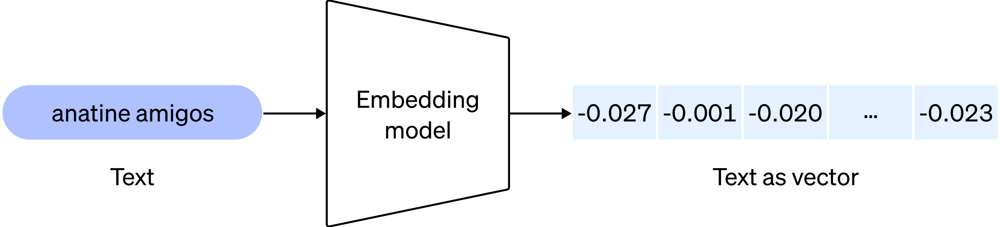

# openai text embedding 介绍

## openai text embedding 是什么

```
OpenAI offers an API to generate embeddings for a string of text using its language model. You feed it any text information (blog articles, documentation, your company's knowledge base), and it will output a vector of floating point numbers that represents the “meaning” of that text.

Why is this useful? Once we have generated embeddings on multiple texts, it is trivial to calculate how similar they are using vector math operations like cosine distance.
```

嵌入（Embedding）是深度学习方法处理自然语言文本最重要的方式之一。它将人类的自然语言和文本转换成一个浮点型的向量。是将自然语言处理转化为数学计算和处理的关键技术。

我们想判断这两句话是否为相关话题，人类一看可能就比较好判断，但是机器识别不了。转化为向量之后，那么只要比较这两个向量的距离就可以判断相似度了。距离越小说明越相关。向量计算那么就是数学和计算机领域的强项了。



Embedding 可以在如下领域发挥作用：

- 搜索（根据查询字符串的相关性对结果进行排名）
- 聚类（根据相似性对文本字符串进行分组）
- 推荐（具有相关文本字符串的项目被推荐）
- 异常检测（识别关联度小的异常值）
- 多样性测量（对相似性分布进行分析）
- 分类（文本串按其最相似的标签进行分类）

## openai embedding vs sentence transformer

openai 开启了一个 text/code embedding 服务，提供四种模型：
- Ada (1024 维)
- Babbage (2048 维)
- Curie (4096 维)
- Davinci (12288 维)

大概是这么使用（python openapi 库）的（https://openai.com/blog/introducing-text-and-code-embeddings）：

```python
import openai
response = openai.Embedding.create(
    input="canine companions say",
    engine="text-similarity-davinci-001")

print(response)

```
执行结果：
```json
{
  "data": [
    {
      "embedding": [
        0.000108064,
        0.005860855,
        -0.012656143,
        ...
        -0.006642727,
        0.002583989,
        -0.012567150
      ],
      "index": 0,
      "object": "embedding"
    }
  ],
  "model": "text-similarity-davinci-001",
  "object": "list"
}
```

也可以通过 POST 方式进行：

```bash
curl https://api.openai.com/v1/embeddings \
  -H "Authorization: Bearer $OPENAI_API_KEY" \
  -H "Content-Type: application/json" \
  -d '{
    "input": "The food was delicious and the waiter...",
    "model": "text-embedding-ada-002"
  }'
```
输出结果：

```json
{
  "object": "list",
  "data": [
    {
      "object": "embedding",
      "embedding": [
        0.0023064255,
        -0.009327292,
        .... (1536 floats total for ada-002)
        -0.0028842222,
      ],
      "index": 0
    }
  ],
  "model": "text-embedding-ada-002",
  "usage": {
    "prompt_tokens": 8,
    "total_tokens": 8
}
```

调用 openai 的 api 是需要花钱的


其实没有必要，完全可以用一个开源的产品 https://github.com/UKPLab/sentence-transformers 本地计算 embedding 值。

比如使用 `sentence-transformers all-MiniLM-L6-v2` 模型（该模型 384 维的），计算过程也非常简单：

```python
from sentence_transformers import SentenceTransformer

model = SentenceTransformer('all-MiniLM-L6-v2')

sentences = ['This framework generates embeddings for each input sentence',
    'Sentences are passed as a list of string.', 
    'The quick brown fox jumps over the lazy dog.']
sentence_embeddings = model.encode(sentences)

```

按照这篇文章 "https://medium.com/@nils_reimers/openai-gpt-3-text-embeddings-really-a-new-state-of-the-art-in-dense-text-embeddings-6571fe3ec9d9" 的说法，openai 的 embedding 模型性能也不咋地，用 `sentence_transformers` 就完全够用了。

## 基于 embedding 的搜索场景例子

需要分两步：

- **基于语料库生成 embedding 数据库**
    - Split your text corpus into chunks smaller than the token limit (8,191 tokens for text-embedding-ada-002)
    - Embed each chunk of text
    - Store those embeddings in your own database or in a vector search provider like Pinecone, Weaviate or Qdrant
- **基于 embedding 的搜索**
    - Embed the search query（将我们的查询文本转成 embedding）
    - Find the closest embeddings in your database
    - Return the top results

## embedding 结合 chatgpt 的场景例子

- 1. **语料库准备**：通过爬虫，爬取近2年的关于环境的网页链接，生成语料库（比如网页 title、摘要、链接 等）
- 2. **生成 embedding 数据库**：通过 openai embedding api 或者 sentence transformer，将语料库转化成 embeddings 保存到 database
- 3. **基于 prompts，通过 chatgpt 写一篇关于某个地区环境改善变化的总结报告**
    - 基于 prompts 的部分信息，通过 embedding 搜索相关的网页链接，输出 top 网页链接
    - 将 prompts 和 top 网络链接发给 chatgpt，由 chatgpt 输出该地区环境改善变化的总结报告

# Refers

- [Storing OpenAI embeddings in Postgres with pgvector](https://supabase.com/blog/openai-embeddings-postgres-vector)
- [SentenceTransformers Documentation](https://www.sbert.net/)
- [Question_answering_using_embeddings.ipynb](https://github.com/openai/openai-cookbook/blob/main/examples/Question_answering_using_embeddings.ipynb)
- [Embeddings](https://platform.openai.com/docs/guides/embeddings/what-are-embeddings)
- [Embedding Use Cases](https://platform.openai.com/docs/guides/embeddings/use-cases)
- [Embedding API Reference](https://platform.openai.com/docs/api-reference/embeddings)
- [openai api reference](https://platform.openai.com/docs/api-reference/introduction)
- [openai introduction](https://platform.openai.com/docs/introduction)
- [how to work with large language models](https://github.com/openai/openai-cookbook/blob/main/how_to_work_with_large_language_models.md)
- [Embedding Wikipedia articles for search](https://github.com/openai/openai-cookbook/blob/main/examples/Embedding_Wikipedia_articles_for_search.ipynb)
- [Question answering using embeddings-based search](https://github.com/openai/openai-cookbook/blob/main/examples/Question_answering_using_embeddings.ipynb)
