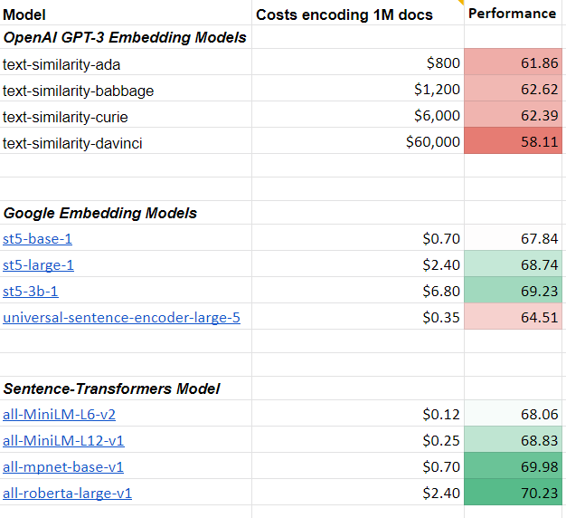

# openai text embedding 是什么

openai 开启了一个 text/code embedding 服务，提供四种模型：
- Ada (1024 维)
- Babbage (2048 维)
- Curie (4096 维)
- Davinci (12288 维)

大概是这么使用的（https://openai.com/blog/introducing-text-and-code-embeddings）：

```python
import openai
response = openai.Embedding.create(
    input="canine companions say",
    engine="text-similarity-davinci-001")

print(response)

```
执行结果：
```json
{
  "data": [
    {
      "embedding": [
        0.000108064,
        0.005860855,
        -0.012656143,
        ...
        -0.006642727,
        0.002583989,
        -0.012567150
      ],
      "index": 0,
      "object": "embedding"
    }
  ],
  "model": "text-similarity-davinci-001",
  "object": "list"
}
```

调用 openai 的 api 是需要花钱的



其实没有必要，完全可以用一个开源的产品 https://github.com/UKPLab/sentence-transformers 本地计算 embedding 值。

比如使用 `sentence-transformers all-MiniLM-L6-v2` 模型（该模型 384 维的），计算过程也非常简单：

```python
from sentence_transformers import SentenceTransformer

model = SentenceTransformer('all-MiniLM-L6-v2')

sentences = ['This framework generates embeddings for each input sentence',
    'Sentences are passed as a list of string.', 
    'The quick brown fox jumps over the lazy dog.']
sentence_embeddings = model.encode(sentences)

```

按照这篇文章 "https://medium.com/@nils_reimers/openai-gpt-3-text-embeddings-really-a-new-state-of-the-art-in-dense-text-embeddings-6571fe3ec9d9" 的说法，openai 的 embedding 模型性能也咋地，用 `sentence_transformers` 就完全够用了。
