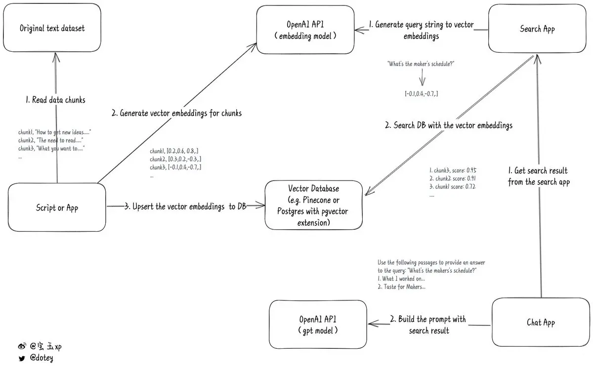

<!-- TOC -->

- [openai text embedding 介绍](#openai-text-embedding-介绍)
    - [openai text embedding 是什么](#openai-text-embedding-是什么)
    - [openai embedding vs sentence transformer](#openai-embedding-vs-sentence-transformer)
    - [为什么 chatgpt 结合 embedding 效果更好](#为什么-chatgpt-结合-embedding-效果更好)
    - [基于 embedding 的搜索场景例子](#基于-embedding-的搜索场景例子)
    - [embedding 结合 chatgpt 的场景例子](#embedding-结合-chatgpt-的场景例子)
- [Refers](#refers)

<!-- /TOC -->
<a id="markdown-openai-text-embedding-介绍" name="openai-text-embedding-介绍"></a>
# openai text embedding 介绍

<a id="markdown-openai-text-embedding-是什么" name="openai-text-embedding-是什么"></a>
## openai text embedding 是什么

```
OpenAI offers an API to generate embeddings for a string of text using its language model. You feed it any text information (blog articles, documentation, your company's knowledge base), and it will output a vector of floating point numbers that represents the “meaning” of that text.

Why is this useful? Once we have generated embeddings on multiple texts, it is trivial to calculate how similar they are using vector math operations like cosine distance.
```

嵌入（Embedding）是深度学习方法处理自然语言文本最重要的方式之一。它将人类的自然语言和文本转换成一个浮点型的向量。是将自然语言处理转化为数学计算和处理的关键技术。

我们想判断这两句话是否为相关话题，人类一看可能就比较好判断，但是机器识别不了。转化为向量之后，那么只要比较这两个向量的距离就可以判断相似度了。距离越小说明越相关。向量计算那么就是数学和计算机领域的强项了。


Embedding 可以在如下领域发挥作用：

- 搜索（根据查询字符串的相关性对结果进行排名）
- 聚类（根据相似性对文本字符串进行分组）
- 推荐（具有相关文本字符串的项目被推荐）
- 异常检测（识别关联度小的异常值）
- 多样性测量（对相似性分布进行分析）
- 分类（文本串按其最相似的标签进行分类）

<a id="markdown-openai-embedding-vs-sentence-transformer" name="openai-embedding-vs-sentence-transformer"></a>
## openai embedding vs sentence transformer

openai 开启了一个 text/code embedding 服务，提供四种模型：
- Ada (1024 维)
- Babbage (2048 维)
- Curie (4096 维)
- Davinci (12288 维)

大概是这么使用（python openapi 库）的（https://openai.com/blog/introducing-text-and-code-embeddings）：

```python
import openai
response = openai.Embedding.create(
    input="canine companions say",
    engine="text-similarity-davinci-001")

print(response)

```
执行结果：
```json
{
  "data": [
    {
      "embedding": [
        0.000108064,
        0.005860855,
        -0.012656143,
        ...
        -0.006642727,
        0.002583989,
        -0.012567150
      ],
      "index": 0,
      "object": "embedding"
    }
  ],
  "model": "text-similarity-davinci-001",
  "object": "list"
}
```

也可以通过 POST 方式进行：

```bash
curl https://api.openai.com/v1/embeddings \
  -H "Authorization: Bearer $OPENAI_API_KEY" \
  -H "Content-Type: application/json" \
  -d '{
    "input": "The food was delicious and the waiter...",
    "model": "text-embedding-ada-002"
  }'
```
输出结果：

```json
{
  "object": "list",
  "data": [
    {
      "object": "embedding",
      "embedding": [
        0.0023064255,
        -0.009327292,
        .... (1536 floats total for ada-002)
        -0.0028842222,
      ],
      "index": 0
    }
  ],
  "model": "text-embedding-ada-002",
  "usage": {
    "prompt_tokens": 8,
    "total_tokens": 8
}
```

调用 openai 的 api 是需要花钱的


**其实没有必要，完全可以用一个开源的产品 https://github.com/UKPLab/sentence-transformers 本地计算 embedding 值。**

比如使用 `sentence-transformers all-MiniLM-L6-v2` 模型（该模型 384 维的），计算过程也非常简单：

```python
from sentence_transformers import SentenceTransformer

model = SentenceTransformer('all-MiniLM-L6-v2')

sentences = ['This framework generates embeddings for each input sentence',
    'Sentences are passed as a list of string.', 
    'The quick brown fox jumps over the lazy dog.']
sentence_embeddings = model.encode(sentences)

```

**按照这篇文章 "https://medium.com/@nils_reimers/openai-gpt-3-text-embeddings-really-a-new-state-of-the-art-in-dense-text-embeddings-6571fe3ec9d9" 的说法，openai 的 embedding 模型性能也不咋地，用 `sentence_transformers` 就完全够用了。**

<a id="markdown-为什么-chatgpt-结合-embedding-效果更好" name="为什么-chatgpt-结合-embedding-效果更好"></a>
## 为什么 chatgpt 结合 embedding 效果更好

要解决私有数据的自然语言查询，我觉得要先解决以下几个问题：

- 私有数据的存储
    - 私有数据需要解决大数据量存储和查询的问题，由于 chatgpt 是个大语言模型，1750亿个参数，不可能将自己的数据全部喂给他微调做对应的子任务模型，一个是成本太高，另一个也确实做不了。
    - 那么必然我们需要将自己的私有数据存储在自己的私有数据库中，这个时候向量数据库（vector database）就出现了。

- 如何通过自然语言进行问答
    - 自然语言的问答，自然需要借助 chatgpt 的能力，但是 chatgpt 的一次 Prompt 是有字数限制的，我不可能把私有数据所有的数据都一起组装成 Prompt 来问 chatgpt，如何能够突破 Prompt 的字数限制呢？
    - 一个可行的想法就是将私有数据库中相关的内容抽取出来，当做 Prompt 来问，这是个行之有效的方式。那么如何提取和问答相关性比较大的内容呢，这个时候 Embeddings 技术就出现了。

所以，整个流程可以分为两大部分：
- 第一大部分：私有数据切片&存储
- 第二大部分：筛选和提问相关性高的内容整合一齐向 Openai 提问



第一大部分：私有数据切片&存储：
1. **首先需要将原始文本按照固定长度截取为一段一段文本**；原因是希望通过 openai 的 Embedding 能力生成对应阶段文本的向量数据集合，由于 openai 对于输入有文本长度的限制，所以需要截取到固定长度；
2. 调用 openai 的 Embeddings 接口，**将一段段文本转成向量**，这样每段文本就有一个向量与之对应；
3. **将原始文本和对应的向量存储到之前提到的向量数据库中**。

第二大部分：筛选和提问相关性高的内容整合一齐向 Openai 提问：
1. **将用户输入的问题字符串当做输入**，调用 openai 的 Embeddings 能力**换取对应的 vector 向量**；
2、将用户输入文本对应的向量去向量数据库中查询高相似度的向量集合，即**对应的相关性文本列表就都查了出来**；
3、将从向量数据库中查出来的**相关性文本和原始的问题组成一个 Prompt 直接问 chatgpt**，既可以得出来结果。

<a id="markdown-基于-embedding-的搜索场景例子" name="基于-embedding-的搜索场景例子"></a>
## 基于 embedding 的搜索场景例子

需要分两步：

- **基于语料库生成 embedding 数据库**
    - Split your text corpus into chunks smaller than the token limit (8,191 tokens for text-embedding-ada-002)
    - Embed each chunk of text
    - Store those embeddings in your own database or in a vector search provider like Pinecone, Weaviate or Qdrant
- **基于 embedding 的搜索**
    - Embed the search query（将我们的查询文本转成 embedding）
    - Find the closest embeddings in your database
    - Return the top results

<a id="markdown-embedding-结合-chatgpt-的场景例子" name="embedding-结合-chatgpt-的场景例子"></a>
## embedding 结合 chatgpt 的场景例子

ChatGPT doesn't just return existing documents. It's able to assimilate a variety of information into a single, cohesive answer. To do this, we need to provide GPT with some relevant documents, and a prompt that it can use to formulate this answer.

One of the biggest challenges of OpenAI's text-davinci-003 completion model is the 4000 token limit. You must fit both your prompt and the resulting completion within the 4000 tokens. This makes it challenging if you wanted to prompt GPT-3 to answer questions about your own custom knowledge base that would never fit in a single prompt.

Embeddings can help solve this by splitting your prompts into a two-phased process:
- Query your embedding database for the most relevant documents related to the question
- Inject these documents as context for GPT-3 to reference in its answer


所以，可以假设这么一个 case：

- 1. **语料库准备**：通过爬虫，爬取近2年的关于环境的网页链接，生成语料库（比如网页 title、摘要、链接 等）
- 2. **生成 embedding 数据库**：通过 openai embedding api 或者 sentence transformer，将语料库转化成 embeddings 保存到 database
- 3. **基于 prompts，通过 chatgpt 写一篇关于某个地区环境改善变化的总结报告**
    - 基于 prompts 的部分信息，通过 embedding 搜索相关的网页链接，输出 top 网页链接
    - 将 prompts 和 top 网络链接发给 chatgpt，由 chatgpt 输出该地区环境改善变化的总结报告

<a id="markdown-refers" name="refers"></a>
# Refers

- [Storing OpenAI embeddings in Postgres with pgvector](https://supabase.com/blog/openai-embeddings-postgres-vector)
- [SentenceTransformers Documentation](https://www.sbert.net/)
- [Question_answering_using_embeddings.ipynb](https://github.com/openai/openai-cookbook/blob/main/examples/Question_answering_using_embeddings.ipynb)
- [Embeddings](https://platform.openai.com/docs/guides/embeddings/what-are-embeddings)
- [Embedding Use Cases](https://platform.openai.com/docs/guides/embeddings/use-cases)
- [Embedding API Reference](https://platform.openai.com/docs/api-reference/embeddings)
- [openai api reference](https://platform.openai.com/docs/api-reference/introduction)
- [openai introduction](https://platform.openai.com/docs/introduction)
- [how to work with large language models](https://github.com/openai/openai-cookbook/blob/main/how_to_work_with_large_language_models.md)
- [Embedding Wikipedia articles for search](https://github.com/openai/openai-cookbook/blob/main/examples/Embedding_Wikipedia_articles_for_search.ipynb)
- [Question answering using embeddings-based search](https://github.com/openai/openai-cookbook/blob/main/examples/Question_answering_using_embeddings.ipynb)
- [如何通过Chatgpt+Embedding搭建私有数据FAQ](https://juejin.cn/post/7215207897519783973)
