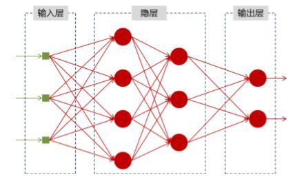
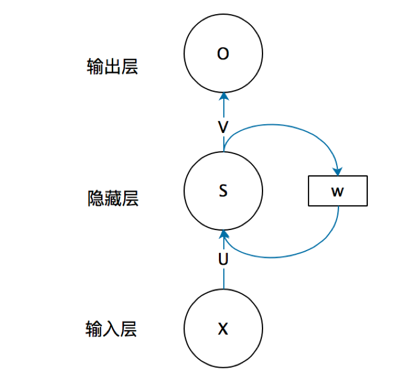
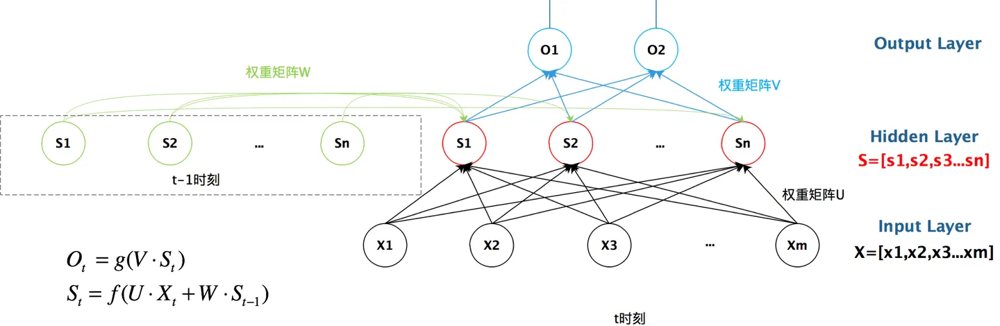
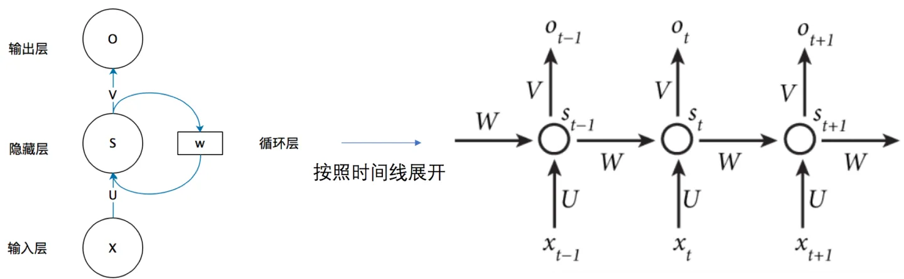
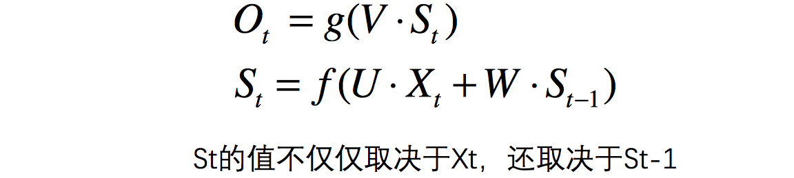
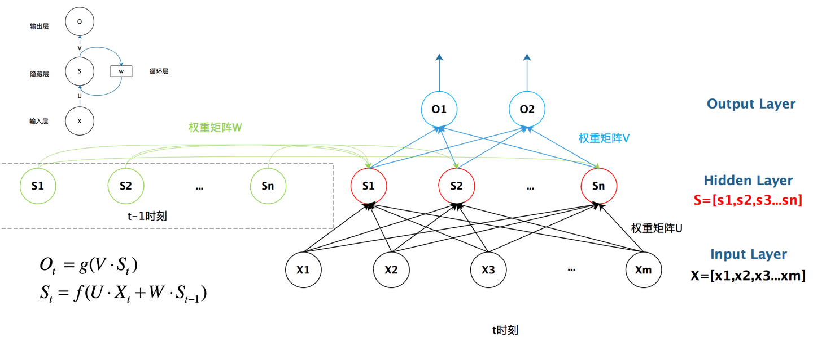

<!-- TOC -->

- [一文搞懂RNN（循环神经网络）基础篇](#一文搞懂rnn循环神经网络基础篇)
    - [神经网络基础](#神经网络基础)
    - [为什么需要RNN（循环神经网络）](#为什么需要rnn循环神经网络)
    - [RNN结构](#rnn结构)
    - [总结](#总结)

<!-- /TOC -->

# 一文搞懂RNN（循环神经网络）基础篇

## 神经网络基础

神经网络可以当做是能够拟合任意函数的黑盒子，只要训练数据足够，给定特定的x，就能得到希望的y，结构图如下：

将神经网络模型训练好之后，在输入层给定一个x，通过网络之后就能够在输出层得到特定的y，那么既然有了这么强大的模型，为什么还需要RNN（循环神经网络）呢？

## 为什么需要RNN（循环神经网络）

他们都只能单独的取处理一个个的输入，前一个输入和后一个输入是完全没有关系的。但是，某些任务需要能够更好的处理序列的信息，即前面的输入和后面的输入是有关系的。

> 比如，当我们在理解一句话意思时，孤立的理解这句话的每个词是不够的，我们需要处理这些词连接起来的整个序列； 当我们处理视频的时候，我们也不能只单独的去分析每一帧，而要分析这些帧连接起来的整个序列。

很明显，一个句子中，前一个单词其实对于当前单词的词性预测是有很大影响的，比如预测苹果的时候，由于前面的吃是一个动词，那么很显然苹果作为名词的概率就会远大于动词的概率，因为动词后面接名词很常见，而动词后面接动词很少见。

所以为了解决一些这样类似的问题，能够更好的处理序列的信息，RNN就诞生了。

## RNN结构

首先看一个简单的循环神经网络如，它由输入层、一个隐藏层和一个输出层组成：

不知道初学的同学能够理解这个图吗，反正我刚开始学习的时候是懵逼的，每个结点到底代表的是一个值的输入，还是说一层的向量结点集合，如何隐藏层又可以连接到自己，等等这些疑惑~这个图是一个比较抽象的图。

我们现在这样来理解，如果把上面有W的那个带箭头的圈去掉，它就变成了最普通的全连接神经网络。x是一个向量，它表示输入层的值（这里面没有画出来表示神经元节点的圆圈）；s是一个向量，它表示隐藏层的值（这里隐藏层面画了一个节点，你也可以想象这一层其实是多个节点，节点数与向量s的维度相同）；

U是输入层到隐藏层的权重矩阵，o也是一个向量，它表示输出层的值；V是隐藏层到输出层的权重矩阵。

那么，现在我们来看看W是什么。循环神经网络的隐藏层的值s不仅仅取决于当前这次的输入x，还取决于上一次隐藏层的值s。权重矩阵 W就是隐藏层上一次的值作为这一次的输入的权重。

我们给出这个抽象图对应的具体图：

**我们从上图就能够很清楚的看到，上一时刻的隐藏层是如何影响当前时刻的隐藏层的。**

如果我们把上面的图展开，**循环神经网络**也可以画成下面这个样子：

我们可以用下面的公式来表示循环神经网络的计算方法：

## 总结

好了，到这里大概讲解了RNN最基本的几个知识点，能够帮助大家直观的感受RNN和了解为什么需要RNN，后续总结它的反向求导知识点。

最后给出RNN的总括图：

> 注意：为了简单说明问题，偏置都没有包含在公式里面。

> refer to: https://zhuanlan.zhihu.com/p/30844905

