<!-- TOC -->

- [循环神经网络 – Recurrent Neural Network | RNN](#循环神经网络--recurrent-neural-network--rnn)
    - [为什么需要 RNN ？独特价值是什么？](#为什么需要-rnn-独特价值是什么)
    - [RNN 的基本原理](#rnn-的基本原理)
    - [RNN 的优化算法](#rnn-的优化算法)
        - [RNN 到 LSTM – 长短期记忆网络](#rnn-到-lstm--长短期记忆网络)
        - [从 LSTM 到 GRU](#从-lstm-到-gru)
    - [RNN 的应用和使用场景](#rnn-的应用和使用场景)
    - [总结](#总结)

<!-- /TOC -->

# 循环神经网络 – Recurrent Neural Network | RNN

卷积神经网络 – CNN 已经很强大的，为什么还需要RNN？

本文会用通俗易懂的方式来解释 RNN 的独特价值——处理序列数据。同时还会说明 RNN 的一些缺陷和它的变种算法。

最后给大家介绍一下 RNN 的实际应用价值和使用场景。

## 为什么需要 RNN ？独特价值是什么？

卷积神经网络 – CNN 和普通的算法大部分都是输入和输出的一一对应，也就是一个输入得到一个输出。不同的输入之间是没有联系的。

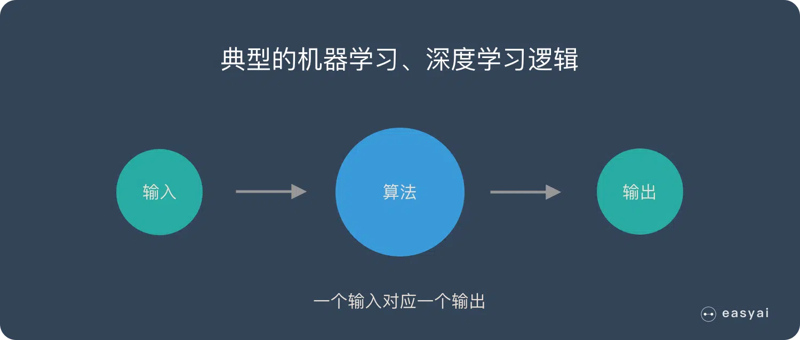

但是在某些场景中，一个输入就不够了！

为了填好下面的空，取前面任何一个词都不合适，我们不但需要知道前面所有的词，还需要知道词之间的顺序。

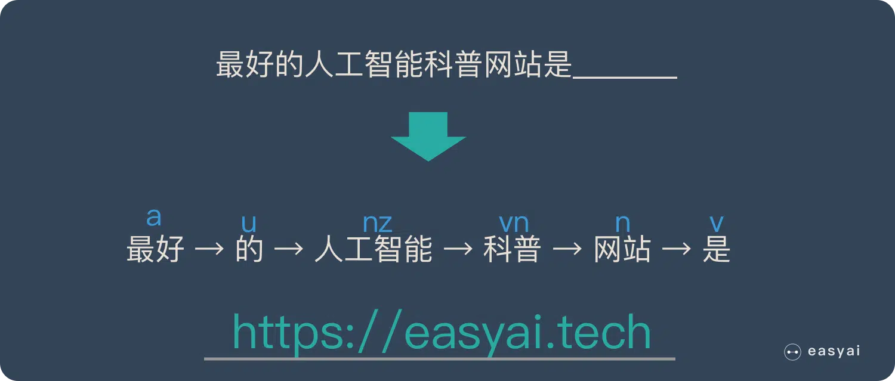

**这种需要处理「序列数据 – 一串相互依赖的数据流」的场景就需要使用 RNN 来解决了。**

典型的集中序列数据：

- 文章里的文字内容
- 语音里的音频内容
- 股票市场中的价格走势
- ……

RNN 之所以能够有效的处理序列数据，主要是基于他的比较特殊的运行原理。下面给大家介绍一下 RNN 的基本运行原理。

## RNN 的基本原理

传统神经网络的结构比较简单：输入层 – 隐藏层 – 输出层。如下图所示：

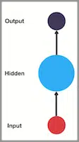

RNN 跟传统神经网络最大的区别在于每次都会将前一次的输出结果，带到下一次的隐藏层中，一起训练。如下图所示：

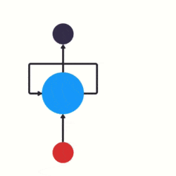

下面用一个具体的案例来看看 RNN 是如何工作的：

假如需要判断用户的说话意图（问天气、问时间、设置闹钟…），用户说了一句“what time is it？”我们需要先对这句话进行分词：

然后按照顺序输入 RNN ，我们先将 “what”作为 RNN 的输入，得到输出「01」

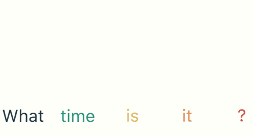

然后，我们按照顺序，将“time”输入到 RNN 网络，得到输出「02」。

这个过程我们可以看到，输入 “time” 的时候，**前面 “what” 的输出也产生了影响（隐藏层中有一半是黑色的）。**

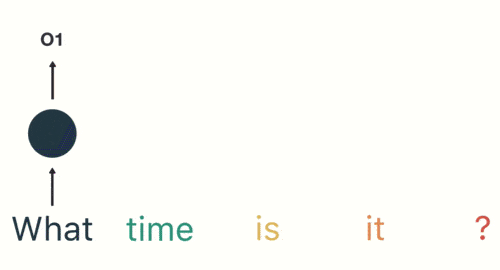

以此类推，前面所有的输入都对未来的输出产生了影响，大家可以看到圆形隐藏层中包含了前面所有的颜色。如下图所示：

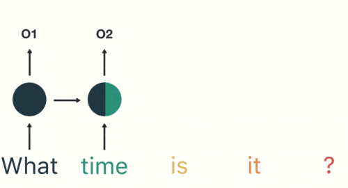

当我们判断意图的时候，只需要最后一层的输出「05」，如下图所示：

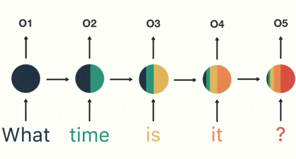

**RNN 的缺点也比较明显**

通过上面的例子，我们已经发现，短期的记忆影响较大（如橙色区域），但是长期的记忆影响就很小（如黑色和绿色区域），这就是 RNN 存在的短期记忆问题。

- RNN 有短期记忆问题，无法处理很长的输入序列
- 训练 RNN 需要投入极大的成本

由于 RNN 的短期记忆问题，后来又出现了基于 RNN 的优化算法，下面给大家简单介绍一下。

## RNN 的优化算法

### RNN 到 LSTM – 长短期记忆网络

RNN 是一种死板的逻辑，越晚的输入影响越大，越早的输入影响越小，且无法改变这个逻辑。

LSTM 做的最大的改变就是打破了这个死板的逻辑，而改用了一套灵活了逻辑——只保留重要的信息。

**简单说就是：抓重点！**

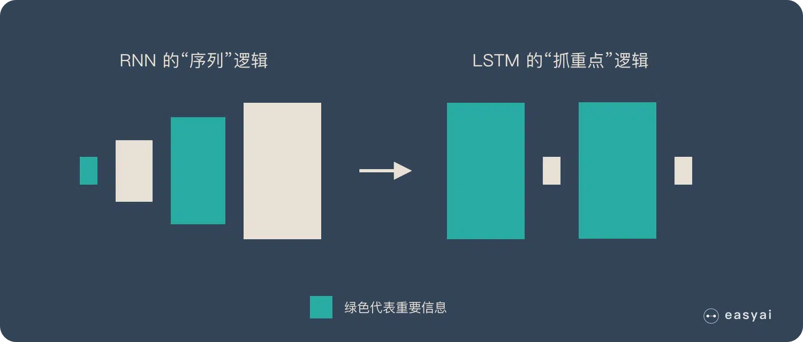

举个例子，我们先快速的阅读下面这段话：

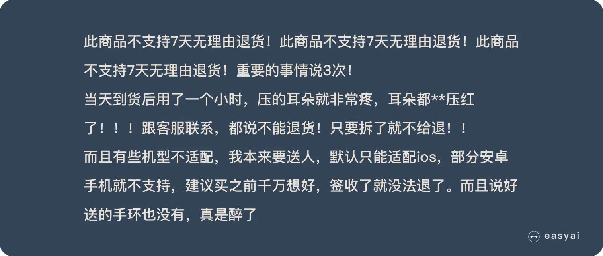

当我们快速阅读完之后，可能只会记住下面几个重点：

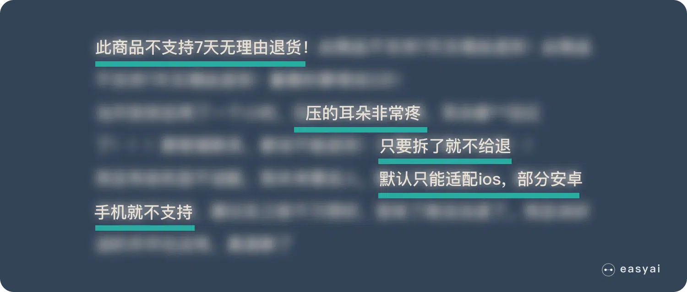

LSTM 类似上面的划重点，他可以保留较长序列数据中的「重要信息」，忽略不重要的信息。这样就解决了 RNN 短期记忆的问题。

具体技术上的实现原理就不在这里展开了，感兴趣的可以看看 LSTM 的详细介绍[《长短期记忆网络 – LSTM》](https://easyai.tech/ai-definition/lstm/)

### 从 LSTM 到 GRU

Gated Recurrent Unit – GRU 是 LSTM 的一个变体。他保留了 LSTM 划重点，遗忘不重要信息的特点，在long-term 传播的时候也不会被丢失。

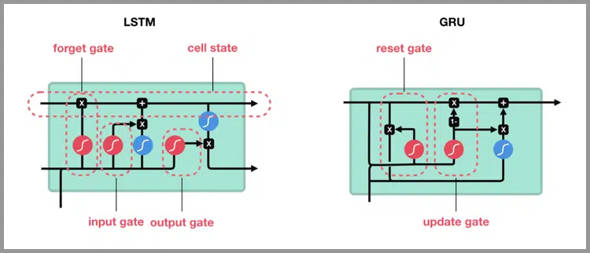

GRU 主要是在 LSTM 的模型上做了一些简化和调整，在训练数据集比较大的情况下可以节省很多时间。

## RNN 的应用和使用场景

只要涉及到序列数据的处理问题，都可以使用到，NLP 就是一个典型的应用场景。

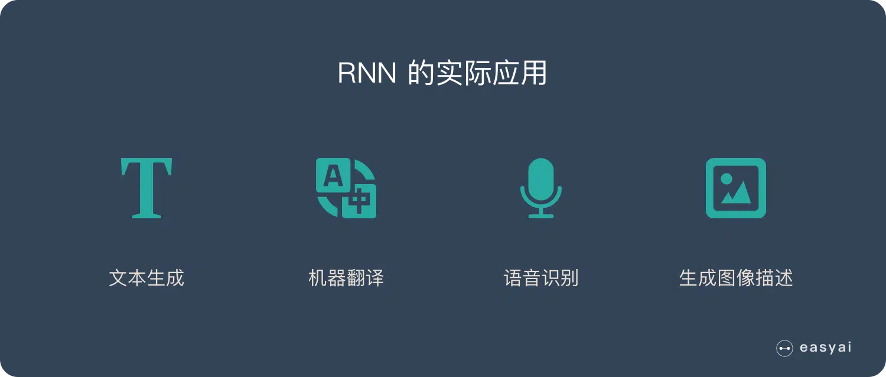

**文本生成**：类似上面的填空题，给出前后文，然后预测空格中的词是什么。

**机器翻译**：翻译工作也是典型的序列问题，词的顺序直接影响了翻译的结果。

**语音识别**：根据输入音频判断对应的文字是什么。

**生成图像描述**：类似看图说话，给一张图，能够描述出图片中的内容。这个往往是 RNN 和 CNN 的结合。

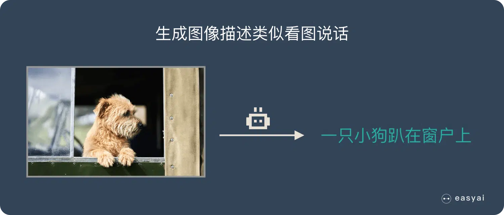

**视频标记**：他将视频分解为图片，然后用图像描述来描述图片内容。

## 总结

RNN的独特价值在于：它能有效的处理序列数据。比如：文章内容、语音音频、股票价格走势…

之所以他能处理序列数据，是因为在序列中前面的输入也会影响到后面的输出，相当于有了“记忆功能”。但是 RNN 存在严重的短期记忆问题，长期的数据影响很小（哪怕他是重要的信息）。

于是基于 RNN 出现了 LSTM 和 GRU 等变种算法。这些变种算法主要有几个特点：

- 长期信息可以有效的保留
- 挑选重要信息保留，不重要的信息会选择“遗忘”

RNN 几个典型的应用如下：

- 文本生成
- 语音识别
- 机器翻译
- 生成图像描述
- 视频标记

> refer to: https://easyai.tech/ai-definition/rnn/
