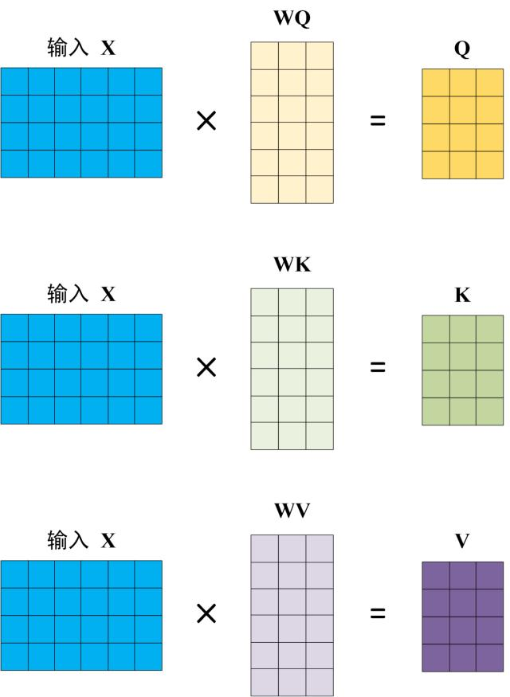

<!-- TOC -->

- [Transformer模型详解（图解最完整版）](#transformer模型详解图解最完整版)
    - [前言](#前言)
    - [Transformer 整体结构](#transformer-整体结构)
    - [Transformer 的输入](#transformer-的输入)
        - [单词 Embedding](#单词-embedding)
    - [位置 Embedding](#位置-embedding)
    - [Self-Attention（自注意力机制）](#self-attention自注意力机制)
        - [Self-Attention 结构](#self-attention-结构)
        - [Q, K, V 的计算](#q-k-v-的计算)
        - [Self-Attention 的输出](#self-attention-的输出)
        - [Multi-Head Attention](#multi-head-attention)
    - [Encoder 结构](#encoder-结构)
        - [Add & Norm](#add--norm)
        - [Feed Forward](#feed-forward)
        - [组成 Encoder](#组成-encoder)
    - [Decoder 结构](#decoder-结构)
        - [第一个 Multi-Head Attention](#第一个-multi-head-attention)
        - [第二个 Multi-Head Attention](#第二个-multi-head-attention)
        - [Softmax 预测输出单词](#softmax-预测输出单词)
    - [Transformer 总结](#transformer-总结)

<!-- /TOC -->

# Transformer模型详解（图解最完整版）

> 建议大家看一下李宏毅老师讲解的Transformer，非常简单易懂（个人觉得史上最强transformer讲解）：https://www.youtube.com/watch?v=ugWDIIOHtPA&list=PLJV_el3uVTsOK_ZK5L0Iv_EQoL1JefRL4&index=61

## 前言

Transformer由论文《Attention is All You Need》提出，现在是谷歌云TPU推荐的参考模型。论文相关的Tensorflow的代码可以从GitHub获取，其作为Tensor2Tensor包的一部分。哈佛的NLP团队也实现了一个基于PyTorch的版本，并注释该论文。

在本文中，我们将试图把模型简化一点，并逐一介绍里面的核心概念，希望让普通读者也能轻易理解。

Attention is All You Need：[Attention Is All You Need](https://arxiv.org/abs/1706.03762)

## Transformer 整体结构

首先介绍 Transformer 的整体结构，下图是 Transformer 用于中英文翻译的整体结构：

可以看到 Transformer 由 Encoder 和 Decoder 两个部分组成，Encoder 和 Decoder 都包含 6 个 block。Transformer 的工作流程大体如下：

**第一步**：获取输入句子的每一个词的表示向量 X，X由词的 Embedding（Embedding就是从原始数据提取出来的Feature） 和单词位置的 Embedding 相加得到。

**第二步**：将得到的单词表示向量矩阵 (如上图所示，每一行是一个单词的表示 x) 传入 Encoder 中，经过 6 个 Encoder block 后可以得到句子所有单词的编码信息矩阵 C，如下图。单词向量用矩阵X(n*d)表示， n 是句子中单词个数，d 是表示向量的维度 (论文中 d=512)。每一个 Encoder block 输出的矩阵维度与输入完全一致。

**第三步**：将 Encoder 输出的编码信息矩阵 C传递到 Decoder 中，Decoder 依次会根据当前翻译过的单词 1~ i 翻译下一个单词 i+1，如下图所示。在使用的过程中，翻译到单词 i+1 的时候需要通过 Mask (掩盖) 操作遮盖住 i+1 之后的单词。

上图 Decoder 接收了 Encoder 的编码矩阵 C，然后首先输入一个翻译开始符 "\<Begin\>"，预测第一个单词 "I"；然后输入翻译开始符 "\<Begin\>" 和单词 "I"，预测单词 "have"，以此类推。这是 Transformer 使用时候的大致流程，接下来是里面各个部分的细节。

## Transformer 的输入

Transformer 中单词的输入表示 x由单词 Embedding 和位置 Embedding （Positional Encoding）相加得到。

### 单词 Embedding

单词的 Embedding 有很多种方式可以获取，例如可以采用 Word2Vec、Glove 等算法预训练得到，也可以在 Transformer 中训练得到。

## 位置 Embedding

Transformer 中除了单词的 Embedding，还需要使用位置 Embedding 表示单词出现在句子中的位置。因为 Transformer 不采用 RNN 的结构，而是使用全局信息，不能利用单词的顺序信息，而这部分信息对于 NLP 来说非常重要。所以 Transformer 中使用位置 Embedding 保存单词在序列中的相对或绝对位置。

位置 Embedding 用 PE表示，PE 的维度与单词 Embedding 是一样的。PE 可以通过训练得到，也可以使用某种公式计算得到。在 Transformer 中采用了后者，计算公式如下：

其中，pos 表示单词在句子中的位置，d 表示 PE的维度 (与词 Embedding 一样)，2i 表示偶数的维度，2i+1 表示奇数维度 (即 2i≤d, 2i+1≤d)。使用这种公式计算 PE 有以下的好处：

- 使 PE 能够适应比训练集里面所有句子更长的句子，假设训练集里面最长的句子是有 20 个单词，突然来了一个长度为 21 的句子，则使用公式计算的方法可以计算出第 21 位的 Embedding。
- 可以让模型容易地计算出相对位置，对于固定长度的间距 k，PE(pos+k) 可以用 PE(pos) 计算得到。因为 Sin(A+B) = Sin(A)Cos(B) + Cos(A)Sin(B), Cos(A+B) = Cos(A)Cos(B) - Sin(A)Sin(B)。

将单词的词 Embedding 和位置 Embedding 相加，就可以得到单词的表示向量 x，x 就是 Transformer 的输入。

## Self-Attention（自注意力机制）

上图是论文中 Transformer 的内部结构图，左侧为 Encoder block，右侧为 Decoder block。红色圈中的部分为 Multi-Head Attention，是由多个 Self-Attention组成的，可以看到 Encoder block 包含一个 Multi-Head Attention，而 Decoder block 包含两个 Multi-Head Attention (其中有一个用到 Masked)。Multi-Head Attention 上方还包括一个 Add & Norm 层，Add 表示残差连接 (Residual Connection) 用于防止网络退化，Norm 表示 Layer Normalization，用于对每一层的激活值进行归一化。

因为 Self-Attention是 Transformer 的重点，所以我们重点关注 Multi-Head Attention 以及 Self-Attention，首先详细了解一下 Self-Attention 的内部逻辑。

### Self-Attention 结构

上图是 Self-Attention 的结构，在计算的时候需要用到矩阵Q(查询),K(键值),V(值)。在实际中，Self-Attention 接收的是输入(单词的表示向量x组成的矩阵X) 或者上一个 Encoder block 的输出。而 Q,K,V正是通过 Self-Attention 的输入进行线性变换得到的。

### Q, K, V 的计算

Self-Attention 的输入用矩阵X进行表示，则可以使用线性变阵矩阵WQ,WK,WV计算得到Q,K,V。计算如下图所示，**注意 X, Q, K, V 的每一行都表示一个单词。**

### Self-Attention 的输出

得到矩阵 Q, K, V之后就可以计算出 Self-Attention 的输出了，计算的公式如下：

公式中计算矩阵Q和K每一行向量的内积，为了防止内积过大，因此除以 
 d(k) 的平方根。Q乘以K的转置后，得到的矩阵行列数都为 n，n 为句子单词数，这个矩阵可以表示单词之间的 attention 强度。下图为Q乘以 K(t)，1234 表示的是句子中的单词。

得到 QK(T) 之后，使用 Softmax 计算每一个单词对于其他单词的 attention 系数，公式中的 Softmax 是对矩阵的每一行进行 Softmax，即每一行的和都变为 1.

得到 Softmax 矩阵之后可以和V相乘，得到最终的输出Z。

上图中 Softmax 矩阵的第 1 行表示单词 1 与其他所有单词的 attention 系数，最终单词 1 的输出 Z(1) 等于所有单词 i 的值 V(i) 根据 attention 系数的比例加在一起得到，如下图所示：

### Multi-Head Attention

在上一步，我们已经知道怎么通过 Self-Attention 计算得到输出矩阵 Z，而 Multi-Head Attention 是由多个 Self-Attention 组合形成的，下图是论文中 Multi-Head Attention 的结构图。

从上图可以看到 Multi-Head Attention 包含多个 Self-Attention 层，首先将输入X分别传递到 h 个不同的 Self-Attention 中，计算得到 h 个输出矩阵Z。下图是 h=8 时候的情况，此时会得到 8 个输出矩阵Z。

得到 8 个输出矩阵 Z(1) 到 Z(8) 之后，Multi-Head Attention 将它们拼接在一起 (Concat)，然后传入一个Linear层，得到 Multi-Head Attention 最终的输出Z。

可以看到 Multi-Head Attention 输出的矩阵Z与其输入的矩阵X的维度是一样的。

## Encoder 结构

上图红色部分是 Transformer 的 Encoder block 结构，可以看到是由 Multi-Head Attention, Add & Norm, Feed Forward, Add & Norm 组成的。刚刚已经了解了 Multi-Head Attention 的计算过程，现在了解一下 Add & Norm 和 Feed Forward 部分。

### Add & Norm

Add & Norm 层由 Add 和 Norm 两部分组成，其计算公式如下：

其中 X表示 Multi-Head Attention 或者 Feed Forward 的输入，MultiHeadAttention(X) 和 FeedForward(X) 表示输出 (输出与输入 X 维度是一样的，所以可以相加)。

Add指 X+MultiHeadAttention(X)，是一种残差连接，通常用于解决多层网络训练的问题，可以让网络只关注当前差异的部分，在 ResNet 中经常用到：

Norm指 Layer Normalization，通常用于 RNN 结构，Layer Normalization 会将每一层神经元的输入都转成均值方差都一样的，这样可以加快收敛。

### Feed Forward

Feed Forward 层比较简单，是一个两层的全连接层，第一层的激活函数为 Relu，第二层不使用激活函数，对应的公式如下。

X是输入，Feed Forward 最终得到的输出矩阵的维度与X一致。

### 组成 Encoder

通过上面描述的 Multi-Head Attention, Feed Forward, Add & Norm 就可以构造出一个 Encoder block，Encoder block 接收输入矩阵 X(n*d)，并输出一个矩阵 O(n*d)。通过多个 Encoder block 叠加就可以组成 Encoder。

第一个 Encoder block 的输入为句子单词的表示向量矩阵，后续 Encoder block 的输入是前一个 Encoder block 的输出，最后一个 Encoder block 输出的矩阵就是编码信息矩阵 C，这一矩阵后续会用到 Decoder 中。

## Decoder 结构

上图红色部分为 Transformer 的 Decoder block 结构，与 Encoder block 相似，但是存在一些区别：

- 包含两个 Multi-Head Attention 层。
- 第一个 Multi-Head Attention 层采用了 Masked 操作。
- 第二个 Multi-Head Attention 层的K, V矩阵使用 Encoder 的编码信息矩阵C进行计算，而Q使用上一个 Decoder block 的输出计算。
- 最后有一个 Softmax 层计算下一个翻译单词的概率。

### 第一个 Multi-Head Attention

Decoder block 的第一个 Multi-Head Attention 采用了 Masked 操作，因为在翻译的过程中是顺序翻译的，即翻译完第 i 个单词，才可以翻译第 i+1 个单词。通过 Masked 操作可以防止第 i 个单词知道 i+1 个单词之后的信息。下面以 "我有一只猫" 翻译成 "I have a cat" 为例，了解一下 Masked 操作。

下面的描述中使用了类似 Teacher Forcing 的概念，不熟悉 Teacher Forcing 的童鞋可以参考以下上一篇文章Seq2Seq 模型详解。在 Decoder 的时候，是需要根据之前的翻译，求解当前最有可能的翻译，如下图所示。首先根据输入 "\<Begin>" 预测出第一个单词为 "I"，然后根据输入 "\<Begin> I" 预测下一个单词 "have"。

Decoder 可以在训练的过程中使用 Teacher Forcing 并且并行化训练，即将正确的单词序列 (\<Begin> I have a cat) 和对应输出 (I have a cat \<end>) 传递到 Decoder。那么在预测第 i 个输出时，就要将第 i+1 之后的单词掩盖住，注意 Mask 操作是在 Self-Attention 的 Softmax 之前使用的，下面用 0 1 2 3 4 5 分别表示 "\<Begin> I have a cat \<end>"。

**第一步**：是 Decoder 的输入矩阵和 Mask 矩阵，输入矩阵包含 "\<Begin> I have a cat" (0, 1, 2, 3, 4) 五个单词的表示向量，Mask 是一个 5×5 的矩阵。在 Mask 可以发现单词 0 只能使用单词 0 的信息，而单词 1 可以使用单词 0, 1 的信息，即只能使用之前的信息。

**第二步**：接下来的操作和之前的 Self-Attention 一样，通过输入矩阵X计算得到Q,K,V矩阵。然后计算Q和 K(T) 的乘积 QK(T)。

**第三步**：在得到 QK(T) 之后需要进行 Softmax，计算 attention score，我们在 Softmax 之前需要使用Mask矩阵遮挡住每一个单词之后的信息，遮挡操作如下：

得到 Mask QK(T) 之后在 Mask QK(T) 上进行 Softmax，每一行的和都为 1。但是单词 0 在单词 1, 2, 3, 4 上的 attention score 都为 0。

**第四步**：使用 Mask QK(T) 与矩阵 V相乘，得到输出 Z，则单词 1 的输出向量 Z(1) 是只包含单词 1 信息的。

第五步：通过上述步骤就可以得到一个 Mask Self-Attention 的输出矩阵 Z(i)，然后和 Encoder 类似，通过 Multi-Head Attention 拼接多个输出 Z(i) 然后计算得到第一个 Multi-Head Attention 的输出Z，Z与输入X维度一样。

### 第二个 Multi-Head Attention

Decoder block 第二个 Multi-Head Attention 变化不大， 主要的区别在于其中 Self-Attention 的 K, V矩阵不是使用 上一个 Decoder block 的输出计算的，而是使用 Encoder 的编码信息矩阵 C 计算的。

根据 Encoder 的输出 C计算得到 K, V，根据上一个 Decoder block 的输出 Z 计算 Q (如果是第一个 Decoder block 则使用输入矩阵 X 进行计算)，后续的计算方法与之前描述的一致。

这样做的好处是在 Decoder 的时候，每一位单词都可以利用到 Encoder 所有单词的信息 (这些信息无需 Mask)。

### Softmax 预测输出单词

Decoder block 最后的部分是利用 Softmax 预测下一个单词，在之前的网络层我们可以得到一个最终的输出 Z，因为 Mask 的存在，使得单词 0 的输出 Z0 只包含单词 0 的信息，如下：

Softmax 根据输出矩阵的每一行预测下一个单词：

这就是 Decoder block 的定义，与 Encoder 一样，Decoder 是由多个 Decoder block 组合而成。

## Transformer 总结

- Transformer 与 RNN 不同，可以比较好地并行训练。
- Transformer 本身是不能利用单词的顺序信息的，因此需要在输入中添加位置 Embedding，否则 Transformer 就是一个词袋模型了。
- Transformer 的重点是 Self-Attention 结构，其中用到的 Q, K, V矩阵通过输出进行线性变换得到。
- Transformer 中 Multi-Head Attention 中有多个 Self-Attention，可以捕获单词之间多种维度上的相关系数 attention score。

> refer to: https://zhuanlan.zhihu.com/p/338817680
