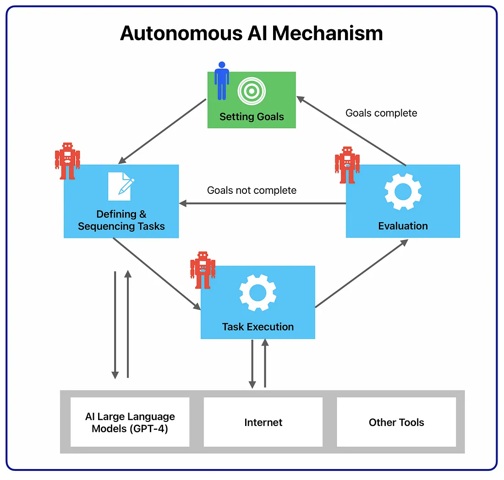

<!-- TOC -->

- [What is AutoGPT? A Comprehensive Guide & ChatGPT Comparison](#what-is-autogpt-a-comprehensive-guide--chatgpt-comparison)
- [What is AutoGPT?](#what-is-autogpt)
- [How Does AutoGPT Work?](#how-does-autogpt-work)
- [How Does AutoGPT Compare with ChatGPT?](#how-does-autogpt-compare-with-chatgpt)
    - [Real-Time Insights](#real-time-insights)
    - [Memory Management](#memory-management)
    - [Image Generation](#image-generation)
    - [Text to Speech](#text-to-speech)
- [Limitations of AutoGPT](#limitations-of-autogpt)
    - [Too Expensive to Use](#too-expensive-to-use)
    - [Gets Stuck in a Loop Too Often](#gets-stuck-in-a-loop-too-often)
    - [Data Breaches are Possible](#data-breaches-are-possible)
- [Closing Thoughts](#closing-thoughts)

<!-- /TOC -->

# What is AutoGPT? A Comprehensive Guide & ChatGPT Comparison

> refer to: <https://writesonic.com/blog/what-is-autogpt/>

Artificial intelligence continues to evolve at an accelerating pace.

From GPT-3 to GPT-4, we saw significant improvements with regard to advanced reasoning, input settings, fine-tuning behavior, and understanding longer contexts.

> Learn more about [GPT-4 vs. GPT-3](https://writesonic.com/blog/gpt-4-vs-gpt-3/).

However, the AI-human interaction remained the same. You need to carefully craft AI prompts and fine-tune their behavior to get your desired results.

Well, what if you simply state your goals to the AI, and it does everything for you? Like how you enter your destination in a Tesla car, and it takes you there without requiring your active involvement.

Yes, we are talking about autonomous AI agents. And guess what? They’re already here!

AutoGPT is the latest application out of GPT-4 that has taken the internet by storm. Developers worldwide are building new applications using AutoGPT across industries. And some are calling AutoGPT an AGI!

# What is AutoGPT?

AutoGPT is an open-source AI application leveraging OpenAI’s [GPT-4](https://writesonic.com/blog/what-is-gpt-4/) language model to create fully autonomous and customizable AI agents. It was released on 30th March 2023, by Toran Bruce Richards. Toran is a game developer by trade and founded a gaming company called Significant Gravitas.

AutoGPT is unique compared to other AI tools because it operates independently, meaning you no longer have to steer the model to meet your needs. Instead, you write your objectives, and the AI does the rest for you. So AutoGPT is fundamentally changing the interaction between AI and humans, where humans no longer have to play an active role while still maintaining the same or better quality of results as other AI applications like ChatGPT.

> Check out [31 ChatGPT alternatives](https://writesonic.com/blog/chatgpt-alternatives/) that you should know about.

# How Does AutoGPT Work?

AutoGPT works based on an autonomous AI mechanism where the AI system creates different AI agents to meet specific tasks, which include:

- **Task Creation Agent**: When you enter your goals on AutoGPT, the first AI agent to interact with the task creation agent. Based on your goals, it will create a list of tasks with steps to achieve them and send it to the prioritization agent.
- **Task Prioritization Agent**: After receiving the list of tasks, the prioritization AI agent ensures the sequence is correct and makes logical sense before sending it to the execution agent.
- **Task Execution Agent**: Once prioritization is done, the execution agent completes one task after another. This involves tapping into GPT-4, the Internet, and other resources to get results.

The above agents also communicate with each other. So when the execution agent completes all tasks, and the results are unsatisfactory, it can communicate with the task creation agent to create a new list of tasks. This becomes an iterative loop between the three agents until all user-defined goals are completed.

The actions of the AI agents are also shown on the user interface by categorizing them into four groups: thoughts, reasoning, plan, and criticism. Firstly, the AI agent shares thoughts after completing a task. Then comes reasoning, which explains why the AI agent is doing what it’s doing. After that, the system provides a plan to complete the task. Finally, the system also gives criticism to allow the AI agent to rectify its mistakes and overcome any limitations.

By sharing this computational flow, AutoGPT gives insights into how it approaches a particular problem and overcomes them without any user intervention.

# How Does AutoGPT Compare with ChatGPT?

While the underlying LLM model is the same, we can draw quite a few distinctions between AutoGPT and ChatGPT. Some of them are given below.

## Real-Time Insights

The latest GPT-4 model that ChatGPT uses is trained on the same data as GPT-3.5, which is only till September 2021. So you can’t get real-time insights using ChatGPT as you can’t access websites and online platforms to extract information.

On the other hand, AutoGPT has access to the internet. It cannot only surf the Web but can also validate whether a source is legitimate. Further, AutoGPT can access any platform to perform a task. For example, if you ask the AI to research prospects for selling a product and send an outreach email, it will draft and send emails directly using your Gmail account.

## Memory Management

Context window is very important for language models to give accurate answers. But in LLMs like GPT-4, the window has a limit of anywhere from 4000 to 8000 tokens. So, if the requirement is beyond the limit, the model may not follow all the instructions properly or may go off on a tangent and give unreliable outputs.

In contrast, AutoGPT is good at short-term and long-term memory management. By using vector databases, AutoGPT can store the context or previous experiences to allow the model to make better decisions.

## Image Generation

AutoGPT is capable of image generating as it uses DALL-E. If you want to enable image generation functionality for your AI agent, you need API access to DALL-E. This feature is currently unavailable in ChatGPT-4 despite being a multi-modal input-wise.

## Text to Speech

You can enable text-to-speech on AutoGPT by typing python -m autogpt --speak in the command line. But you have to enter the command every time you interact with AutoGPT. You can also add different voices to the speech by connecting AutoGPT to Eleven Labs, a versatile AI speech software.

# Limitations of AutoGPT

There is no doubt that autonomous nature adds a new dimension to AI systems. At the same time, we cannot ignore the limitations and risks of AutoGPT. Some of the key limitations you must know are given below.

## Too Expensive to Use

While the functionality is amazing, AutoGPT’s practicality will likely disappoint you. As AutoGPT uses an expensive GPT-4 model, the cost per task completion can be high, even for a small task. This is mainly because AutoGPT can use GPT-4 numerous times at the step of a particular task.

Furthermore, it is not practical because it can’t replicate outputs in a different scenario when the input is the same. For example, if you ask the model to find top running shoes on the road and turf, it won’t create a function to replicate the process for the turf category; instead, it will start from scratch.

## Gets Stuck in a Loop Too Often

The most common issue users are facing with AutoGPT is it gets stuck in a loop. If this goes on for more than a couple of minutes, it likely means you have to restart the process. This happens because AutoGPT relies on GPT-4 to properly define and decompose tasks. So the results are inadequate for AutoGPT to take any action.

## Data Breaches are Possible

When an AI model operates autonomously with access to your system and the internet, your data may be leaked. As there are no security agents, it is a concern, and you have to be careful when using AutoGPT. You can’t leave the model running without giving proper instructions and safety guidelines.

# Closing Thoughts

While I think the possibilities of AutoGPT will be exciting to watch, it’s important to set realistic expectations when it comes to emerging technologies. It hasn’t even been a full month since AutoGPT launched, so we still haven’t seen what this new AI application can and can’t do in different use-cases. Further, it comes with many personal privacy and data security issues that need immediate attention.

That said, I believe AutoGPT is changing how we interact with LLM models like GPT-4. We can now see how an AI approaches a problem, learns from mistakes, and delivers good results, allowing us to optimize our prompts better. So AI agents aren’t going anywhere, but they will take time to mature and drive meaningful user adoption.
