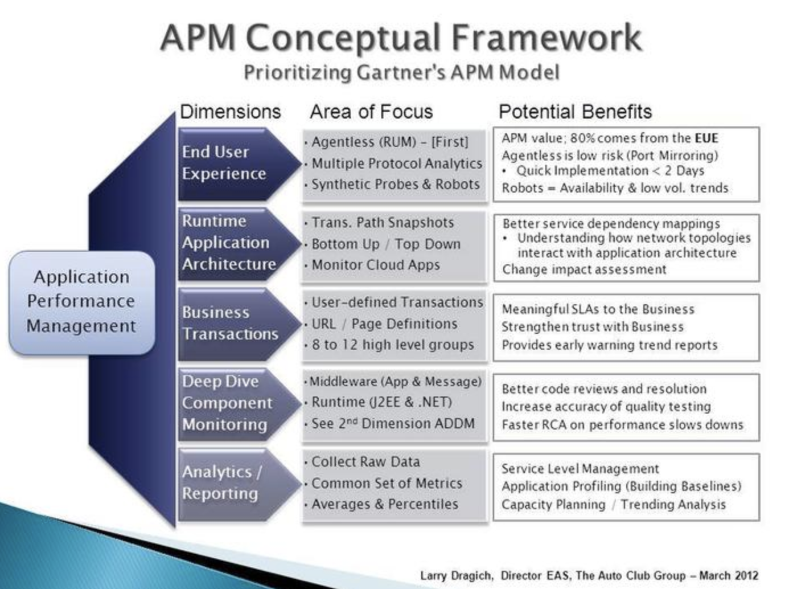
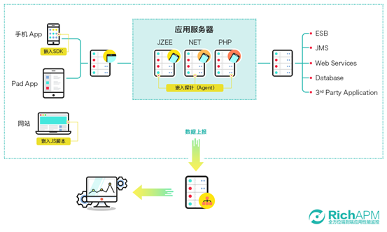
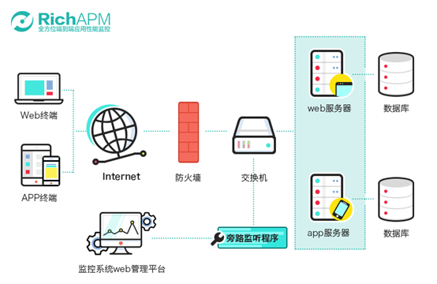
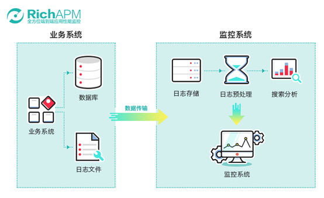
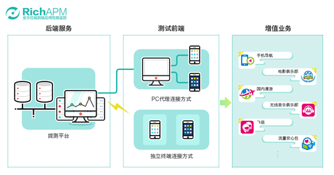
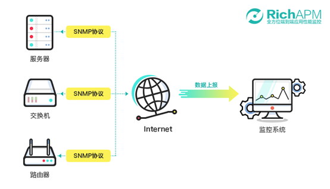

<!-- TOC -->

- [APM 简述](#apm-简述)
- [APM 概念框架](#apm-概念框架)
- [APM 核心功能](#apm-核心功能)
- [APM 数据采集方式](#apm-数据采集方式)
    - [代码潜入](#代码潜入)
    - [旁路监听](#旁路监听)
    - [日志分析](#日志分析)
    - [模拟拨测](#模拟拨测)
    - [SNMP接口](#snmp接口)

<!-- /TOC -->

# APM 简述

APM，Application Performance Management，应用性能监控，对企业系统即时监控以实现对应用程序性能管理和故障管理的系统化的解决方案。

最早的APM主要是网络为中心，对基础设备的性能数据进行收集与加工，并提供给企业客户，相当于提供一种事后数据的简单处理与告警监控功能。随着APM市场的发展，目前的 APM 工具在性能监控的基础上有了进化，更加关注于运维数据分析，比如客户端到端的体验情况怎么样？性能瓶颈在哪里？而且当前的 APM 工具以数据分析为中间实现了更好的可视化，更快更精准预警，更强的问题关联定位等特性。

随着分布式系统和微服务架构的应用和发展，应用性能管理成为系统运维管理和网络管理的一个重要方向，它能够对企业的关键业务应用进行监测、优化，提高企业应用的可靠性和质量，保证用户得到良好的服务，降低IT总拥有成本(TCO)。应用性能管理APM能够对整个企业的IT系统各个层面进行集中的性能监控，并对有可能出现的性能问题进行及时、准确的分析和处理。它能轻松地从一个IT应用系统中找到故障点，并提供有相关解决建议或方法，从而提高整体的系统性能。一个企业的关键业务应用的性能强大，可以保证企业业务应用系统的高效性和稳定性，为企业带来核心竞争力的提升。

# APM 概念框架

随着互联网技术和应用的快速发展，应用程序本身变得越来越难以管理，因为它们从单体架构转向高度分布的、多层、多元素的分布式应用架构，应用系统在许多情况下依赖于应用程序的开发框架。APM概念框架旨在帮助企业优先考虑在IT系统架构中需要首先关注的方法，以便企业能够快速实施并全面了解五维APM模型。

- 终端用户体验

  此测量的结果称为实时应用程序监视（又称自顶向下监视），它具有被动和主动两个组件。被动监控通常是使用网络端口镜像实现的无代理设备。主动监控由预定义的合成探针和Web机器人组成，用于报告系统可用性和业务事务（即业务方自行埋点）。

- 运行时应用架构

  更好的理解服务依赖映射。

- 应用事务的分析

- 深度应用诊断

- 分析报告

# APM 核心功能

APM 主要包含如下核心功能：

- 应用系统存活检测

- 应用程序性能指标检测(CPU利用率、内存利用率等)

- 应用程序关键事件检测

- 检测数据持久化存储并能够多维度查询

- 服务调用跟踪

- 监控告警

下图 APM 核心的能力的列表：

# APM 数据采集方式

## 代码潜入

通过在 APP 中嵌入 SDK 采集移动端用户行为与体验数据；在网页中嵌入 JS 采集浏览器端用户行为与体验数据；在应用程序端嵌入 Agent 采集各种服务性能指标及运行时代码数据，这些数据通过安全网络传输到云端服务器，用户通过监控平台实现对数据的查看和管理。

- 优点
  - 能实现对代码、SQL脚本和服务问题进行诊断分析，监控的内容及问题定位更深入
  - 实现从用户端到服务层的针对用户真实行为的端到端应用性能监控

- 缺点
  - 需要应用程序开发厂商配合，变更维护相对麻烦
  - 提供的 agent 要根据不同程序的不同开发语言进行适配，分支的语言和版本较多
  - 对系统性能有一定的影响

## 旁路监听

旁路监听型监控就是通过镜像交换机的方式，把出口数据复制一份到指定服务器，通过专业的旁路监听程序将数据包进行解析，从而达到监控的目的。

- 优点
  - 不中断正常业务
  - 不影响性能
  - 不使用探针或者插件
  - 不修改应用
  - 不需要人工介入

- 缺点
  - 需要提供数据采集、分析、展现等方面的硬件资源，对服务器资源要求较高
  - 数据只能反映目前所采集到的流量情况，监控的细致程度受上报数据内容和格式的限制

## 日志分析

日志监控技术对运维日志、业务日志进行采集、搜索、分析、可视化，用于运维监控、安全审计、业务数据分析。

- 优点
  - 相比其他监控方式，监控的指标可以灵活定义、指标更全面、数据更完善
  - 能够深入到业务级别进行监控，监控的指标与业务结合更紧密

- 缺点
  - 被监控的系统通常需要配合改造或输出符合规范格式的业务日志
  - 需要对海量日志数据进行储存，对存储有较高的要求，服务器资源消耗相对大
  - 与业务紧密藕合，复用度较差，实现成本较高

## 模拟拨测

模拟拨测主要通过程序模拟用户行为进行系统操作，实现对业务进行自动拨测、识别并记录拨测过程及结果。

- 优点
  - 贴近用户操作和感受，完全模拟人手工操作
  - 提供24小时不间断的监控服务，能够比用户更早发现系统中存在的问题
  - 灵活配置基础资源及监控节点

- 缺点
  - 数据的精确程度取决于拨测设备的数量和拨测频率，如果需要做到相对精确，对拨测环境的要求较高
  - 采集的数据为模拟用户操作行为的数据，而非用户真实体验数据
  - 对于静态网站地址的拨测比较方便，对于动态网站信息拨测需要录制维护脚本比较麻烦，且受验证码的限制

## SNMP接口

简单网络管理协议（SNMP），由一组网络管理的标准组成，包含一个应用层协议（applicationlayerprotocol）、数据库模型（databaseschema）和一组资源对象。该协议能够支持网络管理系统，用以监测连接到网络上的设备是否有任何引起管理上关注的情况。

- 优点
  - 通用性高，不管什么平台、什么设备，任何能实现 SNMP 协议的软件都可对其进行监测
  - 部署简单，服务器只需要开通 SNMP 协议，经过简单的配置，便可实现服务器性能监控

- 缺点
  - 监测有参数指标比较固定不够深入，如用户有特殊需求无法通过定制开发满足
  - 通过 UDP 方式实现，在网络状况不佳的情况下其可靠性难以保证
