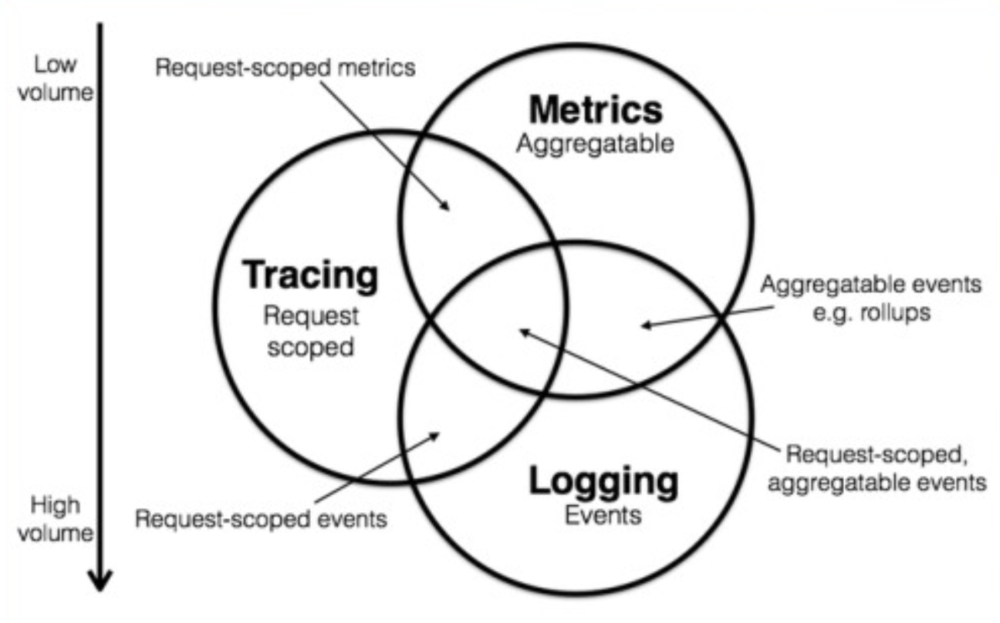
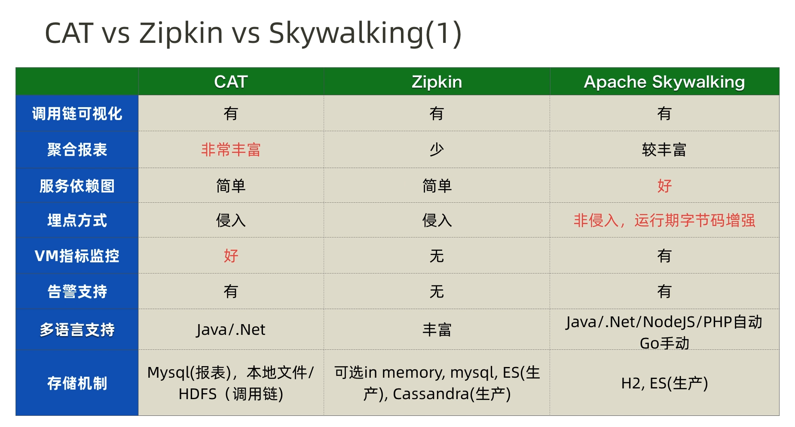
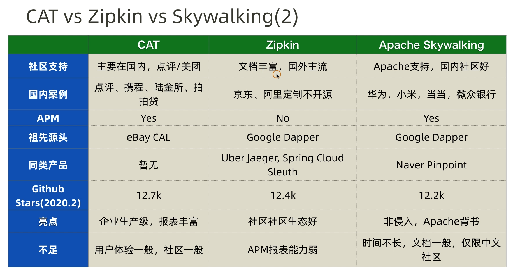
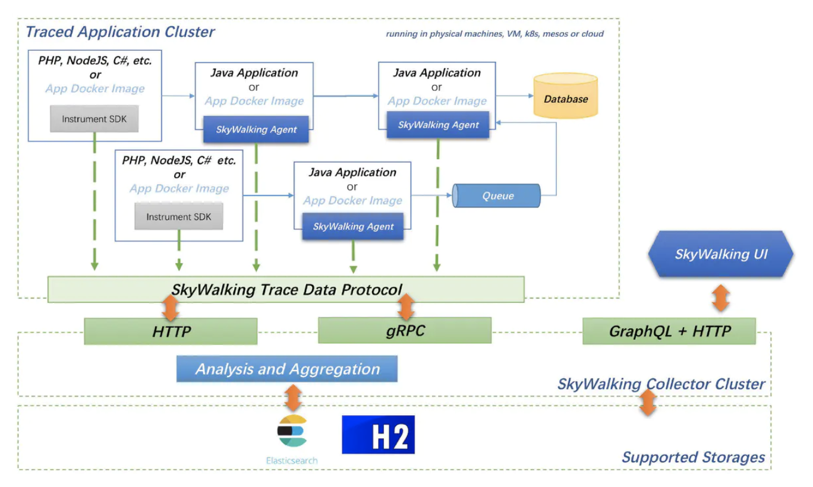

<!-- TOC -->

- [监控对象](#监控对象)
    - [数据维度](#数据维度)
    - [业务维度](#业务维度)
- [APM 工具对比](#apm-工具对比)
- [skywalking 部署架构](#skywalking-部署架构)

<!-- /TOC -->

# 监控对象

## 数据维度

从数据类型划分，大体可分为：

- 日志（logs）：自动埋点/手动埋点
- 指标监控(metrics)：服务、端点、实例的各项指标
- 调用链(tracing): 同一 TraceId 的调用序列

## 业务维度

从业务角度划分，可分为：

- 基础资源监控
    - 服务器监控：cpu、内存、磁盘 IO、网络 IO、本地磁盘
    - 网络监控
        - 设备监控：主要针对数据中心内的多种网络设备进行监控。包括路由器，防火墙和交换机等硬件设备，可以通过 snmp 等协议收集数据。
        - 网络性能监控：主要涉及网络监测，网络实时流量监控（网络延迟、访问量、成功率）和历史数据统计、汇总和历史数据分析等功能。
        - 网络安全检测：主要针对内网或者外网的网络攻击。如DDoS攻击。通过分析异常流量来确定网络攻击行为。
    - 存储监控
        - 存储设备监控：对于构建在 x86 服务器上的存储设备，设备监控通过每个存储节点上的采集器统一收集磁盘、SSD、网卡等设备信息；存储厂商以黑盒方式提供商业存储设备，通常自带监控功能，可监控设备的运行状态，性能和容量的。
        - 存储性能监控：存储通常监控块的读写速率，IOPS。读写延迟，磁盘用量等；文件存储通常监控文件系统 inode。读写速度、目录权限等。
        - 存储系统监控：不同的存储系统有不同的指标，例如，对于 ceph 存储需要监控 OSD, MON 的运行状态，各种状态 pg 的数量以及集群 IOPS 等信息。
- 中间件监控：kafka Db Redis Zk 等依赖项的性能
- 应用程序监控（APM）

Prometheus 既适合系统层的监控，也适合应用层监控。但是不适合做应用程序 APM。因为 APM 包括应用程序的运行状态监控，性能监控，日志监控及调用链跟踪等的监控。

应用程序监控工具除了有 Pinpoint，还有 Twitter 开源的 Zipkin，Apache SkyWalking，美团开源的 CAT等。

# APM 工具对比

# skywalking 部署架构

