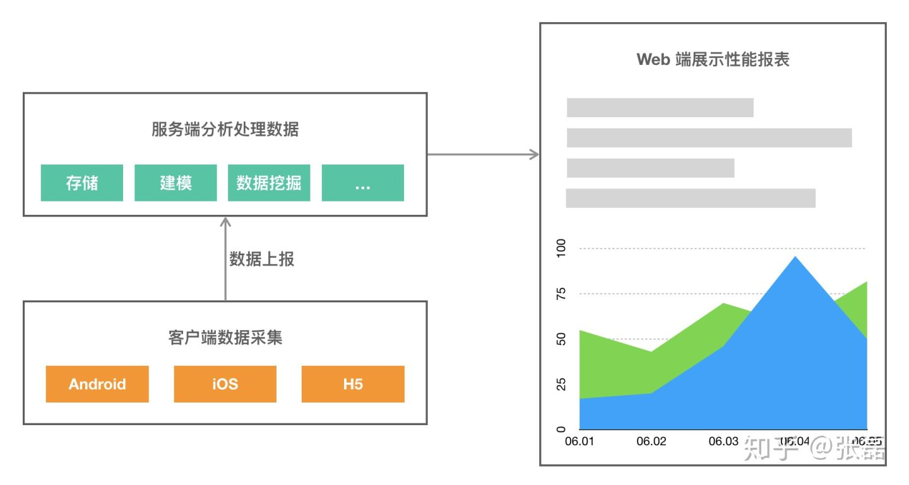
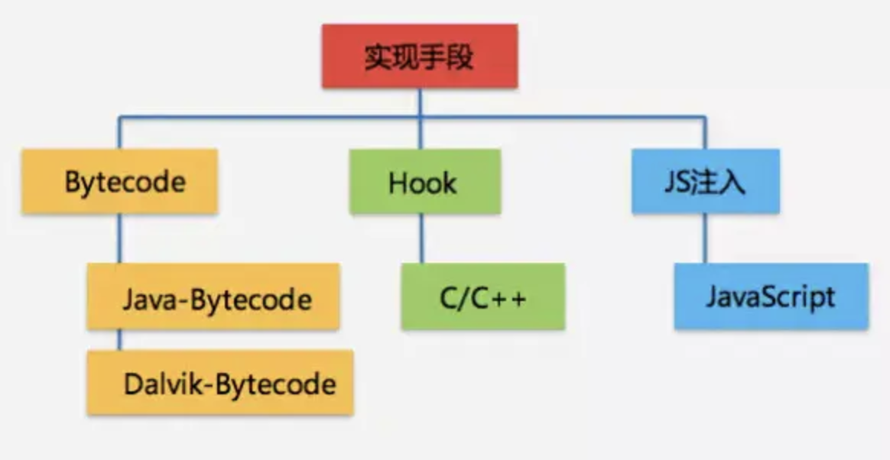
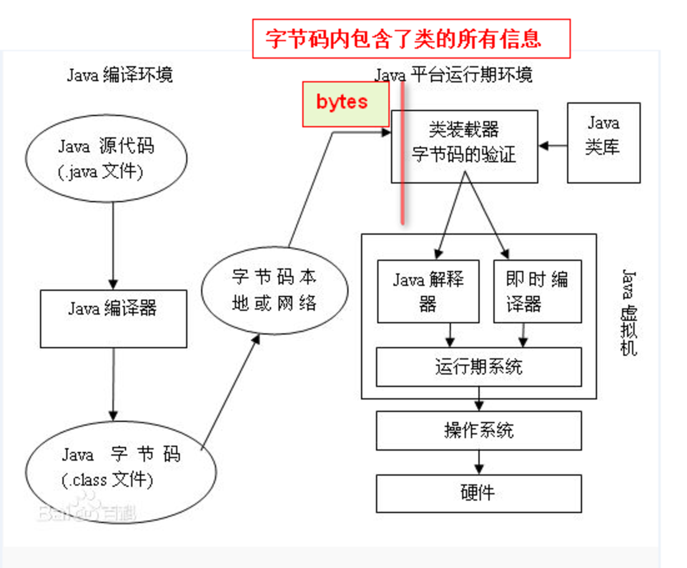
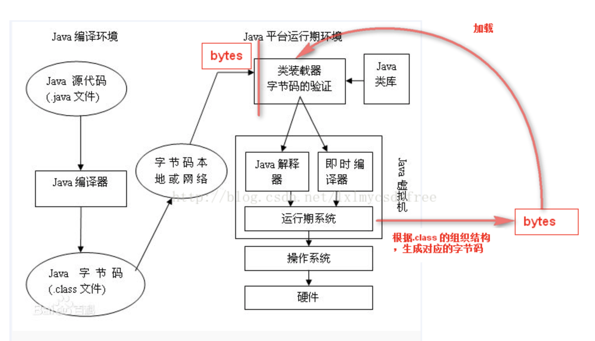
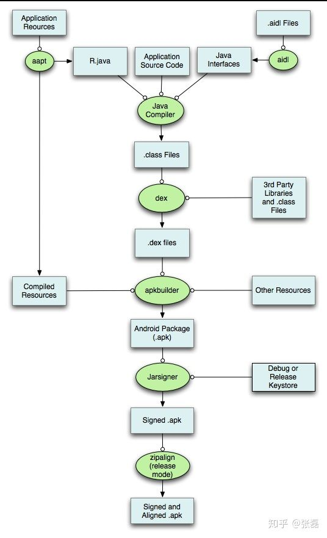
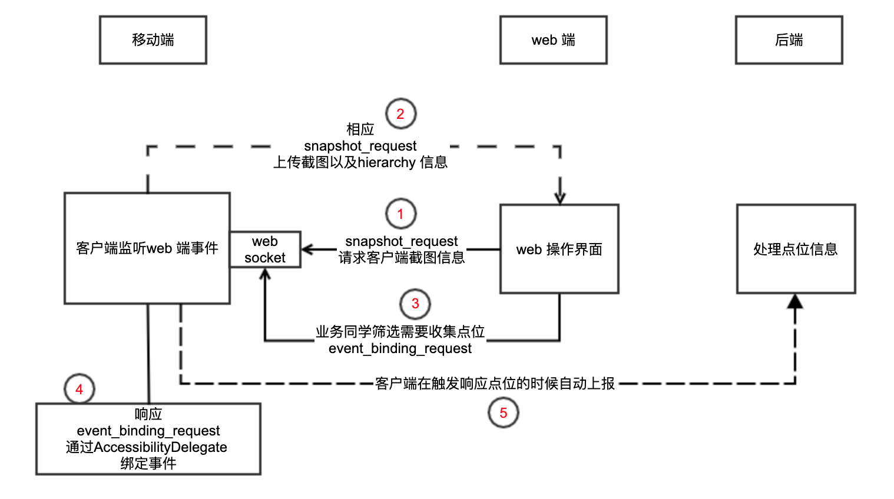
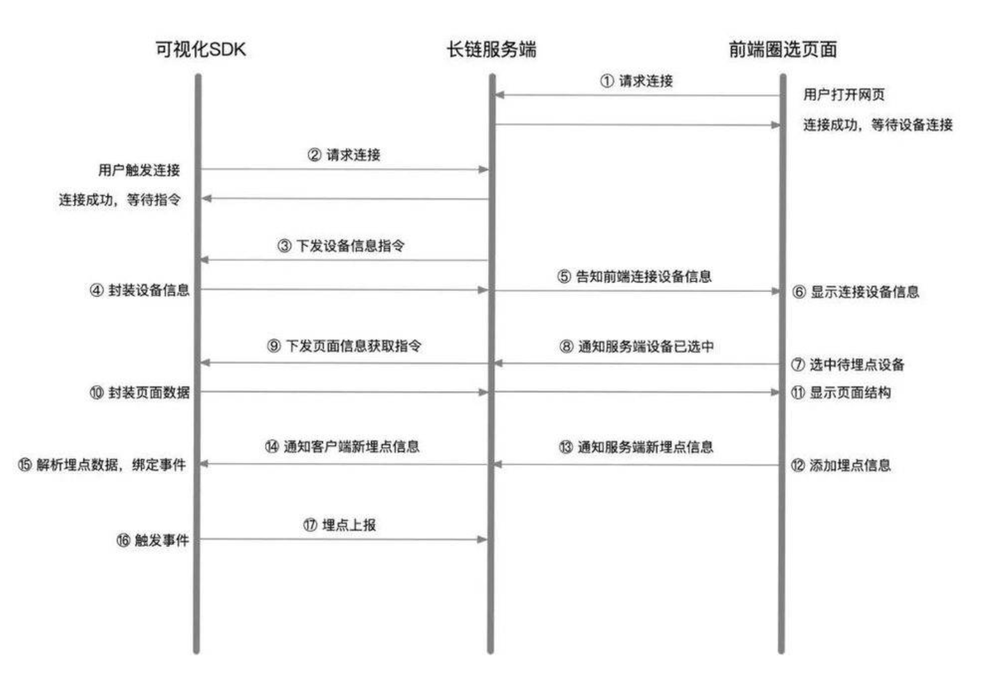

<!-- TOC -->

- [移动应用端 APM 原理](#移动应用端-apm-原理)
    - [技术方案](#技术方案)
    - [什么是埋点](#什么是埋点)
    - [客户端埋点框架组成](#客户端埋点框架组成)
    - [采集点位方案](#采集点位方案)
        - [手动埋点](#手动埋点)
        - [无埋点](#无埋点)
            - [采集事件](#采集事件)
            - [埋点方法](#埋点方法)
        - [可视化埋点](#可视化埋点)
        - [埋点方案总结](#埋点方案总结)

<!-- /TOC -->

<a id="markdown-移动应用端-apm-原理" name="移动应用端-apm-原理"></a>
# 移动应用端 APM 原理

移动应用端 APM 工作流程基本都是一致的：

1. 首先在客户端（Android、iOS、Web 等）采集数据；
2. 接着将采集到的数据整理上报到服务器；
3. 服务器接收到数据后建模、存储、挖掘分析，让后将数据可视化，供用户使用。



<a id="markdown-技术方案" name="技术方案"></a>
## 技术方案



其中数据采集是整个 APM 框架的核心。数据采集和上报主要通过客户端埋点来实现。

<a id="markdown-什么是埋点" name="什么是埋点"></a>
## 什么是埋点

埋点是数据领域的专业术语，它的学名叫事件追踪，对应的英文是 Event Tracking。它主要是针对特定用户行为或事件进行捕获、处理和发送的相关技术及其实施过程。

<a id="markdown-客户端埋点框架组成" name="客户端埋点框架组成"></a>
## 客户端埋点框架组成

一套成熟的客户端打点框架由下面3部分组成。

- 采集点位
- 存储点位
- 发送点位

客户端打点的流程：收集用户行为数据->存储数据->发送数据。先存储数据的原因是为了防止网络失败遗失点位。存储点位和发送点位跟 App 中使用的存储框架和网络框架保持一致最好。接下来主要讲下采集点位部分。

<a id="markdown-采集点位方案" name="采集点位方案"></a>
## 采集点位方案

采集点位的方案可以总结为三种：手动埋点、可视化埋点、无埋点。

<a id="markdown-手动埋点" name="手动埋点"></a>
### 手动埋点

手动埋点，又叫埋点、代码埋点、侵入式埋点，最容易理解的一套埋点框架，在 “Web页面”或者 “App 源码”添加行为事件上报的代码。

优点：可以精准控制，设置自定义属性、自定义事件，传递比较丰富的数据到服务端。

缺点：
1. 每一个控件的埋点都需要添加相应的代码，不仅工作量大，而且限定了必须是技术人员才能完成；
2. 每一次更新埋点方案，都必须改代码，然后通过各个应用市场进行分发，并且总会有相当多数量的用户不喜欢更新 APP，这样埋点代码也就得不到更新了；
3. 客户端上报埋点数据传输时效性和可靠性的问题，这个问题只能通过在后端收集数据来解决。

<a id="markdown-无埋点" name="无埋点"></a>
### 无埋点

无埋点，又叫全埋点，对应的英文是 Codeless Tracking，只需要研发人员集成采集 SDK，不需要写埋点代码。采集 SDK 直接捕捉和监测用户在应用里的所有行为，并全部上报。所以，与其说它们是不需要埋点，还不如说是SDK 帮应用开发者完成了『处处埋点』的繁琐工作。

优点：
1. 由于采集的是全量数据，所以产品迭代过程中是不需要关注埋点逻辑的，也不会出现漏埋、误埋等现象。
2. 无埋点方式因为收集的是全量数据，可以大大减少运营和产品的试错成本，试错的可能性高了，可以带来更多启发性的信息。
3. 无需开发，应用开发人员集成埋点 SDK 即可。

缺点：
1. 上报的数据量比埋点大很多，里面可能很多是没有价值的数据。
2. 不能灵活地自定义属性。
3. 传输时效性和数据可靠性欠佳。
4. 由于所有的控件事件都全部搜集，会给服务器和网络传输带来更大的负载。

<a id="markdown-采集事件" name="采集事件"></a>
#### 采集事件

全埋点采集的事件主要包括下面四种:
- $AppStart 事件：指 App 启动，包括冷启动和热启动。
- $AppEnd 事件：指 App 退出，包括正常退出、进入后台、 App 崩溃、App 被强杀。
- $AppViewScreen 事件：指 App 页面浏览 ，对于 Android 来说，就是指切换 Activity。
- $AppClick 事件:指 App 控件被点击。

在采集的这四种事件当中，最重要并且采集难度最大的是 $AppClick 事件。所以，全埋点基本上也都是围绕着如何采集 $AppClick 事件。

全埋点的整体解决思路，就是要找到那个被点击的 View 的点击处理逻辑(也叫原处理逻辑)，然后利用一定的技术原理，对原处理逻辑进行“拦截”，或者在原处理逻辑的前面或者后面“插入”相应的埋点代码，从而达到自动埋点的效果。

至于如何做到自动“拦截” View 的原点击处理逻辑，一般都是参考 Android 系统 View （控件）点击事件处理机制来进行的。 至于如何做到自动“插入”埋点代码，基本上都是参考编译器对 Java 代码的处理流程来进行的即:

```
JavaCode --> .java --> .class --> .dex
```

选择在不同的处理阶段“插入”代码，其所用的技术或者原理也不尽相同，所以全埋点的解决方案也是多种多样的。

在选择全埋点的方案时，需要从效率、兼容性、扩展性等 方面综合考虑。

全埋点的基本原理，其实就是利用某些技术对某些方法 (View 被点击时的处理逻辑)进行代理(或者叫 Hook)，或者“插入”代码，按照“在什么时候去代理或者插入代码” 这个条件来区分的话，Android 全埋点技术：

- 静态代理：直接在 App 编译期间插入代理类。

- 动态代理：在 App 编译期间插入 Hook（或者代理框架），利用 Java 反射机制在运行期间动态生成代理类。反射机制是比较耗时间和耗内存的。

对于 App 业务代理，一般采用静态代理方式对业务的影响比较小；但是对于第三方 Lib 库，因为我们不建议给第三方 Lib 库插入代理逻辑，所以一般会采用动态代理方法。

静态代理：



动态代理：



<a id="markdown-埋点方法" name="埋点方法"></a>
#### 埋点方法

在编译期间“插入”或者修改代码（.class 文 件）的方法：

- AspectJ：切面编程（AOP），编译期插入埋点代码
- AST：编译期操作 AST 修改源代码
- ASM：编译期修改字节码插入埋点代码
- javassist：编译期修改字节码插入埋点代码

这几种方式处理的时机可以参考下图：


结合 APK 打包流程来分析一下：



一个 App 的所有 class 文件，包括第三方的 class 文件都会经过 dex 的过程打包成一个或者多个 dex 文件。

这其中涉及到两个很关键的环节：

1. javac：将 .java 格式的源代码文件编译成 class 文件；
2. dex: 将 class 格式的文件打包汇总，组成一个或者多个 dex 文件。

我们想要对字节码进行修改，只需要在 javac 之后 dex 之前遍历所有的字节码文件，并按照一定的规则过滤修改就好了，这里便是字节码插桩的入口。

那么我们到底如何介入打包过程，在 class 转换为 dex 文件的时候实现对字节码的修改呢？

答案是 **transform api**。Android Gradle Plugin 1.5.0 及以上版本，Google 官方提供了 transform api 作为字节码插桩的入口，允许第三方 Plugin 在打包 dex 文件之前的编译过程中操作 .class 文件。我们只需要实现一个自定义的 Gradle Plugin，然后在编译阶段去修改字节码文件。

**注:**Android Studio 是一个为 Android 平台开发程序的集成开发环境。Android Studio 构建系统以 Gradle 为基础，并且 Android Gradle Plugin 添加了几项专用于构建 Android 应用的功能。

找到了插桩入口，接下来就要对字节码进行修改。对于字节码的修改，比较常用的框架有 Javassist 和 ASM。

- Javassist 是一个开源的分析、编辑和创建 Java 字节码的类库，它提供了源码级别的 API 以及字节码级别的 API，源码级别的 API，直接使用 Java 编码的形式，而不需要深入了解虚拟机指令，就能动态改变类的结构或者动态生成类。

- ASM 是一个 Java 字节码操控框架。它能被用来动态生成类或者增强既有类的功能。ASM 可以直接产生二进制 class 文件，也可以在类被加载入 Java 虚拟机之前动态改变类行为。

ASM 和 Javassit 相比，API 贴近底层，比较难使用，需要对 Java 字节码和虚拟机方面有一定程度的了解。ASM 的优点就在于性能上的优势，且更加灵活；Javassist 的实现中大量使用的反射，所以性能偏低。

简单的说就是 ASM 虽然难以使用，但是功能强大效率高。是很多无痕埋点、 APM 框架的首选方案。

<a id="markdown-可视化埋点" name="可视化埋点"></a>
### 可视化埋点

可视化埋点是指开发同学集成采集 SDK 后，不再需要额外操作。后续由业务同学去下发需要收集的点位。采集方式跟无埋点类似，但是可以过滤冗余点位。



可视化埋点需要实现从前端展示、埋点圈选、事件捕获、数据上报的全流程可视化，满足界面交互相关的大部分数据统计需求。下面这张图概述了在埋点阶段各端的配合流程：



APP 嵌入的可视化功能的 SDK 通过 WebSocket 的方式和服务器进行通信。

<a id="markdown-埋点方案总结" name="埋点方案总结"></a>
### 埋点方案总结

| 埋点方案 | 准确性 | 开发成本 | 维护成本 | 灵活性(打点覆盖面、冗余打点) |
| --- | --- | --- | --- | --- |
| 手动埋点 | 中(需要测试阶段保证数据准确性) | 中 | 高(需要跟版本迭代打点) | 高 |
| 无埋点 | 高 |	中 | 低	| 中(可能存在大量冗余数据) |
| 可视化埋点 | 高 | 高 | 低 | 中(打点功能受限，比如分享成功打点) |
