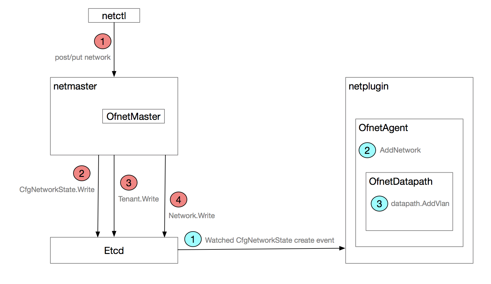
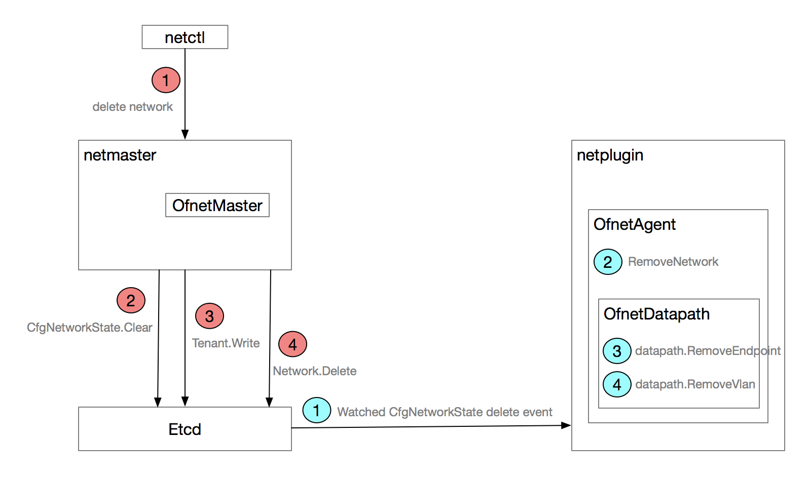

# network create

```
NAME:
   netctl network create - Create a network

USAGE:
   netctl network create [command options] [network]

OPTIONS:
   --tenant, -t "default"   Name of the tenant
   --nw-type, -n "data"     Network Type (infra or data)
   --encap, -e "vxlan"      Encap type (vlan or vxlan)
   --pkt-tag, -p "0"        Packet tag (Vlan ID/VNI)
   --subnet, -s         Subnet CIDR - REQUIRED
   --gateway, -g        Gateway
   --subnetv6, --s6         IPv6 Subnet CIDR
   --gatewayv6, --g6        IPv6 Gateway
   --nw-tag, --tag      Configured Network Tag
```



## netmaster 流程

### httpCreateNetwork

**contivmodel/contivModel.go**

// CREATE REST call
func httpCreateNetwork(w http.ResponseWriter, r *http.Request, vars map[string]string) (interface{}, error) {
    var obj Network
    key := vars["key"]

    // Get object from the request
    err := json.NewDecoder(r.Body).Decode(&obj)
    if err != nil {
        log.Errorf("Error decoding network create request. Err %v", err)
        return nil, err
    }

    // set the key
    obj.Key = key

    // Create the object
    err = CreateNetwork(&obj)

    // Return the obj
    return obj, nil
}

// Create a network object
func CreateNetwork(obj *Network) error {
    // Validate parameters
    err := ValidateNetwork(obj)

    // Check if we handle this object
    if objCallbackHandler.NetworkCb == nil {
        log.Errorf("No callback registered for network object")
        return errors.New("Invalid object type")
    }

    saveObj := obj

    collections.networkMutex.Lock()
    key := collections.networks[obj.Key]
    collections.networkMutex.Unlock()

    // Check if object already exists
    if key != nil {
        // Perform Update callback
        err = objCallbackHandler.NetworkCb.NetworkUpdate(collections.networks[obj.Key], obj)
        if err != nil {
            log.Errorf("NetworkUpdate retruned error for: %+v. Err: %v", obj, err)
            return err
        }

        // save the original object after update
        collections.networkMutex.Lock()
        saveObj = collections.networks[obj.Key]
        collections.networkMutex.Unlock()
    } else {
        // save it in cache
        collections.networkMutex.Lock()
        collections.networks[obj.Key] = obj
        collections.networkMutex.Unlock()

        // Perform Create callback
        err = objCallbackHandler.NetworkCb.NetworkCreate(obj)
        if err != nil {
            log.Errorf("NetworkCreate retruned error for: %+v. Err: %v", obj, err)
            collections.networkMutex.Lock()
            delete(collections.networks, obj.Key)
            collections.networkMutex.Unlock()
            return err
        }
    }

    // Write it to modeldb
    collections.networkMutex.Lock()
    err = saveObj.Write() // Network 结构写入 etcd
    collections.networkMutex.Unlock()
    if err != nil {
        log.Errorf("Error saving network %s to db. Err: %v", saveObj.Key, err)
        return err
    }

    return nil
}

**netmaster/objApi/apiController.go**

检测 network 配置的合法性

// NetworkCreate creates network
func (ac *APIController) NetworkCreate(network *contivModel.Network) error {

    tenant := contivModel.FindTenant(network.TenantName)

    for key := range tenant.LinkSets.Networks {
        networkDetail := contivModel.FindNetwork(key)
        if networkDetail == nil {
            log.Errorf("Network key %s not found", key)
            return fmt.Errorf("network key %s not found", key)
        }

        // Check for overlapping subnetv6 if existing and current subnetv6 is non-empty
        if network.Ipv6Subnet != "" && networkDetail.Ipv6Subnet != "" {
            flagv6 := netutils.IsOverlappingSubnetv6(network.Ipv6Subnet, networkDetail.Ipv6Subnet)
            if flagv6 == true {
                log.Errorf("Overlapping of Subnetv6 Networks")
                return errors.New("network " + networkDetail.NetworkName + " conflicts with subnetv6  " + network.Ipv6Subnet)
            }
        }

        // Check for overlapping subnet if existing and current subnet is non-empty
        if network.Subnet != "" && networkDetail.Subnet != "" {
            flag := netutils.IsOverlappingSubnet(network.Subnet, networkDetail.Subnet)
            if flag == true {
                log.Errorf("Overlapping of Networks")
                return errors.New("network " + networkDetail.NetworkName + " conflicts with subnet " + network.Subnet)
            }
        }
    }

    // If there is an EndpointGroup with the same name as this network, reject.
    nameClash := contivModel.FindEndpointGroup(network.Key)
    if nameClash != nil {
        return core.Errorf("EndpointGroup %s conflicts with the network name",
            nameClash.GroupName)
    }

    // Get the state driver
    stateDriver, err := utils.GetStateDriver()
    if err != nil {
        return err
    }

    // Build network config
    networkCfg := intent.ConfigNetwork{
        Name:           network.NetworkName,
        NwType:         network.NwType,
        PktTagType:     network.Encap,
        PktTag:         network.PktTag,
        SubnetCIDR:     network.Subnet,
        Gateway:        network.Gateway,
        IPv6SubnetCIDR: network.Ipv6Subnet,
        IPv6Gateway:    network.Ipv6Gateway,
        CfgdTag:        network.CfgdTag,
    }

    // Create the network
    err = master.CreateNetwork(networkCfg, stateDriver, network.TenantName)
    if err != nil {
        log.Errorf("Error creating network {%+v}. Err: %v", network, err)
        return err
    }

    // Setup links
    modeldb.AddLink(&network.Links.Tenant, tenant)
    modeldb.AddLinkSet(&tenant.LinkSets.Networks, network)

    // Save the tenant too since we added the links
    err = tenant.Write()
    if err != nil {
        log.Errorf("Error updating tenant state(%+v). Err: %v", tenant, err)
        return err
    }

    return nil
}

**netmaster/master/network.go**

// CreateNetwork creates a network from intent
func CreateNetwork(network intent.ConfigNetwork, stateDriver core.StateDriver, tenantName string) error {
    var extPktTag, pktTag uint

    gstate.GlobalMutex.Lock()
    defer gstate.GlobalMutex.Unlock()
    gCfg := gstate.Cfg{}
    gCfg.StateDriver = stateDriver
    err := gCfg.Read("")

    // Create network state
    networkID := network.Name + "." + tenantName
    nwCfg := &mastercfg.CfgNetworkState{}
    nwCfg.StateDriver = stateDriver
    if nwCfg.Read(networkID) == nil {
        // TODO: check if parameters changed and apply an update if needed
        return nil
    }

    subnetIP, subnetLen, _ := netutils.ParseCIDR(network.SubnetCIDR)
    err = netutils.ValidateNetworkRangeParams(subnetIP, subnetLen)
    if err != nil {
        return err
    }

    ipv6Subnet, ipv6SubnetLen, _ := netutils.ParseCIDR(network.IPv6SubnetCIDR)

    // if there is no label given generate one for the network
    nwTag := network.CfgdTag
    if nwTag == "" {
        nwTag = network.Name + "." + tenantName
    }

    // construct and update network state
    nwCfg = &mastercfg.CfgNetworkState{
        Tenant:        tenantName,
        NetworkName:   network.Name,
        NwType:        network.NwType,
        PktTagType:    network.PktTagType,
        SubnetIP:      subnetIP,
        SubnetLen:     subnetLen,
        IPv6Subnet:    ipv6Subnet,
        IPv6SubnetLen: ipv6SubnetLen,
        NetworkTag:    nwTag,
    }

    nwCfg.ID = networkID
    nwCfg.StateDriver = stateDriver

    netutils.InitSubnetBitset(&nwCfg.IPAllocMap, nwCfg.SubnetLen)
    subnetAddr := netutils.GetSubnetAddr(nwCfg.SubnetIP, nwCfg.SubnetLen)
    nwCfg.SubnetIP = subnetAddr
    nwCfg.IPAddrRange = netutils.GetIPAddrRange(subnetIP, subnetLen)

    if network.Gateway != "" {
        nwCfg.Gateway = network.Gateway

        // Reserve gateway IP address if gateway is specified
        ipAddrValue, err := netutils.GetIPNumber(subnetAddr, nwCfg.SubnetLen, 32, nwCfg.Gateway)
        if err != nil {
            log.Errorf("Error parsing gateway address %s. Err: %v", nwCfg.Gateway, err)
            return err
        }
        nwCfg.IPAllocMap.Set(ipAddrValue)
    }

    if strings.Contains(subnetIP, "-") {
        netutils.SetBitsOutsideRange(&nwCfg.IPAllocMap, subnetIP, subnetLen)
    }

    if network.IPv6Gateway != "" {
        nwCfg.IPv6Gateway = network.IPv6Gateway

        // Reserve gateway IPv6 address if gateway is specified
        hostID, err := netutils.GetIPv6HostID(nwCfg.IPv6Subnet, nwCfg.IPv6SubnetLen, nwCfg.IPv6Gateway)
        if err != nil {
            log.Errorf("Error parsing gateway address %s. Err: %v", nwCfg.IPv6Gateway, err)
            return err
        }
        netutils.ReserveIPv6HostID(hostID, &nwCfg.IPv6AllocMap)
    }

    // Allocate pkt tags
    reqPktTag := uint(network.PktTag)
    if nwCfg.PktTagType == "vlan" {
        pktTag, err = gCfg.AllocVLAN(reqPktTag)
        if err != nil {
            return err
        }
    } else if nwCfg.PktTagType == "vxlan" {
        extPktTag, pktTag, err = gCfg.AllocVXLAN(reqPktTag)
        if err != nil {
            return err
        }
    }

    nwCfg.ExtPktTag = int(extPktTag)
    nwCfg.PktTag = int(pktTag)

    err = nwCfg.Write()

    return nil
}

## netplugin 流程

### handleNetworkEvents

侦听 CfgNetworkState 事件，并调用 processStateEvent 处理

func handleNetworkEvents(netPlugin *plugin.NetPlugin, opts core.InstanceInfo, retErr chan error) {
    rsps := make(chan core.WatchState)
    go processStateEvent(netPlugin, opts, rsps)
    cfg := mastercfg.CfgNetworkState{}
    cfg.StateDriver = netPlugin.StateDriver
    retErr <- cfg.WatchAll(rsps)
    log.Errorf("Error from handleNetworkEvents")
}

### processStateEvent 处理 CfgNetworkState 事件

**netplugin/agent/state_event.go**

func processStateEvent(netPlugin *plugin.NetPlugin, opts core.InstanceInfo, rsps chan core.WatchState) {
    for {
        // block on change notifications
        rsp := <-rsps

        // For now we deal with only create and delete events
        currentState := rsp.Curr
        isDelete := false
        eventStr := "create"
        if rsp.Curr == nil {
            currentState = rsp.Prev
            isDelete = true
            eventStr = "delete"
        } else if rsp.Prev != nil {
            // Ignore modify event on network state
            if nwCfg, ok := currentState.(*mastercfg.CfgNetworkState); ok {
                log.Debugf("Received a modify event on network %q, ignoring it", nwCfg.ID)
                continue
            }

        }

        if nwCfg, ok := currentState.(*mastercfg.CfgNetworkState); ok {
            log.Infof("Received %q for network: %q", eventStr, nwCfg.ID)
            if isDelete != true {
                processNetEvent(netPlugin, nwCfg, isDelete, opts)
            } else {
                processNetEvent(netPlugin, nwCfg, isDelete, opts)
            }
        }
    }
}

### processNetEvent 处理 CfgNetworkState 事件

**netplugin/agent/state_event.go**

func processNetEvent(netPlugin *plugin.NetPlugin, nwCfg *mastercfg.CfgNetworkState,
    isDelete bool, opts core.InstanceInfo) (err error) {
    // take a lock to ensure we are programming one event at a time.
    // Also network create events need to be processed before endpoint creates
    // and reverse shall happen for deletes. That order is ensured by netmaster,
    // so we don't need to worry about that here

    gwIP := ""
    route := fmt.Sprintf("%s/%d", nwCfg.SubnetIP, nwCfg.SubnetLen)
    if nwCfg.NwType != "infra" && nwCfg.PktTagType == "vxlan" {
        gwIP, _ = getVxGWIP(netPlugin, nwCfg.Tenant, opts.HostLabel)
    }
    operStr := ""
    if isDelete {
        err = netPlugin.DeleteNetwork(nwCfg.ID, route, nwCfg.NwType, nwCfg.PktTagType, nwCfg.PktTag, nwCfg.ExtPktTag,
            nwCfg.Gateway, nwCfg.Tenant)
        operStr = "delete"
        if err == nil && gwIP != "" {
            netutils.DelIPRoute(route, gwIP)
        }
    } else {
        err = netPlugin.CreateNetwork(nwCfg.ID)
        operStr = "create"
        if err == nil && gwIP != "" {
            netutils.AddIPRoute(route, gwIP)
        }
    }

    return
}

### CreateNetwork

**netplugin/plugin/netplugin.go**

// CreateNetwork creates a network for a given ID.
func (p *NetPlugin) CreateNetwork(id string) error {
    p.Lock()
    defer p.Unlock()
    return p.NetworkDriver.CreateNetwork(id)
}

**drivers/ovsd/ovsSwitch.go**

// CreateNetwork creates a new network/vlan
func (sw *OvsSwitch) CreateNetwork(pktTag uint16, extPktTag uint32, defaultGw string, Vrf string) error {
    // Add the vlan/vni to ofnet
    if sw.ofnetAgent != nil {
        err := sw.ofnetAgent.AddNetwork(pktTag, extPktTag, defaultGw, Vrf)
        if err != nil {
            log.Errorf("Error adding vlan/vni %d/%d. Err: %v", pktTag, extPktTag, err)
            return err
        }
    }
    return nil
}

**ofnet/ofnetAgent.go**

// Add a Network.
// This is mainly used for mapping vlan id to Vxlan VNI and add gateway for network
func (self *OfnetAgent) AddNetwork(vlanId uint16, vni uint32, Gw string, Vrf string) error {

    log.Infof("Received Add Network for  Vlan %d. Vni %d Gw %s Vrf %s", vlanId, vni, Gw, Vrf)
    // if nothing changed, ignore the message
    self.vlanVniMutex.Lock()
    oldVni, ok := self.vlanVniMap[vlanId]
    if ok && *oldVni == vni {
        self.vlanVniMutex.Unlock()
        return nil
    }

    // store it in DB
    self.vlanVniMap[vlanId] = &vni
    self.vniVlanMap[vni] = &vlanId
    self.vlanVniMutex.Unlock()
    // Call the datapath
    err := self.datapath.AddVlan(vlanId, vni, Vrf)
    if err != nil {
        return err
    }

    self.vlanVrfMutex.RLock()
    vrf := self.vlanVrf[vlanId]
    self.vlanVrfMutex.RUnlock()

    gwEpid := self.GetEndpointIdByIpVrf(net.ParseIP(Gw), *vrf)

    if Gw != "" && self.fwdMode == "routing" {
        // Call the datapath
        epreg := &OfnetEndpoint{
            EndpointID: gwEpid,
            IpAddr:     net.ParseIP(Gw),
            IpMask:     net.ParseIP("255.255.255.255"),
            Vrf:        *vrf,
            Vni:        vni,
            Vlan:       vlanId,
            PortNo:     0,
            Timestamp:  time.Now(),
        }
        self.setInternal(epreg)
        self.endpointDb.Set(gwEpid, epreg)
        // increment stats
    }
    self.incrStats("AddNetwork")

    return nil
}

# network delete

```
NAME:
   netctl network rm - Delete a network

USAGE:
   netctl network rm [command options] [network]

OPTIONS:
   --tenant, -t "default"   Name of the tenant
```

只有 network 内不在关联有 endpointgroup 和 servicelb ，并且该 network 不再有 active 的 endpoint，这时候才能允许删除。



### httpDeleteNetwork

**contivmodel/contivModel.go**

// DELETE rest call
func httpDeleteNetwork(w http.ResponseWriter, r *http.Request, vars map[string]string) (interface{}, error) {
    log.Debugf("Received httpDeleteNetwork: %+v", vars)

    key := vars["key"]

    // Delete the object
    err := DeleteNetwork(key)
    if err != nil {
        log.Errorf("DeleteNetwork error for: %s. Err: %v", key, err)
        return nil, err
    }

    // Return the obj
    return key, nil
}

// Delete a network object
func DeleteNetwork(key string) error {
    collections.networkMutex.Lock()
    obj := collections.networks[key]
    collections.networkMutex.Unlock()

    // Perform callback
    err := objCallbackHandler.NetworkCb.NetworkDelete(obj)
    if err != nil {
        log.Errorf("NetworkDelete retruned error for: %+v. Err: %v", obj, err)
        return err
    }

    // delete it from modeldb
    collections.networkMutex.Lock()
    err = obj.Delete()
    collections.networkMutex.Unlock()
    if err != nil {
        log.Errorf("Error deleting network %s. Err: %v", obj.Key, err)
    }

    // delete it from cache
    collections.networkMutex.Lock()
    delete(collections.networks, key)
    collections.networkMutex.Unlock()

    return nil
}

**netmaster/objApi/apiController.go**

// NetworkDelete deletes network
func (ac *APIController) NetworkDelete(network *contivModel.Network) error {
    log.Infof("Received NetworkDelete: %+v", network)

    // Find the tenant
    tenant := contivModel.FindTenant(network.TenantName)

    // if the network has associated epgs, fail the delete
    epgCount := len(network.LinkSets.EndpointGroups)
    if epgCount != 0 {
        return core.Errorf("cannot delete %s has %d endpoint groups",
            network.NetworkName, epgCount)
    }

    svcCount := len(network.LinkSets.Servicelbs)
    if svcCount != 0 {
        return core.Errorf("cannot delete %s has %d services ",
            network.NetworkName, svcCount)
    }

    // Remove link
    modeldb.RemoveLinkSet(&tenant.LinkSets.Networks, network)

    // Get the state driver
    stateDriver, err := utils.GetStateDriver()
    if err != nil {
        return err
    }

    // Delete the network
    networkID := network.NetworkName + "." + network.TenantName
    err = master.DeleteNetworkID(stateDriver, networkID)
    if err != nil {
        log.Errorf("Error deleting network %s. Err: %v", network.NetworkName, err)
        return err
    }

    // Save the tenant too since we removed the links
    return tenant.Write()
}

**netmaster/master/network.go**

// DeleteNetworkID removes a network by ID.
func DeleteNetworkID(stateDriver core.StateDriver, netID string) error {
    nwCfg := &mastercfg.CfgNetworkState{}
    nwCfg.StateDriver = stateDriver
    err := nwCfg.Read(netID)

    // Will Skip docker network deletion for ACI fabric mode.
    aci, _ := IsAciConfigured()

    if nwCfg.NwType != "infra" {
        // For Infra nw, endpoint delete initiated by netplugin
        // Check if there are any active endpoints
        if hasActiveEndpoints(nwCfg) {
            return core.Errorf("Error: Network has active endpoints")
        }

        if GetClusterMode() == core.Docker && aci == false {
            // Delete the docker network
            err = docknet.DeleteDockNet(nwCfg.Tenant, nwCfg.NetworkName, "")
            if err != nil {
                log.Errorf("Error deleting network %s. Err: %v", netID, err)
                // DeleteDockNet will fail when network has active endpoints.
                // No damage is done yet. It is safe to fail.
                return err
            }
        }
    }

    gstate.GlobalMutex.Lock()
    defer gstate.GlobalMutex.Unlock()
    gCfg := &gstate.Cfg{}
    gCfg.StateDriver = stateDriver
    err = gCfg.Read("")

    // Free resource associated with the network
    err = freeNetworkResources(stateDriver, nwCfg, gCfg)

    err = nwCfg.Clear()
    if err != nil {
        log.Errorf("error writing nw config. Error: %s", err)
        return err
    }

    return err
}

## netplugin 流程

### handleNetworkEvents -> processStateEvent 处理 CfgNetworkState 事件

### DeleteNetwork

**netplugin/plugin/netplugin.go**

// DeleteNetwork deletes a network provided by the ID.
func (p *NetPlugin) DeleteNetwork(id, subnet, nwType, encap string, pktTag, extPktTag int, Gw string, tenant string) error {
    p.Lock()
    defer p.Unlock()
    return p.NetworkDriver.DeleteNetwork(id, subnet, nwType, encap, pktTag, extPktTag, Gw, tenant)
}

**drivers/ovsd/ovsdriver.go**

// DeleteNetwork deletes a network by named identifier
func (d *OvsDriver) DeleteNetwork(id, subnet, nwType, encap string, pktTag, extPktTag int, gateway string, tenant string) error {
    log.Infof("delete net %s, nwType %s, encap %s, tags: %d/%d", id, nwType, encap, pktTag, extPktTag)

    // Find the switch based on network type
    var sw *OvsSwitch
    if encap == "vxlan" {
        sw = d.switchDb["vxlan"]
    } else {
        sw = d.switchDb["vlan"]
    }

    // Delete infra nw endpoint if present
    if nwType == "infra" {
        hostName, _ := os.Hostname()
        epID := id + "-" + hostName

        epOper := drivers.OperEndpointState{}
        epOper.StateDriver = d.oper.StateDriver
        err := epOper.Read(epID)
        if err == nil {
            err = sw.DeletePort(&epOper, true)
            if err != nil {
                log.Errorf("Error deleting endpoint: %+v. Err: %v", epOper, err)
            }
            epOper.Clear()
        }
    }

    return sw.DeleteNetwork(uint16(pktTag), uint32(extPktTag), gateway, tenant)
}

**drivers/ovsd/ovsSwitch.go**

// DeleteNetwork deletes a network/vlan
func (sw *OvsSwitch) DeleteNetwork(pktTag uint16, extPktTag uint32, gateway string, Vrf string) error {
    // Delete vlan/vni mapping
    if sw.ofnetAgent != nil {
        err := sw.ofnetAgent.RemoveNetwork(pktTag, extPktTag, gateway, Vrf)
        if err != nil {
            log.Errorf("Error removing vlan/vni %d/%d. Err: %v", pktTag, extPktTag, err)
            return err
        }
    }
    return nil
}

**ofnet/ofnetAgent.go**

// Remove a vlan from datapath
func (self *OfnetAgent) RemoveNetwork(vlanId uint16, vni uint32, Gw string, Vrf string) error {
    // Dont handle endpointDB operations during this time
    log.Infof("Received Remove Network for  Vlan %d. Vni %d Vrf:%s", vlanId, vni, Vrf)
    gwEpid := self.getEndpointIdByIpVlan(net.ParseIP(Gw), vlanId)

    self.endpointDb.Remove(gwEpid)

    // make sure there are no endpoints still installed in this vlan
    for endpoint := range self.endpointDb.IterBuffered() {
        ep := endpoint.Val.(*OfnetEndpoint)
        if (vni != 0) && (ep.Vni == vni) {
            if ep.OriginatorIp.String() == self.localIp.String() {
                log.Fatalf("Vlan %d still has routes. Route: %+v", vlanId, ep)
            } else if self.isInternal(ep) {
                // Network delete arrived before other hosts cleanup endpoint
                log.Warnf("Vlan %d still has routes, cleaning up. Route: %+v", vlanId, ep)
                // Uninstall the endpoint from datapath
                err := self.datapath.RemoveEndpoint(ep)
                if err != nil {
                    log.Errorf("Error deleting endpoint: {%+v}. Err: %v", ep, err)
                }

                // Remove it from endpoint table
                self.endpointDb.Remove(ep.EndpointID)
            }
        }
    }
    // Clear the database
    self.vlanVniMutex.Lock()
    delete(self.vlanVniMap, vlanId)
    delete(self.vniVlanMap, vni)
    self.vlanVniMutex.Unlock()
    // increment stats
    self.incrStats("RemoveNetwork")

    // Call the datapath
    return self.datapath.RemoveVlan(vlanId, vni, Vrf)
}

