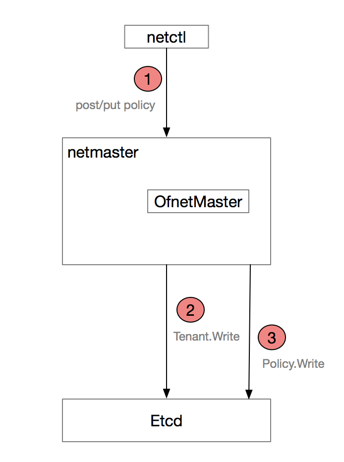
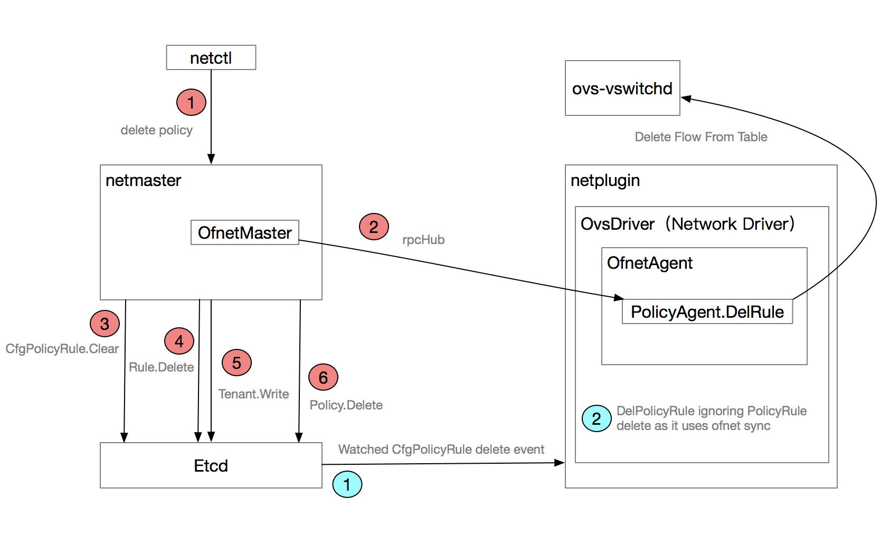

# policy create

```
NAME:
   netctl policy create - Create a new policy

USAGE:
   netctl policy create [command options] [policy]

OPTIONS:
   --tenant, -t "default"   Name of the tenant
```



## netmaster 流程

```
NAME:
   netctl policy create - Create a new policy

USAGE:
   netctl policy create [command options] [policy]

OPTIONS:
   --tenant, -t "default"   Name of the tenant
```

**contivModel/contivModelClient.go**

// Policy object
type Policy struct {
    // every object has a key
    Key string `json:"key,omitempty"`

    PolicyName string `json:"policyName,omitempty"` // Policy Name
    TenantName string `json:"tenantName,omitempty"` // Tenant Name

    // add link-sets and links
    LinkSets PolicyLinkSets `json:"link-sets,omitempty"`
    Links    PolicyLinks    `json:"links,omitempty"`
}

### httpCreatePolicy

**contivModel/contivModel.go**

// CREATE REST call
func httpCreatePolicy(w http.ResponseWriter, r *http.Request, vars map[string]string) (interface{}, error) {
    log.Debugf("Received httpGetPolicy: %+v", vars)

    var obj Policy
    key := vars["key"]

    // Get object from the request
    err := json.NewDecoder(r.Body).Decode(&obj)
    if err != nil {
        log.Errorf("Error decoding policy create request. Err %v", err)
        return nil, err
    }

    // set the key
    obj.Key = key

    // Create the object
    err = CreatePolicy(&obj)
    if err != nil {
        log.Errorf("CreatePolicy error for: %+v. Err: %v", obj, err)
        return nil, err
    }

    // Return the obj
    return obj, nil
}

// Create a policy object
func CreatePolicy(obj *Policy) error {
    // Validate parameters
    err := ValidatePolicy(obj)
    if err != nil {
        log.Errorf("ValidatePolicy retruned error for: %+v. Err: %v", obj, err)
        return err
    }

    // objCallbackHandler.PolicyCb 为 apiController
    // Check if we handle this object
    if objCallbackHandler.PolicyCb == nil {
        log.Errorf("No callback registered for policy object")
        return errors.New("Invalid object type")
    }

    saveObj := obj

    collections.policyMutex.Lock()
    key := collections.policys[obj.Key]
    collections.policyMutex.Unlock()

    // Check if object already exists
    if key != nil {
        // Perform Update callback
        err = objCallbackHandler.PolicyCb.PolicyUpdate(collections.policys[obj.Key], obj)
        if err != nil {
            log.Errorf("PolicyUpdate retruned error for: %+v. Err: %v", obj, err)
            return err
        }

        // save the original object after update
        collections.policyMutex.Lock()
        saveObj = collections.policys[obj.Key]
        collections.policyMutex.Unlock()
    } else {
        // save it in cache
        collections.policyMutex.Lock()
        collections.policys[obj.Key] = obj
        collections.policyMutex.Unlock()

        // Perform Create callback
        err = objCallbackHandler.PolicyCb.PolicyCreate(obj)
        if err != nil {
            log.Errorf("PolicyCreate retruned error for: %+v. Err: %v", obj, err)
            collections.policyMutex.Lock()
            delete(collections.policys, obj.Key)
            collections.policyMutex.Unlock()
            return err
        }
    }

    // Write it to modeldb
    collections.policyMutex.Lock()
    err = saveObj.Write()
    collections.policyMutex.Unlock()
    if err != nil {
        log.Errorf("Error saving policy %s to db. Err: %v", saveObj.Key, err)
        return err
    }

    return nil
}

**netmaster/objApi/apiController.go**

// PolicyCreate creates policy
func (ac *APIController) PolicyCreate(policy *contivModel.Policy) error {
    log.Infof("Received PolicyCreate: %+v", policy)

    // Make sure tenant exists
    if policy.TenantName == "" {
        return core.Errorf("Invalid tenant name")
    }

    tenant := contivModel.FindTenant(policy.TenantName)
    if tenant == nil {
        return core.Errorf("Tenant not found")
    }

    // Setup links
    modeldb.AddLink(&policy.Links.Tenant, tenant)
    modeldb.AddLinkSet(&tenant.LinkSets.Policies, policy)

    // Save the tenant too since we added the links
    err := tenant.Write()
    if err != nil {
        log.Errorf("Error updating tenant state(%+v). Err: %v", tenant, err)
        return err
    }

    return nil
}

# policy delete

```
NAME:
   netctl policy rm - Delete a policy

USAGE:
   netctl policy rm [command options] [policy]

OPTIONS:
   --tenant, -t "default"   Name of the tenant
```



## netmaster 流程

**contivmodel/contivModel.go**

// DELETE rest call
func httpDeletePolicy(w http.ResponseWriter, r *http.Request, vars map[string]string) (interface{}, error) {
    log.Debugf("Received httpDeletePolicy: %+v", vars)

    key := vars["key"]

    // Delete the object
    err := DeletePolicy(key)
    if err != nil {
        log.Errorf("DeletePolicy error for: %s. Err: %v", key, err)
        return nil, err
    }

    // Return the obj
    return key, nil
}

// Delete a policy object
func DeletePolicy(key string) error {
    collections.policyMutex.Lock()
    obj := collections.policys[key]
    collections.policyMutex.Unlock()

    // Check if we handle this object
    if objCallbackHandler.PolicyCb == nil {
        log.Errorf("No callback registered for policy object")
        return errors.New("Invalid object type")
    }

    // Perform callback
    err := objCallbackHandler.PolicyCb.PolicyDelete(obj)
    if err != nil {
        log.Errorf("PolicyDelete retruned error for: %+v. Err: %v", obj, err)
        return err
    }

    // delete it from modeldb
    collections.policyMutex.Lock()
    err = obj.Delete()
    collections.policyMutex.Unlock()

    // delete it from cache
    collections.policyMutex.Lock()
    delete(collections.policys, key)
    collections.policyMutex.Unlock()

    return nil
}

**netmaster/objApi/apiController.go**

// PolicyDelete deletes policy
func (ac *APIController) PolicyDelete(policy *contivModel.Policy) error {
    log.Infof("Received PolicyDelete: %+v", policy)

    // Find Tenant
    tenant := contivModel.FindTenant(policy.TenantName)

    // Check if any endpoint group is using the Policy
    if len(policy.LinkSets.EndpointGroups) != 0 {
        return core.Errorf("Policy is being used")
    }

    // Delete all associated Rules
    for key := range policy.LinkSets.Rules {
        // delete the rule
        err := contivModel.DeleteRule(key)
        if err != nil {
            log.Errorf("Error deleting the rule: %s. Err: %v", key, err)
        }
    }

    //Remove Links
    modeldb.RemoveLinkSet(&tenant.LinkSets.Policies, policy)

    // Save the tenant too since we added the links
    err := tenant.Write()
    if err != nil {
        log.Errorf("Error updating tenant state(%+v). Err: %v", tenant, err)
        return err
    }

    return nil
}

**contivmodel/contivModel.go**

// Delete a rule object
func DeleteRule(key string) error {
    collections.ruleMutex.Lock()
    obj := collections.rules[key]
    collections.ruleMutex.Unlock()

    // Check if we handle this object
    if objCallbackHandler.RuleCb == nil {
        log.Errorf("No callback registered for rule object")
        return errors.New("Invalid object type")
    }

    // Perform callback
    err := objCallbackHandler.RuleCb.RuleDelete(obj)
    if err != nil {
        log.Errorf("RuleDelete retruned error for: %+v. Err: %v", obj, err)
        return err
    }

    // delete it from modeldb
    collections.ruleMutex.Lock()
    err = obj.Delete()
    collections.ruleMutex.Unlock()
    if err != nil {
        log.Errorf("Error deleting rule %s. Err: %v", obj.Key, err)
    }

    // delete it from cache
    collections.ruleMutex.Lock()
    delete(collections.rules, key)
    collections.ruleMutex.Unlock()

    return nil
}

**netmaster/objApi/apiController.go**

// RuleDelete deletes the rule within a policy
func (ac *APIController) RuleDelete(rule *contivModel.Rule) error {
    var epg *contivModel.EndpointGroup

    epg = nil
    log.Infof("Received RuleDelete: %+v", rule)

    policyKey := GetpolicyKey(rule.TenantName, rule.PolicyName)

    // find the policy
    policy := contivModel.FindPolicy(policyKey)

    // unlink the rule from policy
    modeldb.RemoveLinkSet(&policy.LinkSets.Rules, rule)
    err := policy.Write()
    if err != nil {
        return err
    }

    // unlink the rule from matching epg
    epgKey := rule.Links.MatchEndpointGroup.ObjKey
    if epgKey != "" {
        epg = contivModel.FindEndpointGroup(epgKey)
        if epg != nil {
            modeldb.RemoveLinkSet(&epg.LinkSets.MatchRules, rule)
        }
    }

    // Trigger policyDB Update
    err = master.PolicyDelRule(policy, rule)
    if err != nil {
        log.Errorf("Error deleting rule %s to policy %s. Err: %v", rule.Key, policy.Key, err)
        return err
    }

    // Update any affected app profiles
    pMap := getAffectedProfs(policy, epg)
    syncAppProfile(pMap)

    return nil
}

**netmaster/master/policy.go**

// PolicyDelRule removes a rule from existing policy
func PolicyDelRule(policy *contivModel.Policy, rule *contivModel.Rule) error {
    // Dont install policies in ACI mode
    if !isPolicyEnabled() {
        return nil
    }

    // Walk all associated endpoint groups
    for epgKey := range policy.LinkSets.EndpointGroups {
        gpKey := epgKey + ":" + policy.Key

        // Find the epg policy
        gp := mastercfg.FindEpgPolicy(gpKey)
        if gp == nil {
            log.Errorf("Failed to find the epg policy %s", gpKey)
            return core.Errorf("epg policy not found")
        }

        // delete the Rule
        err := gp.DelRule(rule)
        if err != nil {
            log.Errorf("Error deleting the rule %s from epg policy %s. Err: %v", rule.Key, gpKey, err)
            return err
        }

        // Save the policy state
        err = gp.Write()
        if err != nil {
            log.Errorf("Error writing polify %s to state store. Err: %v", gp.EpgPolicyKey, err)
        }
    }

    return nil
}

**netmaster/mastercfg/policyState.go**


// DelRule removes a rule from epg policy
func (gp *EpgPolicy) DelRule(rule *contivModel.Rule) error {
    // check if the rule exists
    ruleMap := gp.RuleMaps[rule.Key]
    if ruleMap == nil {
        return core.Errorf("Rule does not exists")
    }

    // Delete each ofnet rule under this policy rule
    for _, ofnetRule := range ruleMap.OfnetRules {
        log.Infof("Deleting rule {%+v} from policyDB", ofnetRule)

        // Delete the rule from policyDB
        err := ofnetMaster.DelRule(ofnetRule)

        // Send DelRule to netplugin agents
        err = delPolicyRuleState(ofnetRule)
    }

    // delete the cache
    delete(gp.RuleMaps, rule.Key)

    return nil
}

**ofnet/ofnetMaster.go**

// DelRule removes a rule from policy DB
func (self *OfnetMaster) DelRule(rule *OfnetPolicyRule) error {
    // Check if we have the rule
    if self.policyDb[rule.RuleId] == nil {
        return errors.New("Rule does not exist")
    }

    // Remove the rule from DB
    self.masterMutex.Lock()
    delete(self.policyDb, rule.RuleId)
    self.masterMutex.Unlock()

    // take a read lock for accessing db
    self.masterMutex.RLock()
    defer self.masterMutex.RUnlock()

    // Publish it to all agents
    for nodeKey, node := range self.agentDb {
        var resp bool

        log.Infof("Sending DELETE rule: %+v to node %s", rule, node.HostAddr)

        client := rpcHub.Client(node.HostAddr, node.HostPort)
        err := client.Call("PolicyAgent.DelRule", rule, &resp)
    }

    return nil
}

**netmaster/mastercfg/policyRuleState.go**

// delPolicyRuleState deletes policy rule from state store
func delPolicyRuleState(ofnetRule *ofnet.OfnetPolicyRule) error {
    ruleCfg := &CfgPolicyRule{}
    ruleCfg.StateDriver = stateStore
    ruleCfg.OfnetPolicyRule = (*ofnetRule)

    // Delete the rule
    return ruleCfg.Clear()
}

## netplugin 流程

### PolicyAgent.DelRule

**ofnet/ofnetPolicy.go**

// DelRule deletes a security rule from policy table
func (self *PolicyAgent) DelRule(rule *OfnetPolicyRule, ret *bool) error {
    log.Infof("Received DelRule: %+v", rule)

    // Gte the rule
    self.mutex.Lock()
    defer self.mutex.Unlock()
    cache := self.Rules[rule.RuleId]

    // Delete the Flow
    err := cache.flow.Delete()
    if err != nil {
        log.Errorf("Error deleting flow: %+v. Err: %v", rule, err)
    }

    // Delete the rule from cache
    delete(self.Rules, rule.RuleId)

    return nil
}

**ofnet/ofctl/fgraphFlow.go**

// Delete the flow
func (self *Flow) Delete() error {
    self.lock.Lock()
    defer self.lock.Unlock()

    // Delete from ofswitch
    if self.isInstalled {
        // Create a flowmode entry
        flowMod := openflow13.NewFlowMod()
        flowMod.Command = openflow13.FC_DELETE
        flowMod.TableId = self.Table.TableId
        flowMod.Priority = self.Match.Priority
        flowMod.Cookie = self.FlowID
        flowMod.CookieMask = 0xffffffffffffffff
        flowMod.OutPort = openflow13.P_ANY
        flowMod.OutGroup = openflow13.OFPG_ANY

        log.Debugf("Sending DELETE flowmod: %+v", flowMod)

        // Send the message
        self.Table.Switch.Send(flowMod)
    }

    // Delete it from the table
    flowKey := self.flowKey()
    self.Table.DeleteFlow(flowKey)

    return nil
}

### handlePolicyRuleEvents

**netplugin/agent/state_event.go**

func handlePolicyRuleEvents(netPlugin *plugin.NetPlugin, opts core.InstanceInfo, retErr chan error) {
    rsps := make(chan core.WatchState)
    go processStateEvent(netPlugin, opts, rsps)
    cfg := mastercfg.CfgPolicyRule{}
    cfg.StateDriver = netPlugin.StateDriver
    retErr <- cfg.WatchAll(rsps)
    log.Errorf("Error from handlePolicyRuleEvents")
}


### processStateEvent 处理 CfgPolicyRule event

**netplugin/agent/state_event.go**

func processStateEvent(netPlugin *plugin.NetPlugin, opts core.InstanceInfo, rsps chan core.WatchState) {
    for {
        // block on change notifications
        rsp := <-rsps

        if ruleCfg, ok := currentState.(*mastercfg.CfgPolicyRule); ok {
            log.Infof("Received %q for PolicyRule: %q", eventStr, ruleCfg.RuleId)
            processPolicyRuleState(netPlugin, opts, ruleCfg.RuleId, isDelete)
        }
    }
}

### processPolicyRuleState

**netplugin/agent/state_event.go**

// processPolicyRuleState updates policy rule state
func processPolicyRuleState(netPlugin *plugin.NetPlugin, opts core.InstanceInfo, ruleID string, isDelete bool) error {
    // read policy config
    ruleCfg := &mastercfg.CfgPolicyRule{}
    ruleCfg.StateDriver = netPlugin.StateDriver

    err := ruleCfg.Read(ruleID)
    if err != nil {
        log.Errorf("Failed to read config for policy rule '%s' \n", ruleID)
        return err
    }
    if isDelete {
        // Delete endpoint
        err = netPlugin.DelPolicyRule(ruleID)
        if err != nil {
            log.Errorf("PolicyRule %s delete operation failed. Error: %s", ruleID, err)
            return err
        }
        log.Infof("PolicyRule %s delete operation succeeded", ruleID)
    } else {
        // Create endpoint
        err = netPlugin.AddPolicyRule(ruleID)
        if err != nil {
            log.Errorf("PolicyRule %s create operation failed. Error: %s", ruleID, err)
            return err
        }
        log.Infof("PolicyRule %s create operation succeeded", ruleID)
    }

    return err
}

**netplugin/plugin/netplugin.go**

// DelPolicyRule deletes a policy rule
func (p *NetPlugin) DelPolicyRule(id string) error {
    p.Lock()
    defer p.Unlock()
    return p.NetworkDriver.DelPolicyRule(id)
}

**drivers/ovsd/ovsdriver.go**

// DelPolicyRule deletes a policy rule
func (d *OvsDriver) DelPolicyRule(id string) error {
    log.Debug("OVS driver ignoring PolicyRule delete as it uses ofnet sync")
    return nil
}
