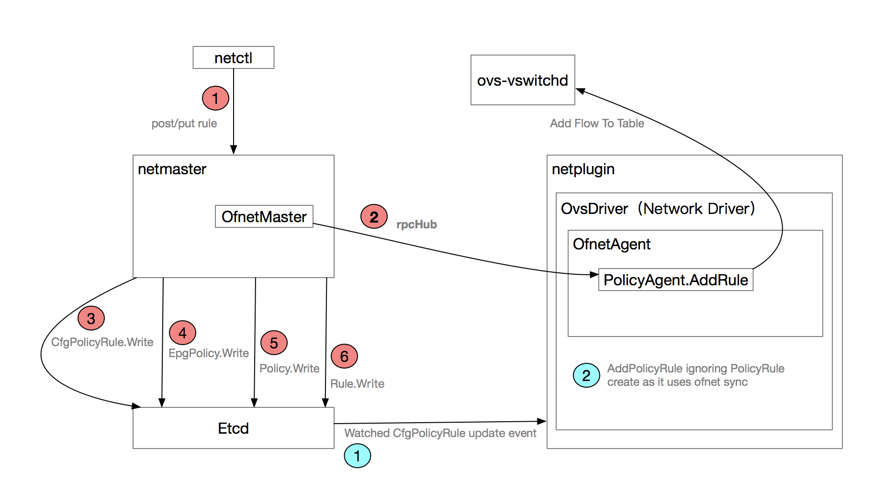
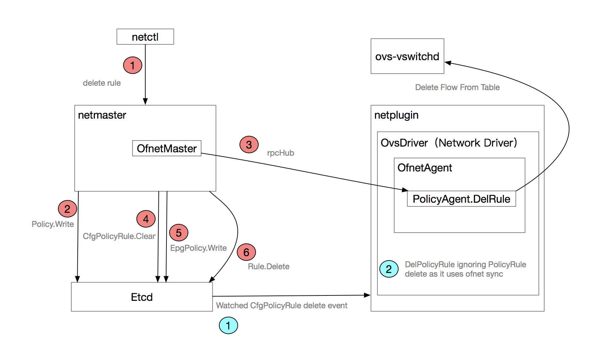

# rule add

```
NAME:
   netctl policy rule-add - Add a new rule to the policy

USAGE:
   netctl policy rule-add [command options] [policy] [rule id]

OPTIONS:
   --tenant, -t "default"   Name of the tenant
   --priority, -p "1"       Priority Indicator
   --direction, -d "in"     Direction of traffic (in/out)
   --from-group, -g         From Endpoint Group Name (Valid in incoming direction only)
   --to-group, -e       To Endpoint Group Name (Valid in outgoing direction only)
   --from-network, -n       From Network name (Valid in incoming direction only)
   --to-network, -o         To Network name (Valid in outgoing direction only)
   --from-ip-address, -i    From IP address/CIDR (Valid in incoming direction only)
   --to-ip-address, -s      To IP address/CIDR (Valid in outgoing direction only)
   --protocol, -l       Protocol (e.g., tcp, udp, icmp)
   --port, -P "0"       Port
   --action, -j "allow"     Action to take (allow or deny)
```



## netmaster 流程

### httpCreateRule

**contivmodel/contivModel.go**

// CREATE REST call
func httpCreateRule(w http.ResponseWriter, r *http.Request, vars map[string]string) (interface{}, error) {
    log.Debugf("Received httpGetRule: %+v", vars)

    var obj Rule
    key := vars["key"]

    // Get object from the request
    err := json.NewDecoder(r.Body).Decode(&obj)
    if err != nil {
        log.Errorf("Error decoding rule create request. Err %v", err)
        return nil, err
    }

    // set the key
    obj.Key = key

    // Create the object
    err = CreateRule(&obj)
    if err != nil {
        log.Errorf("CreateRule error for: %+v. Err: %v", obj, err)
        return nil, err
    }

    // Return the obj
    return obj, nil
}

// Create a rule object
func CreateRule(obj *Rule) error {

    saveObj := obj

    collections.ruleMutex.Lock()
    key := collections.rules[obj.Key]
    collections.ruleMutex.Unlock()

    // Check if object already exists
    if key != nil {
        // Perform Update callback
        err = objCallbackHandler.RuleCb.RuleUpdate(collections.rules[obj.Key], obj)
        if err != nil {
            log.Errorf("RuleUpdate retruned error for: %+v. Err: %v", obj, err)
            return err
        }

        // save the original object after update
        collections.ruleMutex.Lock()
        saveObj = collections.rules[obj.Key]
        collections.ruleMutex.Unlock()
    } else {
        // save it in cache
        collections.ruleMutex.Lock()
        collections.rules[obj.Key] = obj
        collections.ruleMutex.Unlock()

        // Perform Create callback
        err = objCallbackHandler.RuleCb.RuleCreate(obj)
        if err != nil {
            log.Errorf("RuleCreate retruned error for: %+v. Err: %v", obj, err)
            collections.ruleMutex.Lock()
            delete(collections.rules, obj.Key)
            collections.ruleMutex.Unlock()
            return err
        }
    }

    // Write it to modeldb
    collections.ruleMutex.Lock()
    err = saveObj.Write()
    collections.ruleMutex.Unlock()
    if err != nil {
        log.Errorf("Error saving rule %s to db. Err: %v", saveObj.Key, err)
        return err
    }

    return nil
}

**netmaster/objApi/apiController.go**

// RuleCreate Creates the rule within a policy
func (ac *APIController) RuleCreate(rule *contivModel.Rule) error {
    log.Infof("Received RuleCreate: %+v", rule)
    var epg *contivModel.EndpointGroup
    epg = nil

    policyKey := GetpolicyKey(rule.TenantName, rule.PolicyName)

    // Trigger policyDB Update
    err := master.PolicyAddRule(policy, rule)
    if err != nil {
        log.Errorf("Error adding rule %s to policy %s. Err: %v", rule.Key, policy.Key, err)
        return err
    }

    // link the rule to policy
    modeldb.AddLinkSet(&rule.LinkSets.Policies, policy)
    modeldb.AddLinkSet(&policy.LinkSets.Rules, rule)
    err = policy.Write()
    if err != nil {
        return err
    }

    // link the rule to epg and vice versa
    if epg != nil {
        modeldb.AddLinkSet(&epg.LinkSets.MatchRules, rule)
        modeldb.AddLink(&rule.Links.MatchEndpointGroup, epg)
        err = epg.Write()
        if err != nil {
            return err
        }
    }

    // Update any affected app profiles
    pMap := getAffectedProfs(policy, epg)
    syncAppProfile(pMap)

    return nil
}

**netmaster/master/policy.go**

// PolicyAddRule adds a rule to existing policy
func PolicyAddRule(policy *contivModel.Policy, rule *contivModel.Rule) error {
    // Dont install policies in ACI mode
    if !isPolicyEnabled() {
        return nil
    }

    // Walk all associated endpoint groups
    for epgKey := range policy.LinkSets.EndpointGroups {
        gpKey := epgKey + ":" + policy.Key

        // Find the epg policy
        gp := mastercfg.FindEpgPolicy(gpKey)
        if gp == nil {
            log.Errorf("Failed to find the epg policy %s", gpKey)
            return core.Errorf("epg policy not found")
        }

        // Add the Rule
        err := gp.AddRule(rule)
        if err != nil {
            log.Errorf("Error adding the rule %s to epg policy %s. Err: %v", rule.Key, gpKey, err)
            return err
        }

        // Save the policy state
        err = gp.Write()
        if err != nil {
            return err
        }
    }

    return nil
}

**netmaster/mastercfg/policyState.go**

// AddRule adds a rule to epg policy
func (gp *EpgPolicy) AddRule(rule *contivModel.Rule) error {
    var dirs []string

    // Figure out all the directional rules we need to install
    switch rule.Direction {
    case "in":
        if (rule.Protocol == "udp" || rule.Protocol == "tcp") && rule.Port != 0 {
            dirs = []string{"inRx", "inTx"}
        } else {
            dirs = []string{"inRx"}
        }
    case "out":
        if (rule.Protocol == "udp" || rule.Protocol == "tcp") && rule.Port != 0 {
            dirs = []string{"outRx", "outTx"}
        } else {
            dirs = []string{"outTx"}
        }
    case "both":
        if (rule.Protocol == "udp" || rule.Protocol == "tcp") && rule.Port != 0 {
            dirs = []string{"inRx", "inTx", "outRx", "outTx"}
        } else {
            dirs = []string{"inRx", "outTx"}
        }

    }

    // create a ruleMap
    ruleMap := new(RuleMap)
    ruleMap.OfnetRules = make(map[string]*ofnet.OfnetPolicyRule)
    ruleMap.Rule = rule

    // Create ofnet rules
    for _, dir := range dirs {
        ofnetRule, err := gp.createOfnetRule(rule, dir)
        if err != nil {
            log.Errorf("Error creating %s ofnet rule for {%+v}. Err: %v", dir, rule, err)
            return err
        }

        // add it to the rule map
        ruleMap.OfnetRules[ofnetRule.RuleId] = ofnetRule
    }

    // save the rulemap
    gp.RuleMaps[rule.Key] = ruleMap

    return nil
}

// createOfnetRule creates a directional ofnet rule
func (gp *EpgPolicy) createOfnetRule(rule *contivModel.Rule, dir string) (*ofnet.OfnetPolicyRule, error) {
    var remoteEpgID int
    var err error

    ruleID := gp.EpgPolicyKey + ":" + rule.Key + ":" + dir

    // Create an ofnet rule
    ofnetRule := new(ofnet.OfnetPolicyRule)
    ofnetRule.RuleId = ruleID
    ofnetRule.Priority = rule.Priority
    ofnetRule.Action = rule.Action

    // Set protocol
    switch rule.Protocol {
    case "tcp":
        ofnetRule.IpProtocol = 6
    case "udp":
        ofnetRule.IpProtocol = 17
    case "icmp":
        ofnetRule.IpProtocol = 1
    case "igmp":
        ofnetRule.IpProtocol = 2
    case "":
        ofnetRule.IpProtocol = 0
    default:
        proto, err := strconv.Atoi(rule.Protocol)
        if err == nil && proto < 256 {
            ofnetRule.IpProtocol = uint8(proto)
        }
    }

    // Set directional parameters
    switch dir {
    case "inRx":
        // Set src/dest endpoint group
        ofnetRule.DstEndpointGroup = gp.EndpointGroupID
        ofnetRule.SrcEndpointGroup = remoteEpgID

        // Set src/dest IP Address
        ofnetRule.SrcIpAddr = rule.FromIpAddress
        if len(rule.ToIpAddress) > 0 {
            ofnetRule.DstIpAddr = rule.ToIpAddress
        }

        // set port numbers
        ofnetRule.DstPort = uint16(rule.Port)

        // set tcp flags
        if rule.Protocol == "tcp" && rule.Port == 0 {
            ofnetRule.TcpFlags = "syn,!ack"
        }
    case "inTx":
        // Set src/dest endpoint group
        ofnetRule.SrcEndpointGroup = gp.EndpointGroupID
        ofnetRule.DstEndpointGroup = remoteEpgID

        // Set src/dest IP Address
        ofnetRule.DstIpAddr = rule.FromIpAddress
        if len(rule.ToIpAddress) > 0 {
            ofnetRule.SrcIpAddr = rule.ToIpAddress
        }

        // set port numbers
        ofnetRule.SrcPort = uint16(rule.Port)
    case "outRx":
        // Set src/dest endpoint group
        ofnetRule.DstEndpointGroup = gp.EndpointGroupID
        ofnetRule.SrcEndpointGroup = remoteEpgID

        // Set src/dest IP Address
        ofnetRule.SrcIpAddr = rule.ToIpAddress

        // set port numbers
        ofnetRule.SrcPort = uint16(rule.Port)
    case "outTx":
        // Set src/dest endpoint group
        ofnetRule.SrcEndpointGroup = gp.EndpointGroupID
        ofnetRule.DstEndpointGroup = remoteEpgID

        // Set src/dest IP Address
        ofnetRule.DstIpAddr = rule.ToIpAddress

        // set port numbers
        ofnetRule.DstPort = uint16(rule.Port)

        // set tcp flags
        if rule.Protocol == "tcp" && rule.Port == 0 {
            ofnetRule.TcpFlags = "syn,!ack"
        }
    default:
        log.Fatalf("Unknown rule direction %s", dir)
    }

    // Add the Rule to policyDB
    err = ofnetMaster.AddRule(ofnetRule)
    if err != nil {
        log.Errorf("Error creating rule {%+v}. Err: %v", ofnetRule, err)
        return nil, err
    }

    // Send AddRule to netplugin agents
    err = addPolicyRuleState(ofnetRule)
    if err != nil {
        log.Errorf("Error creating rule {%+v}. Err: %v", ofnetRule, err)
        return nil, err
    }

    log.Infof("Added rule {%+v} to policyDB", ofnetRule)

    return ofnetRule, nil
}

**ofnet/ofnetMaster.go**

// AddRule adds a new rule to the policyDB
func (self *OfnetMaster) AddRule(rule *OfnetPolicyRule) error {

    // Save the rule in DB
    self.masterMutex.Lock()
    self.policyDb[rule.RuleId] = rule
    self.masterMutex.Unlock()

    // take a read lock for accessing db
    self.masterMutex.RLock()
    defer self.masterMutex.RUnlock()

    // Publish it to all agents
    for nodeKey, node := range self.agentDb {
        var resp bool

        log.Infof("Sending rule: %+v to node %s:%d", rule, node.HostAddr, node.HostPort)

        client := rpcHub.Client(node.HostAddr, node.HostPort)
        err := client.Call("PolicyAgent.AddRule", rule, &resp)
    }

    return nil
}

**netmaster/mastercfg/policyRuleState.go**

// addPolicyRuleState adds policy rule to state store
func addPolicyRuleState(ofnetRule *ofnet.OfnetPolicyRule) error {
    ruleCfg := &CfgPolicyRule{}
    ruleCfg.StateDriver = stateStore
    ruleCfg.OfnetPolicyRule = (*ofnetRule)

    // Save the rule
    return ruleCfg.Write()
}

## netplugin 流程

### handlePolicyRuleEvent 处理 CfgPolicyRule 事件

**netplugin/agent/state_event.go**

func handlePolicyRuleEvents(netPlugin *plugin.NetPlugin, opts core.InstanceInfo, retErr chan error) {
    rsps := make(chan core.WatchState)
    go processStateEvent(netPlugin, opts, rsps)
    cfg := mastercfg.CfgPolicyRule{}
    cfg.StateDriver = netPlugin.StateDriver
    retErr <- cfg.WatchAll(rsps)
    log.Errorf("Error from handlePolicyRuleEvents")
}

### processStateEvent 处理 CfgPolicyRule 事件

**netplugin/agent/state_event.go**

func processStateEvent(netPlugin *plugin.NetPlugin, opts core.InstanceInfo, rsps chan core.WatchState) {
    for {
        // block on change notifications
        rsp := <-rsps

        // For now we deal with only create and delete events
        currentState := rsp.Curr
        isDelete := false
        eventStr := "create"
        if rsp.Curr == nil {
            currentState = rsp.Prev
            isDelete = true
            eventStr = "delete"
        } else if rsp.Prev != nil {
        if ruleCfg, ok := currentState.(*mastercfg.CfgPolicyRule); ok {
            log.Infof("Received %q for PolicyRule: %q", eventStr, ruleCfg.RuleId)
            processPolicyRuleState(netPlugin, opts, ruleCfg.RuleId, isDelete)
        }
    }
}

### processPolicyRuleState

**netplugin/agent/state_event.go**

// processPolicyRuleState updates policy rule state
func processPolicyRuleState(netPlugin *plugin.NetPlugin, opts core.InstanceInfo, ruleID string, isDelete bool) error {
    // read policy config
    ruleCfg := &mastercfg.CfgPolicyRule{}
    ruleCfg.StateDriver = netPlugin.StateDriver

    err := ruleCfg.Read(ruleID)
    if err != nil {
        log.Errorf("Failed to read config for policy rule '%s' \n", ruleID)
        return err
    }
    if isDelete {
        // Delete endpoint
        err = netPlugin.DelPolicyRule(ruleID)
        if err != nil {
            log.Errorf("PolicyRule %s delete operation failed. Error: %s", ruleID, err)
            return err
        }
        log.Infof("PolicyRule %s delete operation succeeded", ruleID)
    } else {
        // Create endpoint
        err = netPlugin.AddPolicyRule(ruleID)
        if err != nil {
            log.Errorf("PolicyRule %s create operation failed. Error: %s", ruleID, err)
            return err
        }
        log.Infof("PolicyRule %s create operation succeeded", ruleID)
    }

    return err
}

**netplugin/plugin/netplugin.go**

// AddPolicyRule creates a policy rule
func (p *NetPlugin) AddPolicyRule(id string) error {
    p.Lock()
    defer p.Unlock()
    return p.NetworkDriver.AddPolicyRule(id)
}

**drivers/ovsd/ovsdriver.go**

// AddPolicyRule creates a policy rule
func (d *OvsDriver) AddPolicyRule(id string) error {
    log.Debug("OVS driver ignoring PolicyRule create as it uses ofnet sync")
    return nil
}

# rule delete

```
NAME:
   netctl policy rule-rm - Delete a rule from the policy

USAGE:
   netctl policy rule-rm [command options] [policy] [rule id]

OPTIONS:
   --tenant, -t "default"   Name of the tenant
```



## netmaster 流程

### httpDeleteRule

**contivmodel/contivModel.go**

// DELETE rest call
func httpDeleteRule(w http.ResponseWriter, r *http.Request, vars map[string]string) (interface{}, error) {

    // Delete the object
    err := DeleteRule(key)

    // Return the obj
    return key, nil
}

// Delete a rule object
func DeleteRule(key string) error {
    collections.ruleMutex.Lock()
    obj := collections.rules[key]
    collections.ruleMutex.Unlock()

    // Perform callback
    err := objCallbackHandler.RuleCb.RuleDelete(obj)
    if err != nil {
        log.Errorf("RuleDelete retruned error for: %+v. Err: %v", obj, err)
        return err
    }

    // delete it from modeldb
    collections.ruleMutex.Lock()
    err = obj.Delete()
    collections.ruleMutex.Unlock()
    if err != nil {
        log.Errorf("Error deleting rule %s. Err: %v", obj.Key, err)
    }

    // delete it from cache
    collections.ruleMutex.Lock()
    delete(collections.rules, key)
    collections.ruleMutex.Unlock()

    return nil
}

**netmaster/objApi/apiController.go**

// RuleDelete deletes the rule within a policy
func (ac *APIController) RuleDelete(rule *contivModel.Rule) error {

    policyKey := GetpolicyKey(rule.TenantName, rule.PolicyName)

    // find the policy
    policy := contivModel.FindPolicy(policyKey)

    // unlink the rule from policy
    modeldb.RemoveLinkSet(&policy.LinkSets.Rules, rule)
    err := policy.Write()

    // unlink the rule from matching epg
    epgKey := rule.Links.MatchEndpointGroup.ObjKey
    if epgKey != "" {
        epg = contivModel.FindEndpointGroup(epgKey)
        if epg != nil {
            modeldb.RemoveLinkSet(&epg.LinkSets.MatchRules, rule)
        }
    }

    // Trigger policyDB Update
    err = master.PolicyDelRule(policy, rule)

    // Update any affected app profiles
    pMap := getAffectedProfs(policy, epg)
    syncAppProfile(pMap)

    return nil
}

**netmaster/master/policy.go**

// PolicyDelRule removes a rule from existing policy
func PolicyDelRule(policy *contivModel.Policy, rule *contivModel.Rule) error {
    // Dont install policies in ACI mode
    if !isPolicyEnabled() {
        return nil
    }

    // Walk all associated endpoint groups
    for epgKey := range policy.LinkSets.EndpointGroups {
        gpKey := epgKey + ":" + policy.Key

        // Find the epg policy
        gp := mastercfg.FindEpgPolicy(gpKey)

        // delete the Rule
        err := gp.DelRule(rule)

        // Save the policy state
        err = gp.Write()
        if err != nil {
            log.Errorf("Error writing polify %s to state store. Err: %v", gp.EpgPolicyKey, err)
        }
    }

    return nil
}

**netmaster/mastercfg/policyState.go**

// DelRule removes a rule from epg policy
func (gp *EpgPolicy) DelRule(rule *contivModel.Rule) error {
    // check if the rule exists
    ruleMap := gp.RuleMaps[rule.Key]
    if ruleMap == nil {
        return core.Errorf("Rule does not exists")
    }

    // Delete each ofnet rule under this policy rule
    for _, ofnetRule := range ruleMap.OfnetRules {
        log.Infof("Deleting rule {%+v} from policyDB", ofnetRule)

        // Delete the rule from policyDB
        err := ofnetMaster.DelRule(ofnetRule)
        if err != nil {
            log.Errorf("Error deleting the ofnet rule {%+v}. Err: %v", ofnetRule, err)
        }

        // Send DelRule to netplugin agents
        err = delPolicyRuleState(ofnetRule)
        if err != nil {
            log.Errorf("Error deleting the ofnet rule {%+v}. Err: %v", ofnetRule, err)
        }
    }

    // delete the cache
    delete(gp.RuleMaps, rule.Key)

    return nil
}

**ofnet/ofnetMaster.go**

// DelRule removes a rule from policy DB
func (self *OfnetMaster) DelRule(rule *OfnetPolicyRule) error {

    // Publish it to all agents
    for nodeKey, node := range self.agentDb {
        var resp bool

        log.Infof("Sending DELETE rule: %+v to node %s", rule, node.HostAddr)

        client := rpcHub.Client(node.HostAddr, node.HostPort)
        err := client.Call("PolicyAgent.DelRule", rule, &resp)
    }

    return nil
}

**netmaster/mastercfg/policyRuleState.go**

// delPolicyRuleState deletes policy rule from state store
func delPolicyRuleState(ofnetRule *ofnet.OfnetPolicyRule) error {
    ruleCfg := &CfgPolicyRule{}
    ruleCfg.StateDriver = stateStore
    ruleCfg.OfnetPolicyRule = (*ofnetRule)

    // Delete the rule
    return ruleCfg.Clear()
}

## netplugin 流程

### handlePolicyRuleEvents

**netplugin/agent/state_event.go**

func handlePolicyRuleEvents(netPlugin *plugin.NetPlugin, opts core.InstanceInfo, retErr chan error) {
    rsps := make(chan core.WatchState)
    go processStateEvent(netPlugin, opts, rsps)
    cfg := mastercfg.CfgPolicyRule{}
    cfg.StateDriver = netPlugin.StateDriver
    retErr <- cfg.WatchAll(rsps)
    log.Errorf("Error from handlePolicyRuleEvents")
}

### processStateEvent 处理 CfgPolicyRule 事件

**netplugin/agent/state_event.go**

func processStateEvent(netPlugin *plugin.NetPlugin, opts core.InstanceInfo, rsps chan core.WatchState) {
    for {
        // block on change notifications
        rsp := <-rsps

        // For now we deal with only create and delete events
        currentState := rsp.Curr
        isDelete := false
        eventStr := "create"
        if rsp.Curr == nil {
            currentState = rsp.Prev
            isDelete = true
            eventStr = "delete"
        } else if rsp.Prev != nil {
        if ruleCfg, ok := currentState.(*mastercfg.CfgPolicyRule); ok {
            log.Infof("Received %q for PolicyRule: %q", eventStr, ruleCfg.RuleId)
            processPolicyRuleState(netPlugin, opts, ruleCfg.RuleId, isDelete)
        }
    }
}

### processPolicyRuleState

**netplugin/agent/state_event.go**

// processPolicyRuleState updates policy rule state
func processPolicyRuleState(netPlugin *plugin.NetPlugin, opts core.InstanceInfo, ruleID string, isDelete bool) error {
    // read policy config
    ruleCfg := &mastercfg.CfgPolicyRule{}
    ruleCfg.StateDriver = netPlugin.StateDriver

    err := ruleCfg.Read(ruleID)
    if err != nil {
        log.Errorf("Failed to read config for policy rule '%s' \n", ruleID)
        return err
    }
    if isDelete {
        // Delete endpoint
        err = netPlugin.DelPolicyRule(ruleID)
        if err != nil {
            log.Errorf("PolicyRule %s delete operation failed. Error: %s", ruleID, err)
            return err
        }
        log.Infof("PolicyRule %s delete operation succeeded", ruleID)
    } else {
        // Create endpoint
        err = netPlugin.AddPolicyRule(ruleID)
        if err != nil {
            log.Errorf("PolicyRule %s create operation failed. Error: %s", ruleID, err)
            return err
        }
        log.Infof("PolicyRule %s create operation succeeded", ruleID)
    }

    return err
}

**netplugin/plugin/netplugin.go**

// DelPolicyRule creates a policy rule
func (p *NetPlugin) DelPolicyRule(id string) error {
    p.Lock()
    defer p.Unlock()
    return p.NetworkDriver.DelPolicyRule(id)
}

**drivers/ovsd/ovsdriver.go**

// DelPolicyRule deletes a policy rule
func (d *OvsDriver) DelPolicyRule(id string) error {
    log.Debug("OVS driver ignoring PolicyRule delete as it uses ofnet sync")
    return nil
}
