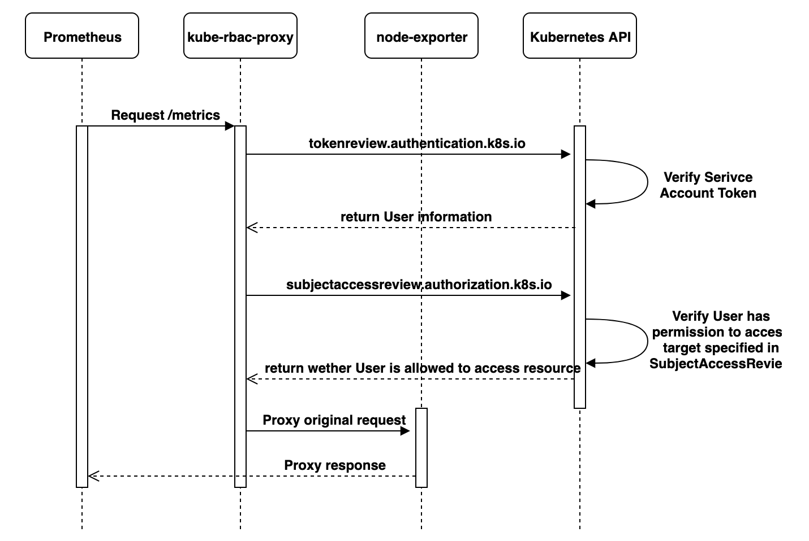
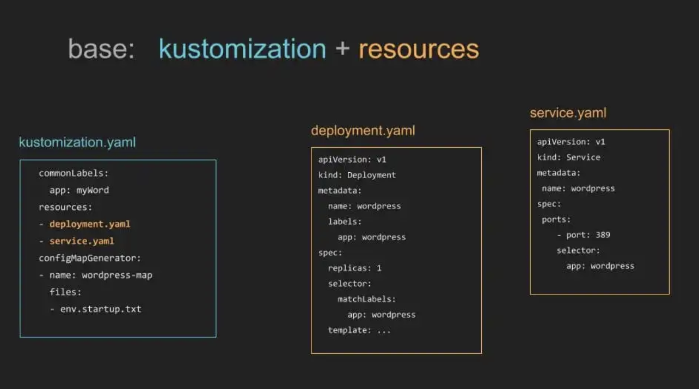

<!-- TOC -->

- [kubebuild 是什么](#kubebuild-是什么)
    - [API Group & Versions（GV）](#api-group--versionsgv)
    - [Kinds & Resources](#kinds--resources)
    - [Scheme](#scheme)
    - [Manager](#manager)
    - [Cache](#cache)
    - [Controller](#controller)
    - [Clients](#clients)
    - [Index](#index)
    - [Finalizer](#finalizer)
    - [OwnerReference](#ownerreference)
    - [总结](#总结)
- [kubebuild 安装](#kubebuild-安装)
- [初始化项目](#初始化项目)
- [创建 API](#创建-api)
- [增加 CRD 字段](#增加-crd-字段)
- [增加 Controller 逻辑](#增加-controller-逻辑)
- [设置 KUBEBUILDER_ASSETS 环境变量](#设置-kubebuilder_assets-环境变量)
- [修改 imagePullPolicy](#修改-imagepullpolicy)
- [去掉 manager auth_proxy](#去掉-manager-auth_proxy)
- [编译、构建镜像、部署](#编译构建镜像部署)
- [check CRD、Manager](#check-crdmanager)
- [创建 CR](#创建-cr)
- [check controller reconcile](#check-controller-reconcile)

<!-- /TOC -->

<a id="markdown-kubebuild-是什么" name="kubebuild-是什么"></a>
# kubebuild 是什么

Kubebuilder 是一个使用 CRDs 构建 K8s API 的 SDK，方便用户从零开始开发 CRDs，Controllers 和 Admission Webhooks 来扩展 K8s。

<a id="markdown-api-group--versionsgv" name="api-group--versionsgv"></a>
## API Group & Versions（GV）

API Group 是相关 API 功能的集合，每个 Group 拥有一或多个 Versions，用于接口的演进。

<a id="markdown-kinds--resources" name="kinds--resources"></a>
## Kinds & Resources

每个 GV 都包含多个 API 类型，称为 Kinds，在不同的 Versions 之间同一个 Kind 定义可能不同，Resource 是 Kind 的对象。比如：

| Resource Name | Short Names | API Group | Namespaced | Resource Kind |
| --- | --- | --- | --- | --- |
| pods | po |  | true |	Pod |
| services | svc |  | true | Service |
| cronjobs | cj | batch | true | CronJob |
| clusterroles |  |rbac.authorization.k8s.io | false | ClusterRole |

一般来说 Kinds 和 Resources 是 1:1 的，对于 CRD 来说，只会是 1:1 的关系。

每一个 GVK 都关联着一个 package 中给定的 root Go type，比如 `apps/v1/Deployment` 就关联着 K8s 源码里面 `k8s.io/api/apps/v1` package 中的 `Deployment struct`，我们提交的各类资源定义 YAML 文件都需要写：

```
apiVersion：这个就是 GV 。
kind：这个就是 K。
```

根据 GVK K8s 就能找到你到底要创建什么类型的资源，根据你 Yaml 中定义的 Spec 创建好资源之后就成为了 Resource Object，也就是 GVR。GVK/GVR 就是 K8s 资源的坐标，是我们创建/删除/修改/读取资源的基础。

<a id="markdown-scheme" name="scheme"></a>
## Scheme

Scheme 管理的就是 GVK 和 GVR Type 的关系，同时定义了资源序列化和反序列化的方法。

```go
// Scheme defines methods for serializing and deserializing API objects, a type
// registry for converting group, version, and kind information to and from Go
// schemas, and mappings between Go schemas of different versions. A scheme is the
// foundation for a versioned API and versioned configuration over time.
//
// In a Scheme, a Type is a particular Go struct, a Version is a point-in-time
// identifier for a particular representation of that Type (typically backwards
// compatible), a Kind is the unique name for that Type within the Version, and a
// Group identifies a set of Versions, Kinds, and Types that evolve over time. An
// Unversioned Type is one that is not yet formally bound to a type and is promised
// to be backwards compatible (effectively a "v1" of a Type that does not expect
// to break in the future).
//
// Schemes are not expected to change at runtime and are only threadsafe after
// registration is complete.
type Scheme struct {
	// versionMap allows one to figure out the go type of an object with
	// the given version and name.
	gvkToType map[schema.GroupVersionKind]reflect.Type
 
	// typeToGroupVersion allows one to find metadata for a given go object.
	// The reflect.Type we index by should *not* be a pointer.
	typeToGVK map[reflect.Type][]schema.GroupVersionKind
 
	// unversionedTypes are transformed without conversion in ConvertToVersion.
	unversionedTypes map[reflect.Type]schema.GroupVersionKind
 
	// unversionedKinds are the names of kinds that can be created in the context of any group
	// or version
	// TODO: resolve the status of unversioned types.
	unversionedKinds map[string]reflect.Type
 
	// Map from version and resource to the corresponding func to convert
	// resource field labels in that version to internal version.
	fieldLabelConversionFuncs map[schema.GroupVersionKind]FieldLabelConversionFunc
 
	// defaulterFuncs is an array of interfaces to be called with an object to provide defaulting
	// the provided object must be a pointer.
	defaulterFuncs map[reflect.Type]func(interface{})
 
	// converter stores all registered conversion functions. It also has
	// default converting behavior.
	converter *conversion.Converter
 
	// versionPriority is a map of groups to ordered lists of versions for those groups indicating the
	// default priorities of these versions as registered in the scheme
	versionPriority map[string][]string
 
	// observedVersions keeps track of the order we've seen versions during type registration
	observedVersions []schema.GroupVersion
 
	// schemeName is the name of this scheme.  If you don't specify a name, the stack of the NewScheme caller will be used.
	// This is useful for error reporting to indicate the origin of the scheme.
	schemeName string
}

```

每一组 Controllers 都需要一个 Scheme，提供了 Kinds 与对应 Go types 的映射，也就是说给定 Go type 就知道他的 GVK，给定 GVK 就知道他的 Go type，比如说我们给定一个 Scheme: `"tutotial.kubebuilder.io/api/v1".CronJob{}` 这个 Go type 映射到 `batch.tutotial.kubebuilder.io/v1` 的 `CronJob` GVK，那么从 Api Server 获取 cronjob Resource 的时候就能得到下面的 JSON:

```json
{
  "kind": "CronJob",
  "apiVersion": "batch.tutorial.kubebuilder.io/v1",
  ...
}
```

就能构造出对应的 Go type 了。通过这个 Go type 也能正确地获取 GVR 的一些信息，控制器可以通过该 Go type 获取到期望状态以及其他辅助信息进行调谐逻辑。

<a id="markdown-manager" name="manager"></a>
## Manager

Kubebuilder 的核心组件，具有 3 个职责：

- 负责运行所有的 Controllers；
- 初始化共享 caches，包含 listAndWatch 功能；
- 初始化 clients 用于与 Api Server 通信。

<a id="markdown-cache" name="cache"></a>
## Cache

Kubebuilder 的核心组件，负责在 Controller 进程里面根据 Scheme 同步 Api Server 中所有该 Controller 关心 GVKs 的 GVRs，其核心是 GVK -> Informer 的映射，Informer 会负责监听对应 GVK 的 GVRs 的创建/删除/更新操作，以触发 Controller 的 Reconcile 逻辑。

<a id="markdown-controller" name="controller"></a>
## Controller

Kubebuidler 为我们生成的脚手架文件，我们只需要实现 Reconcile 方法即可。

<a id="markdown-clients" name="clients"></a>
## Clients

Controller 通过 Clients 与 Api Server 通信。

<a id="markdown-index" name="index"></a>
## Index

由于 Controller 经常要对 Cache 进行查询，Kubebuilder 提供 Index utility 给 Cache 加索引提升查询效率。

<a id="markdown-finalizer" name="finalizer"></a>
## Finalizer

在一般情况下，如果资源被删除之后，我们虽然能够被触发删除事件，但是这个时候从 Cache 里面无法读取任何被删除对象的信息，这样一来，导致很多垃圾清理工作因为信息不足无法进行，K8s 的 Finalizer 字段用于处理这种情况。在 K8s 中，只要对象 ObjectMeta 里面的 Finalizers 不为空，对该对象的 delete 操作就会转变为 update 操作，具体说就是 update deletionTimestamp 字段，其意义就是告诉 K8s 的 GC “在deletionTimestamp 这个时刻之后，只要 Finalizers 为空，就立马删除掉该对象”。

所以一般的使用姿势就是在创建对象时把 Finalizers 设置好（任意 string），然后处理 DeletionTimestamp 不为空的 update 操作（实际是 delete），根据 Finalizers 的值执行完所有的 pre-delete hook（此时可以在 Cache 里面读取到被删除对象的任何信息）之后将 Finalizers 置为空即可。

<a id="markdown-ownerreference" name="ownerreference"></a>
## OwnerReference

K8s GC 在删除一个对象时，任何 ownerReference 是该对象的对象都会被清除，与此同时，Kubebuidler 支持所有对象的变更都会触发 Owner 对象 controller 的 Reconcile 方法。

<a id="markdown-总结" name="总结"></a>
## 总结

所有概念集合在一起：


<a id="markdown-kubebuild-安装" name="kubebuild-安装"></a>
# kubebuild 安装

下载源码

```sh
# bytedance @ C02D2025ML87 in ~/go/src/github.com/kubernetes-sigs [10:55:54] 
$ git clone https://github.com/kubernetes-sigs/kubebuilder
Cloning into 'kubebuilder'...
remote: Enumerating objects: 4, done.
remote: Counting objects: 100% (4/4), done.
remote: Compressing objects: 100% (3/3), done.
remote: Total 40656 (delta 1), reused 2 (delta 1), pack-reused 40652
Receiving objects: 100% (40656/40656), 61.90 MiB | 1.10 MiB/s, done.
Resolving deltas: 100% (19732/19732), done.
```

编译安装

```sh
# bytedance @ C02D2025ML87 in ~/go/src/github.com/kubernetes-sigs [10:56:56] 
$ cd kubebuilder 

# bytedance @ C02D2025ML87 in ~/go/src/github.com/kubernetes-sigs/kubebuilder on git:master o [11:01:01] 
$ make install  
make build                     
go build -o bin/kubebuilder ./cmd
go: downloading github.com/spf13/cobra v0.0.7
go: downloading github.com/spf13/pflag v1.0.5
go: downloading github.com/spf13/afero v1.2.2
go: downloading github.com/gobuffalo/flect v0.2.1
go: downloading sigs.k8s.io/yaml v1.2.0
go: downloading golang.org/x/tools v0.0.0-20200403190813-44a64ad78b9b
go: downloading gopkg.in/yaml.v2 v2.2.8
go: downloading golang.org/x/text v0.3.0
go: downloading golang.org/x/mod v0.2.0
go: downloading golang.org/x/xerrors v0.0.0-20191204190536-9bdfabe68543
cp ./bin/kubebuilder /Users/bytedance/go/bin/kubebuilder

# bytedance @ C02D2025ML87 in ~/go/src/github.com/kubernetes-sigs/kubebuilder on git:master o [11:02:39] 
$ echo $PATH
/usr/local/bin:/usr/bin:/bin:/usr/sbin:/sbin:/usr/local/go/bin:/opt/puppetlabs/bin:/usr/local/munki:/Users/bytedance/go/bin
```

<a id="markdown-初始化项目" name="初始化项目"></a>
# 初始化项目

```sh
# bytedance @ C02D2025ML87 in ~/go/src/github.com/keontang [11:13:48] 
$ mkdir operator-example

# bytedance @ C02D2025ML87 in ~/go/src/github.com/keontang [11:14:09] 
$ cd operator-example 

# bytedance @ C02D2025ML87 in ~/go/src/github.com/keontang/operator-example [11:14:16] 
$

# bytedance @ C02D2025ML87 in ~/go/src/github.com/keontang/operator-example [11:14:16] 
$ kubebuilder init --domain keon.io --license apache2 --owner "keon" 
Writing scaffold for you to edit...
Get controller runtime:
$ go get sigs.k8s.io/controller-runtime@v0.6.2
go: downloading sigs.k8s.io/controller-runtime v0.6.2
go: downloading k8s.io/apimachinery v0.18.6
...
...
...
go: downloading golang.org/x/text v0.3.2
/Users/bytedance/go/bin/controller-gen object:headerFile="hack/boilerplate.go.txt" paths="./..."
go fmt ./...
go vet ./...
go build -o bin/manager main.go
Next: define a resource with:
$ kubebuilder create api
```

`kubebuilder init` 这一步创建了一个 Go module 工程，引入了必要的依赖，创建了一些模板文件。

生成的代码目录结构如下：

```sh
# bytedance @ C02D2025ML87 in ~/go/src/github.com/keontang/operator-example [11:19:01] 
$ tree -L 3
.
├── Dockerfile
├── Makefile
├── PROJECT
├── bin
│   └── manager
├── config
│   ├── certmanager
│   │   ├── certificate.yaml
│   │   ├── kustomization.yaml
│   │   └── kustomizeconfig.yaml
│   ├── default
│   │   ├── kustomization.yaml
│   │   ├── manager_auth_proxy_patch.yaml
│   │   ├── manager_webhook_patch.yaml
│   │   └── webhookcainjection_patch.yaml
│   ├── manager
│   │   ├── kustomization.yaml
│   │   └── manager.yaml
│   ├── prometheus
│   │   ├── kustomization.yaml
│   │   └── monitor.yaml
│   ├── rbac
│   │   ├── auth_proxy_client_clusterrole.yaml
│   │   ├── auth_proxy_role.yaml
│   │   ├── auth_proxy_role_binding.yaml
│   │   ├── auth_proxy_service.yaml
│   │   ├── kustomization.yaml
│   │   ├── leader_election_role.yaml
│   │   ├── leader_election_role_binding.yaml
│   │   └── role_binding.yaml
│   └── webhook
│       ├── kustomization.yaml
│       ├── kustomizeconfig.yaml
│       └── service.yaml
├── go.mod
├── go.sum
├── hack
│   └── boilerplate.go.txt
└── main.go

9 directories, 30 files
```
<a id="markdown-创建-api" name="创建-api"></a>
# 创建 API

创建 API 的时候可以选择创建对应的 K8S Resource 和 Controller：

```sh
# bytedance @ C02D2025ML87 in ~/go/src/github.com/keontang/operator-example [11:22:48] 
$ kubebuilder create api --group apps --version v1alpha1 --kind Person    
Create Resource [y/n]
y
Create Controller [y/n]
y
Writing scaffold for you to edit...
api/v1alpha1/person_types.go
controllers/person_controller.go
Running make:
$ make
/Users/bytedance/go/bin/controller-gen object:headerFile="hack/boilerplate.go.txt" paths="./..."
go fmt ./...
go vet ./...
go build -o bin/manager main.go
```

其中，真正的 group 由 group+domain 组成，这里为：

```go
// api/v1alpha1/groupversion_info.go
// GroupVersion is group version used to register these objects
	GroupVersion = schema.GroupVersion{Group: "apps.keon.io", Version: "v1alpha1"}
```

得到的目录结构：

```sh
# bytedance @ C02D2025ML87 in ~/go/src/github.com/keontang/operator-example [11:28:51] 
$ tree -L 3
.
├── Dockerfile
├── Makefile
├── PROJECT
├── api
│   └── v1alpha1
│       ├── groupversion_info.go # GV 信息，schema 创建方法
│       ├── person_types.go # 自定义 CRD type 的地方
│       └── zz_generated.deepcopy.go
├── bin
│   └── manager # 一个 manager 可以管理多个 controller，而这些 controller 会共享 manager 的 client
├── config
│   ├── certmanager
│   │   ├── certificate.yaml
│   │   ├── kustomization.yaml
│   │   └── kustomizeconfig.yaml
│   ├── crd # 部署 CRD 资源的 yaml
│   │   ├── kustomization.yaml
│   │   ├── kustomizeconfig.yaml
│   │   └── patches
│   ├── default
│   │   ├── kustomization.yaml
│   │   ├── manager_auth_proxy_patch.yaml
│   │   ├── manager_webhook_patch.yaml
│   │   └── webhookcainjection_patch.yaml
│   ├── manager # 部署 controller-manager 的 yaml
│   │   ├── kustomization.yaml
│   │   └── manager.yaml
│   ├── prometheus
│   │   ├── kustomization.yaml
│   │   └── monitor.yaml
│   ├── rbac
│   │   ├── auth_proxy_client_clusterrole.yaml
│   │   ├── auth_proxy_role.yaml
│   │   ├── auth_proxy_role_binding.yaml
│   │   ├── auth_proxy_service.yaml
│   │   ├── kustomization.yaml
│   │   ├── leader_election_role.yaml
│   │   ├── leader_election_role_binding.yaml
│   │   ├── person_editor_role.yaml
│   │   ├── person_viewer_role.yaml
│   │   └── role_binding.yaml
│   ├── samples # 创建 CR (CRD Object) 的模版 yaml
│   │   └── apps_v1alpha1_person.yaml
│   └── webhook
│       ├── kustomization.yaml
│       ├── kustomizeconfig.yaml
│       └── service.yaml
├── controllers
│   ├── person_controller.go # 自定义 CRD Controller 逻辑的地方
│   └── suite_test.go
├── go.mod
├── go.sum
├── hack
│   └── boilerplate.go.txt
└── main.go

15 directories, 40 files
```

<a id="markdown-增加-crd-字段" name="增加-crd-字段"></a>
# 增加 CRD 字段

```go
// api/v1alpha1/person_types.go
// PersonSpec defines the desired state of Person
type PersonSpec struct {
	// INSERT ADDITIONAL SPEC FIELDS - desired state of cluster
	// Important: Run "make" to regenerate code after modifying this file
	FirstName  string `json:"firstname"`
    SecondName string `json:"secondname"`
}
```

<a id="markdown-增加-controller-逻辑" name="增加-controller-逻辑"></a>
# 增加 Controller 逻辑

```go
func (r *PersonReconciler) Reconcile(req ctrl.Request) (ctrl.Result, error) {
	ctx = context.Background()
	_ = r.Log.WithValues("person", req.NamespacedName)

    obj := &appsv1alpha1.Person{}
    if err := r.Get(ctx, req.NamespacedName, obj); err != nil {
        log.Println(err, "unable to fetch New Object")
    } else {
        log.Println("fetch New Object:", obj.Spec.FirstName, obj.Spec.SecondName)
    }

	return ctrl.Result{}, nil
}
```

<a id="markdown-设置-kubebuilder_assets-环境变量" name="设置-kubebuilder_assets-环境变量"></a>
# 设置 KUBEBUILDER_ASSETS 环境变量

设置 `KUBEBUILDER_ASSETS`，该路径下存放：`etcd`，`kube-apiserver`，`kubebuilder`，`kubectl` 工具。

```sh
# bytedance @ C02D2025ML87 in ~/go/src/github.com/kubernetes-sigs/kubebuilder/bin on git:master o [21:07:51]
$ export KUBEBUILDER_ASSETS=~/go/src/github.com/kubernetes-sigs/kubebuilder/bin
```

<a id="markdown-修改-imagepullpolicy" name="修改-imagepullpolicy"></a>
# 修改 imagePullPolicy

由于在本地编译构建 Manager 镜像，并不上传到 Docker Hub，所以需要添加 imagePullPolicy 策略：

```yaml
# config/manager/manager.yaml

apiVersion: apps/v1
kind: Deployment
metadata:
  name: controller-manager
  ...
          image: controller:latest
          imagePullPolicy: IfNotPresent
```

<a id="markdown-去掉-manager-auth_proxy" name="去掉-manager-auth_proxy"></a>
# 去掉 manager auth_proxy

kube-rbac-proxy，顾名思义，就是一个基于 RBAC 访问 K8S Apiserver、Node-exporter 等服务的一个代理。



`额外话题`: K8S Apiserver 本来就是一个代理了，为什么还需要 kube-rbac-proxy 代理呢？开发这个工具的设计者出于两个目的：第一，减轻 Apiserver 的负担，让 Apiserver 尽量服务集群组件的请求，而不是客户端的请求；第二，作为接收 Http 请求的辅助工具，确保请求得到真正授权，而不是因为一个组件可以通过网络访问到，那么任何请求都能访问到这个组件。**在没有 NetworkPolicies 的 Kubernetes 集群中，任何 Pod 都可以对集群中的每个其他 Pod 执行请求。通过此代理，就只允许合法的经过 RBAC 授权的或者经过 TLS 证书授权的请求通过，非法请求都无法通过此代理。**

我们可以为 kube-rbac-proxy 增加一个 insecure-listen-address，也可以为了方便查看 metrics，去掉这个 manager auth_proxy，同时增加了一个 net tool，方便直接 curl 命令查看：

```yaml
# config/default/manager_auth_proxy_patch.yaml
    spec:
      containers:
      #- name: kube-rbac-proxy
      #  image: gcr.io/kubebuilder/kube-rbac-proxy:v0.5.0
      #  args:
      #  - "--secure-listen-address=0.0.0.0:8443"
      #  - "--upstream=http://127.0.0.1:8080/"
      #  - "--logtostderr=true"
      #  - "--v=10"
      #  ports:
      #  - containerPort: 8443
      #    name: https
      - name: net-tool
        image: praqma/network-multitool:latest
        imagePullPolicy: IfNotPresent
      - name: manager
        args:
        - "--metrics-addr=0.0.0.0:8080"
        - "--enable-leader-election"
```

<a id="markdown-编译构建镜像部署" name="编译构建镜像部署"></a>
# 编译、构建镜像、部署

```sh
# bytedance @ C02D2025ML87 in ~/go/src/github.com/keontang/operator-example [21:13:51] C:130
$ make && make docker-build && make deploy
...
...
...
/Users/bytedance/go/bin/kustomize build config/default | kubectl apply -f -
namespace/operator-example-system created
customresourcedefinition.apiextensions.k8s.io/persons.apps.keon.io created
role.rbac.authorization.k8s.io/operator-example-leader-election-role created
clusterrole.rbac.authorization.k8s.io/operator-example-manager-role created
clusterrole.rbac.authorization.k8s.io/operator-example-proxy-role created
clusterrole.rbac.authorization.k8s.io/operator-example-metrics-reader created
rolebinding.rbac.authorization.k8s.io/operator-example-leader-election-rolebinding created
clusterrolebinding.rbac.authorization.k8s.io/operator-example-manager-rolebinding created
clusterrolebinding.rbac.authorization.k8s.io/operator-example-proxy-rolebinding created
service/operator-example-controller-manager-metrics-service created
deployment.apps/operator-example-controller-manager created
```

`make deploy` 这一步会创建 namespace，CRD、Role、Rolebinding、Manager Deployment，Manager Service 等资源。

这里要说明一下 Kustomize 工具。

Kustomize 将对 K8S 应用定义为由 Yaml 表示的资源描述，对 K8s 应用的变更可以映射到对 Yaml 的变更上。而这些变更操作可以利用 git 等版本控制程序来管理，因此用户得以使用 git 风格的流程对 K8s 应用进行管理。

对于一个受 Kustomize 管理的 App，都有若干个 Yaml 组成。

比如：

```
~/someApp
├── base
    ├── deployment.yaml
    ├── kustomization.yaml
    └── service.yaml
```

基本模版保存在 base 目录下。

`kustomize build ~/someApp/bash` 表示： Kustomize 根据 base 目录下 kustomization.yaml 规则将 deployment.yaml 和 service.yaml 合并成一个 yaml。

`kustomize build ~/someApp/bash | kubectl apply -f -` 这种方式直接将 App Yaml 部署到 K8S 集群上。1.14 版本以后，kustomize 命令已经集成到 kubectl 命令中，`kubectl apply -k ~/someApp/bash` 即代表上面上面的命令。



根据特定场景定制的模版放在 overlay 目录下。

比如：

```
~/someApp
├── base
│   ├── deployment.yaml
│   ├── kustomization.yaml
│   └── service.yaml
└── overlays
    ├── development
    │   ├── cpu_count.yaml
    │   ├── kustomization.yaml
    │   └── replica_count.yaml
    └── production
        ├── cpu_count.yaml
        ├── kustomization.yaml
        └── replica_count.yaml
```

overlay 下会继承 base 的配置，假设 `overlays/development/kustomization.yaml` 如下：

```yaml
bases:
- ../../base
 
patches:
- cpu_count.yaml
- replica_count.yaml
```

overlays/development 目录继承了 base 的配置，并且添加了 cpu_count.yaml、replica_count.yaml 配置。

可以通过 `kubectl kustomize ~/someApp/overlays/production` 生成 production 环境的 Yaml。

Kustomize 工具 App 不同场景 Yaml 管理可以归纳为：


<a id="markdown-check-crdmanager" name="check-crdmanager"></a>
# check CRD、Manager

```sh
# bytedance @ C02D2025ML87 in ~/go/src/github.com/keontang/operator-example [22:12:27]
$ kubectl get crds
NAME                    CREATED AT
persons.apps.keon.io   2020-09-10T13:16:27Z

# bytedance @ C02D2025ML87 in ~/go/src/github.com/keontang/operator-example [22:27:09]
$ kubectl get namespace
NAME                      STATUS   AGE
default                   Active   37d
docker                    Active   37d
kube-node-lease           Active   37d
kube-public               Active   37d
kube-system               Active   37d
operator-example-system   Active   5m54s

# bytedance @ C02D2025ML87 in ~/go/src/github.com/keontang/operator-example [22:30:28]
$ kubectl get services -n operator-example-system
NAME                                                  TYPE        CLUSTER-IP      EXTERNAL-IP   PORT(S)    AGE
operator-example-controller-manager-metrics-service   ClusterIP   10.97.104.190   <none>        8443/TCP   6m21s

# bytedance @ C02D2025ML87 in ~/go/src/github.com/keontang/operator-example [22:38:24]
$ kubectl get pods -n operator-example-system
NAME                                                   READY   STATUS    RESTARTS   AGE
operator-example-controller-manager-5fc859554f-ht8h7   2/2     Running   0          6m17s
```

<a id="markdown-创建-cr" name="创建-cr"></a>
# 创建 CR

`config/samples/groupa_v1beta1_person.yaml` 中添加字段：

```go
apiVersion: apps.keon.io/v1alpha1
kind: Person
metadata:
  name: person-sample
spec:
  # Add fields here
  firstname: Keon
  secondname: Tang
```

创建 CR：

```sh
# bytedance @ C02D2025ML87 in ~/go/src/github.com/keontang/operator-example [22:17:50] C:1
$ kubectl create -f config/samples/apps_v1alpha1_person.yaml
person.apps.keon.io/person-sample created

# bytedance @ C02D2025ML87 in ~/go/src/github.com/keontang/operator-example [22:18:56]
$ kubectl get Person
NAME             AGE
person-sample   41s
```

<a id="markdown-check-controller-reconcile" name="check-controller-reconcile"></a>
# check controller reconcile

```sh
# bytedance @ C02D2025ML87 in ~/go/src/github.com/keontang/operator-example [22:48:39]
$ kubectl logs -f operator-example-controller-manager-5fc859554f-ht8h7 -c manager -n operator-example-system
2020-09-10T14:38:26.009Z	INFO	controller-runtime.metrics	metrics server is starting to listen	{"addr": "127.0.0.1:8080"}
2020-09-10T14:38:26.010Z	INFO	setup	starting manager
I0910 14:38:26.012396       1 leaderelection.go:242] attempting to acquire leader lease  operator-example-system/015c509b.keon.io...
2020-09-10T14:38:26.012Z	INFO	controller-runtime.manager	starting metrics server	{"path": "/metrics"}
I0910 14:38:26.091631       1 leaderelection.go:252] successfully acquired lease operator-example-system/015c509b.keon.io
2020-09-10T14:38:26.095Z	INFO	controller	Starting EventSource	{"reconcilerGroup": "apps.keon.io", "reconcilerKind": "Person", "controller": "person", "source": "kind source: /, Kind="}
2020-09-10T14:38:26.091Z	DEBUG	controller-runtime.manager.events	Normal	{"object": {"kind":"ConfigMap","namespace":"operator-example-system","name":"015c509b.keon.io","uid":"0aa17c2c-811d-4255-a2bf-f9ee5639bde0","apiVersion":"v1","resourceVersion":"173325"}, "reason": "LeaderElection", "message": "operator-example-controller-manager-5fc859554f-ht8h7_f2145799-788f-44f7-be76-a665bd894237 became leader"}
2020-09-10T14:38:26.199Z	INFO	controller	Starting Controller	{"reconcilerGroup": "apps.keon.io", "reconcilerKind": "Person", "controller": "person"}
2020-09-10T14:38:26.199Z	INFO	controller	Starting workers	{"reconcilerGroup": "apps.keon.io", "reconcilerKind": "Person", "controller": "person", "worker count": 1}
2020/09/10 14:50:43 fetch New Object: Keon Tang
2020-09-10T14:50:43.716Z	DEBUG	controller	Successfully Reconciled	{"reconcilerGroup": "apps.keon.io", "reconcilerKind": "Person", "controller": "person", "name": "person-sample", "namespace": "default"}
2020/09/10 14:51:12 fetch New Object: Keon Tang
2020-09-10T14:51:12.198Z	DEBUG	controller	Successfully Reconciled	{"reconcilerGroup": "apps.keon.io", "reconcilerKind": "Person", "controller": "person", "name": "person-sample", "namespace": "default"}
```

进入 net-tool 容器查看 metrics 信息：

```sh
# bytedance @ C02D2025ML87 in ~/go/src/github.com/keontang/operator-example [14:01:05]
$ kubectl exec -it operator-example-controller-manager-76b5449cdc-gq69x bash -c net-tool -n operator-example-system
bash-5.0# curl 127.0.0.1:8080/metrics
# HELP controller_runtime_reconcile_time_seconds Length of time per reconciliation per controller
# TYPE controller_runtime_reconcile_time_seconds histogram
controller_runtime_reconcile_time_seconds_bucket{controller="persion",le="0.005"} 1
controller_runtime_reconcile_time_seconds_bucket{controller="persion",le="0.01"} 1
controller_runtime_reconcile_time_seconds_bucket{controller="persion",le="0.025"} 1
...
```

这些 metrics 是 kubebuilder 利用 controller-runtime 从 controller 搜集过来的。
