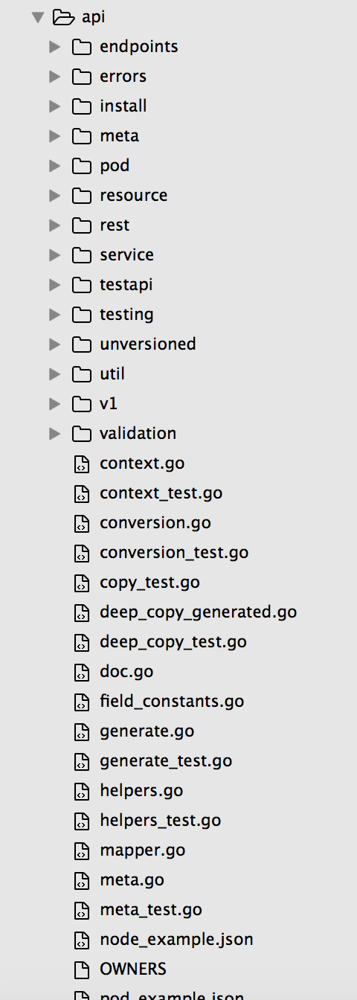

<!-- START doctoc generated TOC please keep comment here to allow auto update -->
<!-- DON'T EDIT THIS SECTION, INSTEAD RE-RUN doctoc TO UPDATE -->
**Table of Contents**  *generated with [DocToc](https://github.com/thlorenz/doctoc)*

- [API Machinery](#api-machinery)
- [API对象](#api%E5%AF%B9%E8%B1%A1)
- [API Package](#api-package)

<!-- END doctoc generated TOC please keep comment here to allow auto update -->

# API Machinery

The Kubernetes API has two major components - the internal structures and the versioned APIs. The versioned APIs are intended to be stable, while the internal structures are implemented to best reflect the needs of the Kubernetes code itself.

As mentioned above, the internal representation of an API object is decoupled from any one API version. This provides a lot of freedom to evolve the code, but it requires robust infrastructure to convert between representations. There are multiple steps in processing an API operation - even something as simple as a GET involves a great deal of machinery.

The conversion process is logically a "star" with the internal form at the center. Every versioned API can be converted to the internal form (and vice-versa), but versioned APIs do not convert to other versioned APIs directly. This sounds like a heavy process, but in reality we do not intend to keep more than a small number of versions alive at once. While all of the Kubernetes code operates on the internal structures, they are always converted to a versioned form before being written to storage (disk or etcd) or being sent over a wire. Clients should consume and operate on the versioned APIs exclusively.

To demonstrate the general process, here is a (hypothetical) example:

A user POSTs a Pod object to /api/v7beta1/...
The JSON is unmarshalled into a v7beta1.Pod structure [decode]
Default values are applied to the v7beta1.Pod
The v7beta1.Pod is converted to an api.Pod structure [convert]
The api.Pod is validated, and any errors are returned to the user
The api.Pod is converted to a v6.Pod (because v6 is the latest stable version) [convert]
The v6.Pod is marshalled into JSON and written to etcd [encode]

Now that we have the Pod object stored, a user can GET that object in any supported api version. For example:

A user GETs the Pod from /api/v5/...
The JSON is read from etcd and unmarshalled into a v6.Pod structure [decode]
Default values are applied to the v6.Pod
The v6.Pod is converted to an api.Pod structure [convert]
The api.Pod is converted to a v5.Pod structure [convert]
The v5.Pod is marshalled into JSON and sent to the user [encode]

Most operations conducted by clients against the server are done using the primary API of the server (today, v1). Internally, we must maintain a version of code that can be converted to all other API versions - we call this the internal version and it is denoted in the scheme as __internal. All API operations start in a serialized form (either from a client or from etcd), are read as bytes / strings, loaded into a Go struct (known as an external type), defaulting is provided, then the object is converted to the internal API version and passed to the API machinery. The value either then is sent to etcd or back to the client in a reversed process. 

Our internal objects track the primary external version quite closely, we end up maintaining N+1 versions of our objects instead of just N, and we generally require all objects to be 100% convertible to all supported API versions by introducing new fields on older versions that match the newer API version.

# API对象

API 对象是 K8s 集群中的管理操作单元。K8s 集群系统每支持一项新功能，引入一项新技术，一定会新引入对应的 API 对象，支持对该功能的管理操作。例如副本集 Replica Set 对应的 API 对象是 RS。

每个 API 对象都有3大类属性：元数据 metadata、规范 spec 和状态 status。

元数据是用来标识 API 对象的，每个对象都至少有3个元数据：namespace，name 和 uid；除此以外还有各种各样的标签 labels 用来标识和匹配不同的对象，例如用户可以用标签 env 来标识区分不同的服务部署环境，分别用 env=dev、env=testing、env=production 来标识开发、测试、生产的不同服务。

规范描述了用户期望 K8s 集群中的分布式系统达到的理想状态（Desired State），例如用户可以通过复制控制器 Replication Controller 设置期望的 Pod 副本数为3。

状态描述了系统实际当前达到的状态（Status），例如系统当前实际的 Pod 副本数为2；那么复制控制器当前的程序逻辑就是自动启动新的 Pod，争取达到副本数为3。

K8s 中所有的配置都是通过 API 对象的spec去设置的，也就是用户通过配置系统的理想状态来改变系统，这是 k8s 重要设计理念之一，即所有的操作都是声明式（Declarative）的而不是命令式（Imperative）的。声明式操作在分布式系统中的好处是稳定，不怕丢操作或运行多次，例如设置副本数为3的操作运行多次也还是一个结果，而给副本数加1的操作就不是声明式的，运行多次结果就错了。

# API Package

Package api contains the latest (or "internal") version of the Kubernetes API objects. This is the API objects as represented in memory. The contract presented to clients is located in the versioned packages, which are sub-directories. The first one is "v1beta1". Those packages describe how a particular version is serialized to storage/network.
