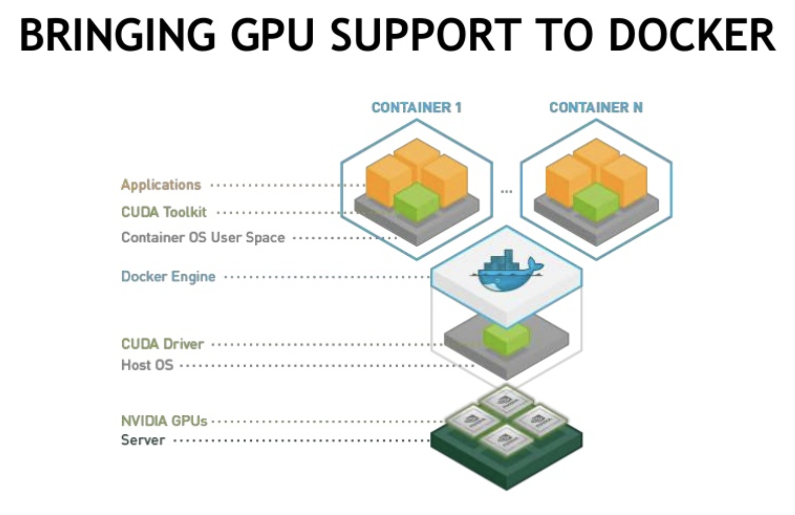

<!-- START doctoc generated TOC please keep comment here to allow auto update -->
<!-- DON'T EDIT THIS SECTION, INSTEAD RE-RUN doctoc TO UPDATE -->
**Table of Contents**  *generated with [DocToc](https://github.com/thlorenz/doctoc)*

- [nvidia docker](#nvidia-docker)
  - [nvidia-docker 1.0 vs nvidia-docker 2.0](#nvidia-docker-10-vs-nvidia-docker-20)
    - [nvidia-docker 1.0](#nvidia-docker-10)
    - [nvidia-docker 2.0](#nvidia-docker-20)

<!-- END doctoc generated TOC please keep comment here to allow auto update -->

# nvidia docker



## nvidia-docker 1.0 vs nvidia-docker 2.0

### nvidia-docker 1.0


### nvidia-docker 2.0


上面已经介绍个各个组件的作用以及它们之间的关系，接下来详细的描述下这张图:

1.正常创建一个容器的流程是这样的:

```
docker --> dockerd --> docker-containerd-shm -->runc --> container-process
```

docker 客户端将创建容器的请求发送给 dockerd, 当 dockerd 收到请求任务之后将请求发送给 docker-containerd-shm (其实就是 containerd)。

创建 GPU 容器的流程如下:

```
docker--> dockerd --> docker-containerd-shim-->nvidia-container-runtime -- > container-process
```

基本流程和不使用 GPU 的容器差不多，只是把 docker 默认的运行时替换成了 NVIDIA 自家的 nvidia-container-runtime。

这样当 nvidia-container-runtime 创建容器时，先执行 nvidia-container-runtime-hook 这个 hook 去检查容器是否需要使用 GPU (通过环境变量 NVIDIA_VISIBLE_DEVICES 来判断)。如果需要则调用 libnvidia-container 来暴露 GPU 给容器使用。否则走默认的 runc 逻辑。
