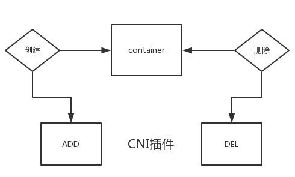
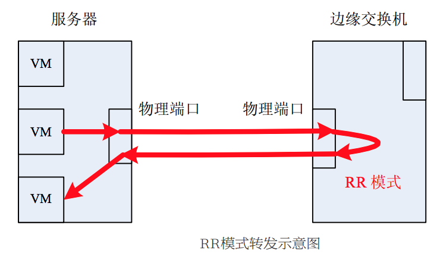
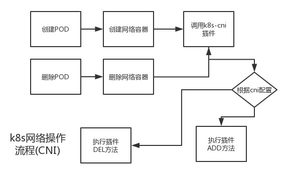

<!-- START doctoc generated TOC please keep comment here to allow auto update -->
<!-- DON'T EDIT THIS SECTION, INSTEAD RE-RUN doctoc TO UPDATE -->
**Table of Contents**  *generated with [DocToc](https://github.com/thlorenz/doctoc)*

- [名称解释](#%E5%90%8D%E7%A7%B0%E8%A7%A3%E9%87%8A)
  - [IPAM](#ipam)
  - [CIDR](#cidr)
- [CNI](#cni)
  - [CNI 网络配置](#cni-%E7%BD%91%E7%BB%9C%E9%85%8D%E7%BD%AE)
  - [<h2 id="CNI_INTERFACE">CNI 库接口</h2>](#h2-idcni_interfacecni-%E5%BA%93%E6%8E%A5%E5%8F%A3h2)
  - [CNI plugin](#cni-plugin)
  - [官方的 bridge CNI 插件框架代码分析](#%E5%AE%98%E6%96%B9%E7%9A%84-bridge-cni-%E6%8F%92%E4%BB%B6%E6%A1%86%E6%9E%B6%E4%BB%A3%E7%A0%81%E5%88%86%E6%9E%90)
- [Kubernetes 网络框架](#kubernetes-%E7%BD%91%E7%BB%9C%E6%A1%86%E6%9E%B6)
  - [kubernetes 网络框架接口](#kubernetes-%E7%BD%91%E7%BB%9C%E6%A1%86%E6%9E%B6%E6%8E%A5%E5%8F%A3)
  - [kubelet 启动时选择合适的网络插件](#kubelet-%E5%90%AF%E5%8A%A8%E6%97%B6%E9%80%89%E6%8B%A9%E5%90%88%E9%80%82%E7%9A%84%E7%BD%91%E7%BB%9C%E6%8F%92%E4%BB%B6)
    - [查找所有可用的网络插件](#%E6%9F%A5%E6%89%BE%E6%89%80%E6%9C%89%E5%8F%AF%E7%94%A8%E7%9A%84%E7%BD%91%E7%BB%9C%E6%8F%92%E4%BB%B6)
    - [根据用户配置选择对应的网络插件](#%E6%A0%B9%E6%8D%AE%E7%94%A8%E6%88%B7%E9%85%8D%E7%BD%AE%E9%80%89%E6%8B%A9%E5%AF%B9%E5%BA%94%E7%9A%84%E7%BD%91%E7%BB%9C%E6%8F%92%E4%BB%B6)
  - [k8s kubenet 网络框架](#k8s-kubenet-%E7%BD%91%E7%BB%9C%E6%A1%86%E6%9E%B6)
    - [k8s kubenet plugin 对象初始化](#k8s-kubenet-plugin-%E5%AF%B9%E8%B1%A1%E5%88%9D%E5%A7%8B%E5%8C%96)
    - [k8s kubenet plugin 初始化工作](#k8s-kubenet-plugin-%E5%88%9D%E5%A7%8B%E5%8C%96%E5%B7%A5%E4%BD%9C)
    - [kubenet Event](#kubenet-event)
    - [kubenet SetUpPod](#kubenet-setuppod)
    - [kubenet TearDownPod](#kubenet-teardownpod)
  - [k8s CNI 网络插件](#k8s-cni-%E7%BD%91%E7%BB%9C%E6%8F%92%E4%BB%B6)
    - [k8s CNI plugin 对象初始化](#k8s-cni-plugin-%E5%AF%B9%E8%B1%A1%E5%88%9D%E5%A7%8B%E5%8C%96)
    - [k8s CNI plugin 初始化工作](#k8s-cni-plugin-%E5%88%9D%E5%A7%8B%E5%8C%96%E5%B7%A5%E4%BD%9C)
    - [CNI Event](#cni-event)
    - [CNI SetUpPod](#cni-setuppod)
    - [CNI TearDownPod](#cni-teardownpod)
- [网络模型和网络功能测试](#%E7%BD%91%E7%BB%9C%E6%A8%A1%E5%9E%8B%E5%92%8C%E7%BD%91%E7%BB%9C%E5%8A%9F%E8%83%BD%E6%B5%8B%E8%AF%95)
  - [Kubernetes model](#kubernetes-model)
  - [Kubernetes network test](#kubernetes-network-test)
- [k8s CNI 社区动态](#k8s-cni-%E7%A4%BE%E5%8C%BA%E5%8A%A8%E6%80%81)
- [References](#references)

<!-- END doctoc generated TOC please keep comment here to allow auto update -->

# 名称解释

## IPAM

IP Adress Management 是规划, 跟踪和管理网络中使用的 IP 地址的系统.

## CIDR

CIDR (Classless Inter-Domain Routing) 无类别域间路由, 一个按位的, 基于前缀的, 用于解释 IP 地址的标准.

CIDR 是一种新的编址方式, 能够比传统的 A, B, C 类编址方式更为有效地分配 IP 地址. CIDR 是一种对 IP 地址和子网掩码的表示方法.

比如 192.168.0.0 子网掩码 255.255.255.0, 用 CIDR 表示为: `192.168.0.0/24`.

# CNI

CNI (Container Network Interface) 容器网络接口, 是Linux容器网络配置的一组[标准](https://github.com/containernetworking/cni/blob/master/SPEC.md)和[库](https://github.com/containernetworking/cni), 用户需要根据这些标准和库来开发自己的容器网络插件. CNI 只专注解决容器网络连接和容器销毁时的资源释放, 所以 CNI 可以支持大量不同的网络模式, 并且容易实现.

CNI plugin 只需要通过 CNI 库实现两类方法, 一类事创建容器时调用, 一类是删除容器时调用.



## CNI 网络配置

CNI 网络初始化的时候, 会根据网络配置文件来进行相关的初始化工作.

CNI 标准中规定, 使用 json 文件来配置网络. 详细的网络配置说明请参考: [Network Configuration](https://github.com/containernetworking/cni/blob/master/SPEC.md#network-configuration)

`NetConf struct` 定义了一些标准中指定的比较通用的域.

```
// cni/pkg/types/types.go

// NetConf describes a network.
type NetConf struct {
    CNIVersion string `json:"cniVersion,omitempty"`

    Name         string          `json:"name,omitempty"`
    Type         string          `json:"type,omitempty"`
    Capabilities map[string]bool `json:"capabilities,omitempty"`
    IPAM         struct {
        Type string `json:"type,omitempty"`
    } `json:"ipam,omitempty"`
    DNS DNS `json:"dns"`
}
```

我们还可以在 CNI 插件中定义插件特有的域, 比如 [bridge 插件](https://github.com/containernetworking/cni/blob/master/plugins/main/bridge/bridge.go):

```
// cni/plugins/main/bridge/bridge.go

type NetConf struct {
    types.NetConf
    BrName       string `json:"bridge"`
    IsGW         bool   `json:"isGateway"`
    IsDefaultGW  bool   `json:"isDefaultGateway"`
    ForceAddress bool   `json:"forceAddress"`
    IPMasq       bool   `json:"ipMasq"`
    MTU          int    `json:"mtu"`
    HairpinMode  bool   `json:"hairpinMode"`
}
```

[host-local ipam 插件](https://github.com/containernetworking/cni/blob/master/plugins/ipam/host-local/backend/allocator/config.go):

```
// cni/plugins/ipam/host-local/backend/allocator/config.go

// IPAMConfig represents the IP related network configuration.
type IPAMConfig struct {
    Name       string
    Type       string        `json:"type"`
    RangeStart net.IP        `json:"rangeStart"`
    RangeEnd   net.IP        `json:"rangeEnd"`
    Subnet     types.IPNet   `json:"subnet"`
    Gateway    net.IP        `json:"gateway"`
    Routes     []types.Route `json:"routes"`
    DataDir    string        `json:"dataDir"`
    ResolvConf string        `json:"resolvConf"`
    Args       *IPAMArgs     `json:"-"`
}
```

下面是一个 bridge 和 host-local 的配置示例:

```
{
  "cniVersion": "0.3.1",
  "name": "dbnet",
  "type": "bridge",
  // type (plugin) specific
  "bridge": "cni0",
  "ipam": {
    "type": "host-local",
    // ipam specific
    "subnet": "10.1.0.0/16",
    "gateway": "10.1.0.1"
  },
  "dns": {
    "nameservers": [ "10.1.0.1" ]
  }
}
```

## <h2 id="CNI_INTERFACE">CNI 库接口</h2>

利用 CNI 库, 我们可以实现一个支持 CNI 插件的网络模型. 该网络模型通过 `CNI interface` 的 `AddNetwork` 方法和 `DelNetwork` 方法调用 CNI 插件去执行 `ADD` 命令 (配置容器网络) 和 `DEL` 命令 (删除容器网络).


CNI 库中的 `CNIConfig struct` 实现了 `CNI interface`:

```
// cni/libcni/api.go

type NetworkConfig struct {
    Network *types.NetConf
    Bytes   []byte
}

type CNI interface {
    AddNetwork(net *NetworkConfig, rt *RuntimeConf) (types.Result, error)
    DelNetwork(net *NetworkConfig, rt *RuntimeConf) error
}

type CNIConfig struct {
    Path []string
}

// AddNetwork executes the plugin with the ADD command
func (c *CNIConfig) AddNetwork(net *NetworkConfig, rt *RuntimeConf) (types.Result, error) {
    pluginPath, err := invoke.FindInPath(net.Network.Type, c.Path)
    if err != nil {
        return nil, err
    }

    net, err = injectRuntimeConfig(net, rt)
    if err != nil {
        return nil, err
    }

    return invoke.ExecPluginWithResult(pluginPath, net.Bytes, c.args("ADD", rt))
}

// DelNetwork executes the plugin with the DEL command
func (c *CNIConfig) DelNetwork(net *NetworkConfig, rt *RuntimeConf) error {
    pluginPath, err := invoke.FindInPath(net.Network.Type, c.Path)
    if err != nil {
        return err
    }

    net, err = injectRuntimeConfig(net, rt)
    if err != nil {
        return err
    }

    return invoke.ExecPluginWithoutResult(pluginPath, net.Bytes, c.args("DEL", rt))
}
```

上述方法都是通过 `invoke.ExecPluginWithResult()`/`invoke.ExecPluginWithoutResult()` 去调用 cni 插件执行 `ADD`/`DEL` 操作.

```
// pkg/invoke/exec.go

func ExecPluginWithResult(pluginPath string, netconf []byte, args CNIArgs) (types.Result, error) {
    return defaultPluginExec.WithResult(pluginPath, netconf, args)
}

func ExecPluginWithoutResult(pluginPath string, netconf []byte, args CNIArgs) error {
    return defaultPluginExec.WithoutResult(pluginPath, netconf, args)
}
```

defaultPluginExec 的实现如下:

```
// pkg/invoke/exec.go

var defaultPluginExec = &PluginExec{
    RawExec:        &RawExec{Stderr: os.Stderr},
    VersionDecoder: &version.PluginDecoder{},
}

type PluginExec struct {
    RawExec interface {
        ExecPlugin(pluginPath string, stdinData []byte, environ []string) ([]byte, error)
    }
    VersionDecoder interface {
        Decode(jsonBytes []byte) (version.PluginInfo, error)
    }
}

func (e *PluginExec) WithResult(pluginPath string, netconf []byte, args CNIArgs) (types.Result, error) {
    stdoutBytes, err := e.RawExec.ExecPlugin(pluginPath, netconf, args.AsEnv())
    if err != nil {
        return nil, err
    }

    // Plugin must return result in same version as specified in netconf
    versionDecoder := &version.ConfigDecoder{}
    confVersion, err := versionDecoder.Decode(netconf)
    if err != nil {
        return nil, err
    }

    return version.NewResult(confVersion, stdoutBytes)
}

func (e *PluginExec) WithoutResult(pluginPath string, netconf []byte, args CNIArgs) error {
    _, err := e.RawExec.ExecPlugin(pluginPath, netconf, args.AsEnv())
    return err
}
```

所以, 要实现一个 cni plugin 只需要实现  `ADD` 和 `DEL` 命令就可以了. 可以参考官方 [bridge cni 插件](https://github.com/containernetworking/cni/blob/master/plugins/main/bridge/bridge.go#L416).

## CNI plugin

CNI 插件包含两部分:

- CNI Plugin 负责给容器配置网络, 它包括两个基本的命令实现
    - 配置网络: ADD 命令实现
    - 清理网络: DEL 命令实现

- IPAM Plugin 负责给容器分配 IP 地址
    - 官方实现为 host-local 和 dhcp
    - 还可以通过调用第三方 IPAM Server 来分配 IP 地址

每个 CNI 插件被实现为由容器运行时 (例如 rkt 或 Docker) 调用的可执行文件.

CNI 插件负责将网络接口插入容器网络命名空间 (例如 veth 对的一端), 并对主机进行任何必要的更改 (例如将 veth 的另一端连接到桥中). 另外 IPAM 管理代码可以调用 IPAM plugin 来分配 IP 给网络接口并设置路由.

[cni/plugins](https://github.com/containernetworking/cni/tree/master/plugins) 目录下面实现了一些 IPAM plugin 和 CNI plugin.

第三方 CNI plugin 有: flannel, calico, canal, weave 等.

下面我们简单分析一下[官方的 bridge CNI 插件](https://github.com/containernetworking/cni/blob/master/plugins/main/bridge/bridge.go)的框架代码.

## 官方的 bridge CNI 插件框架代码分析

```
// cni/plugins/main/bridge/bridge.go

package main

const defaultBrName = "cni0"

type NetConf struct {
    types.NetConf
    BrName       string `json:"bridge"`
    IsGW         bool   `json:"isGateway"`
    IsDefaultGW  bool   `json:"isDefaultGateway"`
    ForceAddress bool   `json:"forceAddress"`
    IPMasq       bool   `json:"ipMasq"`
    MTU          int    `json:"mtu"`
    HairpinMode  bool   `json:"hairpinMode"`
}

// ADD 命令实现
func cmdAdd(args *skel.CmdArgs) error {
    // 加载 bridge cni plugin 网络配置
    n, cniVersion, err := loadNetConf(args.StdinData)

    // 确保节点上的网桥存在, 不存在则创建网桥
    br, brInterface, err := setupBridge(n)

    // 创建 Veth 对
    // containerInterface 就是容器的 interface, 移到了容器的 network namespace
    // hostInterface 移到了 host network namespace, 并且连接到了 br 网桥上
    hostInterface, containerInterface, err := setupVeth(netns, br, args.IfName, n.MTU, n.HairpinMode)

    // 调用 IPAM plugin 分配 IP 地址
    // run the IPAM plugin and get back the config to apply
    r, err := ipam.ExecAdd(n.IPAM.Type, args.StdinData)

    netns.Do(func(_ ns.NetNS) error {
        // 为容器 interface 设置刚才通过 IPAM plugin 获得的 IP 地址
        ipam.ConfigureIface(args.IfName, result)

        // 根据 IP 地址为容器 interface 生成物理地址
        ip.SetHWAddrByIP(args.IfName, result.IPs[0].Address.IP, nil /* TODO IPv6 */)
    }

    return types.PrintResult(result, cniVersion)
}

// DEL 命令实现
func cmdDel(args *skel.CmdArgs) error {
    // 加载 bridge cni plugin 网络配置
    n, _, err := loadNetConf(args.StdinData)

    // 调用 IPAM plugin 释放 IP 地址
    ipam.ExecDel(n.IPAM.Type, args.StdinData)

    // 删除容器 interface
    err = ns.WithNetNSPath(args.Netns, func(_ ns.NetNS) error {
        var err error
        ipn, err = ip.DelLinkByNameAddr(args.IfName, netlink.FAMILY_V4)
        if err != nil && err == ip.ErrLinkNotFound {
            return nil
        }
        return err
    })

    return err
}

func main() {
    skel.PluginMain(cmdAdd, cmdDel, version.All)
}
```

# Kubernetes 网络框架

**Kubernetes version: 1.5**

Kubernetes 本身不提供容器网络, 但是实现了一套支持多种网络插件的框架代码, 通过调用网络插件来为容器设置网络环境.

目前 Kubernetes 支持三种网络类型: kubenet, CNI, exec. 但是 exec 网络类型会在 1.6 版本中移除, 而用 CNI 来代替 ([Remove 'exec' network plugin - use CNI instead](https://github.com/kubernetes/kubernetes/pull/39254)).

## kubernetes 网络框架接口

kubelet 是通过 NetworkPlugin interface 来调用底层的网络插件为容器设置网络环境.

```
// pkg/kubelet/network/plugins.go

// Plugin is an interface to network plugins for the kubelet
type NetworkPlugin interface {
    // Init initializes the plugin.  This will be called exactly once
    // before any other methods are called.
    Init(host Host, hairpinMode componentconfig.HairpinMode, nonMasqueradeCIDR string, mtu int) error

    // Called on various events like:
    // NET_PLUGIN_EVENT_POD_CIDR_CHANGE
    Event(name string, details map[string]interface{})

    // Name returns the plugin's name. This will be used when searching
    // for a plugin by name, e.g.
    Name() string

    // Returns a set of NET_PLUGIN_CAPABILITY_*
    Capabilities() utilsets.Int

    // SetUpPod is the method called after the infra container of
    // the pod has been created but before the other containers of the
    // pod are launched.
    // TODO: rename podInfraContainerID to sandboxID
    SetUpPod(namespace string, name string, podInfraContainerID kubecontainer.ContainerID) error

    // TearDownPod is the method called before a pod's infra container will be deleted
    // TODO: rename podInfraContainerID to sandboxID
    TearDownPod(namespace string, name string, podInfraContainerID kubecontainer.ContainerID) error

    // Status is the method called to obtain the ipv4 or ipv6 addresses of the container
    // TODO: rename podInfraContainerID to sandboxID
    GetPodNetworkStatus(namespace string, name string, podInfraContainerID kubecontainer.ContainerID) (*PodNetworkStatus, error)

    // NetworkStatus returns error if the network plugin is in error state
    Status() error
}
```

如果我们要实现一个新的 kubernetes network plugin 就需要实现 NetworkPlugin interface.

另外需要注意的是, 虽然 kubenet (/pkg/kubelet/network/kubenet), cni (/pkg/kubelet/network/cni) 和 exec (/pkg/kubelet/network/exec) 都实现了 NetworkPlugin interface, 但仅仅只实现了框架代码, 并不涉及如何设置容器网络, 容器网络设置的步骤交给了具体的插件. 比如 cni 类型的网络插件有: flannel, calico 等.


对于 kubenet, 我们不再需要自己写插件, 因为 kubenet 利用的是官方提供的三个 cni 类型插件: "bridge", "host-local", "loopback" (参考 [cni plugins](https://github.com/containernetworking/cni/tree/master/plugins/main), [cni ipam](https://github.com/containernetworking/cni/tree/master/plugins/ipam)), 这个插件一般位于每个 Node 的 `/opt/cni/bin` 目录.

对于 cni 类型或者 exec 类型, 我们可以使用开源的一些插件, 甚至还可以自己写 cni 类型或者 exec 类型的网络插件.

后面还会详细分析 kubenet 网络框架, cni 网络框架.

## kubelet 启动时选择合适的网络插件

kubelet 启动时会去查找所有可用的网络插件. 然后根据用户配置的网络插件名选择对应的网络插件.

```
// cmd/kubelet/app/server.go

func run(s *options.KubeletServer, kubeDeps *kubelet.KubeletDeps) (err error) {
    ...
    if kubeDeps == nil {
        ...
        // 查找所有可用的网络插件
        kubeDeps, err = UnsecuredKubeletDeps(s)
    }
    ...
    // 根据 kubelet 的运行参数运行 kubelet
    // 这里会根据用户配置的网络插件名选择网络插件
    if err := RunKubelet(&s.KubeletConfiguration, kubeDeps, s.RunOnce, standaloneMode); err != nil {
        return err
    }
    ...
}
```

### 查找所有可用的网络插件

```
// cmd/kubelet/app/server.go

// UnsecuredKubeletDeps returns a KubeletDeps suitable for being run, or an error if the server setup
// is not valid.  It will not start any background processes, and does not include authentication/authorization
func UnsecuredKubeletDeps(s *options.KubeletServer) (*kubelet.KubeletDeps, error) {
    ...
    return &kubelet.KubeletDeps{
        ...
        // 查找到的可用的网络插件都保存到 NetworkPlugins 列表
        NetworkPlugins:    ProbeNetworkPlugins(s.NetworkPluginDir, s.CNIConfDir, s.CNIBinDir),
        ...
    }
}
```

ProbeNetworkPlugins() 函数将所有可用的 exec 类型, cni 类型的插件和 kubenet 插件添加到插件列表 allPlugins, 并返回给 NetworkPlugins.

```
// cmd/kubelet/app/plugins.go

// ProbeNetworkPlugins collects all compiled-in plugins
func ProbeNetworkPlugins(pluginDir, cniConfDir, cniBinDir string) []network.NetworkPlugin {
    allPlugins := []network.NetworkPlugin{}

    // for backwards-compat, allow pluginDir as a source of CNI config files
    if cniConfDir == "" {
        cniConfDir = pluginDir
    }
    // for each existing plugin, add to the list
    // 初始化所有 exec 类型的插件对象
    allPlugins = append(allPlugins, exec.ProbeNetworkPlugins(pluginDir)...)
    // 初始化所有 cni 类型的插件对象
    allPlugins = append(allPlugins, cni.ProbeNetworkPlugins(cniConfDir, cniBinDir)...)
    // 初始化 kubenet 插件对象
    allPlugins = append(allPlugins, kubenet.NewPlugin(pluginDir))

    return allPlugins
}
```

### 根据用户配置选择对应的网络插件

RunKubelet() 函数首先会初始化 kubelet 对象, 这就包括根据用户网络配置选择对应的网络插件对象. 然后开始运行 kubelet.

```
// cmd/kubelet/app/server.go

// RunKubelet is responsible for setting up and running a kubelet.  It is used in three different applications:
//   1 Integration tests
//   2 Kubelet binary
//   3 Standalone 'kubernetes' binary
// Eventually, #2 will be replaced with instances of #3
func RunKubelet(kubeCfg *componentconfig.KubeletConfiguration, kubeDeps *kubelet.KubeletDeps, runOnce bool, standaloneMode bool) error {
    ...
    builder := kubeDeps.Builder
    if builder == nil {
        builder = CreateAndInitKubelet
    }
    ...
    k, err := builder(kubeCfg, kubeDeps, standaloneMode)
    ...
    // NewMainKubelet should have set up a pod source config if one didn't exist
    // when the builder was run. This is just a precaution.
    if kubeDeps.PodConfig == nil {
        return fmt.Errorf("failed to create kubelet, pod source config was nil!")
    }
    podCfg := kubeDeps.PodConfig
    ...
    // process pods and exit.
    if runOnce {
        if _, err := k.RunOnce(podCfg.Updates()); err != nil {
            return fmt.Errorf("runonce failed: %v", err)
        }
        glog.Infof("Started kubelet %s as runonce", version.Get().String())
    } else {
        err := startKubelet(k, podCfg, kubeCfg, kubeDeps)
        if err != nil {
            return err
        }
        glog.Infof("Started kubelet %s", version.Get().String())
    }
    return nil
}

func CreateAndInitKubelet(kubeCfg *componentconfig.KubeletConfiguration, kubeDeps *kubelet.KubeletDeps, standaloneMode bool) (k kubelet.KubeletBootstrap, err error) {
    ...
    k, err = kubelet.NewMainKubelet(kubeCfg, kubeDeps, standaloneMode)
    ...
}
```

这里先补充说明一下 Hairpin 模式. 反射式转发模式 (Reflective Relay) 又称为发夹式转发模式 (Hairpin mode), 指交换机可以将报文的接受端口同时作为发送端口, 即报文可以从它的入端口转发出去, 如下图所示:



另外，传统的交换机不支持 RR 转发模式，以防止报文环路.

NewMainKubelet() 函数先根据配置参数计算出有效的 Hairpin 模式, 然后根据 NetworkPluginName 从插件列表中选择对应的网络插件对象.

```
// pkg/kubelet/kubelet.go

// NewMainKubelet instantiates a new Kubelet object along with all the required internal modules.
// No initialization of Kubelet and its modules should happen here.
func NewMainKubelet(kubeCfg *componentconfig.KubeletConfiguration, kubeDeps *KubeletDeps, standaloneMode bool) (*Kubelet, error) {
    ...
    if kubeDeps.PodConfig == nil {
        var err error
        kubeDeps.PodConfig, err = makePodSourceConfig(kubeCfg, kubeDeps, nodeName)
        if err != nil {
            return nil, err
        }
    }
    ...
    // 根据配置参数计算出有效的 hairpin 模式
    if mode, err := effectiveHairpinMode(componentconfig.HairpinMode(kubeCfg.HairpinMode), kubeCfg.ContainerRuntime, kubeCfg.NetworkPluginName); err != nil {
        // This is a non-recoverable error. Returning it up the callstack will just
        // lead to retries of the same failure, so just fail hard.
        glog.Fatalf("Invalid hairpin mode: %v", err)
    } else {
        klet.hairpinMode = mode
    }
    glog.Infof("Hairpin mode set to %q", klet.hairpinMode)

    // 根据用户配置选择对应的网络插件对象
    if plug, err := network.InitNetworkPlugin(kubeDeps.NetworkPlugins, kubeCfg.NetworkPluginName, &criNetworkHost{&networkHost{klet}}, klet.hairpinMode, klet.nonMasqueradeCIDR, int(kubeCfg.NetworkPluginMTU)); err != nil {
        return nil, err
    } else {
        klet.networkPlugin = plug
    }
    ...
    if kubeCfg.EnableCRI {
        // kubelet defers to the runtime shim to setup networking. Setting
        // this to nil will prevent it from trying to invoke the plugin.
        // It's easier to always probe and initialize plugins till cri
        // becomes the default.
        klet.networkPlugin = nil
        ...
        switch kubeCfg.ContainerRuntime {
        case "docker":
            ...
            // Use DockerLegacyService directly to work around unimplemented
            // functions in CRI.
            // TODO: Remove this hack after CRI is fully implemented.
            // TODO: Move the instrumented interface wrapping into kuberuntime.
            runtimeService = kuberuntime.NewInstrumentedRuntimeService(rs)
            ...
        case "remote":
            runtimeService, imageService, err = getRuntimeAndImageServices(kubeCfg)
            ...
        ...
        }
        runtime, err := kuberuntime.NewKubeGenericRuntimeManager(
            kubecontainer.FilterEventRecorder(kubeDeps.Recorder),
            klet.livenessManager,
            containerRefManager,
            machineInfo,
            klet.podManager,
            kubeDeps.OSInterface,
            klet.networkPlugin,
            klet,
            klet.httpClient,
            imageBackOff,
            kubeCfg.SerializeImagePulls,
            float32(kubeCfg.RegistryPullQPS),
            int(kubeCfg.RegistryBurst),
            klet.cpuCFSQuota,
            runtimeService,
            kuberuntime.NewInstrumentedImageManagerService(imageService),
        )
        ...
        klet.containerRuntime = runtime
        klet.runner = runtime
    } else {
        switch kubeCfg.ContainerRuntime {
        case "docker":
            runtime := dockertools.NewDockerManager(...)
            klet.containerRuntime = runtime
            klet.runner = kubecontainer.DirectStreamingRunner(runtime)
        case "rkt":
            runtime, err := rkt.New(...)
            ...
            klet.containerRuntime = runtime
            klet.runner = kubecontainer.DirectStreamingRunner(runtime)
        ...
    }
    ...
    // 向 k8s network plugin 通报 NET_PLUGIN_EVENT_POD_CIDR_CHANGE 事件
    // 该事件将会被 NetworkPlugin interface 的 Event 方法捕获
    klet.updatePodCIDR(kubeCfg.PodCIDR)
    ...
    return klet, nil
}
```

下面看看 updatePodCIDR() 方法:

```
// pkg/kubelet/kubelet_network.go

// updatePodCIDR updates the pod CIDR in the runtime state if it is different
// from the current CIDR.
func (kl *Kubelet) updatePodCIDR(cidr string) {
    podCIDR := kl.runtimeState.podCIDR()

    if podCIDR == cidr {
        return
    }

    // kubelet -> network plugin
    // cri runtime shims are responsible for their own network plugins
    if kl.networkPlugin != nil {
        details := make(map[string]interface{})
        details[network.NET_PLUGIN_EVENT_POD_CIDR_CHANGE_DETAIL_CIDR] = cidr
        kl.networkPlugin.Event(network.NET_PLUGIN_EVENT_POD_CIDR_CHANGE, details)
    }

    // kubelet -> generic runtime -> runtime shim -> network plugin
    // docker/rkt non-cri implementations have a passthrough UpdatePodCIDR
    if err := kl.GetRuntime().UpdatePodCIDR(cidr); err != nil {
        glog.Errorf("Failed to update pod CIDR: %v", err)
        return
    }

    glog.Infof("Setting Pod CIDR: %v -> %v", podCIDR, cidr)
    kl.runtimeState.setPodCIDR(cidr)
}
```

InitNetworkPlugin() 负责从网络插件对象列表中根据用户配置的网络插件名选择对应的网络插件对象.

```
// pkg/kubelet/network/plugins.go

// InitNetworkPlugin inits the plugin that matches networkPluginName. Plugins must have unique names.
func InitNetworkPlugin(plugins []NetworkPlugin, networkPluginName string, host Host, hairpinMode componentconfig.HairpinMode, nonMasqueradeCIDR string, mtu int) (NetworkPlugin, error) {
    // 如果用户没有配置网络插件名, 默认就是NoopNetworkPlugin, 不会提供任何容器网络
    if networkPluginName == "" {
        // default to the no_op plugin
        plug := &NoopNetworkPlugin{}
        if err := plug.Init(host, hairpinMode, nonMasqueradeCIDR, mtu); err != nil {
            return nil, err
        }
        return plug, nil
    }

    pluginMap := map[string]NetworkPlugin{}

    allErrs := []error{}
    for _, plugin := range plugins {
        name := plugin.Name()
        if errs := validation.IsQualifiedName(name); len(errs) != 0 {
            allErrs = append(allErrs, fmt.Errorf("network plugin has invalid name: %q: %s", name, strings.Join(errs, ";")))
            continue
        }

        if _, found := pluginMap[name]; found {
            allErrs = append(allErrs, fmt.Errorf("network plugin %q was registered more than once", name))
            continue
        }
        pluginMap[name] = plugin
    }

    chosenPlugin := pluginMap[networkPluginName]
    if chosenPlugin != nil {
        // 调用 plugin 的 Init(), 进行一些初始化工作
        err := chosenPlugin.Init(host, hairpinMode, nonMasqueradeCIDR, mtu)
        if err != nil {
            allErrs = append(allErrs, fmt.Errorf("Network plugin %q failed init: %v", networkPluginName, err))
        } else {
            glog.V(1).Infof("Loaded network plugin %q", networkPluginName)
        }
    } else {
        allErrs = append(allErrs, fmt.Errorf("Network plugin %q not found.", networkPluginName))
    }

    return chosenPlugin, utilerrors.NewAggregate(allErrs)
}
```

## k8s kubenet 网络框架

k8s kubenet 网络框架实现了 kubernetes NetworkPlugin interface, 对 `CNI Interface` 进行了封装:

```
// pkg/kubelet/network/kubenet/kubenet_linux.go

type kubenetNetworkPlugin struct {
    network.NoopNetworkPlugin

    host            network.Host
    netConfig       *libcni.NetworkConfig
    loConfig        *libcni.NetworkConfig
    cniConfig       libcni.CNI
    bandwidthShaper bandwidth.BandwidthShaper
    mu              sync.Mutex //Mutex for protecting podIPs map, netConfig, and shaper initialization
    podIPs          map[kubecontainer.ContainerID]string
    mtu             int
    execer          utilexec.Interface
    nsenterPath     string
    hairpinMode     componentconfig.HairpinMode
    hostportHandler hostport.HostportHandler
    iptables        utiliptables.Interface
    sysctl          utilsysctl.Interface
    ebtables        utilebtables.Interface
    // vendorDir is passed by kubelet network-plugin-dir parameter.
    // kubenet will search for cni binaries in DefaultCNIDir first, then continue to vendorDir.
    vendorDir         string
    nonMasqueradeCIDR string
    podCidr           string
    gateway           net.IP
}
```

kubenet 直接利用了官方提供的三个 cni plugin:

```
// pkg/kubelet/network/kubenet/kubenet_linux.go

// CNI plugins required by kubenet in /opt/cni/bin or vendor directory
var requiredCNIPlugins = [...]string{"bridge", "host-local", "loopback"}
```

kubenet 网络框架原理非常的简单, 主要利用 "bridge", "host-local", "loopback" (位于 /opt/cni/bin 目录下) 这三个 cni plugin, 在每个 Node 上创建一个 cbr0 网桥, 根据 PodCIDR 为每个 Pod 的 interface 分配一个 ip, 并将改 interface 连接到 cbr0 网桥上.

当然, 对于 kubernetes 集群来说, 还需要解决两个问题:

**1. Node 的 PodCIDR 设置**

k8s kubenet 网络框架中，必须给每个 node 配置一个 podCIDR.

那么, 每个 Node 的 PodCIDR 如何设置呢? 这个需要参考 [kubenet 网络的配置文档](https://kubernetes.io/docs/concepts/cluster-administration/network-plugins/#kubenet)了:

`The node must be assigned an IP subnet through either the --pod-cidr kubelet command-line option or the --allocate-node-cidrs=true --cluster-cidr=<cidr> controller-manager command-line options.`

其实就是两种方式: 第一, 要么通过 `--pod-cidr` 为每个 Node 上的 kubelet 配置好 PodCIDR, 要么通过 `--allocate-node-cidrs=true --cluster-cidr=<cluster_cidr>` 让 controller-manager 来为每个 Node 分配 PodCIDR.

**2. Node 之间的路由设置**

虽然现在每个 Node 都配置好了 PodCIDR, 比如:

Node1: 192.168.0.0/24
Node2: 192.168.1.0/24

但是 Node1 和 Node2 上的容器如何通信呢?

`It is typically used together with a cloud provider that sets up routing rules for communication between nodes, or in single-node environments.`

通常情况下, kubenet 网络插件会跟 cloud provider 一起使用, 从而利用 cloud provider 来设置节点间的路由. kubenet 网络插件也可以用在单节点环境, 这样就不需要考虑 Node 间的路由了. 另外, 我们还可以通过实现一个 network controller 来保证 Node 间的路由.

### k8s kubenet plugin 对象初始化

```
// pkg/kubelet/network/kubenet/kubenet_linux.go

func NewPlugin(networkPluginDir string) network.NetworkPlugin {
    protocol := utiliptables.ProtocolIpv4
    execer := utilexec.New()
    dbus := utildbus.New()
    sysctl := utilsysctl.New()
    iptInterface := utiliptables.New(execer, dbus, protocol)
    return &kubenetNetworkPlugin{
        podIPs:            make(map[kubecontainer.ContainerID]string),
        execer:            utilexec.New(),
        iptables:          iptInterface,
        sysctl:            sysctl,
        vendorDir:         networkPluginDir,
        hostportHandler:   hostport.NewHostportHandler(),
        nonMasqueradeCIDR: "10.0.0.0/8",
    }
}
```

### k8s kubenet plugin 初始化工作

```
// pkg/kubelet/network/kubenet/kubenet_linux.go

func (plugin *kubenetNetworkPlugin) Init(host network.Host, hairpinMode componentconfig.HairpinMode, nonMasqueradeCIDR string, mtu int) error {
    plugin.host = host
    plugin.hairpinMode = hairpinMode
    plugin.nonMasqueradeCIDR = nonMasqueradeCIDR
    plugin.cniConfig = &libcni.CNIConfig{
        Path: []string{DefaultCNIDir, plugin.vendorDir},
    }

    if mtu == network.UseDefaultMTU {
        if link, err := findMinMTU(); err == nil {
            plugin.mtu = link.MTU
            glog.V(5).Infof("Using interface %s MTU %d as bridge MTU", link.Name, link.MTU)
        } else {
            plugin.mtu = fallbackMTU
            glog.Warningf("Failed to find default bridge MTU, using %d: %v", fallbackMTU, err)
        }
    } else {
        plugin.mtu = mtu
    }

    // Since this plugin uses a Linux bridge, set bridge-nf-call-iptables=1
    // is necessary to ensure kube-proxy functions correctly.
    //
    // This will return an error on older kernel version (< 3.18) as the module
    // was built-in, we simply ignore the error here. A better thing to do is
    // to check the kernel version in the future.
    plugin.execer.Command("modprobe", "br-netfilter").CombinedOutput()
    err := plugin.sysctl.SetSysctl(sysctlBridgeCallIPTables, 1)
    if err != nil {
        glog.Warningf("can't set sysctl %s: %v", sysctlBridgeCallIPTables, err)
    }

    // 配置 loopback cni 插件
    plugin.loConfig, err = libcni.ConfFromBytes([]byte(`{
  "cniVersion": "0.1.0",
  "name": "kubenet-loopback",
  "type": "loopback"
}`))
    if err != nil {
        return fmt.Errorf("Failed to generate loopback config: %v", err)
    }

    plugin.nsenterPath, err = plugin.execer.LookPath("nsenter")
    if err != nil {
        return fmt.Errorf("Failed to find nsenter binary: %v", err)
    }

    // Need to SNAT outbound traffic from cluster
    if err = plugin.ensureMasqRule(); err != nil {
        return err
    }
    return nil
}
```

### kubenet Event

kubelet 启动到 `NewMainKubelet` 时, 根据用户配置通过 `klet.updatePodCIDR(kubeCfg.PodCIDR)` 向 k8s network plugin 通报 `NET_PLUGIN_EVENT_POD_CIDR_CHANGE` 事件, 该事件将会被 `Event` 方法捕获.

```
// pkg/kubelet/network/kubenet/kubenet_linux.go

const NET_CONFIG_TEMPLATE = `{
  "cniVersion": "0.1.0",
  "name": "kubenet",
  "type": "bridge",
  "bridge": "%s",
  "mtu": %d,
  "addIf": "%s",
  "isGateway": true,
  "ipMasq": false,
  "hairpinMode": %t,
  "ipam": {
    "type": "host-local",
    "subnet": "%s",
    "gateway": "%s",
    "routes": [
      { "dst": "0.0.0.0/0" }
    ]
  }
}`

// 因 NET_PLUGIN_EVENT_POD_CIDR_CHANGE 事件更新 podCIDR
func (plugin *kubenetNetworkPlugin) Event(name string, details map[string]interface{}) {
    if name != network.NET_PLUGIN_EVENT_POD_CIDR_CHANGE {
        return
    }

    plugin.mu.Lock()
    defer plugin.mu.Unlock()

    podCIDR, ok := details[network.NET_PLUGIN_EVENT_POD_CIDR_CHANGE_DETAIL_CIDR].(string)
    if !ok {
        glog.Warningf("%s event didn't contain pod CIDR", network.NET_PLUGIN_EVENT_POD_CIDR_CHANGE)
        return
    }

    if plugin.netConfig != nil {
        glog.Warningf("Ignoring subsequent pod CIDR update to %s", podCIDR)
        return
    }

    glog.V(5).Infof("PodCIDR is set to %q", podCIDR)
    _, cidr, err := net.ParseCIDR(podCIDR)
    if err == nil {
        setHairpin := plugin.hairpinMode == componentconfig.HairpinVeth
        // Set bridge address to first address in IPNet
        cidr.IP.To4()[3] += 1

        // 更新 cni 网络配置
        // 从 NET_CONFIG_TEMPLATE 中看出, host-local ipam 的 subnet 就是 podCIDR
        // 这其实也就是为什么 k8s kubenet 网络插件需要为每个 node 分配 podCIDR 的原因
        json := fmt.Sprintf(NET_CONFIG_TEMPLATE, BridgeName, plugin.mtu, network.DefaultInterfaceName, setHairpin, podCIDR, cidr.IP.String())
        glog.V(2).Infof("CNI network config set to %v", json)
        plugin.netConfig, err = libcni.ConfFromBytes([]byte(json))
        if err == nil {
            glog.V(5).Infof("CNI network config:\n%s", json)

            // Ensure cbr0 has no conflicting addresses; CNI's 'bridge'
            // plugin will bail out if the bridge has an unexpected one
            plugin.clearBridgeAddressesExcept(cidr)
        }
        // 更新 podCIDR
        plugin.podCidr = podCIDR
        plugin.gateway = cidr.IP
    }

    if err != nil {
        glog.Warningf("Failed to generate CNI network config: %v", err)
    }
}
```

### kubenet SetUpPod

创建 Pod 的时候会调用该方法.

```
// pkg/kubelet/network/kubenet/kubenet_linux.go

func (plugin *kubenetNetworkPlugin) SetUpPod(namespace string, name string, id kubecontainer.ContainerID) error {
    ...
    if err := plugin.setup(namespace, name, id, pod); err != nil {
        ...
    }
    ...
    // Need to SNAT outbound traffic from cluster
    if err := plugin.ensureMasqRule(); err != nil {
        glog.Errorf("Failed to ensure MASQ rule: %v", err)
    }

    return nil
}

// setup sets up networking through CNI using the given ns/name and sandbox ID.
// TODO: Don't pass the pod to this method, it only needs it for bandwidth
// shaping and hostport management.
func (plugin *kubenetNetworkPlugin) setup(namespace string, name string, id kubecontainer.ContainerID, pod *api.Pod) error {
    // 添加 loopback interface 到 pod 的 network namespace
    // Bring up container loopback interface
    if _, err := plugin.addContainerToNetwork(plugin.loConfig, "lo", namespace, name, id); err != nil {
        return err
    }

    // 添加 DefaultInterfaceName eth0 到 pod 的 network namespace
    // Hook container up with our bridge
    res, err := plugin.addContainerToNetwork(plugin.netConfig, network.DefaultInterfaceName, namespace, name, id)
    ...
    // Explicitly assign mac address to cbr0. If bridge mac address is not explicitly set will adopt the lowest MAC address of the attached veths.
    // TODO: Remove this once upstream cni bridge plugin handles this
    link, err := netlink.LinkByName(BridgeName)
    if err != nil {
        return fmt.Errorf("failed to lookup %q: %v", BridgeName, err)
    }
    macAddr, err := generateHardwareAddr(plugin.gateway)
    if err != nil {
        return err
    }
    glog.V(3).Infof("Configure %q mac address to %v", BridgeName, macAddr)
    err = netlink.LinkSetHardwareAddr(link, macAddr)
    ...
}
```

接着看看 addContainerToNetwork() 方法:

```
// pkg/kubelet/network/kubenet/kubenet_linux.go

func (plugin *kubenetNetworkPlugin) addContainerToNetwork(config *libcni.NetworkConfig, ifName, namespace, name string, id kubecontainer.ContainerID) (*cnitypes.Result, error) {
    rt, err := plugin.buildCNIRuntimeConf(ifName, id)
    if err != nil {
        return nil, fmt.Errorf("Error building CNI config: %v", err)
    }

    glog.V(3).Infof("Adding %s/%s to '%s' with CNI '%s' plugin and runtime: %+v", namespace, name, config.Network.Name, config.Network.Type, rt)
    res, err := plugin.cniConfig.AddNetwork(config, rt)
    if err != nil {
        return nil, fmt.Errorf("Error adding container to network: %v", err)
    }
    return res, nil
}
```

由前面 [CNI 库接口](#CNI_INTERFACE)可知, plugin.cniConfig.AddNetwork() 实际上调用的是 cni plugin 去实现容器网络配置. kubenet plugin 主要通过 [loopback](https://github.com/containernetworking/cni/tree/master/plugins/main/loopback) 和 [bridge](https://github.com/containernetworking/cni/tree/master/plugins/main/bridge) cni 插件将容器的 `lo` 和 `eth0` 添加到容器网络中. `bridge` 插件负责 Node 上 `cbr0` 的创建, 然后创建 `veth` 接口对, 通过 `veth` 接口对, 将容器添加到容器网络中. 另外, `host-local` IPAM plugin 负责为 `eth0` 分配 ip 地址.

### kubenet TearDownPod

删除 Pod 的时候会被调用.

```
// pkg/kubelet/network/kubenet/kubenet_linux.go

func (plugin *kubenetNetworkPlugin) TearDownPod(namespace string, name string, id kubecontainer.ContainerID) error {
    ...
    podIP, _ := plugin.podIPs[id]
    if err := plugin.teardown(namespace, name, id, podIP); err != nil {
        return err
    }
    ...

    return nil
}

// Tears down as much of a pod's network as it can even if errors occur.  Returns
// an aggregate error composed of all errors encountered during the teardown.
func (plugin *kubenetNetworkPlugin) teardown(namespace string, name string, id kubecontainer.ContainerID, podIP string) error {
    errList := []error{}

    if podIP != "" {
        glog.V(5).Infof("Removing pod IP %s from shaper", podIP)
        // shaper wants /32
        if err := plugin.shaper().Reset(fmt.Sprintf("%s/32", podIP)); err != nil {
            // Possible bandwidth shaping wasn't enabled for this pod anyways
            glog.V(4).Infof("Failed to remove pod IP %s from shaper: %v", podIP, err)
        }

        delete(plugin.podIPs, id)
    }

    if err := plugin.delContainerFromNetwork(plugin.netConfig, network.DefaultInterfaceName, namespace, name, id); err != nil {
        // This is to prevent returning error when TearDownPod is called twice on the same pod. This helps to reduce event pollution.
        if podIP != "" {
            glog.Warningf("Failed to delete container from kubenet: %v", err)
        } else {
            errList = append(errList, err)
        }
    }

    // The host can choose to not support "legacy" features. The remote
    // shim doesn't support it (#35457), but the kubelet does.
    if !plugin.host.SupportsLegacyFeatures() {
        return utilerrors.NewAggregate(errList)
    }

    activePods, err := plugin.getActivePods()
    if err == nil {
        err = plugin.hostportHandler.SyncHostports(BridgeName, activePods)
    }
    if err != nil {
        errList = append(errList, err)
    }

    return utilerrors.NewAggregate(errList)
}
```

下面看看 delContainerFromNetwork() 方法:

```
// pkg/kubelet/network/kubenet/kubenet_linux.go

func (plugin *kubenetNetworkPlugin) delContainerFromNetwork(config *libcni.NetworkConfig, ifName, namespace, name string, id kubecontainer.ContainerID) error {
    rt, err := plugin.buildCNIRuntimeConf(ifName, id)
    if err != nil {
        return fmt.Errorf("Error building CNI config: %v", err)
    }

    glog.V(3).Infof("Removing %s/%s from '%s' with CNI '%s' plugin and runtime: %+v", namespace, name, config.Network.Name, config.Network.Type, rt)
    if err := plugin.cniConfig.DelNetwork(config, rt); err != nil {
        return fmt.Errorf("Error removing container from network: %v", err)
    }
    return nil
}
```

由前面 [CNI 库接口](#CNI_INTERFACE)可知, plugin.cniConfig.DelNetwork() 实际上调用的是 cni plugin 去删除容器网络配置. `bridge` 插件负责调用 `host-local` IPAM plugin 释放该容器的 ip, 然后删除容器的网络接口等.

## k8s CNI 网络插件

与 k8s kubenet 网络插件类似, k8s cni 网络插件也实现了 kubernetes NetworkPlugin interface, 封装了 `CNI Interface`:

```
// pkg/kubelet/network/cni/cni.go

type cniNetworkPlugin struct {
    network.NoopNetworkPlugin

    loNetwork *cniNetwork

    sync.RWMutex
    defaultNetwork *cniNetwork

    host               network.Host
    execer             utilexec.Interface
    nsenterPath        string
    pluginDir          string
    binDir             string
    vendorCNIDirPrefix string
}

type cniNetwork struct {
    name          string
    NetworkConfig *libcni.NetworkConfig
    CNIConfig     libcni.CNI
}
```

只是与 k8s kubenet 网络插件不同的是, k8s kubenet 网络插件调用的是固定的三个由 cni 官方提供的 cni plugin, 而 k8s cni 网络插件不规定底层的 cni plugin. 也就是说我们可以为 kubernetes 集群配置由 cni 官方提供的 cni plugin, 也可以配置由第三方机构提供的 cni plugin (比如目前有很多开源的 cni plugin: flannal, calico, canal, weave 等), 甚至还可以配置我们自己写的 cni plugin.



### k8s CNI plugin 对象初始化

```
// pkg/kubelet/network/cni/cni.go

func ProbeNetworkPlugins(pluginDir, binDir string) []network.NetworkPlugin {
    return probeNetworkPluginsWithVendorCNIDirPrefix(pluginDir, binDir, "")
}

func probeNetworkPluginsWithVendorCNIDirPrefix(pluginDir, binDir, vendorCNIDirPrefix string) []network.NetworkPlugin {
    if binDir == "" {
        binDir = DefaultCNIDir
    }
    plugin := &cniNetworkPlugin{
        defaultNetwork:     nil,
        loNetwork:          getLoNetwork(binDir, vendorCNIDirPrefix),
        execer:             utilexec.New(),
        pluginDir:          pluginDir,
        binDir:             binDir,
        vendorCNIDirPrefix: vendorCNIDirPrefix,
    }

    // sync NetworkConfig in best effort during probing.
    plugin.syncNetworkConfig()
    // 返回初始化的 k8s CNI plugin 对象
    return []network.NetworkPlugin{plugin}
}

func getLoNetwork(binDir, vendorDirPrefix string) *cniNetwork {
    loConfig, err := libcni.ConfFromBytes([]byte(`{
  "cniVersion": "0.1.0",
  "name": "cni-loopback",
  "type": "loopback"
}`))
    if err != nil {
        // The hardcoded config above should always be valid and unit tests will
        // catch this
        panic(err)
    }
    cninet := &libcni.CNIConfig{
        Path: []string{vendorCNIDir(vendorDirPrefix, loConfig.Network.Type), binDir},
    }
    loNetwork := &cniNetwork{
        name:          "lo",
        NetworkConfig: loConfig,
        CNIConfig:     cninet,
    }

    return loNetwork
}

func (plugin *cniNetworkPlugin) syncNetworkConfig() {
    network, err := getDefaultCNINetwork(plugin.pluginDir, plugin.binDir, plugin.vendorCNIDirPrefix)
    if err != nil {
        glog.Errorf("error updating cni config: %s", err)
        return
    }
    plugin.setDefaultNetwork(network)
}

func getDefaultCNINetwork(pluginDir, binDir, vendorCNIDirPrefix string) (*cniNetwork, error) {
    if pluginDir == "" {
        pluginDir = DefaultNetDir
    }
    // 读取 cni 网络配置
    files, err := libcni.ConfFiles(pluginDir)
    switch {
    case err != nil:
        return nil, err
    case len(files) == 0:
        return nil, fmt.Errorf("No networks found in %s", pluginDir)
    }

    sort.Strings(files)
    for _, confFile := range files {
        conf, err := libcni.ConfFromFile(confFile)
        if err != nil {
            glog.Warningf("Error loading CNI config file %s: %v", confFile, err)
            continue
        }
        // Search for vendor-specific plugins as well as default plugins in the CNI codebase.
        vendorDir := vendorCNIDir(vendorCNIDirPrefix, conf.Network.Type)
        cninet := &libcni.CNIConfig{
            Path: []string{binDir, vendorDir},
        }
        network := &cniNetwork{name: conf.Network.Name, NetworkConfig: conf, CNIConfig: cninet}
        return network, nil
    }
    return nil, fmt.Errorf("No valid networks found in %s", pluginDir)
}

func (plugin *cniNetworkPlugin) setDefaultNetwork(n *cniNetwork) {
    plugin.Lock()
    defer plugin.Unlock()
    plugin.defaultNetwork = n
}
```

### k8s CNI plugin 初始化工作

```
// pkg/kubelet/network/cni/cni.go

func (plugin *cniNetworkPlugin) Init(host network.Host, hairpinMode componentconfig.HairpinMode, nonMasqueradeCIDR string, mtu int) error {
    var err error
    plugin.nsenterPath, err = plugin.execer.LookPath("nsenter")
    if err != nil {
        return err
    }

    plugin.host = host

    // sync network config from pluginDir periodically to detect network config updates
    // 每 10 秒钟更新一次 cni 网络配置
    go wait.Forever(func() {
        plugin.syncNetworkConfig()
    }, 10*time.Second)
    return nil
}
```

### CNI Event

```
// pkg/kubelet/network/cni/cni.go

type cniNetworkPlugin struct {
    network.NoopNetworkPlugin

    loNetwork *cniNetwork

    sync.RWMutex
    defaultNetwork *cniNetwork

    host               network.Host
    execer             utilexec.Interface
    nsenterPath        string
    pluginDir          string
    binDir             string
    vendorCNIDirPrefix string
}
```

cni 使用的是 NoopNetworkPlugin 的 Event, 什么事情都没做:

```
// pkg/kubelet/network/plugins.go

func (plugin *NoopNetworkPlugin) Event(name string, details map[string]interface{}) {
}
```

可见 k8s cni 网络方式并没有规定使用 podCidr 来配置 node 上容器的网络 ip 段, 而把 pod 的 ip 分配完全交给 IPAM, 这样使得 IPAM 更加灵活, 多样化和定制化.

### CNI SetUpPod

```
// pkg/kubelet/network/cni/cni.go

func (plugin *cniNetworkPlugin) SetUpPod(namespace string, name string, id kubecontainer.ContainerID) error {
    if err := plugin.checkInitialized(); err != nil {
        return err
    }
    netnsPath, err := plugin.host.GetNetNS(id.ID)
    if err != nil {
        return fmt.Errorf("CNI failed to retrieve network namespace path: %v", err)
    }

    // 添加 loopback interface 到 pod 的 network namespace
    _, err = plugin.loNetwork.addToNetwork(name, namespace, id, netnsPath)
    if err != nil {
        glog.Errorf("Error while adding to cni lo network: %s", err)
        return err
    }

    // 添加 DefaultInterfaceName eth0 到 pod 的 network namespace
    _, err = plugin.getDefaultNetwork().addToNetwork(name, namespace, id, netnsPath)
    if err != nil {
        glog.Errorf("Error while adding to cni network: %s", err)
        return err
    }

    return err
}
```

下面我们看看 cni 的 addToNetwork() 方法:

```
// pkg/kubelet/network/cni/cni.go

func (network *cniNetwork) addToNetwork(podName string, podNamespace string, podInfraContainerID kubecontainer.ContainerID, podNetnsPath string) (*cnitypes.Result, error) {
    rt, err := buildCNIRuntimeConf(podName, podNamespace, podInfraContainerID, podNetnsPath)
    if err != nil {
        glog.Errorf("Error adding network: %v", err)
        return nil, err
    }

    netconf, cninet := network.NetworkConfig, network.CNIConfig
    glog.V(4).Infof("About to run with conf.Network.Type=%v", netconf.Network.Type)
    res, err := cninet.AddNetwork(netconf, rt)
    if err != nil {
        glog.Errorf("Error adding network: %v", err)
        return nil, err
    }

    return res, nil
}
```

由前面 [CNI 库接口](#CNI_INTERFACE)可知, cninet.AddNetwork() 实际上调用的是底层用户配置的 cni plugin 去实现容器网络配置.

### CNI TearDownPod

```
// pkg/kubelet/network/cni/cni.go

func (plugin *cniNetworkPlugin) TearDownPod(namespace string, name string, id kubecontainer.ContainerID) error {
    if err := plugin.checkInitialized(); err != nil {
        return err
    }
    netnsPath, err := plugin.host.GetNetNS(id.ID)
    if err != nil {
        return fmt.Errorf("CNI failed to retrieve network namespace path: %v", err)
    }

    return plugin.getDefaultNetwork().deleteFromNetwork(name, namespace, id, netnsPath)
}
```

下面我们看看 cni 的 addToNetwork() 方法:

```
// pkg/kubelet/network/cni/cni.go

func (network *cniNetwork) deleteFromNetwork(podName string, podNamespace string, podInfraContainerID kubecontainer.ContainerID, podNetnsPath string) error {
    rt, err := buildCNIRuntimeConf(podName, podNamespace, podInfraContainerID, podNetnsPath)
    if err != nil {
        glog.Errorf("Error deleting network: %v", err)
        return err
    }

    netconf, cninet := network.NetworkConfig, network.CNIConfig
    glog.V(4).Infof("About to run with conf.Network.Type=%v", netconf.Network.Type)
    err = cninet.DelNetwork(netconf, rt)
    if err != nil {
        glog.Errorf("Error deleting network: %v", err)
        return err
    }
    return nil
}
```

由前面 [CNI 库接口](#CNI_INTERFACE)可知, cninet.DelNetwork() 实际上调用的是 cni plugin 去删除容器网络配置.

# 网络模型和网络功能测试

## Kubernetes model

Coordinating ports across multiple developers is very difficult to do at scale and exposes users to cluster-level issues outside of their control. Dynamic port allocation brings a lot of complications to the system - every application has to take ports as flags, the API servers have to know how to insert dynamic port numbers into configuration blocks, services have to know how to find each other, etc. Rather than deal with this, Kubernetes takes a different approach.

Kubernetes **imposes** the following fundamental requirements on any networking implementation (barring any intentional network segmentation policies):

- all containers can communicate with all other containers without NAT
- all nodes can communicate with all containers (and vice-versa) without NAT
- the IP that a container sees itself as is the same IP that others see it as

What this means in practice is that you can not just take two computers running Docker and expect Kubernetes to work. You must ensure that the fundamental requirements are met.

This model is not only less complex overall, but it is principally compatible with the desire for Kubernetes to enable low-friction porting of apps from VMs to containers. If your job previously ran in a VM, your VM had an IP and could talk to other VMs in your project. This is the same basic model.

Until now this document has talked about containers. In reality, Kubernetes applies IP addresses at the Pod scope - containers within a Pod share their network namespaces - including their IP address. This means that containers within a Pod can all reach each other’s ports on localhost. This does imply that containers within a Pod must coordinate port usage, but this is no different than processes in a VM. We call this the “IP-per-pod” model. This is implemented in Docker as a “pod container” which holds the network namespace open while “app containers” (the things the user specified) join that namespace with Docker’s `--net=container:<id>` function.

As with Docker, it is possible to request host ports, but this is reduced to a very niche operation. In this case a port will be allocated on the host Node and traffic will be forwarded to the Pod. The Pod itself is blind to the existence or non-existence of host ports.

**Refer to**: [kubernetes-model](https://kubernetes.io/docs/concepts/cluster-administration/networking/#kubernetes-model)

## Kubernetes network test

I tried to enumerate everything you have to test:

```
pod -> pod, same VM
pop -> pod, other VM
pod -> own VM, own hostPort
pod -> own VM, other hostPort
pod -> other VM, other hostPort

pod -> own VM
pod -> other VM
pod -> internet
pod -> http://metadata

VM -> pod, same VM
VM -> pod, other VM
VM -> same VM hostPort
VM -> other VM hostPort

pod -> own clusterIP, hairpin
pod -> own clusterIP, same VM, other pod, no port remap
pod -> own clusterIP, same VM, other pod, port remap
pod -> own clusterIP, other VM, other pod, no port remap
pod -> own clusterIP, other VM, other pod, port remap
pod -> other clusterIP, same VM, no port remap
pod -> other clusterIP, same VM, port remap
pod -> other clusterIP, other VM, no port remap
pod -> other clusterIP, other VM, port remap
pod -> own node, own nodePort, hairpin
pod -> own node, own nodePort, policy=local
pod -> own node, own nodePort, same VM
pod -> own node, own nodePort, other VM
pod -> own node, other nodePort, policy=local
pod -> own node, other nodePort, same VM
pod -> own node, other nodePort, other VM
pod -> other node, own nodeport, policy=local
pod -> other node, own nodeport, same VM
pod -> other node, own nodeport, other VM
pod -> other node, other nodeport, policy=local
pod -> other node, other nodeport, same VM
pod -> other node, other nodeport, other VM
pod -> own external LB, no remap, policy=local
pod -> own external LB, no remap, same VM
pod -> own external LB, no remap, other VM
pod -> own external LB, remap, policy=local
pod -> own external LB, remap, same VM
pod -> own external LB, remap, other VM

VM -> same VM nodePort, policy=local
VM -> same VM nbodePort, same VM
VM -> same VM nbodePort, other VM
VM -> other VM nodePort, policy=local
VM -> other VM nbodePort, same VM
VM -> other VM nbodePort, other VM

VM -> external LB

public -> nodeport, policy=local
public -> nodeport, policy=global
public -> external LB, no remap, policy=local
public -> external LB, no remap, policy=global
public -> external LB, remap, policy=local
public -> external LB, remap, policy=global

public -> nodeport, manual backend
public -> external LB, manual backend
```

**refer to**: [https://github.com/kubernetes/community/pull/692#discussion_r121268810](https://github.com/kubernetes/community/pull/692#discussion_r121268810)


# k8s CNI 社区动态

- 目前 k8s cni 容器网络模型中, 一个 pod 还不支持多 interface, 社区关于多 interface 的讨论:
    - [Multiple interfaces in a POD](https://github.com/containernetworking/cni/issues/114)
    - [Support multiple pod IP addresses](https://github.com/kubernetes/kubernetes/issues/27398)
    - [README: List multus as 3rd party plugin](https://github.com/containernetworking/cni/pull/379)
    - [Multiple network support](https://github.com/openvswitch/ovn-kubernetes/issues/56)

- 目前 pod 网络模型只支持单个 cni plugin, 还不支持 cni plugin chain:
    - [Is there any reference yaml file applying multus-cni for pod network?](https://github.com/Intel-Corp/multus-cni/issues/3)
    - [MULTUS CNI plugin](https://github.com/Intel-Corp/multus-cni)
    - [Update CNI plugin to newest version; support ConfigLists ](https://github.com/kubernetes/kubernetes/pull/42202)

# References

1. [Kubernetes网络插件](http://feisky.xyz/sdn/container/kubernetes.html)
2. [network-plugins](https://kubernetes.io/docs/concepts/cluster-administration/network-plugins/)
3. [cni github](https://github.com/containernetworking/cni)
4. [cni spec](https://github.com/containernetworking/cni/blob/master/SPEC.md)
5. [k8s cni plugin framework pr](https://github.com/kubernetes/kubernetes/pull/14525/files)
6. [Container Network Interface](http://hustcat.github.io/cni_and_kube/)
7. [CNI Networking and IPAM](https://community.infoblox.com/t5/Community-Blog/CNI-Networking-and-IPAM/ba-p/7828)
8. [Container Network Interface](http://feisky.xyz/sdn/container/cni/index.html)
