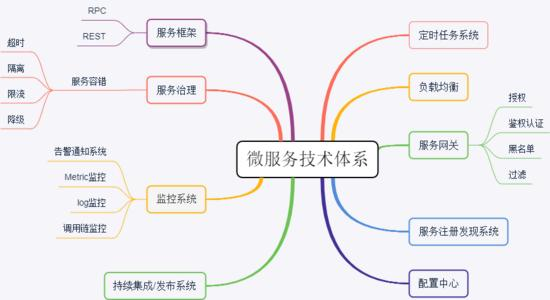
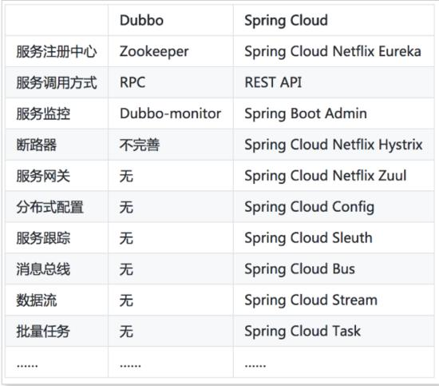

# 一、微服务技术体系

下图列出了微服务的技术体系：

# 二、Golang微服务技术栈

## 微服务框架

- go-micro
- go-kit

国内的bilibili和斗鱼也出了一个微服务框架：

- kratos bilibili出品
- jupiter 斗鱼出品

## 网关

- kong
- nginx +lua
- traefik
- apisix

## 服务注册和发现

- consul
- etcd
- zookeeper
- nacos

## 配置中心

- apollo
- nacos

## 服务治理

- 断路器：hystrix-go
- 流量控制：sentinel-golang 从限流、流量整形、熔断降级、系统负载保护等多个维度来帮助您保障微服务的稳定性

## 链路监控

- zipkin
- pinpoint
- skywalking
- jaeger

## 日志、业务、系统监控

- prometheus
- ELK

# 三、java微服务技术栈

用java技术开发微服务，比较主流的选择有：Spring Cloud 和 Dubbo。

## Spring Cloud

Spring Cloud 是在Spring基础上构建的，它后面有2大公司支撑，Pivotal和Netfix的技术支持。它的核心就是Netflix贡献的源码，也是这家公司构建了整套微服务体系，才使得微服务架构逐渐流行开来，所以说Netflix在微服务上的贡献是巨大的。

### Pivotal的SpingCloud

Pivotal的SpingCloud框架，`Spring Cloud`，这个是Pivotal集成了Netfix，或者重新改写了它的框架。

Spring是一个全家桶，Spring Cloud也是一个全家桶，它由很多技术框架组合而成：

- 服务治理服务注册和发现：Netflix Eureka
    当然我们也有其他的选择，比如consul，etcd，zookeeper等
- 断路器：Hystrix
- 调用端负载均衡：RibbonREST
- 网关：Zuul
    当然我们也可以选择其他的，比如Spring Cloud Gateway，kong，nginx+lua，apisix等
- 分布式链路监控: Spring Cloud Sleuth
    埋点和发送数据当然还有其他的比如zipkin，pinpoint，skywalking，jaeger等
- 消息组件: Spring Cloud StreamSpirng Cloud Bus 
- 消息中间件的其他软件：RocketMQ，Kafka，RabbitMQ
- 配置中心: Spring Cloud Config，配置中心可以有其他的替代，比如Apollo，Nacos等
- 安全控制: Spring Cloud Security

### 阿里巴巴的SpringCloud

- Sentinel ：把流量作为切入点，从流量控制、熔断降级、系统负载保护等多个维度保护服务的稳定性
- Nacos ：一个更易于构建云原生应用的动态服务发现、配置管理和服务管理平台。
- RocketMQ ：一款开源的分布式消息系统，基于高可用分布式集群技术，提供低延时的、高可靠的消息发布与订阅服务。
- Dubbo ：Apache Dubbo™ 是一款高性能 Java RPC 框架。
- Seata ：阿里巴巴开源产品，一个易于使用的高性能微服务分布式事务解决方案。
- Alibaba Cloud ACM ：一款在分布式架构环境中对应用配置进行集中管理和推送的应用配置中心产品。
- Alibaba Cloud OSS: 阿里云对象存储服务（Object Storage Service，简称 OSS），是阿里云提供的海量、安全、低成本、高可靠的云存储服务。您可以在任何应用、任何时间、任何地点存储和访问任意类型的数据。
- Alibaba Cloud SchedulerX: 阿里中间件团队开发的一款分布式任务调度产品，提供秒级、精准、高可靠、高可用的定时（基于 Cron 表达式）任务调度服务。
- Alibaba Cloud SMS: 覆盖全球的短信服务，友好、高效、智能的互联化通讯能力，帮助企业迅速搭建客户触达通道。

### 阿里巴巴 dubbo

从上面spring-cloud-alibabba组件组成来看，Dubbo是它的一个子框架。

Dubbo具有调度、发现、监控、治理、服务发现等功能。

- 优点
    - Dubbo 支持 RPC 调用，服务之间的调用性能会很好
    - 支持多种序列化协议，如 Hessian、HTTP、WebService。
    - Dobbo Admin后台管理功能强大，提供了路由规则、动态配置、访问控制、权重调节、均衡负载等功能。
    - 在国内影响力比较大，中文社区文档较为全面。
- 缺点
    - 它只是微服务的一个子集，一个子框架。服务治理
    - 国内公司用的多，阿里以前不维护，现在重启维护，而且还捐献给了apache基金会

### Dubbo和Spring Cloud对比

Dubbo是专注于RPC和服务治理，Spring Cloud是一个微服务的全家桶，也可以说是微服务生态，功能齐全，社区维护也积极。

SpringCloud国内外公司应用多，dubbo主要是国内公司用的多。

## java微服务框架总结

就微服务体系来说，Dubbo只是整个微服务的一部分。Spring Cloud是一整套微服务体系，它是一个完整的解决方案。Spring Cloud社区强大，也很活跃。
