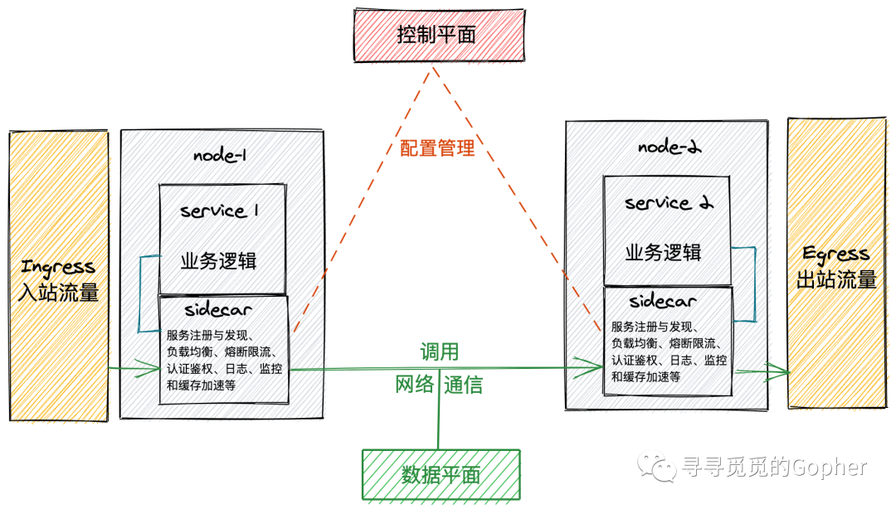

<!-- TOC -->

- [微服务实践系列一之微服务架构](#微服务实践系列一之微服务架构)
    - [单体架构](#单体架构)
    - [升级！微服务架构](#升级微服务架构)
    - [微服务该如何划分](#微服务该如何划分)
    - [思考，微服务带来了什么问题需要治理](#思考微服务带来了什么问题需要治理)
        - [1、请求网关](#1请求网关)
        - [2、服务注册与发现](#2服务注册与发现)
        - [3、可观察性](#3可观察性)
        - [4、容错处理](#4容错处理)
        - [5、统一认证与授权](#5统一认证与授权)
        - [6、负载均衡](#6负载均衡)
    - [好多组件，怎么引入——微服务框架](#好多组件怎么引入微服务框架)
    - [非侵入式架构——服务网格](#非侵入式架构服务网格)
    - [参考资料](#参考资料)

<!-- /TOC -->
# 微服务实践系列一之微服务架构

## 单体架构

在引入微服务架构之前，由于业务需求简单，我做的应用基本都是如下的单体架构。

使用Golang编写API模块主要划分为三层设计。

1. Controller，服务入口，负责处理路由，参数校验，请求转发。
2. Service，逻辑（服务）层，业务逻辑的入口，默认这里所有的请求参数一定是合法的了。业务逻辑和业务流程也都在这一层中。
3. DAO，这一层主要负责和数据、存储打交道。将下层存储以更简单的函数、接口形式暴露给 Service 层来使用。负责数据的持久化工作。

单体架构的特点就是将所有的功能集成在一个项目工程里了，部署时，得益于golang的强大，只要使用`go build`工具打包出二进制文件后放到服务器上就可以跑起来，再用Nginx做一下反向代理和负载均衡就基本OK了。

但是呢，缺点也很明显，现在全部功能都集成在一个工程里了，一旦版本需要扩展维护、升级迭代的，修改一处地方就要将整个应用全部重新编译、部署、启动，牵一发而动全身。长此以往，系统的维护升级会越来越困难，甚至不断的推翻重建。

## 升级！微服务架构

既然单体应用是将全部功能都集成在一个工程里去编译部署，那现在只要把功能拆分出来，将每个拆分的模块作为一个单独的服务（即微服务），去独立部，这一个个的微服务共同组成整个应用不就好了吗。

> 引自维基百科：2014年，Martin Fowler 与 James Lewis 共同提出了微服务的概念，定义了微服务是由以单一应用程序构成的小服务，自己拥有自己的行程与轻量化处理，服务依业务功能设计，以全自动的方式部署，与其他服务使用HTTP API通信。同时服务会使用最小的规模的集中管理 (例如 Docker) 能力，服务可以用不同的编程语言与数据库等组件实现。

试想一下，一个复杂项目，如果是单体架构，CURD过程中，分工该怎么分，就比如很多公共业务，经常每个人都去实现了一遍；项目组有新人加入了，想加个什么功能，还得有项目全部的代码才能跑起来测试。

而使用微服务架构的话，每个人可以单独负责自己的模块，各司其职，模块之间使用 HTTP RESTful API 进行通信就好了，而且哪个模块出了问题，也可以快速定位到（背锅）。

基于以上问题，可以搭建一个简易的微服务架构，如图：

## 微服务该如何划分

现在知道了微服务架构就是将单体架构拆分成一个个微服务，但是微服务的粒度与边界划分该怎么去设计呢？

解决思路：

`DDD （领域驱动设计Domain-DrivenDesign）`可以为微服务的边界拆分提供方法论，可以解决微服务的粒度问题。

DDD可以分为两个方面，

**战略模式————多个微服务之间的协作**
DDD 中根据问题域，将问题划分为领域/子域、通用语言、限界上下文和架构风格。

**战术设计————单个微服务中的设计**
战术设计是对限界上下文的具体化和细致化，涉及具体领域对象的设计，战术设计的关键在于抽象出限界上下文中的领域对象及其关系。

DDD 是一种思想、方法论，它可以分离业务复杂度和技术复杂度，最终目标是高内聚、低耦合。

## 思考，微服务带来了什么问题需要治理

使用微服务架构将应用系统划分成了很多个微服务，这些数量庞大的微服务实例治理起来存在很多的问题。

### 1、请求网关

上面搭建的简易微服务架构方式还存在很大的问题，在之前的单体架构中，客户端向服务端发起请求时，是会先经过 Nginx 进行处理然后才请求到我们的服务中的，而在现在的微服务架构中将原来的单体应用拆分成了多个微服务应用，如果直接对外暴露这些微服务，会造成以下问题：

1. 客户端的需求与每个微服务暴露的细粒度的 API 不匹配（客户端想要获取某些数据时，总不能连续去调用多个服务进行组合吧）

2. 协议问题，微服务之间的调用通常是使用RPC消息传递协议的，这种协议对web调用是不友好的。

应对这些问题，针对服务的入口，微服务的调用需要有一个把关的东西，也就是API网关。

> 引自《微服务：从设计到部署》：API 网关是一个服务器，是系统的单入口点。它类似于面向对象设计模式中的门面（Facade）模式。API 网关封装了内部系统架构，并针对每个客户端提供一个定制 API。它还可用于认证、监控、负载均衡、缓存和静态响应处理。

API 网关负责`请求路由、组合和协议转换`。所有客户端请求首先要通过 API 网关，之后请求被路由到适当的服务。API 网关通常会通过调用多个微服务来处理一个请求并聚合结果。它可以在 Web 协议（如 HTTP 和 WebSocket）和用于内部的非 Web 友好协议之间进行转换。

API 网关还可以为每个客户端提供一个定制 API。它通常会为移动客户端暴露一个粗粒度的 API，通过调用各种服务并组合结果，减少了客户端与应用之间的往返次数，同时简化了客户端的代码。

**常见的网关选型有：Nginx、Netflix Zuul、Kong 等。**

### 2、服务注册与发现

单体服务拆分为微服务后，如果微服务之间存在调用依赖，就需要得到目标服务的服务地址，也就是微服务治理的`“服务发现”`。要完成服务发现，就需要将服务信息存储到某个载体，载体本身即是微服务治理的`“服务注册与发现中心”`，而存储到载体的动作即是`“服务注册”`。

服务注册与发现中心主要有以下的职责：

1. 管理当前注册到服务注册与发现中心的微服务实例元数据信息，包括服务实例的服务名、IP 地址、端口号、服务描述和服务状态等；

2. 与注册到服务注册与发现中心的微服务实例维持心跳，定期检查注册表中的服务实例是否在线，并剔除无效服务实例信息；

3. 提供服务发现能力，为服务调用方提供服务提供方的服务实例元数据。

**常见的服务注册与发现组件有：Consul、Etcd、ZooKeeper 等。**

### 3、可观察性

微服务由于较单体应用有了更多的部署载体，需要对众多服务间的调用关系、状态有清晰的掌控。可观测性就包括了`调用拓扑关系、监控（Metrics）、日志（Logging）、链路追踪（Tracing）等`。

Tracing、Logging 和 Metrics 这三者之间存在一定的关系，既可以单独使用，也可以组合使用。每一个组件都有其侧重点，Tracing 用于追踪具体的请求，绘制调用的拓扑；Logging 则是主动记录的日志事件；Metrics 记录了请求相关的时序数据，通常用于性能统计。在分布式系统中，这三者通常是组合在一起使用。

**常见的组件组合方式为：Metrics：Prometheus + Logging：ELK + Tracing：Jaeger 。**

### 4、容错处理

为了保障分布式系统的高可用性，微服务还需要进行容错处理，比如实现`熔断，接口限流和降级`等机制。

熔断指，当一个服务因为各种原因停止响应时，调用方通常会等待一段时间，然后超时或者收到错误返回。如果调用链路比较长，可能会导致请求堆积，整条链路占用大量资源一直在等待下游响应。所以当多次访问一个服务失败时，应熔断，标记该服务已停止工作，直接返回错误。直至该服务恢复正常后再重新建立连接。

服务降级指，当下游服务停止工作后，如果该服务并非核心业务，则上游服务应该降级，以保证核心业务不中断。

限流指，一个服务挂掉后，上游服务或者用户一般会习惯性地重试访问。这导致一旦服务恢复正常，很可能因为瞬间网络流量过大又立刻挂掉，因此服务需要能够自我保护——限流。

**熔断，接口限流和降级可以使用服务间断路器Hystrix实现，也可以直接通过API网关实现。**

### 5、统一认证与授权

不同微服务承载自身独有的业务职责，对于业务敏感的微服务，需要对其他服务的访问进行认证与鉴权。

**目前主流的统一认证和授权方式有 OIDC、OAuth2、分布式 Session 和 JWT 等。**

### 6、负载均衡

负载均衡指的是在一个集群中通过某种硬件设备或者软件算法来选择集群中的一台机器处理当前请求，以达到大量请求的分发到多台服务器上进行处理，使得所有服务器负载都维持在高效稳定的状态，以提高系统的吞吐量。此外，多个服务实例组成的服务集群，消除了单点问题，当某一个服务实例宕机时，负载均衡就不会将请求分发给它，而是转发给其他正常的服务实例，以此提高整个系统的可用性。

负载均衡常分为`硬件负载均衡、软件负载均衡和DNS负载均衡`，其中软件负载均衡又分为`客户端负载均衡和服务端负载均衡`。 

硬件负载均衡，是直接在服务器和外部网络间安装负载均衡设备，这种设备通常称之为负载均衡器，由于专门的设备完成专门的任务，独立于操作系统，整体性能得到大量提高，加上多样化的负载均衡策略，智能化的流量管理，可达到最佳的负载均衡需求，其主要应用在大型服务器集群中，比如F5负载均衡器。

软件负载均衡，是在服务器的操作系统上安装负载均衡软件，从此服务器发出的请求经软件负载均衡算法路由到后端集群的某一台机器上。

DNS负载均衡，用于地理位置上的负载均衡，比如你的网站在全国范围内都有海量用户，那么当不同用户访问网站域名时经过DNS判断返回给不同地理位置的用户的不同IP，从而达到就近访问，流量分担，提升用户体验。

在微服务架构中，负载均衡常见的应用场景为：

1. 基于服务注册和发现的负载均衡机制

    这里的负载均衡的逻辑是运行在客户端的，属于客户端负载均衡，相比于服务器端负载均衡，它有一个显著的优点，就是可以一定程度避免单点故障。在客户端负载均衡中，所有的客户端节点都有一份自己要访问的服务端清单，这些清单统统都是从服务注册中心获取的。

2. API 网关的负载均衡

## 好多组件，怎么引入——微服务框架

经过上面，我们知道了微服务架构要去治理所带来的问题，通常我们需要自行组合各种组件，比如 RPC、负载均衡、熔断等，因此也诞生了很多微服务框架，比如 Java 的 Spring Cloud，Go 的 Go Kit 、 Go Micro 、Go Zero 和 Go kratos 等。但这些框架和开源组件基本都具有侵入性，需要在业务服务中引入服务治理组件。

## 非侵入式架构——服务网格

微服务架构实践主要有`侵入式架构和非侵入式架构`两种实现形式。侵入式架构是指服务框架嵌入程序代码，开发者组合各种组件，实现微服务架构。非侵入式架构则是以代理的形式与应用程序部署在一起，代理接管应用程序的网络且对应用程序透明，这时开发者只需要关注自身业务即可，这种方式以`服务网格（Service Mesh） `为代表。

服务网格可以理解为微服务的辅助，核心在于将客户端 SDK 剥离，以 Proxy 组件方式独立进程运行，每个服务都额外部署这个 Proxy 组件，所有出站入站的流量都通过该组件进行处理和转发。这个组件被称为 `Sidecar`（边车模式，类似连接到摩托车的边车），Sidecar 边车应用与父应用程序共享相同的生命周期，与父应用程序一起创建和退出。

Sidecar 只负责网络通信。还需要有个组件来统一管理所有sidecar的配置。在Service Mesh中，负责配置管理的部分叫`控制平面（control plane）`，负责网络通信的部分叫`数据平面（data plane）`。数据平面和控制平面构成了Service Mesh的基本架构。如图：

**常见服务网格开源项目有 Istio 、Envoy 、 Linkerd 等。**

## 参考资料

- [https://www.cnblogs.com/xishuai/p/microservices-and-service-mesh.html](https://www.cnblogs.com/xishuai/p/microservices-and-service-mesh.html)
- [https://www.cnblogs.com/skabyy/p/11396571.html](https://www.cnblogs.com/skabyy/p/11396571.html)
- [https://sq.163yun.com/blog/article/404438199148974080](https://sq.163yun.com/blog/article/404438199148974080)
- [https://www.toutiao.com/i6896289132050547207/](https://www.toutiao.com/i6896289132050547207/)
- [https://www.jianshu.com/p/dd818114ab4b](https://www.jianshu.com/p/dd818114ab4b)
- [https://cloud.tencent.com/developer/article/1593724](https://cloud.tencent.com/developer/article/1593724)

文章来自：[https://www.modb.pro/db/74449](https://www.modb.pro/db/74449)
