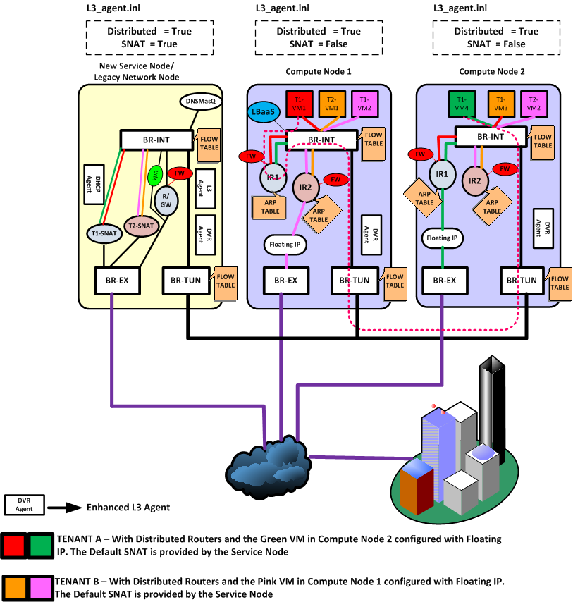

<!-- TOC -->

- [1. netfilter](#1-netfilter)
    - [1.1. 连接跟踪（conntrack）](#11-连接跟踪conntrack)
        - [1.1.1. 连接跟踪发生在哪里](#111-连接跟踪发生在哪里)
        - [1.1.2. 连接跟踪信息是什么](#112-连接跟踪信息是什么)
        - [1.1.3. 状态跟踪](#113-状态跟踪)
    - [1.2. Iptables](#12-iptables)
- [2. snat & dnat](#2-snat--dnat)
    - [2.1. snat（只出不进）](#21-snat只出不进)
    - [2.2. dnat（只进不出）](#22-dnat只进不出)
- [3. openstack 路由器拓扑解析](#3-openstack-路由器拓扑解析)
    - [3.1. 路由器分类](#31-路由器分类)
    - [3.2. 路由器分布拓扑](#32-路由器分布拓扑)
    - [3.3. 路由器流量拓扑](#33-路由器流量拓扑)
        - [3.3.1. Legacy Router](#331-legacy-router)
        - [3.3.2. 分布式路由器](#332-分布式路由器)
        - [3.3.3. 结束语](#333-结束语)
- [4. dvr](#4-dvr)
- [5. 典型场景](#5-典型场景)
    - [5.1. 东西向](#51-东西向)
        - [5.1.1. 同一机器](#511-同一机器)
        - [5.1.2. 不同机器](#512-不同机器)
    - [5.2. 南北向](#52-南北向)
        - [5.2.1. 无 floating IP（dvr_snat）](#521-无-floating-ipdvr_snat)
        - [5.2.2. 有 floating IP](#522-有-floating-ip)
- [6. references](#6-references)

<!-- /TOC -->

# 1. netfilter

Netfilter 是 Linux 内核中一个对数据 包进行控制、修改和过滤（manipulation and filtering）的框架。它在内核协议栈中设置了若干 hook 点，以此对数据包进行拦截、过滤或其他处理，在内核级提供防火墙功能。内核中选取五个位置放了五个hook(勾子) function(INPUT、OUTPUT、FORWARD、PREROUTING、POSTROUTING)，而这五个hook function向用户开放，用户可以通过一个命令工具（iptables）向其写入规则。

报文流向：

    流入本机：PREROUTING --> INPUT-->用户空间进程

    流出本机：用户空间进程-->OUTPUT--> POSTROUTING

    转发：PREROUTING --> FORWARD --> POSTROUTING

内核中数据包的传输过程：

1. 当一个数据包进入网卡时，数据包首先进入PREROUTING链，内核根据数据包目的IP判断是否需要转送出去；
2. 如果数据包就是进入本机的，数据包就会到达INPUT链。经INPUT链检查后，数据包被发往本地进程。本地进程进行相应处理后发送响应数据包，数据包经过OUTPUT链，然后到达POSTROUTING链输出；
3. 如果数据包是要转发出去的，且内核允许转发，数据包就会向右移动，经过FORWARD链，然后到达POSTROUTING链输出。

## 1.1. 连接跟踪（conntrack）

连接跟踪是一个非常重要的模块，它是状态防火墙、ipvs 负载均衡、NAT 等功能的核心依赖模块。

Linux 的连接跟踪是在 Netfilter 中实现的。所以现在提到连接跟踪（conntrack），可能首先都会想到 Netfilter，Netfilter 只是 Linux 内核中的一种连接跟踪实现。换句话说，只要具备了 hook 能力，能拦截到进出主机的每个包，完全可以在此基础上自己实现一套连接跟踪。

云原生网络方案 Cilium 在 1.7.4+ 版本就实现了这样一套独立的连接跟踪和 NAT 机制 （完备功能需要 Kernel 4.19+）。其基本原理是：

1. 基于 BPF hook 实现数据包的拦截功能（等价于 netfilter 里面的 hook 机制）

2. 在 BPF hook 的基础上，实现一套全新的 conntrack 和 NAT。因此，即便卸载掉 Netfilter ，也不会影响 Cilium 对 Kubernetes ClusterIP、NodePort、ExternalIPs 和 LoadBalancer 等功能的支持。由于这套连接跟踪机制是独立于 Netfilter 的，因此它的 conntrack 和 NAT 信息也没有存储在内核的（也就是 Netfilter 的）conntrack table 和 NAT table。所以常规的 conntrack/netstats/ss/lsof 等工具是看不到的，要使用 Cilium 的命令。

连接跟踪系统本身不会过滤数据包，除了一些特殊情况之外（例如，数据结构内存不足，无法存储更多连接信息）它的默认行为是让数据包继续在网络协议栈中处理，所以请记住连接跟踪系统仅仅是跟踪数据包，没有过滤功能，但是可以给过滤机制提供数据。在 linux 中，数据过滤是 netfilter 实现的。

### 1.1.1. 连接跟踪发生在哪里

连接跟踪需要拿到报文的第一手资料，因此它们的入口是以高优先级存在于LOCAL_OUT(本机发送)和PRE_ROUTING(报文接收)这两个链。

既然有入口，自然就有出口。连接跟踪采用的方案是在入口记录，在出口确认(confirm)。以IPv4为例：

当连接的第一个skb通过入口时，连接跟踪会将连接跟踪信息保存在skb->nfctinfo，而在出口处，连接跟踪会从skb上取下连接跟踪信息，保存在自己的hash表中。当然，如果这个数据包在中途其他HOOK点被丢弃了，也就不存在最后的confirm过程了。

### 1.1.2. 连接跟踪信息是什么

连接跟踪系统将一个连接的状态信息存放在 hash 表中，这些信息包括发送方向、目的、源IP地址、目的、源端口号、协议类型、状态和超时时间。

### 1.1.3. 状态跟踪

conntrack共可以为connection标记五种状态（这里的状态跟 tcp 协议状态不是一回事），分别如下：

1. **NEW**：新建连接请求的数据包，且该数据包没有和任何已有连接相关联。 判断的依据是conntrack当前“只看到一个方向数据包(UNREPLIED)”，没有回包。
2. **ESTABLISHED**：该连接是某NEW状态连接的回包，也就是完成了连接的双向关联。nf_conntrack第一次发现该连接的时候，会将其状态设置为NEW，当反方向也出现包的时候，即认为是ESTABLISHED。
3. **RELATED**：匹配那些属于helper模块定义的特殊协议的网络连接，该连接属于已经存在的一个ESTABLISHED连接的衍生连接。简而言之，A连接已经是ESTABLISHED，而B连接如果与A连接相关，那么B连接就是RELATED。
4. **INVALID**：匹配那些无法识别或没有任何状态的数据包。这可能是由于系统内存不足或收到不属于任何已知连接的ICMP错误消息，也就是垃圾包，一般情况下我们都会通过过滤器去DROP此类状态的包。
5. **UNTRACKED**：这是一种特殊状态，或者说并不是状态。它是管理员在raw表中，为连接设置NOTRACK规则后的状态。这样做，便于提高包过滤效率以及降低负载。conntrack是一种状态跟踪和记录的机制，本身并不能过滤数据包，只是提供包过滤的依据。 有状态是一种过滤依据，无状态实际也是一种过滤依据。因此，需要小心的是，设置了NOTRACK，不代表是放行，只是它的状态是UNTRACKED。所以如果想要对这种包放行或者处理，同样需要配置相应的规则。

## 1.2. Iptables

Iptables 是配置 Netfilter 过滤功能的用户空间工具。 netfilter 才是防火墙真正的安全框架（framework），netfilter 位于内核空间。iptables 其实是一个命令行工具，位于用户空间，我们用这个工具操作真正的框架。Iptable 根据规则所定义的方法来处理数据包，如放行（accept）、拒绝（reject）和丢弃（drop）等。

# 2. snat & dnat

SNAT 和 DNAT 是 iptables 中使用 NAT 规则相关的的两个重要概念。

## 2.1. snat（只出不进）

将不同私有 IP 都映射成同一个“公有 IP”，以使其能访问外部网络服务。

SNAT是指在数据包从网卡发送出去的时候，把数据包中的源地址部分替换为指定的公网IP，这样，接收方就认为数据包的来源是被替换的那个公网IP的主机。所以，snat 是在 POSTROUTING 链上进行的。

## 2.2. dnat（只进不出）

当内部需要提供对外服务时(如对外发布web网站)，外部地址发起主动连接，由路由器或者防火墙上的网关接收这个连接，然后将连接转换到内部，此过程是由带有公网IP的网关替代内部服务来接收外部的连接，然后在内部做地址转换，此转换称为DNAT，主要用于内部服务对外发布。

DNAT就是指数据包从网卡接收到的时候，修改数据包中的目的IP（和目的端口）。当外网的数据包进入到内网时，我们需要修改数据包中的公网 IP （和目的端口）为内网的主机 IP（和目的端口），这种 DNAT 的行为规则就是在 PREROUTING 链里添加的。

# 3. openstack 路由器拓扑解析

Neutron 是 OpenStack 中提供虚拟化网络的核心组件，像DHCP、路由器和负载均衡都是 Neutron 实现的。Neutron 一方面在控制节点通过 Neutron-Server 提供 API 接口给用户去创建和操作虚拟化的网络;一方面在计算节点和网络节点通过各种 Neutron Agent去实现这些网络。

## 3.1. 路由器分类

OpenStack 中的路由器可以从不同的角度进行分类，从路由器是否是分布式的可以分为：DVR(Distributed Virtual Router, 分布式路由器)和 Legacy Router(传统路由器)，从路由器是否是高可用的又可以分为：HA Router(高可用路由器)和 Non-HA Router(非高可用路由器)。
通过相互组合，OpenStack 可以根据用户需要实现各种各样的虚拟化路由器，接下来，我们将以拓扑图解的方式介绍这些虚拟化路由器的相似与差异。

## 3.2. 路由器分布拓扑

在图中，Router 1~4 分别代表了几类经常使用的路由器，下面分别来介绍这几种路由器在 OpenStack 集群中的分布差异以及如何对它们进行分类。

Router 1 只分布在网络节点，所以它是 Legacy Router;并且 Router 1 是分布在多台网络节点上的，所以它也是 HA Router。可以总结为 Router 1 是一个 HA Legacy Router。

Router 2 和 Router 1 类似，都是 Legacy Router，但是 Router 2只分布在一台网络节点上，所以称它为一个 Non-HA Legacy Router。

Router 3在计算节点和多台网络节点上都有分布，分别符合分布式路由器和高可用路由器的特征，所以 Router 3 是一个 HA DVR。

Router 4 和 Router 3 类似，都是 DVR，但是 Router 4只在一台网络节点上有分布，所以可以说它是一个 Non-HA DVR。

## 3.3. 路由器流量拓扑

前面介绍了几种路由器在OpenStack 集群中的分布拓扑，下面我们将深入了解在OpenStack 集群中的网络流量如何通过这些路由器。

### 3.3.1. Legacy Router

如图所示，网络 Network 1 和网络 Network 2 连接在 Legacy Router 下， VM 1 和 VM 2 分别是在这两个网络下创建的虚机。

可以看到，VM 1 和VM 2 需要经过网络节点上的 Legacy Router 进行互通，该互通的网络流量也称为东西向网络流量;同时，VM 1 和 VM 2 如果想和外网进行通信，也需要经过网络节点上的 Legacy Router 和外网交换机与外部网络进行交互，这种交互的网络流量也称为南北向网络流量。

当 Legacy Router 是 Non-HA 时，即路由器只分布在一台网络节点上，流量拓扑如上图所示。那么当 Legacy Router 是 HA 时的流量拓扑有什么差异呢?

当 Legacy Router 是 HA 时，路由器会分布在多台网络节点上，但某一时刻，只有一台网络节点上的路由器会承载虚机的网络流量，我们称该路由器为 Master Router，其它网络节点的相同路由器为 Standby Router，虚机流量拓扑见下图(此时，Master Router 在网络节点B上)：

### 3.3.2. 分布式路由器

DVR 路由器即分布式路由器，它的一个主要特征是虚机间的东西向网络流量不需要经过网络节点，当东西向网络流量需要路由时，会被虚机所在计算节点上的路由器及时处理，从而有效减少东西向网络流量路径，提高了网络交互效率，DVR 的东西向网络拓扑图如下：

那么 DVR 路由器又是如何处理南北向网络的呢?请看下图：

图中显示了两种虚机经过DVR与外网进行网络连接的方式，一种是经过网络节点(VM 1)，一种是从计算节点出来通过交换机直连外网(VM 2)。那么 VM 1 和 VM 2 的南北向网络路径为什么不一样呢?

在 DVR 中，当虚机关联了浮动IP地址之后，虚机所在计算节点上的路由器会创建该虚机直连外网的通道，即经过该计算节点上的外网网卡与外网连通，如图中的 VM 2。但是如果虚机没有关联浮动 IP 地址，那么该虚机还是需要通过网络节点上路由器的默认网关连接外网，如图中的 VM 1。
我们在前面说到，DVR 也有 HA 和 Non-HA 之分，其实，HA DVR 和 Non-HA DVR 在处理东西向网络流量和带有浮动IP地址的南北向网络流量时并没有差异，只是在处理没有关联浮动 IP 地址的虚机南北向网络时会进行多个网络节点的路径选择而已，这与 Legacy Router 是一样的，HA DVR处理南北向网络的流量拓扑可参考下图。

### 3.3.3. 结束语

本次我们以拓扑的方式对 OpenStack 中几种常用的路由器进行了对比和解析。对照路由器的分布拓扑图，我们知道了 OpenStack 路由器是如何在网络节点和计算节点上分布的，再之，我们又通过网络流量拓扑图，掌握了各种路由器处理东西向流量和南北向流量的方法以及它们的差异点。

通过文中的图示和解析，我们在宏观和微观上对 OpenStack 路由器都有了基本的了解。

# 4. dvr

在openstack传统的集中式路由环境下，南北流量和跨网络的东西流量都要经过网络节点，当计算节点规模越来越大的时候，网络节点很快会成为整个系统的瓶颈，为解决这个问题引入了Distribute Virtual Router (DVR)的概念。
DVR是将路由分布到计算节点，floating ip的南北流量和跨网段的东西流量由虚机所在计算节点上的虚拟路由进行路由。只有未绑定floating ip的vm的南北流量才需要通过网络节点SNAT访问外网。

# 5. 典型场景
从网络的访问看，涉及到路由服务的至少是需要跨子网的访问，又包括是否是同一机器、是否是涉及到外网（东西向 vs 南北向）。

考虑下面几个跨子网路由的典型场景。
| 方向 | 同一机器 | 不同机器 |
| --- | :--- | :--- |
| 东西 | 本地网桥处理 | 本地东西路由器 |
| 南北 | 本地南北路由器 floating 转发 | 网络节点 SNAT 转发 |

## 5.1. 东西向
东西向意味着租户同一个数据中心内不同子网之间的互相访问。

### 5.1.1. 同一机器
对于同一主机上的不同子网之间访问，路由器直接在 br-int 上转发即可，不需要经过外部网桥。

### 5.1.2. 不同机器

如图所示，租户 T1 的两台虚拟机 VM1（计算节点 1）和 VM4（计算节点 2）分别属于不同子网，位于不同的计算节点。VM1 要访问 VM4，由计算节点 1 上的 IR1 起到路由器功能。返程的网包，则由计算节点 2 上的路由器 IR2 起作用。

## 5.2. 南北向

南北向的流量主要分为两种情况，一种是子网内所有主机共有一个出口：dvr_snat、一种是单个主机绑定浮动IP，这两种情况稍有不同。

### 5.2.1. 无 floating IP（dvr_snat）

租户 T2 内部子网的 vm VM1 试图访问外部网络，经过网络节点上的 T2-SNAT 路由器：

为何这种情况下必须从网络节点走？这是因为对于外部网络来说，看到的都是外部接口的地址，这个地址只有一个。

当然，如果以后每个计算节点上都可以带有这样一个 SNAT 默认外部地址的话，这种情况下的流量也是可以直接从计算节点出去的。

### 5.2.2. 有 floating IP

这种情况下，计算节点上的专门负责的外部路由器将负责进行转发，即计算节点 1 上的 IR2 和计算节点 2 上的 IR1。

如果说SNAT是一群主机的狂欢，那么浮动IP就是一台主机的孤单。公有云中最为常见的功能，通过将公网地址直接绑定到主机网卡上，实现主机与外部网络的直接通信。并可以随时解绑，关联到其他任意主机。

# 6. references
1. [深入理解 neutron: dvr](https://www.bookstack.cn/read/openstack_understand_Neutron/dvr-README.md)
