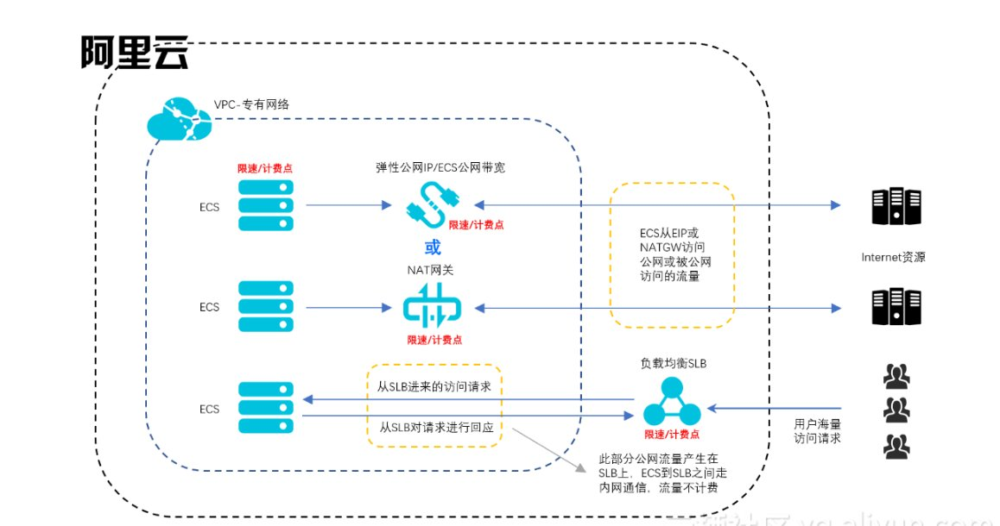

# 公有云 ip 概念

阿里云弹性公网IP使用更灵活，EIP可以独立持有，可以将EIP绑定到ECS、NAT网关、ENI网卡、私网负载均衡SLB上，也可以实现动态解绑，使用更灵活。固定公网IP是跟随ECS云服务器创建的，不可以解绑，也不可以绑定其他实例，固定IP可以转成EIP。

另外，公网IP可以在ECS实例的网卡上看到， 而EIP是通过NAT方式将IP地址映射到ECS的位于私网的网卡上，所以在网卡上看不到EIP。

| 云产品 | 功能 | 优势 |
| :--- | :--- | :--- |
| ECS固定公网IP | 创建ECS时，为ECS选择分配公网IP地址，系统会自动分配一个支持公网访问的固定IP地址。固定公网IP是跟随ECS云服务器创建的，不可以解绑，也不可以绑定其他实例。| 支持使用共享流量包，将公网IP转换为EIP后也可以使用共享带宽。 固定公网IP可以在ECS实例的网卡上可以看到。|
| 弹性公网IP（EIP） | EIP可以动态和VPC ECS实例绑定和解绑，支持VPC ECS实例访问公网（SNAT）和被公网访问（DNAT）。EIP可以绑定ECS、还能够绑定私网SLB和NAT网关 | EIP可以随时和ECS实例绑定和解绑。可以使用共享带宽和共享流量包，降低公网成本。EIP是通过NAT方式将IP地址映射到ECS的位于私网的网卡上，所以在ECS网卡上看不到EIP。 |
| NAT网关 | 支持多台VPC ECS实例访问公网（SNAT）和被公网访问（DNAT）。说明：和负载均衡相比，NAT网关本身没有均衡流量的功能。 | NAT网关和EIP的核心区别是NAT网关可用于多台VPC ECS实例和公网通信，而EIP只能用于一台VPC ECS实例和公网通信。 |
| 负载均衡SLB | 基于端口提供四层和七层负载均衡功能，支持用户从公网通过负载均衡（SLB）访问ECS。说明：负载均衡不支持VPC网络的ECS通过负载均衡主动访问公网（SNAT）。 | 在DNAT方面，负载均衡是基于端口的负载均衡，即一个负载均衡的一个端口可以对应多台ECS。负载均衡通过对多台ECS进行流量分发，可以扩展应用系统对外的服务能力，并通过消除单点故障提升应用系统的可用性。绑定EIP后，支持使用共享带宽和共享流量包，降低公网成本。 |

综上，阿里云专有网络VPC连接公网的方式中ECS固定公网IP、弹性公网IP（EIP）和负载均衡均支持共享带宽和共享流量包，有利于降低公网成本；弹性公网EIP相对于固定公网IP使用更加灵活。

另外，负载均衡SLB仅提供被动访问公网的能力，即后端ECS只能在收到经过负载均衡SLB转发来的公网的请求时，才能访问公网回应该请求，如后端ECS但愿主动发起公网访问，则须要配置/购买ECS公网带宽、弹性公网IP或NAT网关来实现。

# Floating IP

FIP 是 openstack 上的一个概念。浮动IP与弹性公网IP功能类似，都是公网IP，用于连接公网，主要不同点在于浮动IP接口无法配置带宽参数。
