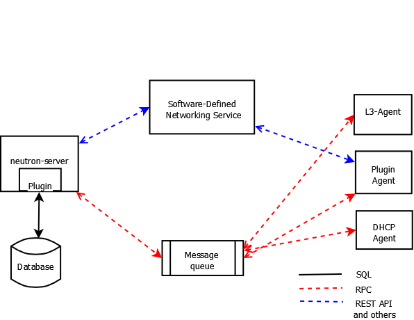
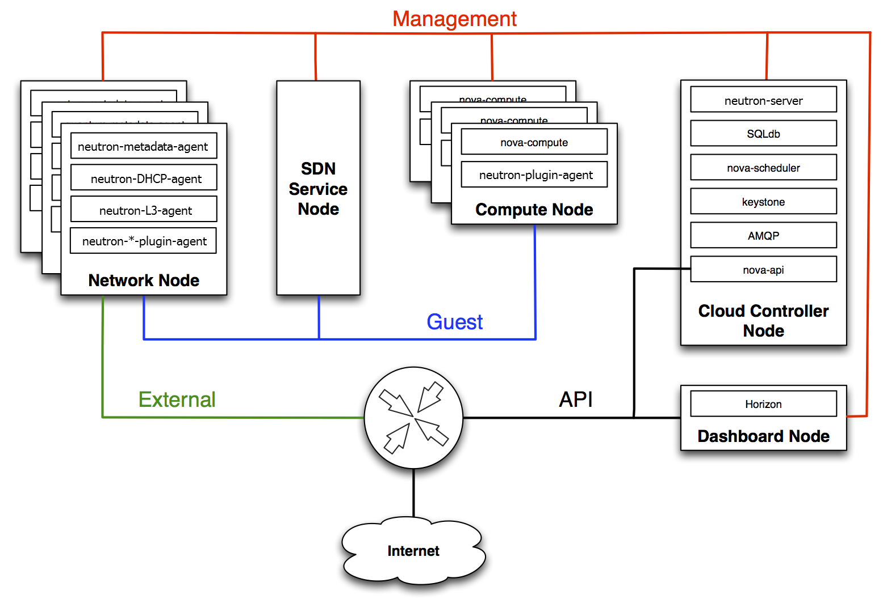
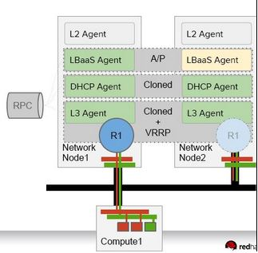
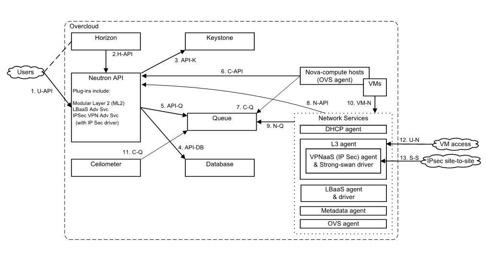
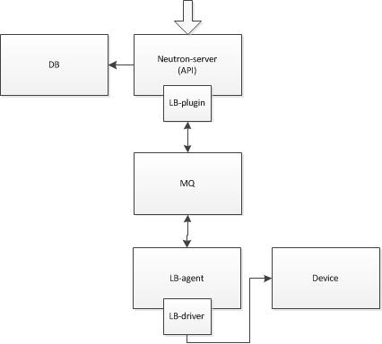

<!-- TOC -->

- [Networking architecture](#networking-architecture)
    - [neutron ha](#neutron-ha)
    - [lbaas basic concept](#lbaas-basic-concept)
    - [lbaas service architecutre](#lbaas-service-architecutre)
- [References](#references)

<!-- /TOC -->

# Networking architecture

OpenStack Networking is a standalone service that often deploys several processes across a number of nodes. These processes interact with each other and other OpenStack services. The main process of the OpenStack Networking service is neutron-server, a Python daemon that exposes the OpenStack Networking API and passes tenant requests to a suite of plug-ins for additional processing.

The OpenStack Networking components are:

**neutron server (neutron-server and neutron-*-plugin)**
This service runs on the network node to service the Networking API and its extensions. It also enforces the network model and IP addressing of each port. The neutron-server requires indirect access to a persistent database. This is accomplished through plugins, which communicate with the database using AMQP (Advanced Message Queuing Protocol).

**plugin agent (neutron-*-agent)**
Runs on each compute node to manage local virtual switch (vswitch) configuration. The plug-in that you use determine which agents run. This service requires message queue access and depends on the plugin used. Some plugins like OpenDaylight(ODL) and Open Virtual Network (OVN) do not require any python agents on compute nodes.

**DHCP agent (neutron-dhcp-agent)**
Provides DHCP services to tenant networks. This agent is the same across all plug-ins and is responsible for maintaining DHCP configuration. The neutron-dhcp-agent requires message queue access. Optional depending on plug-in.

**L3 agent (neutron-l3-agent)**
Provides L3/NAT forwarding for external network access of VMs on tenant networks. Requires message queue access. Optional depending on plug-in.

**network provider services (SDN server/services)**
Provides additional networking services to tenant networks. These SDN services may interact with neutron-server, neutron-plugin, and plugin-agents through communication channels such as REST APIs.

The following figure shows an architectural and networking flow diagram of the OpenStack Networking components:

the neutron server connects to a database where the logical network configuration persists. The Neutron server can take API requests from users and services and communicate with agents via a message queue. In a typical environment, network agents will be scattered across controller and compute nodes and perform duties on their respective node.

The following figure shows the network connectivity of physical servers（neutron dvr solution）:

Neutron does not have its own Layer 3(L3) routing capability, but it uses the Linux kernel bridging and routing mechanisms instead. In a large Cloud environment with a lot of virtual networks, tenants, and applications, all traffic requiring routing and floating IP services need to be handled by the same Neutron L3 agent. Therefore, the agent becomes the choke point. DVR solutions can distribute their own L2/L3 agents among OpenStack nodes to help eliminate Neutron L3 agent bottleneck issue. 

## neutron ha

除了 DHCP Agent 天生就通过配置可以实现 A/A HA 以及 L3 HA 以外，其它的组件的 HA 都是 A/P 的，而且实现的技术可以是原生的，也可以使用 Pacemaker，也可以结合起来使用。

结合 pacemaker 的 a/p 如下：

**Pacemaker** is an open source cluster resource manager that takes care of the life-cycle of deployed software. It is in charge of detecting and recovering from node and resource failures using the messaging and membership capabilities provided by Corosync.

**Corosync** (also open source) provides :

  a quorum system
  a messaging layer for clusters

## lbaas basic concept

The Networking service offers a load balancer feature called “LBaaS v2” through the neutron-lbaas service plug-in.

LBaaS v2 adds the concept of listeners to the LBaaS v1 load balancers. LBaaS v2 allows you to configure multiple listener ports on a single load balancer IP address.

There are two reference implementations of LBaaS v2. The one is an agent based implementation with HAProxy. The agents handle the HAProxy configuration and manage the HAProxy daemon. Another LBaaS v2 implementation, Octavia, has a separate API and separate worker processes that build load balancers within virtual machines on hypervisors that are managed by the Compute service. You do not need an agent for Octavia.

LBaaS v2 has several new concepts to understand:

**Load balancer**
The load balancer occupies a neutron network port and has an IP address assigned from a subnet.
**Listener**
Load balancers can listen for requests on multiple ports. Each one of those ports is specified by a listener.
**Pool**
A pool holds a list of members that serve content through the load balancer.
**Member**
Members are servers that serve traffic behind a load balancer. Each member is specified by the IP address and port that it uses to serve traffic.
**Health monitor**
Members may go offline from time to time and health monitors divert traffic away from members that are not responding properly. Health monitors are associated with pools.

LBaaS v2 has multiple implementations via different service plug-ins. The two most common implementations use either an agent or the Octavia services. Both implementations use the `LBaaS v2 API`.

## lbaas service architecutre

For example, in lbaas agent host, the driver of the lbaas agent will 
makes a interface call to configure the haproxy software lb device. 

# References
1. [CloudSDN: Enabling SDN Framework for Security and Threat Analytics in Cloud Networks](https://link.springer.com/chapter/10.1007/978-3-030-20615-4_12)
2. [Neutron networking architecture](https://docs.openstack.org/security-guide/networking/architecture.html)
3. [LBaaS](https://docs.openstack.org/neutron/pike/admin/config-lbaas.html)
4. [pacemaker github](https://github.com/ClusterLabs/pacemaker)
5. [理解 OpenStack 高可用（HA）（1）：OpenStack 高可用和灾备方案 [OpenStack HA and DR]](https://www.cnblogs.com/sammyliu/p/4741967.html)
6. [understand openstack high availability](https://blog.katastros.com/a?ID=01350-b5725beb-df1e-4eaa-b71b-b59161358ea1)
7. [OpenStack Neutron LBaaS – ensuring high availability for your apps](https://blog.anynines.com/openstack-neutron-lbaas/)
8. [What is OpenStack Networking?
](https://subscription.packtpub.com/book/cloud-and-networking/9781788392495/1/ch01lvl1sec02/what-is-openstack-networking)
9. [haproxy ha with pacemaker](https://db-blog.web.cern.ch/blog/antonio-nappi/2018-01-haproxy-high-availability-setup)
