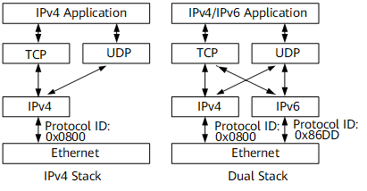
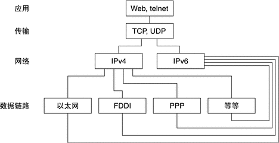
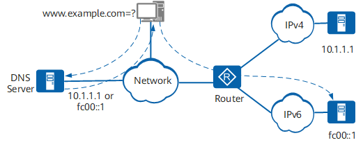

# 双栈技术

双栈技术是IPv4向IPv6过渡的一种有效的技术。网络中的节点同时支持IPv4和IPv6协议栈，源节点根据目的节点的不同选用不同的协议栈，而网络设备根据报文的协议类型选择不同的协议栈进行处理和转发。双栈可以在一个单一的设备上实现，也可以是一个双栈骨干网。对于双栈骨干网，其中的所有设备必须同时支持IPv4/IPv6协议栈，连接双栈网络的接口必须同时配置IPv4地址和IPv6地址。单协议栈和双协议栈结构示例如图1所示。

另一个视角如下：

**双协议栈具有以下特点**：
- 多种链路协议支持双协议栈
    多种链路协议（如以太网）支持双协议栈。图中的链路层是以太网，在以太网帧上，如果协议ID字段的值为0x0800，表示网络层收到的是IPv4报文，如果为0x86DD，表示网络层是IPv6报文。
- 多种应用支持双协议栈
    多种应用（如DNS/FTP/Telnet等）支持双协议栈。上层应用（如DNS）可以选用TCP或UDP作为传输层的协议，但优先选择IPv6协议栈，而不是IPv4协议栈作为网络层协议。

如图2为双协议栈的一个典型应用：

如图所示，主机向DNS服务器发送DNS请求报文，请求域名www.example.com对应的IP地址。DNS服务器将回复该域名对应的IP地址。如图所示，该IP地址可能是10.1.1.1或fc00::1。主机系统发送A类查询，则向DNS服务器请求对应的IPv4地址；系统发送AAAA查询，则向DNS服务器请求对应的IPv6地址。

图中Router支持双协议栈功能。如果主机访问IPv4地址为10.1.1.1的网络服务器，则可以通过Router的IPv4协议栈访问目标节点。如果主机访问IPv6地址为fc00::1的网络服务器，则可以通过Router的IPv6协议栈访问目标节点。

