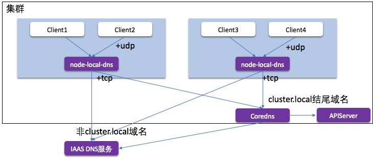

<!-- TOC -->

- [1. 前言](#1-前言)
- [2. Kubernetes 容器网络概述](#2-kubernetes-容器网络概述)
    - [2.1. Pod 网络连通性（CNI）](#21-pod-网络连通性cni)
        - [2.1.1. 什么是 CNI](#211-什么是-cni)
        - [2.1.2. 如何打通的网络？](#212-如何打通的网络)
    - [2.2. Kubernetes 网络负载均衡(Service)](#22-kubernetes-网络负载均衡service)
        - [2.2.1. Kubernetes Service](#221-kubernetes-service)
        - [2.2.2. Kubernetes LoadBalancer Service](#222-kubernetes-loadbalancer-service)
    - [2.3. Kubernetes 服务发现(DNS)](#23-kubernetes-服务发现dns)
- [3. 构建高性能云原生的 CNI 网络](#3-构建高性能云原生的-cni-网络)
    - [3.1. 什么是云原生容器网络？](#31-什么是云原生容器网络)
    - [3.2. 如何利用云原生资源构建容器网络？](#32-如何利用云原生资源构建容器网络)
    - [3.3. 容器网络资源管理](#33-容器网络资源管理)
    - [3.4. 网络如何打通](#34-网络如何打通)
        - [3.4.1. Pod 独占弹性网卡模式](#341-pod-独占弹性网卡模式)
        - [3.4.2. Pod 共享弹性网卡模式](#342-pod-共享弹性网卡模式)
        - [3.4.3. 性能对比](#343-性能对比)
    - [3.5. 增强 Kubernetes 网络扩展性和性能](#35-增强-kubernetes-网络扩展性和性能)
        - [3.5.1. Kubernetes Service 性能和扩展性问题](#351-kubernetes-service-性能和扩展性问题)
        - [3.5.2. NetworkPolicy 性能和扩展性问题](#352-networkpolicy-性能和扩展性问题)
        - [3.5.3. 使用 eBPF 加速 Service 和 NetworkPolicy 扩展性](#353-使用-ebpf-加速-service-和-networkpolicy-扩展性)
        - [3.5.4. 性能对比](#354-性能对比)
    - [3.6. Kubernetes Coredns 性能和扩展性问题](#36-kubernetes-coredns-性能和扩展性问题)
        - [3.6.1. 使用 AutoPath 大幅降低 Pod DNS 的查询量](#361-使用-autopath-大幅降低-pod-dns-的查询量)
        - [3.6.2. 在每个节点上使用 node-local-dns](#362-在每个节点上使用-node-local-dns)
        - [3.6.3. ExternalDNS 直接使用阿里云的域名解析服务](#363-externaldns-直接使用阿里云的域名解析服务)
- [4. 总结](#4-总结)
- [5. Q&A](#5-qa)
- [6. references](#6-references)

<!-- /TOC -->

# 1. 前言

随着云原生计算的普及，越来越多的应用负载都部署在 Kubernetes 之上，Kubernetes 已成为云原生计算的基石，成为用户和云计算新的交互界面。而网络作为应用的最基础的依赖之一，在应用云原生化中是必不可少的基础组件，也是很多开发者在云原生化时最担心的地方，面临很多问题，例如容器网络跟原有机器网络不在一个平面，容器的 Overlay 容器网络带来了封包的性能损失，Kubernetes 的负载均衡和服务发现的可扩展性不足等等。那么怎样才能构建集群容器网络呢？

本次分享将会介绍阿里云在云原生环境中如何设计和构建高性能云原生容器网络。

今天的分享将从 3 个方面进行：

  - Kubernetes 容器网络概述
  - 构建高性能云原生 CNI 网络
  - 增强网络的扩展性和性能

# 2. Kubernetes 容器网络概述

首先我们会介绍下 Kubernetes 容器网络的基础概念，包括：

  - Pod 网络连通性(CNI)
  - Kubernetes 负载均衡(Service)
  - Kubernetes 服务发现(Coredns)

## 2.1. Pod 网络连通性（CNI）

如下所示是 Kubernetes Pod 网络示意图：

首先我们会介绍 Pod 网络的连通性，这里就是我们常说的 CNI 网络，主要包含了以下内容：

  - Pod 有自己独立的网络空间和 IP 地址。不同 Pod 的应用可以监听同样的端口而不冲突；
  - Pod 可以通过各自的 IP 地址互相访问。集群中 Pod 可以通过它独立的 IP 地址访问其它网络：Pod 和 Pod 的联通；Pod 与 Node 的联通；Pod 与外部网络连通。
  - 而实现这些网络的能力，需要地址分配和网络打通，通常是由网络插件(CNI)来负责实现的。

### 2.1.1. 什么是 CNI

CNI 插件即 Container Network Interface，是 K8s 配置容器网络的 API 接口。CNI 插件就是实现了这个 API 的一系列网络插件，例如我们常见的有 Terway,Flannel, Calico 等等。

在我们创建 Pod 时：

  - Kubelet 会首先从 ApiServer 监听到 Pod 的创建，会创建 Pod 的沙箱；
  - 然后通过 CNI 接口调用 CNI 的插件去配置容器的网络；
  - CNI 会配置 Pod 的网络空间，以及打通不同 Pod 之间的网络访问。

### 2.1.2. 如何打通的网络？

通常 Pod 跟宿主机网络不在一个平面，要如何打通 Pod 之间通信呢？一般实现 Pod 之间联通的方案有两种：

  - 封包方式：容器之间的通信报文封装成宿主机之间通信的报文；

  

  - 路由方式：容器之间的通信报文由路由表转发到对应的节点上。

  

## 2.2. Kubernetes 网络负载均衡(Service)

为什么需要 Kubernetes Service？原因如下：

  - Pod 生命周期短暂，IP 地址随时变化，需要固定的访问方式；
  - Deployment 等的一组 Pod 组需要统一访问入口和做负载均衡。

### 2.2.1. Kubernetes Service

- Kubernetes Service 对象创建会分配一个相对固定的 Service IP 地址；
- 通过 labelSelector 选择到一组 Pod，将这个 Service IP 地址和端口负载均衡到这一组 Pod IP 和端口上；
- 从而实现一组 Pod 固定的访问入口，并对这一组 Pod 做负载均衡。

### 2.2.2. Kubernetes LoadBalancer Service

## 2.3. Kubernetes 服务发现(DNS)

- 虽然 Service 固定了 IP 访问方式，但 Service 的 IP 在不同的 namespace 或者集群中是不同的，如何统一？
- 集群的 Coredns 会将 Service 名自动转换成对应的 Service 的 IP 地址，来实现不同部署环境中同样的访问入口。

# 3. 构建高性能云原生的 CNI 网络

## 3.1. 什么是云原生容器网络？

云上 IaaS 层网络虚拟化，在容器中再做一层网络虚拟化带来的性能损失比较大。

云原生容器网络是直接使用云上原生云资源配置容器网络：

  - 容器和节点同等网络平面，同等网络地位；
  - Pod 网络可以和云产品无缝整合；
  - 不需要封包和路由，网络性能和虚机几乎一致。

在 CNI 调用中调用云网络 OpenAPI 完成网络资源分配：

  - 网络资源一般是弹性网卡，弹性网卡辅助 IP 等，绑定到 Pod 所在的节点上；
  - 网络资源分配出来之后 CNI 插件在宿主机中将资源配置到 Pod 的沙箱中。

由于容器的网络直接成为了 VPC 中的一等公民，所以使用云原生容器网络会有这些优势：

  - Pod 和虚拟机同一层网络，便于业务云原生化迁移；
  - 不依赖封包或者路由表，分配给 Pod 的网络设备本身可以用来通信；
  - 集群节点规模不受路由表或者封包的 FDB 转发表等 Quota 限制；
  - 不需要额外为 Pod 规划 Overlay 的网段，多个集群Pod之间只要安全组放开就可以互相通信；
  - 可以直接把 Pod 挂到 LoadBalancer 后端，无需节点上端口再做一层转发；
  - NAT 网关可以对 Pod 做 SNAT，无需节点上对容器网段做 SNAT：Pod 访问 VPC 内资源，所带的源 IP 都是 PodIP，便于审计；Pod 访问外部网络不依赖 conntrack SNAT，失败率降低。

## 3.2. 如何利用云原生资源构建容器网络？

IaaS 层网络资源（以阿里云为例）：

  - 弹性网卡（ENI）。 IaaS 层虚拟化出来的虚拟网卡，可动态分配和绑定到虚拟机上；一般能绑定数量有限，受限于 PCI-E 的限制；
  - 弹性网卡辅助 IP。弹性网卡上通常可以绑定多个 VPC 的 IP 地址，为辅助 IP；一个弹性网卡可以绑定数十个辅助 IP 地址，限制较小。

利用弹性网卡或者弹性网卡辅助 IP 分配给 Pod 来实现云原生容器网络：

## 3.3. 容器网络资源管理

如何解决云资源跟容器快速扩缩容的差距：

  - 容器的启动速度是秒级的， 而 IaaS 层操作和调用一般在 10s 的级别；
  - 容器扩缩容操作频繁，云产品 OpenAPI 通常有严格的调用限流。

Terway 通过内置资源池来缓冲资源加速启动：

  - 资源池中记录分配的正在使用和空闲的资源；
  - Pod释放后资源会保留在资源池中供下次快速启动；
  - 资源池有最低水位和最高水位。空闲资源低于最低水位调用 API 补充资源，预热资源减缓峰值 Pod 创建对 API 的调用；空闲资源高于最高水位调用 API 释放资源。

对并行的 Pod 网络配置调用批量申请资源：

除此之外还有很多资源管理策略，例如：如何选择 Pod 要用的虚拟交换机，保证 IP 充裕？如何平衡每个节点上的网卡的队列和中断数，保证争抢最少？

可参考 Terway 文档或代码：[https://github.com/AliyunContainerService/terway](https://github.com/AliyunContainerService/terway)。

## 3.4. 网络如何打通

### 3.4.1. Pod 独占弹性网卡模式

它的在CNI的实现方式是：

  - 通过 Terway 资源管理将弹性网卡绑定 Pod 所在 Node；
  - Terway CNI 将网卡直接移入到 Pod 网络空间；
  - Terway CNI 为其网卡配置 IP 和路由等网络配置。

这种方式的特点和优势是：

  - Pod 网络完全不经过宿主机网络栈
  - 性能和 ECS 机器一致，无损耗
  - Pod 中为弹性网卡，可以使用 DPDK 等加速应用

### 3.4.2. Pod 共享弹性网卡模式

它的在CNI的实现方式是：

  - Terway 资源管理器根据申请的 IP 数量和现有 ENI上IP 来判断申请 ENI 还是辅助 IP 地址
  - Terway CNI 在 ENI 上创建 IPVLAN 子接口
  - 将 IPVLAN 子接口放入到 Pod 网络空间
  - 配置 Pod 网络空间的 IP 和路由信息

这种方式的特点和优势是：

  - IPVLAN 网络仅部分经过网络栈，不走 iptables、路由表，损耗极低
  - 一个弹性网卡一般支持 10~20 个辅助 IP，不担心部署密度

### 3.4.3. 性能对比

- TCP_RR、UDP、PPS、带宽和延时都优于通用的 Flannel Vxlan 的 Overlay 网络；
- 独占 ENI 模式可以跑满机器的网络资源 PPS 和带宽无损失，适合于高性能计算和游戏场景。

## 3.5. 增强 Kubernetes 网络扩展性和性能

### 3.5.1. Kubernetes Service 性能和扩展性问题

默认的 Kubernetes 的 Service 实现 kube-proxy，它是使用了 iptables 去配置 Service IP 和负载均衡：

如上图所示：

  - 负载均衡过程的 iptables 链路长，导致网络延时显著增加，就算是 ipvs 模式也是绕不开 iptables 的调用；
  - 扩展性差。iptables 规则同步是全量刷的，Service 和 Pod 数量多了，一次规则同步都得接近 1s；Service 和 Pod 数量多了之后，数据链路性能大幅降低。

### 3.5.2. NetworkPolicy 性能和扩展性问题

NetworkPolicy 是 Kubernetes 控制 Pod 和 Pod 间是否允许通信的规则。目前主流的 NetworkPolicy 实现基于 iptables 实现，同样有 iptables 的扩展性问题：

  - iptables 线性匹配，性能不高, Scale 能力差
  - iptables 线性更新，更新速度慢

### 3.5.3. 使用 eBPF 加速 Service 和 NetworkPolicy 扩展性

关于 eBPF 的介绍如下:

- Linux 在最近版本提供的可编程接口
- 通过 tc-ebpf 将 ebpf 程序注入到网卡中
- 用于大幅降低网络链路的长度和复杂度

如上图所示，使用 tc 工具注入 eBPF 程序到 Pod 的网卡上，可以直接将 Service 和 NetworkPolicy 在网卡中解决，然后直接转发到弹性网卡，大幅降低网络复杂度：

  - 每个节点上运行 eBPF Agent，监听 Service 和 NetworkPolicy，配置容器网卡的 Ingress 和 Egress 规则；
  - 在 Egress 的 eBPF 程序中，判断访问 k8s Service IP 的请求直接负载均衡到后端 Endpoint；
  - 在 Ingress 的 eBPF 程序中，根据 NetworkPolicy 规则计算源 IP 决定是否放行。

PS：我们使用 Cilium 作为节点上的 BPF-agent 去配置容器网卡的 BPF 规则，已贡献 Terway 相关适配：[https://github.com/cilium/cilium/pull/10251](https://github.com/cilium/cilium/pull/10251)

### 3.5.4. 性能对比

- 通过 eBPF 对链路的简化，性能有明显提升，相对 iptables 提升 32%, 相对 ipvs 提升 62%；
- 通过编程的 eBPF 的形式，让 Service 数量增加到 5000 时也几乎没有性能损耗，而 iptables 在 Service 增加到 5000 时性能损失了 61%。

## 3.6. Kubernetes Coredns 性能和扩展性问题

Kubernetes Pod 解析 DNS 域名会 search 很多次，例如上图 Pod 中 DNS 配置，当它请求 aliyun.com，会依次解析:

  - aliyun.com.kube-system.svc.cluster.local  -> NXDOMAIN
  - aliyun.com.svc.cluster.local -> NXDOMAIN
  - aliyun.com.cluster.local -> NXDOMAIN
  - aliyun.com -> 1.1.1.1

Coredns 是中心化部署在某一个节点上的，Pod 访问 Coredns 解析经过链路过长，又是 UDP 协议，导致失败率高。

### 3.6.1. 使用 AutoPath 大幅降低 Pod DNS 的查询量

由客户端 Search 变成服务端 Search：

当 Pod 请求 Coredns 时解析域名：

  - Coredns 会通过源 IP 地址查询到 Pod 的信息
  - 然后根据 Pod 的 Namespace 信息，匹配到它真正想访问的是哪个服务直接返回
  - 客户端请求从 4 个直接减少到 1 个，降低了 75% 的 Coredns 请求，从而让失败率降低

### 3.6.2. 在每个节点上使用 node-local-dns

- 拦截 Pod 的 DNS 查询的请求
- 将外部域名分流，外部域名请求不再请求中心 Coredns
- 中间链路使用更稳定的 TCP 解析
- 节点级别缓存 DNS 解析结果，较少请求中信 Coredns

### 3.6.3. ExternalDNS 直接使用阿里云的域名解析服务

- 云原生的 DNS 解析，Pod 直接请求云服务 PrivateZone 中的自定义 DNS 能力
- 由 ExternalDNS 监听到服务和 Pod 创建后配置 PrivateZone 中的域名解析
- 和原生的 ECS 解析同样的 DNS 解析性能

# 4. 总结

以上就是阿里云的高性能云原生的容器网络设计和构建过程，随着云原生的不断发展，会有越来越多类型的应用负载运行在 K8s 上，同时也会有更多的云服务会融入到容器场景之中。我们相信以后在高性能的云原生容器网络中会孵化出更多的功能和应用场景。

项目地址: [https://github.com/AliyunContainerService/terway](https://github.com/AliyunContainerService/terway)

# 5. Q&A

Q1：创建 pod netns 的时候, 是使用 veth pair 连接 pod netns 和 host 的吗?
A1：详见下方内容。

  - 共享 ENI 模式：在 3.10 的内核中，为了兼容性，我们使用 veth pair 打通的 namespace，而在 4.x 的内核中，比如阿里云上我们使用的 aliyunlinux2，是 4.19 的内核，我们采用的是 IPVlan 打通的 namespace；
  - 独享 ENI 模式：直接把 ENI 挪到 Pod 的 namespace 中，不需要打通 host 和 pod 的空间。

Pod IP 不固定怎么做安全审计？
A2：详见下方内容。

  - Pod 在其声明周期中 IP 是不变的，可以在 K8s 的事件中找到这个 IP 地址在某个事件分配给了哪个 Pod 做对照；
  - 在 Terway 的 NetworkPolicy 的实现中，是通过 label 的方式标识 Pod 的，当 Pod 重建后监控到会动态更新 label 对应 Pod 的 IP 地址；
  - 另外 Terway 配置给 Pod 的 IP 是相对固定的，比如在某一个节点更新 Statefulset 应用时，Terway 会在之前的 IP 释放时为其保留一段时间供其再次启动时快速使用起来，更新过程中 IP 就不会变化了。

Q3：ipvlan 对内核要求比较高吧？
A3：是的，在阿里云上，我们可以使用 aliyunlinux2 的 4.19 的内核。对于低内核，Terway 也是支持 veth pair+ 策略路由方式来共享 ENI 上的辅助 IP，只是性能会低一些。

Q4：在 pod 内启动 ebpf, 会不会影响 pod 启动的速度? pod 内的 ebpf 部署时间估计是多少?
A4：ebpf 的程序代码不会太大，目前看整个部署时间增加在百毫秒的级别。

Q5：是否支持 IPV6，实现上遇到了什么问题吗？内核或 kube-proxy 代码问题？
A5：目前支持通过 IPV6 的 LoadBalancer 暴露，但实现还是在 LoadBalancer 中做 6to4 转换。目前 Pod 还未支持 IPV6，K8s 从 1.16 中 kube-proxy 等开始支持 IPV6，我们也在积极跟进，计划今年会和阿里云 IaaS 一起实现原生的 Pod IPv4/IPv6 双栈。

Q6：每次请求 coredns 解析，都去根据源 ip 去获取直接访问的服务，是调用 K8s  api 获取吗？会不会增加 api 的压力?
A6：不会的，那里那样画是为了让结构更易于理解，实际上 Coredns 的 AutoPath 会通过 watch&list 的机制去从 ApiServer 那里监听 Pod 和 Svc 的变化，然后更新本地的缓存。

Q7：K8s 的 Service 请求到一组 pod，这个过程是轮询的吗？请求到每个 pod 的概率是一样的吗？
A7：对，概率是一样的，可以理解为 LB 领域的 roundrobin 算法。

Q8：ipvlan 和 ebpf 好像是高内核才支持的，是不是对宿主机内核有要求？
A8：是的，在阿里云上，我们可以使用 aliyunlinux2 的 4.19 的内核。对于低内核，Terway 也是支持 veth pair + 策略路由方式来共享 ENI 上的辅助 IP，只是性能会低一些。

Q9：cilium 是如何管理 ip 的呢，或者说分配 ip？类似其他的 cni 插件管理 ip pool 吗？
A9：cilium 本身有两种分配 IP 的办法：host-local：就是每个节点分段，然后顺序分配；另外一种是 CRD-backend，可以让 IPAM 插件自己实现分配。Terway 中的 cilium 只会做网络策略和 Service 的劫持和负载，不会做 IP 分配和配置。

Q10：cilium 应该不是注入 bpf 到容器的 veth，而是注入到 host 端的 veth？你们做了什么修改吗？
A10：是的，cilium 是修改的容器对侧的 veth，我们经过测试发现 IPvlan 的性能优于 veth，Terway 中是使用 IPvlan 做的高性能网络，是不存在对侧 veth 的。我们适配的修改请参考：https://github.com/cilium/cilium/pull/10251， 另外 Terway 使用 Cilium 只会做 NetworkPolicy 和 Service 的劫持和负载。

Q11：使用 terway 插件后， pod 是如何访问 service 的 clusterip 的？
A11：使用内置在 Pod 网卡上的 ebpf 程序直接将 serviceIP 负载到后端的 pod。

Q12：能聊下阿里云对 service mesh 这块有什么规划吗？
A12：阿里云目前已经产品化了 ASM 的 Service Mesh 产品，后面的发展会在易用性、性能以及全球跨地域云边端一体化连接等方向。

Q13：和 node 的网络打通后，如果一个 pod 的 ip 被复用，之前的 arp 缓存应该会有影响吧？同时出现节点级别的故障，是否会有 IP 冲突？
A13：首先云上的网络不会存在 arp 的问题，一般 IaaS 层的转发采用 3 层的转发，如果云下自己使用 IPvlan也不存在这个问题，使用 Macvlan 的话会有 arp 缓存的影响，一般来说可以采用 macnat 的方式（ebtables,ebpf 都可以实现哈）。是否存在 IP 冲突是要看 IP 管理策略，在目前的 Terway 方案中 IPAM 直接调用 IaaS 的IPAM，是不存在这个问题的，自己线下搭建得考虑 DHCP 策略或静态分配 IP 地址去规避。

Q14：“通过 eBPF 对链路的简化，性能有明显提升，相对 iptables 提升 32%, 相对 ipvs 提升 62%；”为什么对 ipvs 性能的提升更明显？如果主要是对 iptables 的线性匹配和更新优化的话？
A14：这里的这个对比是针对只有一个 Service 的对比，是主要看链路简化的影响。iptables 模式是 nat 表进行的 DNAT，是只有 forward 流程，而 ipvs 是会经过 INPUT 和 OUTPUT 的，所以在单个服务的情况下 iptables 可能还会更好一些，但是 iptables 的线性匹配会让服务数量很多时性能下降明显。比如 5000 service 时就 ipvs 更好啦：

Q15：如果没有用这套网络方案，又觉得 service 大规模使用影响性能，有什么好的方案吗？
A15：kube-proxy ipvs 模式的性能在大规模中损失还好，但其实整体引入了过长的链路，所以延时会增加一些。

# 6. references

- [https://cloudnative.to/blog/bpf-intro/](https://cloudnative.to/blog/bpf-intro/)
- [阿里云如何构建高性能云原生容器网络](https://aijishu.com/a/1060000000107387)
