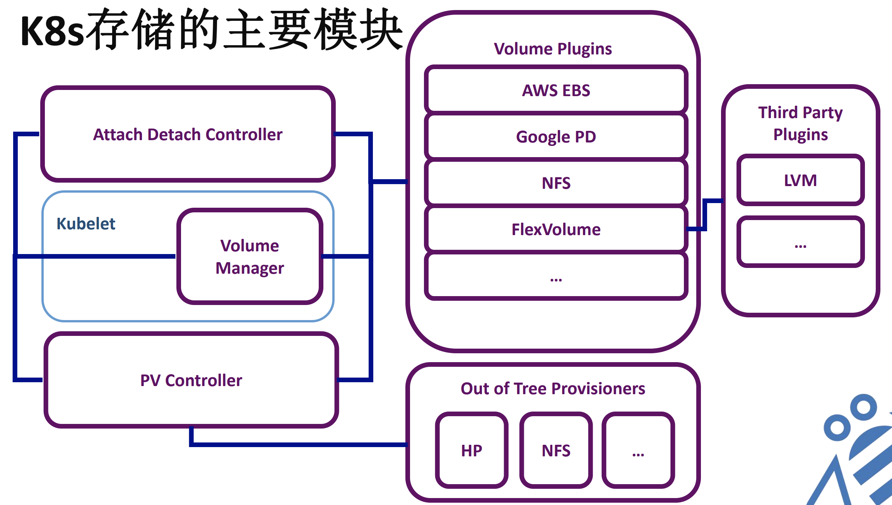

# k8s nfs volume 详解

## k8s volume 主要模块



- attach/dettach controller 主要实现类似 RBD 这样的设备挂载到 node 节点
- volume plugin 主要实现 volume mount 到 pod 中；这里的 volume 指的是 pod.spec.volumes 描述的普通 volume 和 pod.spec.volumes.persistentVolumeClaim 指定的对应 persistentVolume
- pv provisioner 主要实现根据 pvc 创建 pv object

## k8s volume 分类

k8s 的 volume 我们可以分为两类，一类是直接在 pod.spec.volumes 描述的普通 volume，也可以说是非 persistentVolumeClaim volume。

### 非 persistentVolumeClaim volume

对于非 persistentVolumeClaim volume，我们需要在 spec.volumes 中需要详细描述我们即将使用的 volume 配置信息。以 nfs 为例：

```
apiVersion: apps/v1 # for versions before 1.9.0 use apps/v1beta2
kind: Deployment
metadata:
  name: redis
spec:
  selector:
    matchLabels:
      app: redis
  revisionHistoryLimit: 2
  template:
    metadata:
      labels:
        app: redis
    spec:
      containers:
      - image: redis
        name: redis
        imagePullPolicy: IfNotPresent
        ports:
        - containerPort: 6379
          name: redis6379
        env:
        - name: ALLOW_EMPTY_PASSWORD
          value: "yes"
        - name: REDIS_PASSWORD
          value: "redis"   
        volumeMounts:
        - name: redis-persistent-storage
          mountPath: /data
      volumes:
      - name: redis-persistent-storage
        nfs:
          path: /k8s-nfs/redis/data
          server: 10.244.1.4
```

### persistentVolumeClaim volume

对于 persistentVolumeClaim volume，我们只需要在 spec.volumes 中指定 persistentVolumeClaim 的 name，详细的配置需求在 persistentVolumeClaim 描述。

对于 persistentVolumeClaim volume，其对应的 persistentVolume 的创建方式又有两种：

- 静态方式：需要管理员提前创建 persistentVolumeClaim 对应的 pv
- 动态方式：不需要管理员介入，pv 由 dynamic provisioner 创建

仍然以 nfs 为例，静态方式如下：

```
apiVersion: v1
kind: PersistentVolume
metadata:
  name: nfs
spec:
  capacity:
    storage: 1Mi
  accessModes:
    - ReadWriteMany
  nfs:
    # FIXME: use the right IP
    server: 10.244.1.4
    path: "/"
---
apiVersion: v1
kind: PersistentVolumeClaim
metadata:
  name: nfs
spec:
  accessModes:
    - ReadWriteMany
  storageClassName: ""
  resources:
    requests:
      storage: 1Mi
---
# This pod mounts the nfs volume claim into /usr/share/nginx/html and
# serves a simple web page.

apiVersion: v1
kind: ReplicationController
metadata:
  name: nfs-web
spec:
  replicas: 2
  selector:
    role: web-frontend
  template:
    metadata:
      labels:
        role: web-frontend
    spec:
      containers:
      - name: web
        image: nginx
        ports:
          - name: web
            containerPort: 80
        volumeMounts:
            # name must match the volume name below
            - name: nfs
              mountPath: "/usr/share/nginx/html"
      volumes:
      - name: nfs
        persistentVolumeClaim:
          claimName: nfs
```

## nfs volume plugin 分析

但是不管是普通 volume 还是 persistentVolumeClaim 对应的 pv volume，最终都得由 volume plugin 将该 volume 对应路径 mount 到 pod 中。

下面详细分析 nfs volume plugin，代码路径：pkg/volume/nfs/nfs.go。

kubelet 启动查询所以 volume plugin 的时候返回一个 nfsPlugin 类型的 VolumePlugin:

```
func ProbeVolumePlugins(volumeConfig volume.VolumeConfig) []volume.VolumePlugin {
    return []volume.VolumePlugin{
        &nfsPlugin{
            host:   nil,
            config: volumeConfig,
        },
    }
}
```

nfsPlugin 初始化：

```
func (plugin *nfsPlugin) Init(host volume.VolumeHost) error {
    plugin.host = host
    return nil
}
```

获取 volume 类型：

```
func getVolumeSource(spec *volume.Spec) (*v1.NFSVolumeSource, bool, error) {
    if spec.Volume != nil && spec.Volume.NFS != nil {
        return spec.Volume.NFS, spec.Volume.NFS.ReadOnly, nil
    } else if spec.PersistentVolume != nil &&
        spec.PersistentVolume.Spec.NFS != nil {
        return spec.PersistentVolume.Spec.NFS, spec.ReadOnly, nil
    }

    return nil, false, fmt.Errorf("Spec does not reference a NFS volume type")
}
```

一类是普通 volume 中指定的 NFS，一类是 PV volume 中指定的 NFS。我们从 `volume.Spec` 结构也可以看出来：

```
# pkg/volume/plugins.go

// Spec is an internal representation of a volume.  All API volume types translate to Spec.
type Spec struct {
    Volume           *v1.Volume
    PersistentVolume *v1.PersistentVolume
    ReadOnly         bool
}
```

下面都是针对这两类 volume 的操作。

从 volume spec 中获取 volume name：

```
func (plugin *nfsPlugin) GetVolumeName(spec *volume.Spec) (string, error) {
    volumeSource, _, err := getVolumeSource(spec)
    if err != nil {
        return "", err
    }

    return fmt.Sprintf(
        "%v/%v",
        volumeSource.Server,
        volumeSource.Path), nil
}
```

生成 volume Mounter 对象：

```
func (plugin *nfsPlugin) NewMounter(spec *volume.Spec, pod *v1.Pod, _ volume.VolumeOptions) (volume.Mounter, error) {
    return plugin.newMounterInternal(spec, pod, plugin.host.GetMounter())
}

func (plugin *nfsPlugin) newMounterInternal(spec *volume.Spec, pod *v1.Pod, mounter mount.Interface) (volume.Mounter, error) {
    source, readOnly, err := getVolumeSource(spec)
    if err != nil {
        return nil, err
    }

    return &nfsMounter{
        nfs: &nfs{
            volName: spec.Name(),
            mounter: mounter,
            pod:     pod,
            plugin:  plugin,
        },
        server:       source.Server,
        exportPath:   source.Path,
        readOnly:     readOnly,
        mountOptions: volume.MountOptionFromSpec(spec),
    }, nil
}
```

其中，spec.Name() 函数如下：

```
# pkg/volume/plugins.go

// Name returns the name of either Volume or PersistentVolume, one of which must not be nil.
func (spec *Spec) Name() string {
    switch {
    case spec.Volume != nil:
        return spec.Volume.Name
    case spec.PersistentVolume != nil:
        return spec.PersistentVolume.Name
    default:
        return ""
    }
}
```

我们再看看 volume Spec 的构建代码：

```
func (plugin *nfsPlugin) ConstructVolumeSpec(volumeName, mountPath string) (*volume.Spec, error) {
    nfsVolume := &v1.Volume{
        Name: volumeName,
        VolumeSource: v1.VolumeSource{
            NFS: &v1.NFSVolumeSource{
                Path: volumeName,
            },
        },
    }
    return volume.NewSpecFromVolume(nfsVolume), nil
}
```

生成 volume Unmounter 对象：

```
func (plugin *nfsPlugin) NewUnmounter(volName string, podUID types.UID) (volume.Unmounter, error) {
    return plugin.newUnmounterInternal(volName, podUID, plugin.host.GetMounter())
}

func (plugin *nfsPlugin) newUnmounterInternal(volName string, podUID types.UID, mounter mount.Interface) (volume.Unmounter, error) {
    return &nfsUnmounter{&nfs{
        volName: volName,
        mounter: mounter,
        pod:     &v1.Pod{ObjectMeta: metav1.ObjectMeta{UID: podUID}},
        plugin:  plugin,
    }}, nil
}
```

volume 回收：

```
// Recycle recycles/scrubs clean an NFS volume.
// Recycle blocks until the pod has completed or any error occurs.
func (plugin *nfsPlugin) Recycle(pvName string, spec *volume.Spec, eventRecorder volume.RecycleEventRecorder) error {
    if spec.PersistentVolume == nil || spec.PersistentVolume.Spec.NFS == nil {
        return fmt.Errorf("spec.PersistentVolumeSource.NFS is nil")
    }

    pod := plugin.config.RecyclerPodTemplate
    timeout := volume.CalculateTimeoutForVolume(plugin.config.RecyclerMinimumTimeout, plugin.config.RecyclerTimeoutIncrement, spec.PersistentVolume)
    // overrides
    pod.Spec.ActiveDeadlineSeconds = &timeout
    pod.GenerateName = "pv-recycler-nfs-"
    pod.Spec.Volumes[0].VolumeSource = v1.VolumeSource{
        NFS: &v1.NFSVolumeSource{
            Server: spec.PersistentVolume.Spec.NFS.Server,
            Path:   spec.PersistentVolume.Spec.NFS.Path,
        },
    }
    return volume.RecycleVolumeByWatchingPodUntilCompletion(pvName, pod, plugin.host.GetKubeClient(), eventRecorder)
}
```

nfs struct 代表一个挂载点，目录或者文件：

```
// NFS volumes represent a bare host file or directory mount of an NFS export.
type nfs struct {
    volName string
    pod     *v1.Pod
    mounter mount.Interface
    plugin  *nfsPlugin
    volume.MetricsNil
}

func (nfsVolume *nfs) GetPath() string {
    name := nfsPluginName
    return nfsVolume.plugin.host.GetPodVolumeDir(nfsVolume.pod.UID, strings.EscapeQualifiedNameForDisk(name), nfsVolume.volName)
}
```

nfsMounter 对象负责将磁盘挂载到指定的挂载点：

```
type nfsMounter struct {
    *nfs
    server       string
    exportPath   string
    readOnly     bool
    mountOptions []string
}

// SetUp attaches the disk and bind mounts to the volume path.
func (b *nfsMounter) SetUp(fsGroup *int64) error {
    return b.SetUpAt(b.GetPath(), fsGroup)
}

func (b *nfsMounter) SetUpAt(dir string, fsGroup *int64) error {
    notMnt, err := b.mounter.IsLikelyNotMountPoint(dir)
    glog.V(4).Infof("NFS mount set up: %s %v %v", dir, !notMnt, err)
    if err != nil && !os.IsNotExist(err) {
        return err
    }
    if !notMnt {
        return nil
    }
    if err := os.MkdirAll(dir, 0750); err != nil {
        return err
    }
    source := fmt.Sprintf("%s:%s", b.server, b.exportPath)
    options := []string{}
    if b.readOnly {
        options = append(options, "ro")
    }
    mountOptions := volume.JoinMountOptions(b.mountOptions, options)
    err = b.mounter.Mount(source, dir, "nfs", mountOptions)
    if err != nil {
        notMnt, mntErr := b.mounter.IsLikelyNotMountPoint(dir)
        if mntErr != nil {
            glog.Errorf("IsLikelyNotMountPoint check failed: %v", mntErr)
            return err
        }
        if !notMnt {
            if mntErr = b.mounter.Unmount(dir); mntErr != nil {
                glog.Errorf("Failed to unmount: %v", mntErr)
                return err
            }
            notMnt, mntErr := b.mounter.IsLikelyNotMountPoint(dir)
            if mntErr != nil {
                glog.Errorf("IsLikelyNotMountPoint check failed: %v", mntErr)
                return err
            }
            if !notMnt {
                // This is very odd, we don't expect it.  We'll try again next sync loop.
                glog.Errorf("%s is still mounted, despite call to unmount().  Will try again next sync loop.", dir)
                return err
            }
        }
        os.Remove(dir)
        return err
    }
    return nil
}
```

nfsUnmounter 对象负责 unmount 挂载点：

```
type nfsUnmounter struct {
    *nfs
}

func (c *nfsUnmounter) TearDown() error {
    return c.TearDownAt(c.GetPath())
}

func (c *nfsUnmounter) TearDownAt(dir string) error {
    return util.UnmountPath(dir, c.mounter)
}
```

util.UnmountPath() 函数代码如下：

```
# pkg/volume/util/util.go

// UnmountPath is a common unmount routine that unmounts the given path and
// deletes the remaining directory if successful.
func UnmountPath(mountPath string, mounter mount.Interface) error {
    return UnmountMountPoint(mountPath, mounter, false /* extensiveMountPointCheck */)
}

// UnmountMountPoint is a common unmount routine that unmounts the given path and
// deletes the remaining directory if successful.
// if extensiveMountPointCheck is true
// IsNotMountPoint will be called instead of IsLikelyNotMountPoint.
// IsNotMountPoint is more expensive but properly handles bind mounts.
func UnmountMountPoint(mountPath string, mounter mount.Interface, extensiveMountPointCheck bool) error {
    if pathExists, pathErr := PathExists(mountPath); pathErr != nil {
        return fmt.Errorf("Error checking if path exists: %v", pathErr)
    } else if !pathExists {
        glog.Warningf("Warning: Unmount skipped because path does not exist: %v", mountPath)
        return nil
    }

    var notMnt bool
    var err error

    if extensiveMountPointCheck {
        notMnt, err = mount.IsNotMountPoint(mounter, mountPath)
    } else {
        notMnt, err = mounter.IsLikelyNotMountPoint(mountPath)
    }

    if err != nil {
        return err
    }

    if notMnt {
        glog.Warningf("Warning: %q is not a mountpoint, deleting", mountPath)
        return os.Remove(mountPath)
    }

    // Unmount the mount path
    glog.V(4).Infof("%q is a mountpoint, unmounting", mountPath)
    if err := mounter.Unmount(mountPath); err != nil {
        return err
    }
    notMnt, mntErr := mounter.IsLikelyNotMountPoint(mountPath)
    if mntErr != nil {
        return err
    }
    if notMnt {
        glog.V(4).Infof("%q is unmounted, deleting the directory", mountPath)
        return os.Remove(mountPath)
    }
    return fmt.Errorf("Failed to unmount path %v", mountPath)
}
```


